| **Status** | <!--start status:GREEN-->RELEASE<!--end status--> |
| --- | --- |
| Contributors | [M Ilham Jamaludin](https://tokopedia.atlassian.net/wiki/people/5c87306ea329a40b8555c1ca?ref=confluence) [Rizqi Aryansa](https://tokopedia.atlassian.net/wiki/people/5e25ee87006fae0ca232e1ac?ref=confluence)  |
| Product Manager | [Anastasia Astari](https://tokopedia.atlassian.net/wiki/people/5d03818baf3a8f0c58e4061d?ref=confluence) [Franky Gabriel Sanjaya](https://tokopedia.atlassian.net/wiki/people/6029d0717b23f4006842dec3?ref=confluence)  |
| Team | [Minion Stuart](https://tokopedia.atlassian.net/people/team/eeba862a-bd9d-472c-b901-415b15b1a37e?ref=directory&src=peopleMenu) |
| Release date | 27 May 2021 / <!--start status:GREY-->MA-3.127<!--end status--> <!--start status:GREY-->SA-2.57<!--end status--> |
| Module type | <!--start status:YELLOW-->FEATURE<!--end status--> |
| Product PRD | [Shop Score Revamp](/wiki/spaces/MC/pages/1099667100/Shop+Score+Revamp)  |
| Module Location | `features/merchant/shop_score` |

## Table of Contents

- [Overview](https://tokopedia.atlassian.net/wiki/spaces/PA/pages/1470535709/Shop+Score+Penalty+Revamp#Overview)
- [Background](https://tokopedia.atlassian.net/wiki/spaces/PA/pages/1470535709/Shop+Score+Penalty+Revamp#Background)
- [Release Notes](https://tokopedia.atlassian.net/wiki/spaces/PA/pages/1989904172/TokoFood#Release-Notes)
- [Shop Score Page Flow Chart](https://tokopedia.atlassian.net/wiki/spaces/PA/pages/1470535709/Shop+Score+Penalty+Revamp#Shop-Score-Page---Flow-Chart)
- [Penalty Page Flow Chart](https://tokopedia.atlassian.net/wiki/spaces/PA/pages/1470535709/Shop+Score+Penalty+Revamp#Penalty-Page-Flow-Chart)
- [Pages](https://tokopedia.atlassian.net/wiki/spaces/PA/pages/1470535709/Shop+Score+Penalty+Revamp#Pages)

	- [Shop Score](https://tokopedia.atlassian.net/wiki/spaces/PA/pages/1470535709/Shop+Score+Penalty+Revamp#Shop-Score)
	- [Penalty](https://tokopedia.atlassian.net/wiki/spaces/PA/pages/1470535709/Shop+Score+Penalty+Revamp#Penalty)
- [Navigation](https://tokopedia.atlassian.net/wiki/spaces/PA/pages/1470535709/Shop+Score+Penalty+Revamp#%5BhardBreak%5D%5BhardBreak%5DNavigation)
- [Useful Links](https://tokopedia.atlassian.net/wiki/spaces/PA/pages/1470535709/Shop+Score+Penalty+Revamp#Useful-Links)

## Overview

Shop score is a single reference that can fairly represent a good quality merchant despite their tenure. Thus we need to revamp the current shop score and develop a journey to introduce these changes to sellers. Shop score has some rules to define the score for every seller, as follows **existing seller, new seller, and reactivated seller.** And that’s the seller type has a different UI because it has different scores and parameters.

- Existing seller is age more than 90 days
- New seller is the age less than 90 days
- Reactivated seller is the seller that has not logged in for more than 90 days thus, has no parameters and score

## Background

Tokopedia needs a single reference that can fairly represent a good quality merchant despite their tenure. By revamping seller performance assessment to build a single reference across the platforms will fundamentally increase the overall trustworthiness to Tokopedia.

## Release Notes

<!--start expand:December, 9th 2021 (MA-3.155/SA-2.85)-->
###### Shop Score & Penalty to support tablet modePR: <https://github.com/tokopedia/android-tokopedia-core/pull/23099> Ticket: 

 

 

 
 [AN-31746](https://tokopedia.atlassian.net/browse/AN-31746)
 -
 Getting issue details...
STATUS
<!--end expand-->

<!--start expand:November, 26th 2021 (MA-3.153/SA-2.83)-->
###### Shop Score - Reactivated SellerPR: <https://github.com/tokopedia/android-tokopedia-core/pull/22759> Ticket: 

 

 

 
 [AN-31300](https://tokopedia.atlassian.net/browse/AN-31300)
 -
 Getting issue details...
STATUS
<!--end expand-->

<!--start expand:September, 27th 2021 (MA-3.144/SA-2.74)-->
###### Shop Score - New SellerPR: <https://github.com/tokopedia/android-tokopedia-core/pull/21536> Ticket: 

 [AN-29128](https://tokopedia.atlassian.net/browse/AN-29128)
 -
 Getting issue details...
STATUS

 [AN-29130](https://tokopedia.atlassian.net/browse/AN-29130)
 -
 Getting issue details...
STATUS
<!--end expand-->

<!--start expand:July, 27th 2021 (MA-3.127/SA-2.57)-->
###### Shop Score & PM Journey ReleasePR: <https://github.com/tokopedia/android-tokopedia-core/pull/19449> Release SellerApp 2.57<https://github.com/tokopedia/android-tokopedia-core/pull/19447> Ticket: 

 

 

 
 [AN-26648](https://tokopedia.atlassian.net/browse/AN-26648)
 -
 Getting issue details...
STATUS
<!--end expand-->

## Shop Score Page - Flow Chart

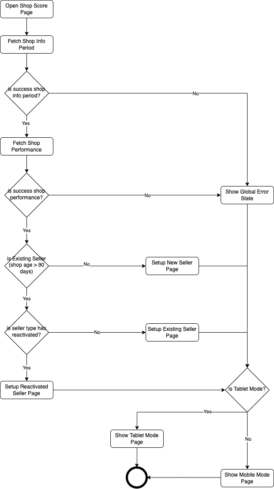## Penalty Page Flow Chart

## Pages

### Shop Score

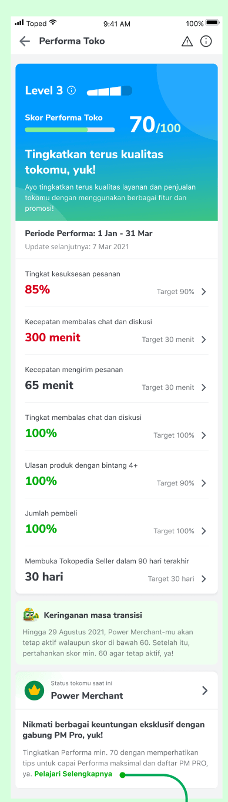

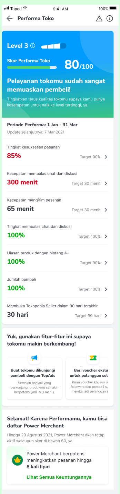

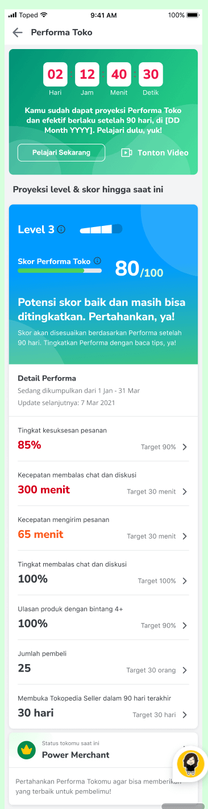

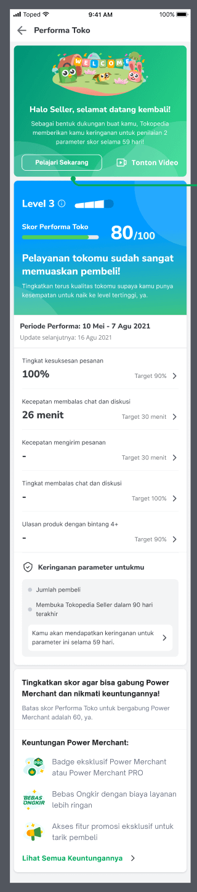

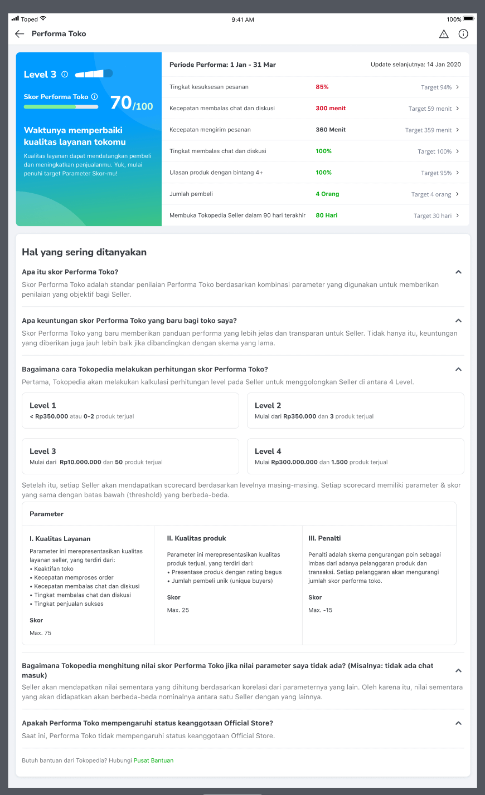

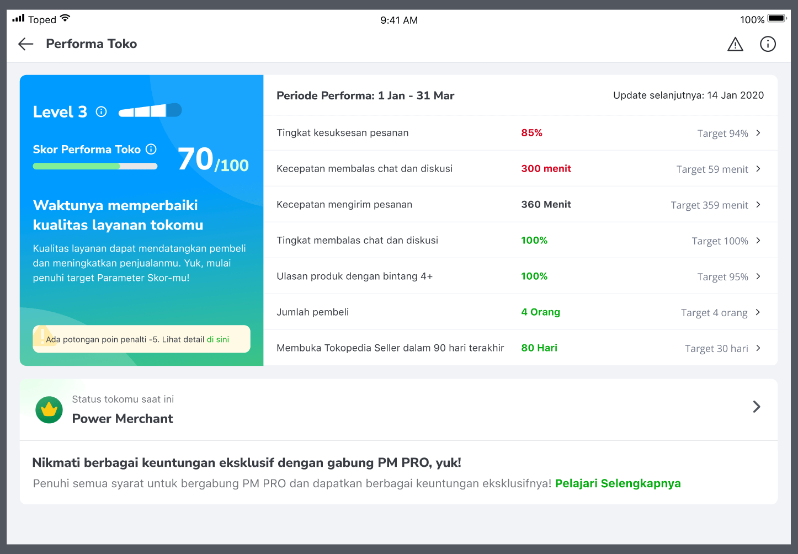

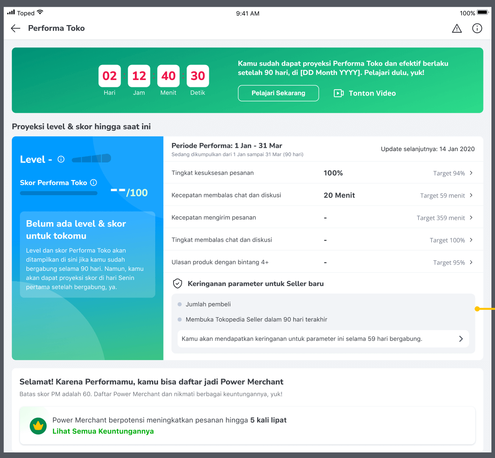

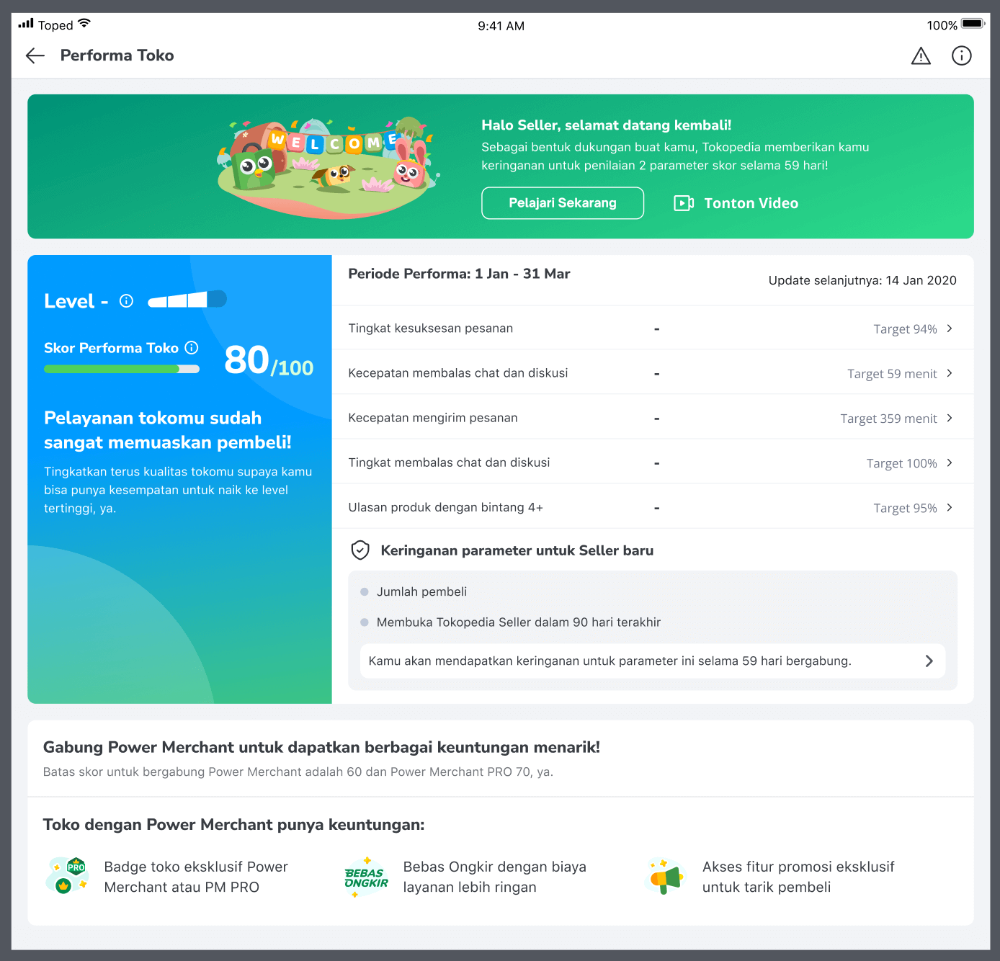

### Penalty

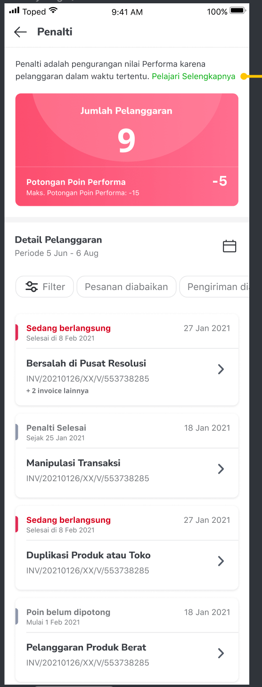

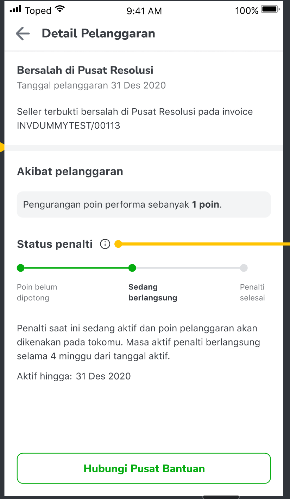

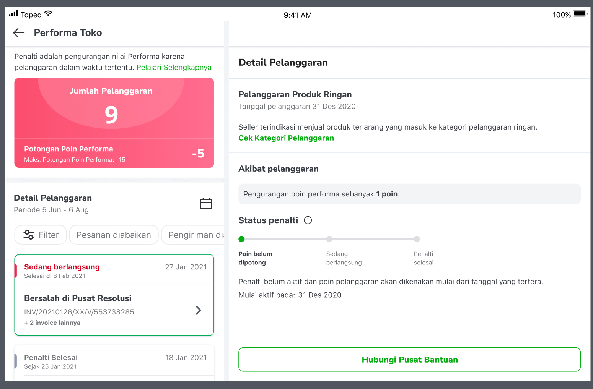

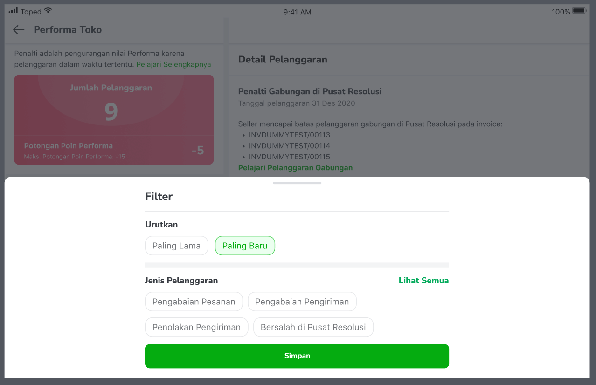

## Navigation

| External Applink - Shop Score | `tokopedia://shop-score-detail` |
| --- | --- |
| Internal Applink - Shop Score | `tokopedia-android-internal://marketplace/shop/performance` |
| External Applink - Shop Penalty | `tokopedia://shop-penalty` |
| Internal Applink - Shop Penalty | `tokopedia-android-internal://marketplace/shop-penalty` |
| External Applink - Shop Penalty Detail | `tokopedia://shop-penalty-detail` |
| Internal Applink - Shop Penalty Detail | `tokopedia-android-internal://marketplace/shop-penalty-detail` |

## Useful Links

| Supporting docs | Links |
| --- | --- |
| Test Case | <https://docs.google.com/spreadsheets/d/1c2J4yUQRhbAf880cAs6TEQsxSBm7HttQpiq9gy8rAkI/edit#gid=0>  |
| Figma | - [Existing Seller (PM/RM)](https://www.figma.com/file/UddY8zvCo1yrGtaDU95n2T/%5BUI--M%5D-Shop-Score?node-id=1%3A39936) - [Existing Seller (OS)](https://www.figma.com/file/UddY8zvCo1yrGtaDU95n2T/%5BUI--M%5D-Shop-Score?node-id=1580%3A0) - [New Seller](https://www.figma.com/file/UddY8zvCo1yrGtaDU95n2T/%5BUI--M%5D-Shop-Score?node-id=223%3A404) - [Reactivated Seller](https://www.figma.com/file/UddY8zvCo1yrGtaDU95n2T/%5BUI-M%5D-Shop-Score?node-id=7653%3A122466) - [Tablet Mode](https://www.figma.com/file/UddY8zvCo1yrGtaDU95n2T/%5BUI-M%5D-Shop-Score?node-id=9650%3A128988)  |
| GQL | Shop Score:[New Shop Score Contract](/wiki/spaces/MC/pages/1267828185/New+Shop+Score+Contract) PM:[GQL PM Journey](/wiki/spaces/OS/pages/1241450499/GQL+PM+Journey) `valuePropositionGetRecommendationTools``goldGetPMSettingInfo``goldGetPMShopInfo`Penalty:[Penalty Query](/wiki/spaces/MC/pages/1377469645/Penalty+Query)  |
| Trackers | Existing Seller:<https://mynakama.tokopedia.com/datatracker/product/requestdetail/804> New Seller:<https://mynakama.tokopedia.com/datatracker/product/requestdetail/949>  |
| PR | Release:<https://github.com/tokopedia/android-tokopedia-core/pull/19449> Release SellerApp 2\_27<https://github.com/tokopedia/android-tokopedia-core/pull/19447> New Seller<https://github.com/tokopedia/android-tokopedia-core/pull/21536> Reactivated Seller<https://github.com/tokopedia/android-tokopedia-core/pull/22759> Tablet Mode<https://github.com/tokopedia/android-tokopedia-core/pull/23099>  |

