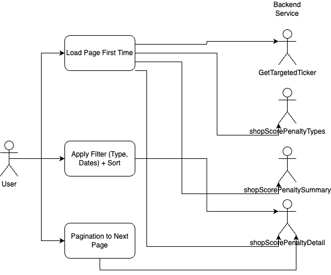
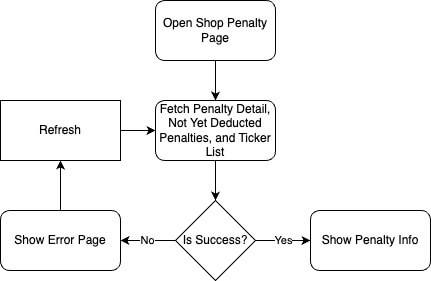
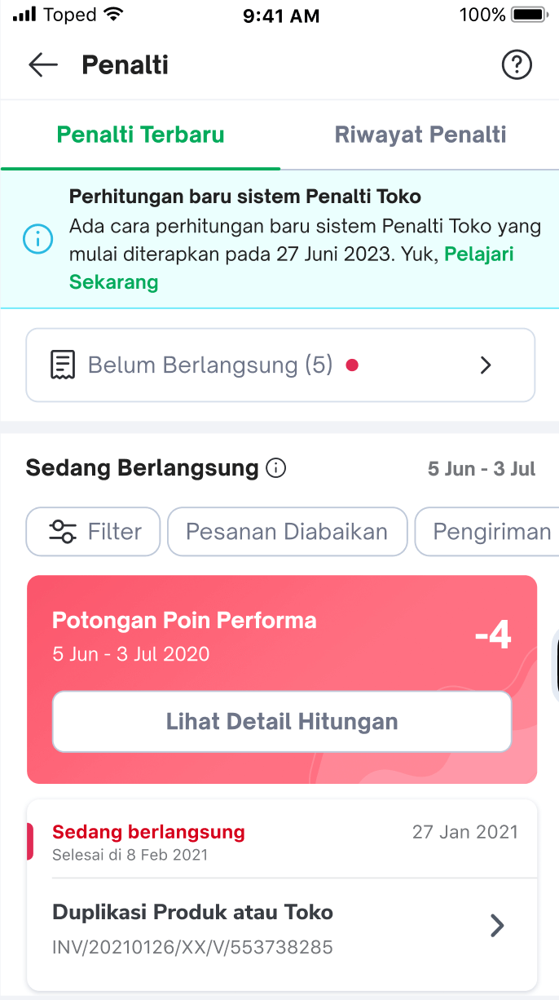
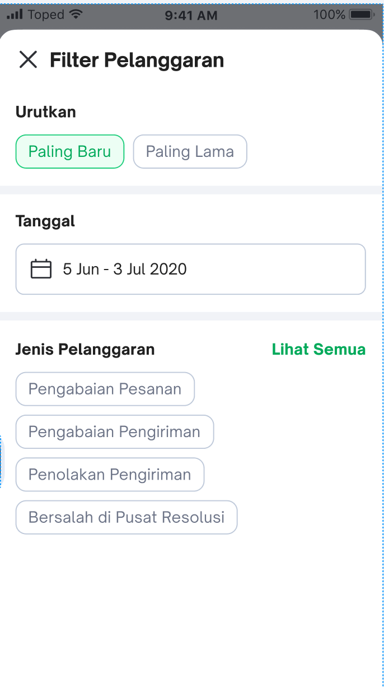
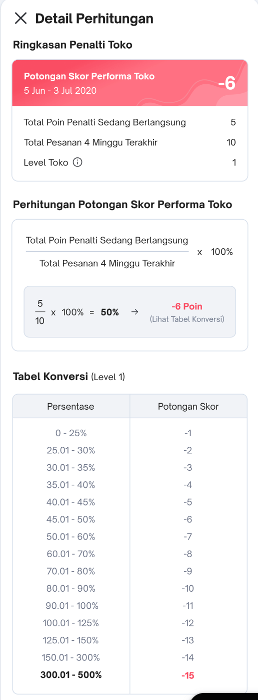
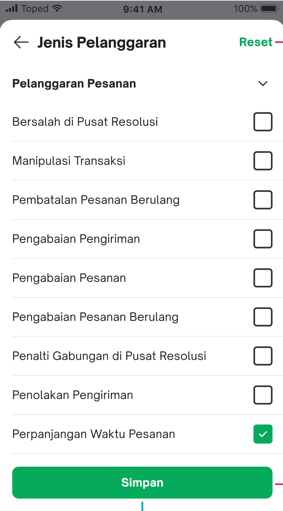

| **Status**      | <!--start status:GREEN-->RELEASE<!--end status-->                                                                                                                                                             |
|-----------------|---------------------------------------------------------------------------------------------------------------------------------------------------------------------------------------------------------------|
| Contributors    | [REIVIN OKTAVIANUS](https://tokopedia.atlassian.net/wiki/people/5dae89dab86cd40c2da5ad2f?ref=confluence) [Rizqi Aryansa](https://tokopedia.atlassian.net/wiki/people/5e25ee87006fae0ca232e1ac?ref=confluence) |
| Product Manager | [Hans Bastian Wangsa](https://tokopedia.atlassian.net/wiki/people/62f046c0e50f2f2a39562aa4?ref=confluence)                                                                                                    |
| Team            | [Minion Stuart](https://tokopedia.atlassian.net/people/team/eeba862a-bd9d-472c-b901-415b15b1a37e?ref=directory&src=peopleMenu)                                                                                |
| Release date    | 26 June 2023 / <!--start status:GREY-->MA-3.225<!--end status--> <!--start status:GREY-->SA-2.155<!--end status-->                                                                                            |
| Module type     | <!--start status:YELLOW-->FEATURE<!--end status-->                                                                                                                                                            |
| Product PRD     | [Poena Revamp](https://docs.google.com/document/d/1k86JacbXBPT2zym27CufF706PxriWVOGI_9ftv4-j0g/edit#)                                                                                                         |
| Module Location | `features/merchant/shop_score`                                                                                                                                                                                |

## Table of Contents

- [Overview](https://tokopedia.atlassian.net/wiki/spaces/PA/pages/2396423289#Overview)
- [Background](https://tokopedia.atlassian.net/wiki/spaces/PA/pages/2396423289#Background)
- [Release Notes](https://tokopedia.atlassian.net/wiki/spaces/PA/pages/2396423289#%5BhardBreak%5DRelease-Notes)
- [Diagram](https://tokopedia.atlassian.net/wiki/spaces/PA/pages/2396423289#Diagram)
- [Design](https://tokopedia.atlassian.net/wiki/spaces/PA/pages/2396423289#Design)
- [Navigation](https://tokopedia.atlassian.net/wiki/spaces/PA/pages/2396423289#Navigation)
- [Useful Links](https://tokopedia.atlassian.net/wiki/spaces/PA/pages/2396423289#Useful-Links)

## Overview

 In Greek mythology, Poena or Poine (Greek: Ποινή "recompense, punishment") is the spirit of punishment. Dynamic Shop Penalty Revamp

 (named Poena project) only impacted Shop Penalty pages inside `shop_score` module. The revamp is needed to implement new dynamic calculation for sellers' penalties. The main changes for this revamp are:

- New card information for penalty points
- Not yet deducted penalty information
- 2 viewpager pages inside main activity (ongoing and history penalty)
- 1 separate page for not yet deducted penalty

## Background

The main issue in the previous penalty calculation is the deduction mechanism. As the previous penalty is deeply correlated with the number of orders that the seller had, sellers with huge orders should be treated differently from sellers with small orders. We want to change the previous penalty deduction into a dynamic penalty deduction, where we will consider the ratio of order per penalty aside to convert the penalty points into shop score deduction.

## Release Notes

<!--start expand:June, 26th 2023 (MA-3.225/SA-2.155)-->
###### Poena RevampPR: <https://github.com/tokopedia/android-tokopedia-core/pull/22759> **Connect your Github account** Ticket: [AN-49546: PoenaPO APPROVED](https://tokopedia.atlassian.net/browse/AN-49546)
<!--end expand-->

## Diagram

   Use Case Diagram

   Flow Chart

## Design

|  Ongoing Penalty Page                        |  Filter Bottom Sheet           |
|------------------------------------------------------------------------------------|----------------------------------------------------------------------------|
|  Calculation Detail BottomSheet   |  Filter See All Bottom Sheet       |

## Navigation

| External Applink - Shop Penalty | `tokopedia://shop-penalty`                              |
|---------------------------------|---------------------------------------------------------|
| Internal Applink - Shop Penalty | `tokopedia-android-internal://marketplace/shop-penalty` |

## Useful Links

| Supporting docs | Links                                                                                                                                                                                                                                              |
|-----------------|----------------------------------------------------------------------------------------------------------------------------------------------------------------------------------------------------------------------------------------------------|
| Figma           | [Poena Revamp](https://www.figma.com/file/hLhl3aewWzO7SD8Wje6waf/Dynamic-Penalty?node-id=2223%3A169398&mode=dev)                                                                                                                                   |
| GQL             | `shopScorePenaltyTypes``shopScorePenaltySummary``shopScorePenaltyDetail`[Penalty Query](/wiki/spaces/MC/pages/1377469645/Penalty+Query) `GetTargetedTicker`[GQL - Get Targeted Ticker](/wiki/spaces/EI/pages/1919520722/GQL+-+Get+Targeted+Ticker) |
| PR              | <https://github.com/tokopedia/android-tokopedia-core/pull/33435>                                                                                                                                                                                   |

