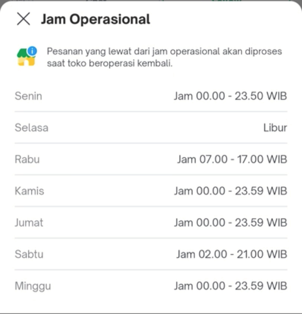
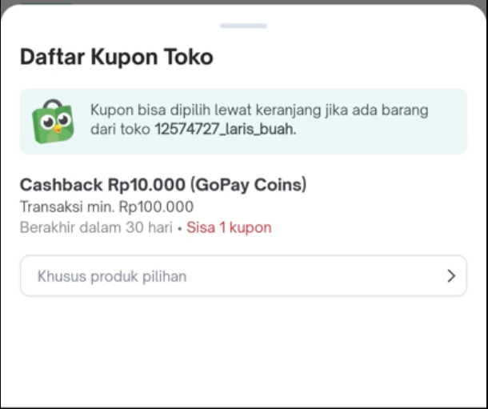
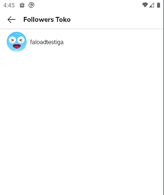
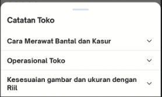
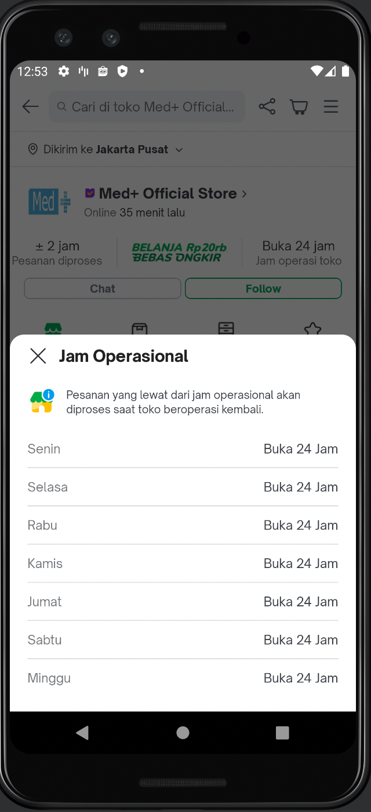
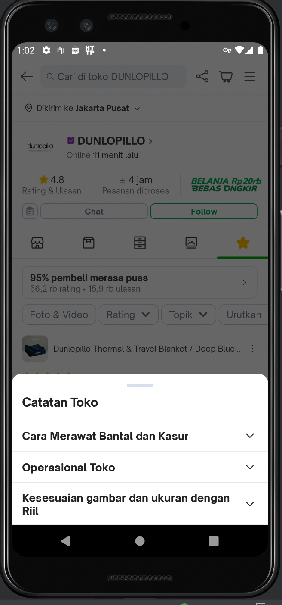

| **Status** | <!--start status:GREEN-->RELEASE<!--end status--> |
| --- | --- |
| Contributors | [Willybrodus Rangga Khaisar Purnama](https://tokopedia.atlassian.net/wiki/people/62cb5c393d382dfc9c5f11d2?ref=confluence) [CALVYN JULIAN](https://tokopedia.atlassian.net/wiki/people/5d1adf49cdf26a0d349c76ec?ref=confluence)  |
| Product Manager<br/> | [Joshua Ghibran](https://tokopedia.atlassian.net/wiki/people/70121:7d12fd85-be0a-4d0c-a14e-8279fe20ff69?ref=confluence)  |
| Team | [Minion Ken](https://tokopedia.atlassian.net/people/team/0ac7bdd0-19b2-4196-8711-b1a0a4b07178)  |
| Module type | <!--start status:BLUE-->FEATURE<!--end status-->  |
| Module Location | `com.tokopedia.shop_widget` | `features/merchant/shop_widget` |

## Table of Contents

<!--toc-->

## Overview

Shop\_widget is an internal library to assist in making pages intended for shops in displaying various views ranging from adapter campaigns to bottom sheets that bring up sort list options on the main page of the shop or related to the shop

### Project Description

Unified UI store widgets and common capabilities for shop pages or other shop-related pages. These internal widgets are created because shop\_page or other pages have many kinds of UI capabilities and they are similar on one page to another so they can be written as reused components. So we decided to build this public library to make it easier to develop other pages related to the store in the future.  
  
On shop\_widget internal library have the:

1. Shop Operational Hours Bottom Sheet



2. Shop Mvc Locked To Product



3. Shop Favorite List



4. Shop Note Detail as Page and Shop Note Detail as Bottom Sheet



5. Thematic Widget (Thematic View)

[Shop\_Widget.webm](/wiki/download/attachments/2133335029/Shop_Widget.webm?version=1&modificationDate=1673569219293&cacheVersion=1&api=v2)

### Tech Task

1. MVVM
2. Coroutine
3. DiffUtil and visitable pattern
4. LiveData
5. Dagger

## How-to

#### Access to Shop Operational Hours Bottom Sheet

For Access the Shop Operational Hours Bottom Sheet you can route the app link using 


```
RouteManager.getIntent(getContext(),tokopedia://shop/{shop_id}/operational-hour)
```

Here is a UI Example : 



#### Access to Shop Mvc Locked To Product

For Access the Shop Mvc Locked To Product you can route the app link using 


```
RouteManager.getIntent(getContext(),tokopedia://shop/{shop_id}/voucher/{voucher_id})
```

[Shop\_Widget.webm](/wiki/download/attachments/2133335029/Shop_Widget.webm?version=1&modificationDate=1673569219293&cacheVersion=1&api=v2)

#### Access to Shop Favorite List

For Access the Shop Favorite List you can route the app link using 


```
RouteManager.getIntent(getContext(),tokopedia://shop/{shop_id}/follower)
```

#### Access to Shop Note Detail Page and Bottom Sheet

For Access the Shop Note Detail, you can using `createIntent(context: Context?, shopId: String?, shopNoteId: String?) : Intent` method, and here is the example :


```
startActivity(ShopNoteDetailActivity.createIntent(activity, shopId, shopNoteId)))
```

and for accessing the shop note as a bottom sheet you can use `createInstance(shopId: String?): ShopNoteBottomSheet()` to create the instance of the bottom sheet. Here is an example to showing note detail : 


```
ShopNoteBottomSheet.createInstance(shopId).show(childFragmentManager, ShopNoteBottomSheet.TAG)
```

Here is a UI Example : 



[Catatan Toko.webm](/wiki/download/attachments/2133335029/Catatan%20Toko.webm?version=2&modificationDate=1674713153638&cacheVersion=1&api=v2&width=340)

#### Using Thematic Widget Adapter

Thematic Widget Adapter has three types of widgets, there are : 

1. Product Adapter
2. Loading Adapter
3. See All Adapter

For using Thematic Widget Adapter the first thing you should do is implement the interface `ThematicWidgetTypeFactory`, and you need to set the listener using `ThematicWidgetListener` here is the example code


```
ShopHomeAdapterTypeFactory(    
private val thematicWidgetListener: ThematicWidgetViewHolder.ThematicWidgetListener
) : BaseAdapterTypeFactory(), ThematicWidgetTypeFactory {

  override fun type(uiModel: ThematicWidgetUiModel): Int {
      return if (isShowThematicWidgetPlaceHolder(uiModel))
         ThematicWidgetLoadingStateViewHolder.LAYOUT
      else
          ThematicWidgetViewHolder.LAYOUT
  }
  
  override fun createViewHolder(parent: View, type: Int): AbstractViewHolder<*> {
      val viewHolder = when(type){
        ThematicWidgetViewHolder.LAYOUT -> ThematicWidgetViewHolder(parent, thematicWidgetListener)
        ThematicWidgetLoadingStateViewHolder.LAYOUT -> ThematicWidgetLoadingStateViewHolder(parent)
      }
      return viewHolder
  }
}
```

## FAQ

<!--start expand:Where can I see the features that have been implemented shop_widget ?-->
You can see the implementation on `com.tokopedia.shop` | `feature/merchant/shop_page`
<!--end expand-->

