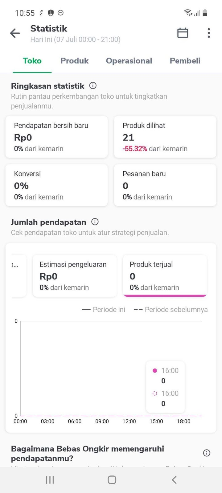
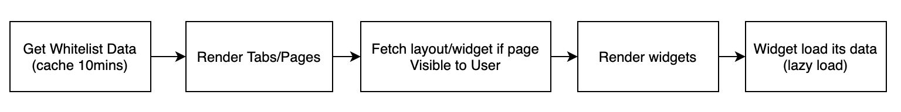
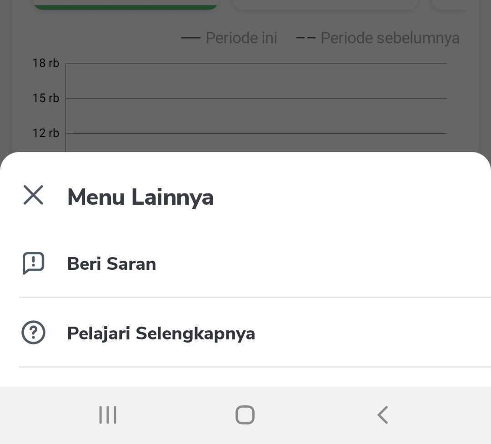
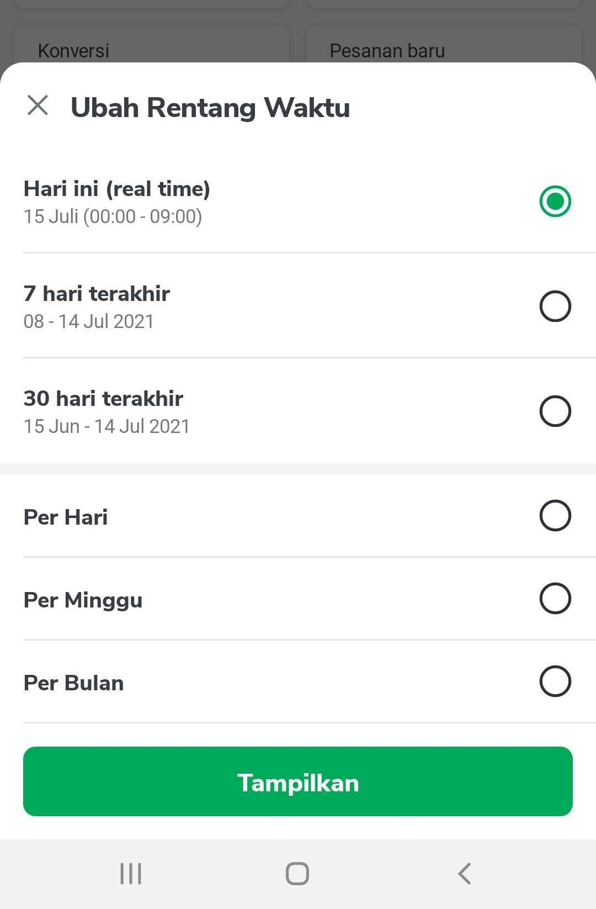

| Module | `:features:merchant:statistic` |
| --- | --- |
| Applink | `tokopedia://gold-merchant-statistic-dashboard` `sellerapp://gold-merchant-statistic-dashboard` optional params `page` and `widget` ex :`tokopedia://gold-merchant-statistic-dashboard?page=shop-insight&widget=pieChart-183` |
| Team | Product : [Ariska Giovanni (Unlicensed)](https://tokopedia.atlassian.net/wiki/people/5ca55b55307b0637cbbd86f9?ref=confluence) Android : [Ilham .](https://tokopedia.atlassian.net/wiki/people/5de4d2148743750d00b7cc12?ref=confluence) [Steven Fredian Andy Putra](https://tokopedia.atlassian.net/wiki/people/557058:20782bf2-2a29-413c-b75c-ce30c92cad9e?ref=confluence) UI : [Panggih Giri Samudra (Unlicensed)](https://tokopedia.atlassian.net/wiki/people/5fd6f8628332a1010e017da7?ref=confluence) BE : [Vinsensius Indra Suryanto](https://tokopedia.atlassian.net/wiki/people/5fc483cb31795a006fac23c1?ref=confluence) [Husein Alhamid](https://tokopedia.atlassian.net/wiki/people/5eb5859986d01b0b7d2a8bf5?ref=confluence) [Alfian Dhimas (Unlicensed)](https://tokopedia.atlassian.net/wiki/people/5cc284cc3d24270e75a90c2c?ref=confluence) TE : [Febrian Dwinanda (Deactivated)](https://tokopedia.atlassian.net/wiki/people/5fc88cf69592df00763a8ddd?ref=confluence) [Gerard Ferhandi (Unlicensed)](https://tokopedia.atlassian.net/wiki/people/5d84a69f696ec70c3366e75c?ref=confluence)  |

### Links


| [PRD](https://tokopedia.atlassian.net/wiki/spaces/~354932339/pages/755957825/Insight+Platform+Statistic+Overview+on+Seller+App) |
| --- |
| [Figma](https://www.figma.com/file/BYkpm4fygCngb6rspEdL9s/%5BAll-Platform---Seller%5D-Statistic-Navigation?node-id=364%3A10690) |
| [GQL Docs](/wiki/spaces/~354932339/pages/719618522/Version+3) |
| [PR](https://github.com/tokopedia/android-tokopedia-core/pull/14222) |

### Oeverview



- **General Logic**


	- this page have some tabs but using only one fragment class with different instance
	- have a whitelist flow to show a tab/page for only whitelisted seller
	- this page contains many widgets where each widget has its own GQL to fetch its data.
	- widgets displayed are fully controlled by BE (app will render widget based on response)
- **Flow Api**


	- fetch whitelist query, if eligible will render all tabs, otherwise will render some of them
	- then the tab/page visible to the seller will fetch all widget using *GetSellerDashboardPageLayout* query, it will return list of widgets to be displayed
	- then app will render the widgets, each widget will load its own data while show its own loading state
- **Tech Stack**


	- standard MVVM, lazy load

### Data Flow



### Statistic existing tabs

1. Shop Statistic / Toko `StatisticPageHelper.getShopStatistic(...)`
2. Product Statistic / Produk `StatisticPageHelper.getProductStatistic(...)`
3. Operational Statistic / Operasional `StatisticPageHelper.getOperationalStatistic(...)`
4. Buyer Statistic / Pembeli `StatisticPageHelper.getBuyerStatistic(...)`

### How to add new tabs?

#### 1. You need to prepare some parameters :

 **a.** `pageTitle` will be shown as Tab title  
 **b.** `pageSource` will be sent when get statistic layout/widget (`GetLayoutUseCase`)  
 **c.** `tickerPageName` will be sent when get statistic ticker (`GetTickerUseCase`)  
 **d.** `actionMenu` is variable that contains list of menu for the tab/page that you want to create.   
 for example you want to show `Beri Saran` and `Pelajari Selengkapnya` menu, here is the code in `StatisticPageHelper` :



`listOf(ActionMenuUiModel(`   
`title = context.getString(R.string.stc_give_suggestions), appLink = Const.Url.SHOP_GIVE_SUGGESTIONS,`   
`iconUnify = IconUnify.CHAT_REPORT), ActionMenuUiModel( title = context.getString(R.string.stc_learn_more), appLink = Const.Url.SHOP_LEARN_MORE, iconUnify = IconUnify.HELP ))`  


 **e.** `dateFilters` is the list of filters that you want to show for your tab/page. for example in `StatisticPageHelper` :



`listOf(`   
`getDateRangeItemToday(context, true), getDateFilterItemClick(context, Const.DAYS_7, Const.DAYS_7, Const.DAY_1, DateFilterItem.TYPE_LAST_7_DAYS, false), getDateFilterItemClick(context, Const.DAYS_30, Const.DAYS_30, Const.DAY_1, DateFilterItem.TYPE_LAST_30_DAYS, showBottomBorder = false), DateFilterItem.Divider, getDateFilterPerDay(context, Const.DAYS_365), getDateFilterPerWeek(context, false, Const.DAYS_365), getFilterPerMonth(context, true, Const.DAYS_365), DateFilterItem.ApplyButton`   
`)`

#### 2. Create method to get your tab object in `StatisticPageHelper` class, example :


```
fun getShopStatistic(context: Context, userSession: UserSessionInterface): StatisticPageUiModel {
    val title = context.getString(R.string.stc_shop)
    return StatisticPageUiModel(
            pageTitle = title,
            pageSource = Const.PageSource.SHOP_INSIGHT,
            tickerPageName = Const.TickerPageName.SHOP_INSIGHT,
            actionMenu = listOf(
                    ActionMenuUiModel(
                            title = context.getString(R.string.stc_give_suggestions),
                            appLink = Const.Url.SHOP_GIVE_SUGGESTIONS,
                            iconUnify = IconUnify.CHAT_REPORT
                    ),
                    ActionMenuUiModel(
                            title = context.getString(R.string.stc_learn_more),
                            appLink = Const.Url.SHOP_LEARN_MORE,
                            iconUnify = IconUnify.HELP
                    )
            ),
            dateFilters = getShopDateFilters(context, userSession)
    )
}
```

#### 3. Last, include the tab object you just created in `StatisticActivity.getStatisticPages(...)`

### Widgets

All of the widget in statistic page are the same widget that used in seller home. Will be documented in separate document.

### Page Source and Ticker Page Name for each tab

`pageSource` and `tickerPageName` are two important params. `pageSource` is used when get page layout/widget in `GetLayoutUseCase`. `tickerPageName` is used when get page ticker in `GetTickerUseCase`. Here are the list of page source and ticker name for each tab :


| **Tab** | **Page Source** | **Ticker Name** |
| --- | --- | --- |
| Toko | `shop-insight` | `seller-statistic` |
| Pembeli | `buyer-insight` | `wawasan-pembeli` |
| Produk | `product-landing-insight` | `seller-statistic#wawasan-produk` |
| Operasional | `operational-insight` | `seller-statistic#wawasan-operasional` |

### Remote Config


| **Key** | **Current Value** | **Description** | **Status** |
| --- | --- | --- | --- |
| `android_sellerapp_statistic_custom_date_filter` | `true` | To **enable**(`true`) or **disable**(`false`) custom date filter on **Shop** and **Product** tab | active |

### Tech Improvement Plan

1. Implement `diff util` to optimise widget rendering on data changed
2. Implement `coroutine flow` to solve problem live data doesn’t support back pressure compatibility. This makes possibility for some widgets won’t update their state when 1 live data used by two or more widgets that load data in parallel.
3. Improve lazy load. Currently only load widgets that visible to seller/user. I think it's better if we load more 2 or 3 widgets below, so there is possibility seller not see the loading state of the widget and the page will not blinking on state changed.
4. Dark mode ***[on progress]***
5. Thanos / Cassava instrument test to validate tracker
6. Tablet Mode ***[on progress]***
7. ViewPager2 to optimise page load and page management
