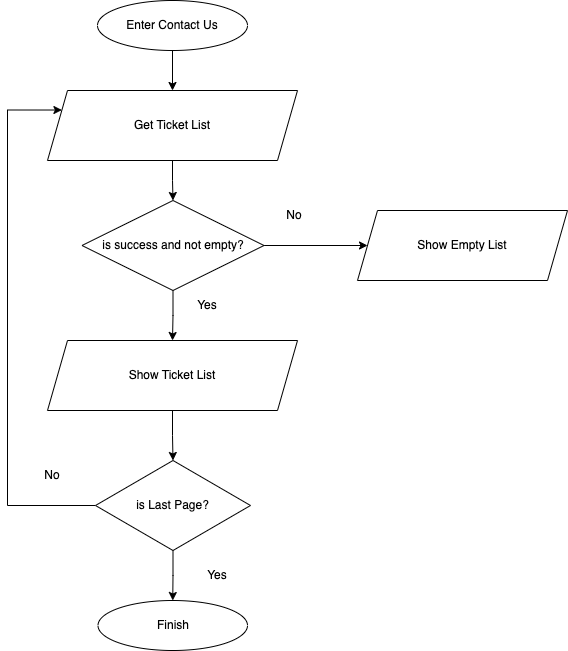
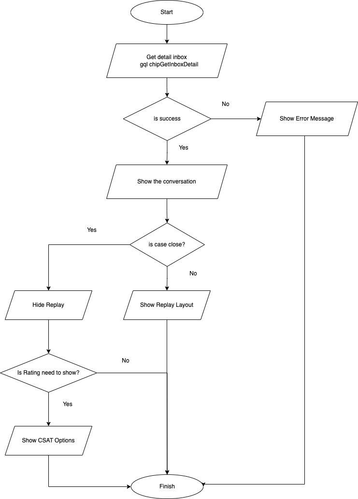
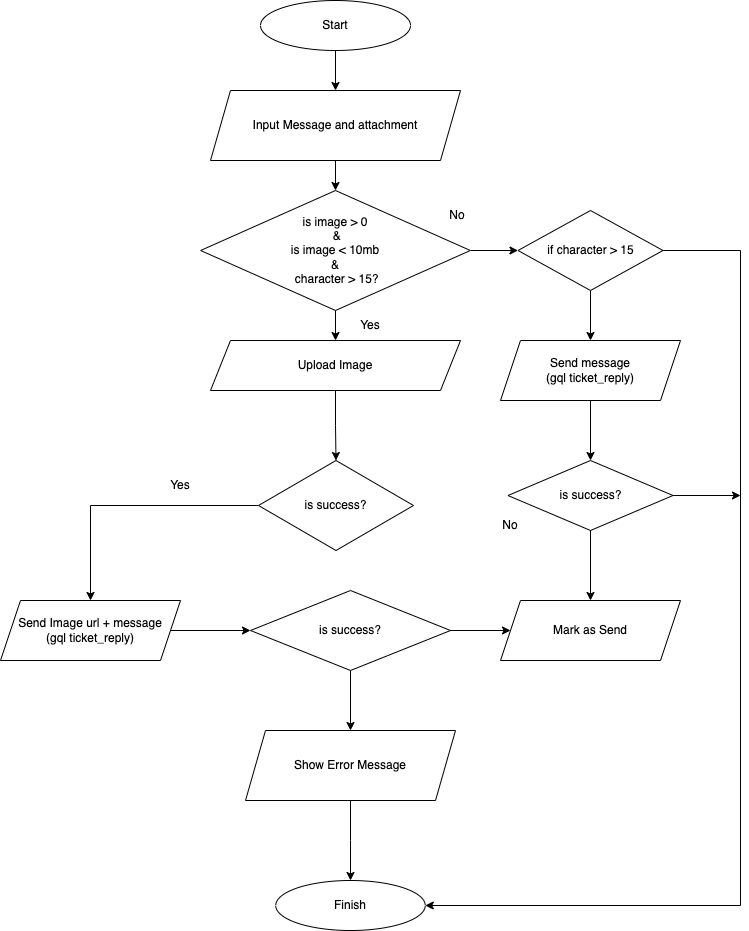
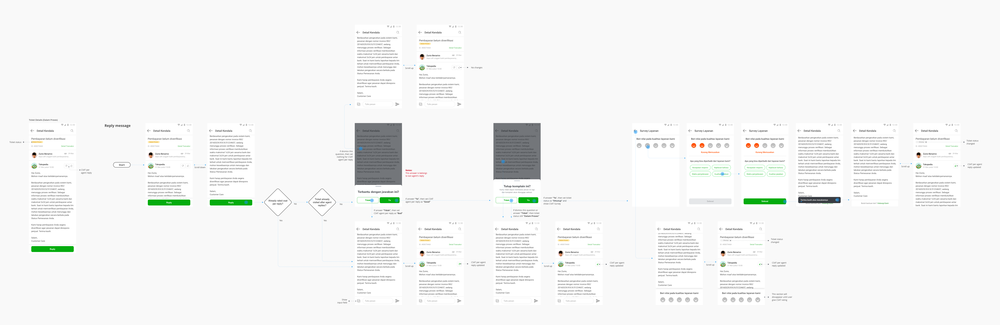
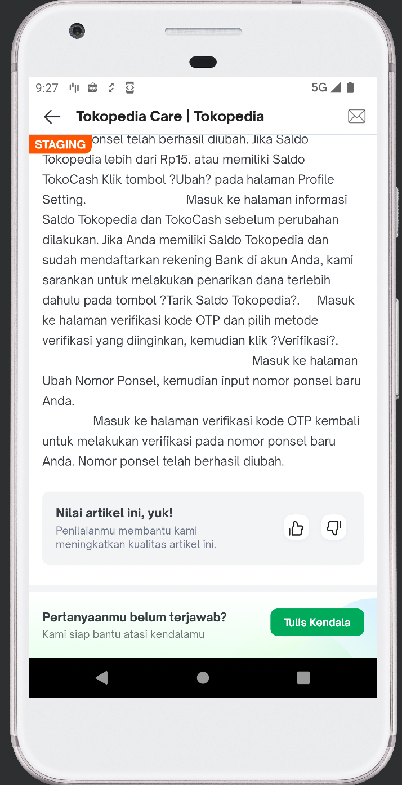
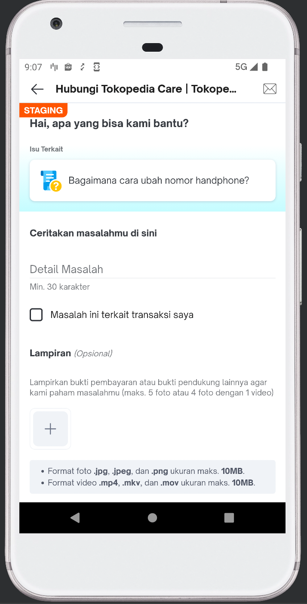
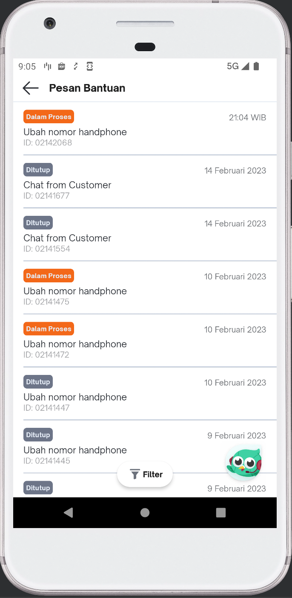

---
"Contact Us"
---

| **Status** | <!--start status:GREEN-->RELEASE<!--end status-->  |
| --- | --- |
| Contributors | [Willybrodus Rangga Khaisar Purnama](https://tokopedia.atlassian.net/wiki/people/62cb5c393d382dfc9c5f11d2?ref=confluence) [Sourav Kumar Saikia](https://tokopedia.atlassian.net/wiki/people/61654e3cc669a60069d09903?ref=confluence)  |
| Product Manager | [Zulham Yachya](https://tokopedia.atlassian.net/wiki/people/5c6bf6755b4c267532740b51?ref=confluence) [Karunia Khairunnisa](https://tokopedia.atlassian.net/wiki/people/5dfa1215a0602c0cabdd0fa9?ref=confluence)  |
| Team  | [Minion Mark](https://tokopedia.atlassian.net/people/team/54372146-8afa-46e4-8de3-783c53a0cc3b) ([Sourav Kumar Saikia](https://tokopedia.atlassian.net/wiki/people/61654e3cc669a60069d09903?ref=confluence) [Willybrodus Rangga Khaisar Purnama](https://tokopedia.atlassian.net/wiki/people/62cb5c393d382dfc9c5f11d2?ref=confluence) ) |
| Release date | 2018 |
| Module type | <!--start status:YELLOW-->FEATURE<!--end status--> |
| Module Location | `features.operational.contact_us`| `features/operational/contact_us` |

## Table of Contents

<!--toc-->

## Overview

Contact Us is a feature created that acts as Customer Relations which plays an important role as a liaison between the company and consumers, providing services to customers, especially in communication services, whether it's customer complaints or to get information about a feature. This feature displays a list of tickets that have been made and displays a summary of the ongoing conversation. In addition, the user can also assess whether the performance of the agent is related to whether the information provided is useful or not.

### Background

Contact Us can give a lot of benefits to Tokopedia and User, the following are some of them :

1. As a user, when I create a ticket, in the inbox, every conversation between me and the agent will be shown in a listed chat
2. To quantify the quality of CS agents, not only measure it using CSAT after the ticket closed, but we also need to measure it based on CSAT per agent reply.

### Project Description

The Contact Us feature module consists of 3 sub-features, it is the inbox sub-feature containing a list of tickets that have been made by the user, then a conversation page that contains a list of conversations that occurred on the ticket, and the CSAT filling-in sub-feature that can be used by users to provide an assessment of CS Agent performance. 

Note : 

This feature has a special treatment for creating tickets from a chatbot. Every ticket created on the chatbot will be shown on the Inbox page when the ticket is declared as Solved by CS Agent, also the conversation page will show as a resume conversation not replay by replay.

## Tech Stack

- `MVVM, StateFlow and SharedFlow`
- `csat_rating Module` - Modul for handling csat activity on contact us
- `ImageUploader` - The library for uploading images [should be changed to `MediaUploader`]
- `ImagePicker` - The library for image picker [should be changed to `MediaPicker`]

## Flow Diagram

Here is the Flow Chart of Contact Us, the flow diagram will device into 2 diagrams, the first is for the Inbox page and the second is for the conversation page

1. For Inbox Page
	1. Hit `ticket gql : ticket(userID: String, page: int, status: int, rating: int)`
	2. Is (a) success? if successful then show to recycler view, not show an empty page
	3. User can :
		1. do scrolls and if the page is not last then do (a)
		2. do filter and after clicking the option do (a)

2. For the Conversation Page
- Load Detail Inbox
	1. Hit `chipGetInboxDetail(caseID: String)`
	2. Is Hit Success
		1. if successful then :
			1. show the conversation
			2. if the case is closed :
				1. if yes, does a check-in case need to show a rating?
					1. if yes then show csat, hide the replay layout
					2. if not then just hide the replay layout
				2. if not then show the replay layout
		2. If failed then show an error message

- Send a Message
	- Is image > 0 & Is image < 10Mb & comment character > 15?
		- is yes then upload image using `ImageUploader`, and store text + image URL using `ticket_reply(ticketID: String, userID: String, message: String, pPhoto: Int, pPhotoAll: String, agentReplay: String)`
			- is sending a message successfully?
				- if yes, then mark it as sent
				- if no, then show an error message
		- is no then show a toast error message
	- if character > 15 ?
		- is yes then send it using `ticket_reply(ticketID: String, userID: String, message: String, pPhoto: 0, pPhotoAll: "", agentReplay: String)`
			- is sending a message successfully?
				- if yes, then mark it as sent
				- if no, then show an error message
		- is no then show a toast error message

- CSAT Ticket Close + CSAT Per Replay

You can see CSAT flow on this UI Flow

## Navigation

*The contact us page has two ways to access it, here's how:*

| **No** | **How to Access** | **Video** |
| --- | --- | --- |
| 1. | You can access the contact us page from Home, then click Inbox menu then click options Pesan Bantuan | [To Contact Us.webm](/wiki/download/attachments/2168062023/To%20Contact%20Us.webm?version=1&modificationDate=1677334595379&cacheVersion=1&api=v2)  |
| 2.  | You can access the contact us page from Tokopedia Care page. 1. Click Humberger Icon 2. Scroll to bottom until see Bantuan Tokopedia Care 3. Click on Bantuan Tokopedia Care 4. Click icon Ampelop on Right Top  | [Go To Inbox contact us.webm](/wiki/download/attachments/2168062023/Go%20To%20Inbox%20contact%20us.webm?version=1&modificationDate=1677334746696&cacheVersion=1&api=v2)  |

## How-to

| **No** | **How To** | **Video / Picture** |
| --- | --- | --- |
| 1.   | Filter Item:You can filter the inbox item into 4 state :1. All 2. Dalam Proses 3. Beri Penilaian 4. Ditutup  | [Inbox Page.webm](/wiki/download/attachments/2168062023/Inbox%20Page.webm?version=1&modificationDate=1677335113249&cacheVersion=1&api=v2)  |
| 2.  | Here is the way to create the ticket :1. Open page [Artikel Ubah Nomor Saya](https://staging.tokopedia.com/help/article/t-1001-nomor-saya-sudah-tidak-aktif-bagaimana-cara-mengubahnya) 2. Click Button Tulis kendala on the bottom of page 3. Completed the form and click `Kirim` 4. After that wait around 2 minutes until the ticket will shown on Inbox Page (Pesan Bantuan Page)  |     |
|  3.  | CSAT :On Contact Us, there are two types of CSAT namely CSAT per ticket and CSAT per replay. You can see the flow on the column `Video/Picture` |   |

## Useful Links

- [Figma](https://www.figma.com/file/KSX9uOq0XhgxZsYsAza2R0/Help-Page---Bug-Bash?node-id=10%3A1358&t=QALSuts5AZFZv1x4-0)
- [Roadmap](https://docs.google.com/spreadsheets/d/1oeoiTJhrjNhpoYqps6n-0M-2NYfgrkhebWpQAf06trs/edit#gid=1910952273)

## FAQ

<!--start expand:How I can do chat testing?-->
You can do chat testing using your account and for CS Agent you can log in on [Salesforce](https://tokopedia--staging.sandbox.my.salesforce.com/?ec=302&startURL=%2Fvisualforce%2Fsession%3Furl%3Dhttps%253A%252F%252Ftokopedia--staging.sandbox.lightning.force.com%252Flightning%252Fr%252FCase%252F5005D000009383CQAQ%252Fview) and use an account on this [doc](https://docs.google.com/document/d/1v8dKGKoCOLDQLEgQE3sZ8f2BI0gRLOdDew-jFE3kGXI/edit?usp=sharing), for note, you can test it using STAGING envy
<!--end expand-->

<!--start expand:How can I check and test UI for tickets created from the chatbot?-->
You can create a ticket using chatbot ([here is the guide to chatbot](https://tokopedia.atlassian.net/wiki/spaces/PA/pages/2109183004/Chatbot#Navigation)) and use the word “Chat dengan CFS” then you can log in on [Salesforce](https://tokopedia--staging.sandbox.my.salesforce.com/?ec=302&startURL=%2Fvisualforce%2Fsession%3Furl%3Dhttps%253A%252F%252Ftokopedia--staging.sandbox.lightning.force.com%252Flightning%252Fr%252FCase%252F5005D000009383CQAQ%252Fview) and use an account and follow the step on this [doc](https://docs.google.com/document/d/1v8dKGKoCOLDQLEgQE3sZ8f2BI0gRLOdDew-jFE3kGXI/edit?usp=sharing), for note, you can test it using STAGING envy
<!--end expand-->

