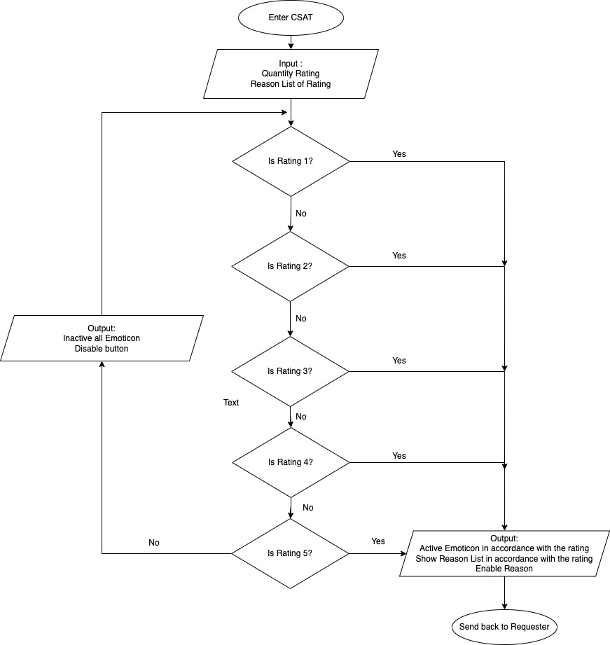
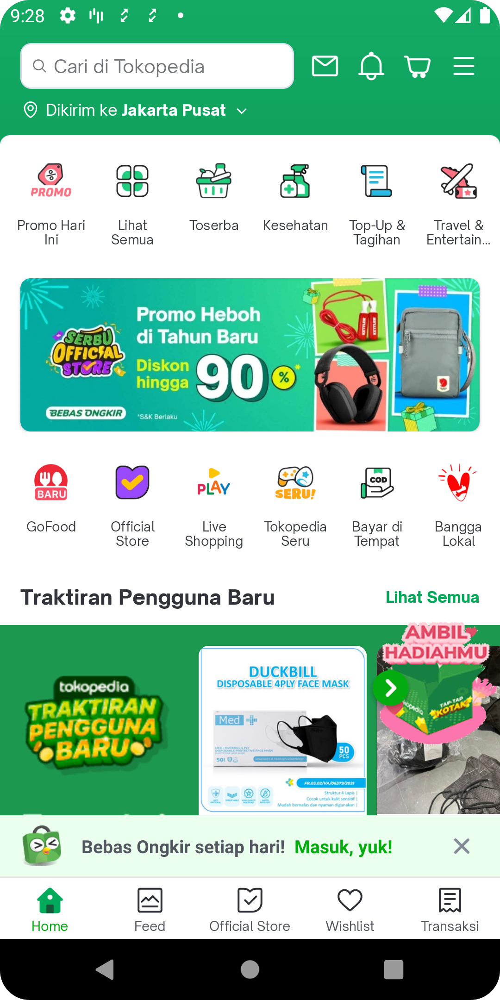
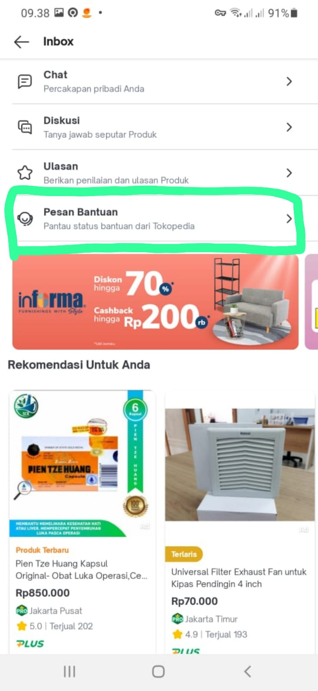
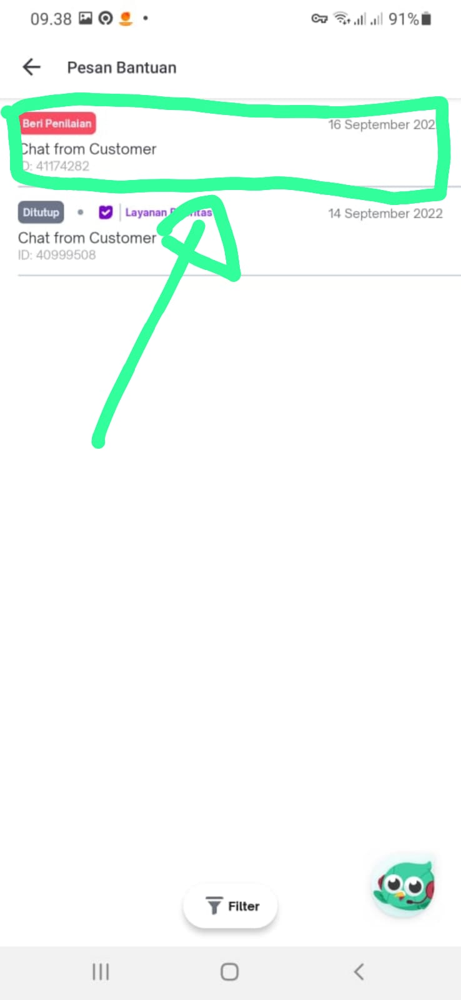
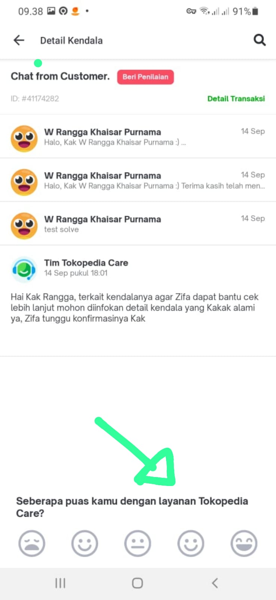
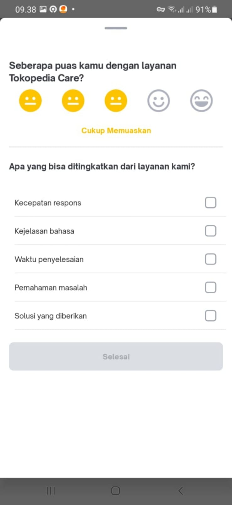

---
"CSAT Rating"
---

| **Status** | <!--start status:GREEN-->RELEASE<!--end status--> |
| --- | --- |
| Contributors | [Willybrodus Rangga Khaisar Purnama](https://tokopedia.atlassian.net/wiki/people/62cb5c393d382dfc9c5f11d2?ref=confluence) [Sourav Kumar Saikia](https://tokopedia.atlassian.net/wiki/people/61654e3cc669a60069d09903?ref=confluence)  |
| Product Manager | [Zulham Yachya](https://tokopedia.atlassian.net/wiki/people/5c6bf6755b4c267532740b51?ref=confluence) [Rifki Mega](https://tokopedia.atlassian.net/wiki/people/62831a49222d36006fb5d2e2?ref=confluence)  |
| Team | [Minion Ken](https://tokopedia.atlassian.net/people/team/0ac7bdd0-19b2-4196-8711-b1a0a4b07178) ([Willybrodus Rangga Khaisar Purnama](https://tokopedia.atlassian.net/wiki/people/62cb5c393d382dfc9c5f11d2?ref=confluence) [Sourav Kumar Saikia](https://tokopedia.atlassian.net/wiki/people/61654e3cc669a60069d09903?ref=confluence)) |
| Release date<br/> | 2017 |
| Module type | <!--start status:BLUE-->SUB-FEATURE<!--end status--> |
| Product PRD<br/> | [[Internal][chatbot] Dynamic CSAT](/wiki/spaces/CS/pages/1837367781)  |
| Module Location |   `operational/contact_us` | `com.tokopedia.csat_rating` |

## Table of Contents

<!--toc-->

## Overview

Every user has the right to judge whether our service is good or not and that can be feedback for us to assess our performance, by using this sub-feature we can get a user's assessment of us.


### Project Description

*Each user has the right to judge whether our service is good or not and that can be feedback for us to assess and make changes and improvements to our performance.*  
*By using the csat\_rating sub-feature we can see and we can get a lot of information from the user to determine what next we can improve in our service.*  


Another benefit is : 

- To quantify the quality of the CS agent after the ticket closed
- To make SLA for closing tickets faster (by seamlessly guiding the user to close the ticket)
- To increase the CSAT response rate when the ticket was closed.

[CSAT\_Record.webm](/wiki/download/attachments/2110985562/CSAT_Record.webm?version=1&modificationDate=1673511287155&cacheVersion=1&api=v2)

### Tech Task

1. MVVM
2. LiveData - sharing the UI model (ScreenState object) from View Model to View
3. Dagger

## Flow Diagram



## Navigation

You can access the CSAT Rating on Ticket Chat on the menu Pesan Bantuan, here is the flow UI : 

</br>

</br>

</br>

</br>

</br>

## How-to

*You have to add these steps to your module first:*


```
implementation projectOrAar(rootProject.ext.features.csat_rating)
```


---

On csat\_rating you can show the csat layout using two type of view, as a bottom sheet or as an activity

#### Access to CSAT Rating as Activity

After adding a dependency on the gradle, you can use the csat\_rating sub-feature with extend class 

`BaseProvideRatingActivity()` on your activity, and also you must extend 

`BaseFragmentProvideRating()` on your fragment class then you need to 

`override` all of the methods on 

`BaseFragmentProvideRating` class. 

 Here is the snippet : 


```
class ClassActivity : BaseProvideRatingActivity() {}
```


```
class ClassFragment : BaseFragmentProvideRating(){

override fun getLayoutManager(filterList: List<BadCsatReasonListItem>): RecyclerView.LayoutManager {}

 override fun getTextHelpTitleId(): Int = getBindingView().txtHelpTitle.id
 override fun getSmilleLayoutId(): Int = getBindingView().smileLayout.id
 override fun getSmileSelectedId(): Int = getBindingView().txtSmileSelected.id
 override fun getFeedbackQuestionId(): Int = getBindingView().txtFeedbackQuestion.id
 override fun getTextFinishedId(): Int = getBindingView().txtFinished.id
 override fun getFilterReviewId(): Int = getBindingView().filterReview.id
 
 override fun onSuccessSubmit(intent: Intent) {
    super.onSuccessSubmit(intent)
 }
}
```

## Useful Links

- [Figma of CSAT per Reply](https://www.figma.com/file/0pffoiuwJDPKnX4YMEo4bd/%5BUX-M-Support-Message%5D-CSAT-per-reply-(UX---Novie-%40-fec2fb1)?node-id=0%3A1)
- [Figma for CSAT per Close](https://www.figma.com/file/0pffoiuwJDPKnX4YMEo4bd/%5BUX-M-Support-Message%5D-CSAT-per-reply-(UX---Novie-%40-fec2fb1)?node-id=0%3A11)

## FAQ

<!--start expand:Where can I see features that have implemented csat rating?-->
You can see csat rating implementation you can see on `com.tokopedia.chatbot` | `user.chatbot`
<!--end expand-->

