| **Status** | <!--start status:GREEN-->RELEASE<!--end status-->  |
| --- | --- |
| Contributors | [Edwin Nurwansyah](https://tokopedia.atlassian.net/wiki/people/622e71a875f257006a98bab9?ref=confluence) [Ilham .](https://tokopedia.atlassian.net/wiki/people/5de4d2148743750d00b7cc12?ref=confluence) [REIVIN OKTAVIANUS](https://tokopedia.atlassian.net/wiki/people/5dae89dab86cd40c2da5ad2f?ref=confluence) [Rizqi Aryansa](https://tokopedia.atlassian.net/wiki/people/5e25ee87006fae0ca232e1ac?ref=confluence) [Yehezkiel .](https://tokopedia.atlassian.net/wiki/people/5c94aa7a7792242c8613ad14?ref=confluence) [Yusuf Hendrawan](https://tokopedia.atlassian.net/wiki/people/5df336f3f4ab290ecfc64169?ref=confluence) |
| Product Manager | [Erik Novaldi Sampurno](https://tokopedia.atlassian.net/wiki/people/622e70525b6d710070a01bed?ref=confluence) [Priscilla Christie Suyanto](https://tokopedia.atlassian.net/wiki/people/60865011248ef6007359be97?ref=confluence)[Venessa Jeremia](https://tokopedia.atlassian.net/wiki/people/5ce4e9c983de300fe5d546d7?ref=confluence)  |
| Team | [Minion Stuart](https://tokopedia.atlassian.net/people/team/eeba862a-bd9d-472c-b901-415b15b1a37e?ref=directory&src=peopleMenu) |
| Release date | 21 Jun 2022 / <!--start status:GREY-->MA-3.131<!--end status--> |
| Module type |  <!--start status:YELLOW-->FEATURE<!--end status--> |
| Product PRD | [BOM Detail Page Revamp](/wiki/spaces/SM/pages/1179356469/BOM+Detail+Page+Revamp)  |
| Package Location | `com.tokopedia.buyerorderdetail` |
| Fragment Class | `BuyerOrderDetailFragment` |

- [Overview](https://tokopedia.atlassian.net/wiki/spaces/PA/pages/2151845406/Buyer+Order+Detail#%5BhardBreak%5DOverview)
- [Flowchart](https://tokopedia.atlassian.net/wiki/spaces/PA/pages/2151845406/Buyer+Order+Detail#Flowchart)
- [Navigation](https://tokopedia.atlassian.net/wiki/spaces/PA/pages/2151845406/Buyer+Order+Detail#Navigation)
- [GQL](https://tokopedia.atlassian.net/wiki/spaces/PA/pages/2151845406/Buyer+Order+Detail#GQL)
- [How To&#39;s](https://tokopedia.atlassian.net/wiki/spaces/PA/pages/2151845406/Buyer+Order+Detail#How-To%E2%80%99s)
- [Notes](https://tokopedia.atlassian.net/wiki/spaces/PA/pages/2151845406/Buyer+Order+Detail#Notes)
- [Useful Links](https://tokopedia.atlassian.net/wiki/spaces/PA/pages/2151845406/Buyer+Order+Detail#Useful-Links)

# Overview

The buyer order detail page is built using a RecyclerView (except for the buttons on the bottom), which consists of multiple view holders, each responsible for displaying different types of information. The response from the Backend determines the type of view holder to be displayed. Additionally, there is a main button and a secondary button located at the bottom of the page, which are controlled by the Backend and mapped on the Frontend.


| 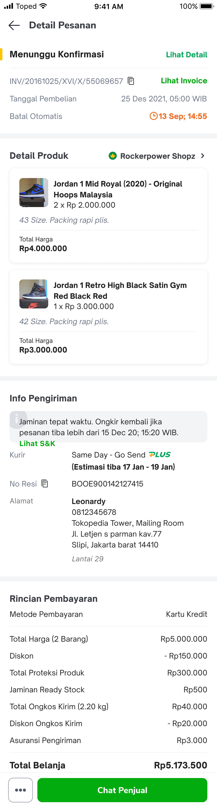<br/>            | 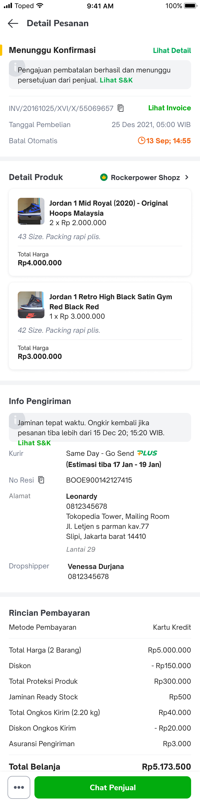<br/> | 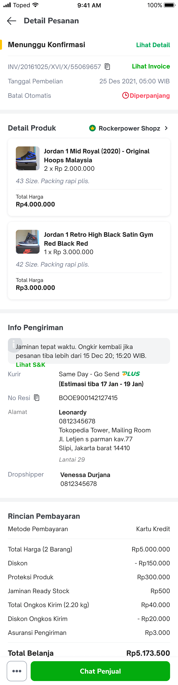<br/> |
|--------------------------------------------------------------------------|----------------------------------------------------------------------------|-------------------------------------------------------------------------|
| 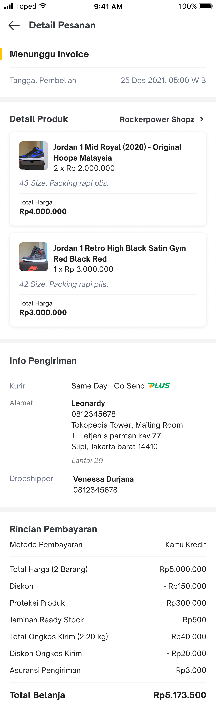<br/> | 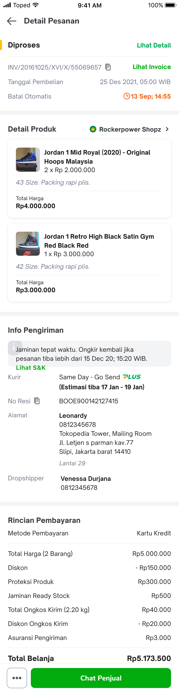<br/>                         | 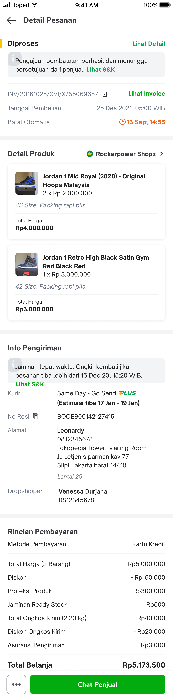<br/>           |
| 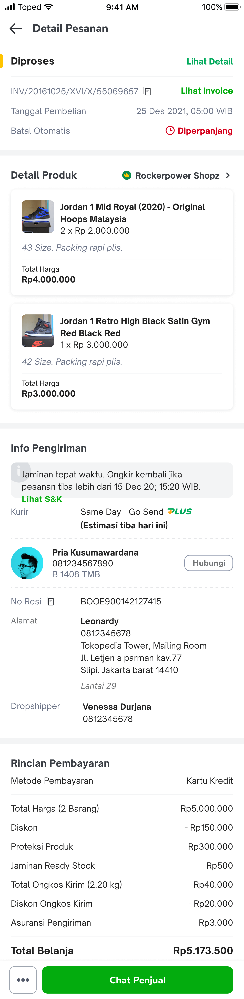<br/>          | 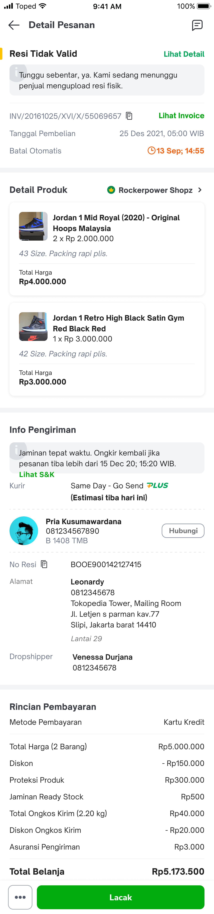<br/>        | 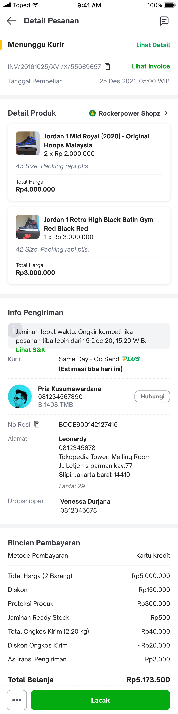<br/>        |
| 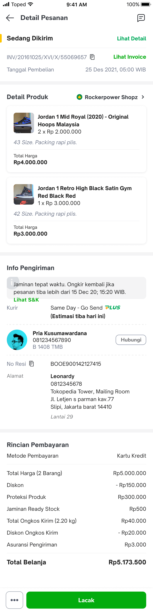<br/>         | 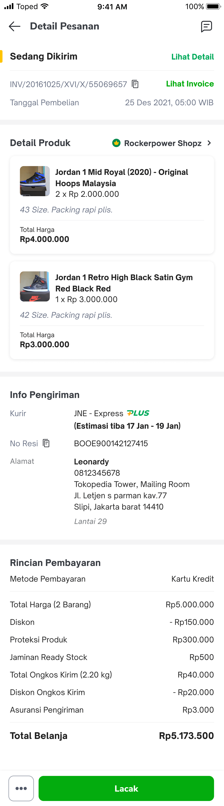<br/>           | 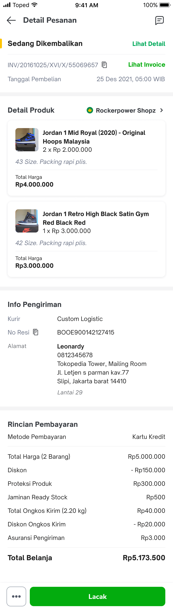<br/>       |
| <br/>       | 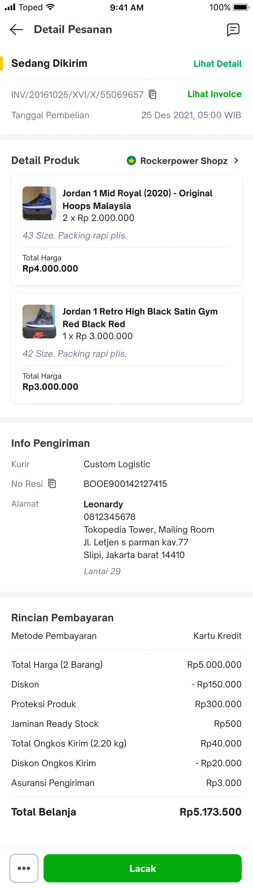<br/>          | 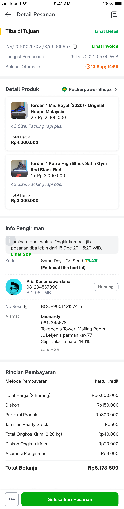<br/>            |
| 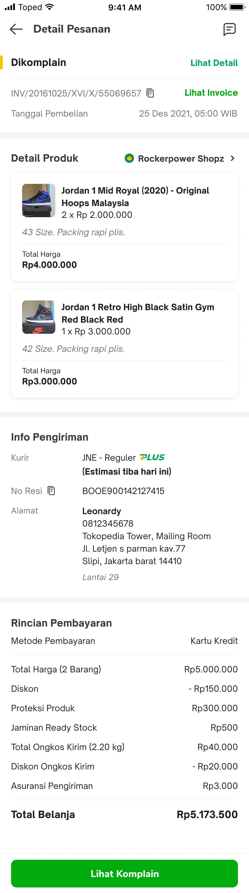<br/>                 | 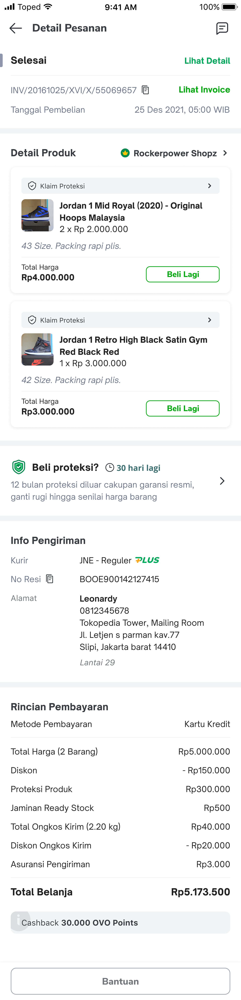<br/>                    | 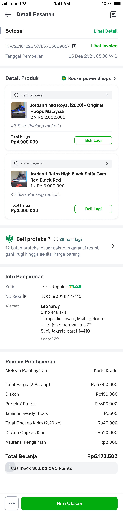<br/>                   |
| 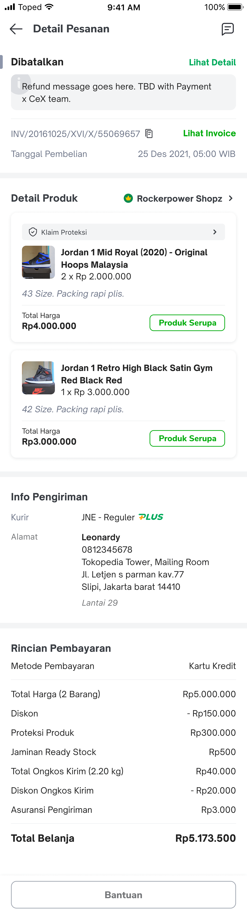<br/>                |                                                                            |                                                                         |

# Flowchart

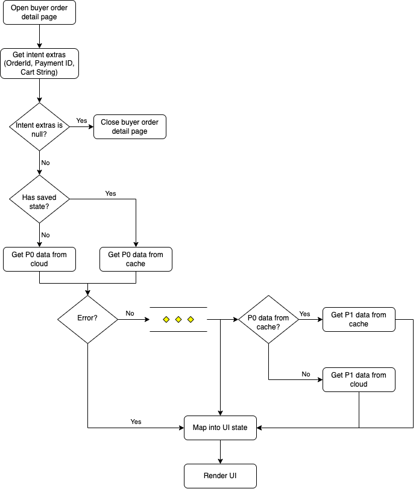

# Navigation


| External Applink | `tokopedia://marketplace/order/{orderId}` |
| --- | --- |
| Internal Applink  | `tokopedia-android-internal://marketplace//buyer-order-detail?payment_id={paymentID}&cart_string={cartString}``tokopedia-android-internal://marketplace/buyer-order-detail?order_id={orderId}` |

# GQL

In this module, there are 2 groups of use cases that will be executed when the page is loading or reloading:

- P0 → Wrapper use case for use cases that can be sent without waiting for another use case result
- P1 → Wrapper use case for use cases that can be sent after receiving data from any use cases from the P0 use case


| **Query** | **Description** | **Documentation** |
| --- | --- | --- |
| `query mp_bom_detail`  | Main query for getting general order detail data such as order basic info, product list info, shipment info, payment info and the available actions for that specific order (Ex: `Selesaikan Pesanan` , `Lacak` etc.). This query can be sent without any conditional check, therefore this query is part of P0 use case.If this query is failing then the page must show an error state. | [[Query] Buyer Order Detail V2](/wiki/spaces/TTD/pages/1435515815)  |
| `query ppGetInsuranceDetail` | Secondary query for getting products insurance detail info for that specific order. In order to send this query, we need to send the `mp_bom_detail` query first to get the invoice number for the order. Therefore this query is part of P1 use case. If this query is failing then the page **must not** show an error state and the insurance detail info.**Note: you must only send this query when** `has_ppp` **from the** `mp_bom_detail` **query is true** | [Insurance BOM Integration](/wiki/spaces/FT/pages/2053406887/Insurance+BOM+Integration)  |
| `query resolutionGetTicketStatus` | Secondary query for getting resolution detail info for that specific order. In order to send this query, we need to send the `mp_bom_detail` query first to know whether that specific order has a resolution ticket. Therefore this query is part of P1 use case. If this query is failing then the page **must not** show an error state and the resolution detail info.**Note: you must only send this query when** `has_reso_status` **from the** `mp_bom_detail` **query is true** | [Tech Plan - Integrate Resolution Status In Order Detail Page](/wiki/spaces/CS/pages/1983977492/Tech+Plan+-+Integrate+Resolution+Status+In+Order+Detail+Page)  |
| `mutation finish_order_buyer` | Query for the action `Selesaikan Pesanan` which used to move the order status to `700` or `Selesai`. This query is not part of P0 or P1 use case, since this query is not sent during the page load. | <https://tokopedia.atlassian.net/wiki/spaces/TTD/pages/594280963?search_id=4476a8f1-65c0-460d-b669-4d69476e2a7e>  |

# How To&#39;s

#### How to implement a new button

- Write the handler/logic inside `BuyerOrderDetailStickyActionButtonHandler` class
- Ask the Backend team about the button key and put it on `BuyerOrderDetailActionButtonKey`
- Modify the `onActionButtonClicked` inside `BuyerOrderDetailStickyActionButtonHandler` class

#### How to run cassava instrumentation test

- To install Buyer Order Detail instrumentation test app, use this command


```
./gradlew installDebugAndroidTest -p features/ordermanagement/buyer_order_detail -PtkpdBuildType=hockeyapp
```

- To run the Buyer Order Detail cassava instrumentation test, use this command


```
adb shell am instrument -w -r -e debug false -e package 'com.tokopedia.buyerorderdetail.cassava' com.tokopedia.buyerorderdetail.test/com.tokopedia.test.application.environment.InstrumentationTestRunner
```

#### How to monitor page load time (PLT)

To check PLT performance we can use this trace name: `buyer_order_detail_layout_trace`or click [here](https://console.firebase.google.com/u/0/project/tkpd-tokopedia-2014/performance/app/android:com.tokopedia.tkpd/metrics/trace/DURATION_TRACE/buyer_order_detail_layout_trace)

# Notes

- You should make the UI react to the data changes. For example, if your UI has an accordion feature, you should have a flag on the UI model which indicates whether the accordion is expanded or collapsed so when you click the expand/collapse trigger you need to change the UI model value first through the ViewModel and then the adapter will rebind your ViewHolder and you can change the expand/collapse state on your UI based on the value on you UI model

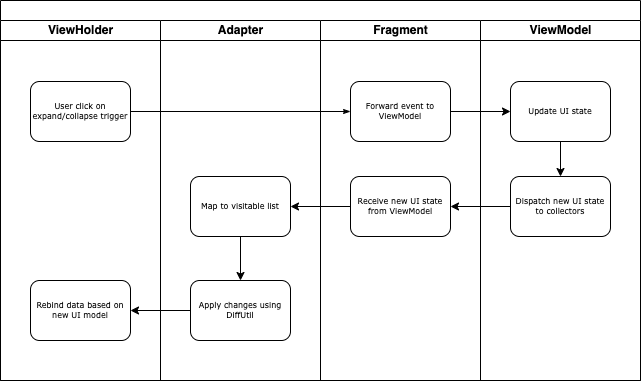

- To prevent ViewHolder flicker when your UI model contents change, you should override the bind with payload function on your ViewHolder. You should also override the bind with payload function if there&#39;s any chance that the UI model contents are changing when the user is refreshing the page. For example:


```
override fun bind(element: OrderSomethingUiModel?, payloads: MutableList<Any>) {
    bind(element)
}
```

- You should call the `applyTransition` function after routing from inside `BuyerOrderDetailNavigation` to run the sliding transition between activities unless you want to disable the transition. You should also start your activity using `startActivityForResult` to run the sliding transition when coming back to the buyer order detail page (ex: `startActivityForResult(intent, BuyerOrderDetailIntentCode.REQUEST_CODE_IGNORED)`)

[Screen Recording 2023-02-02 at 11.43.30.mov](/wiki/download/attachments/2151845406/Screen%20Recording%202023-02-02%20at%2011.43.30.mov?version=1&modificationDate=1675313054080&cacheVersion=1&api=v2&width=340)

# Useful Links


| Figma | <https://www.figma.com/file/SurFX8HnscD3mkQAQGg9Qh/UI%2FM---Buyer-Order-Management?node-id=12%3A1&t=hwgunOirlyKYsI0s-0>  |
| --- | --- |
| Trackers | <https://mynakama.tokopedia.com/datatracker/requestdetail/view/1122>  |

