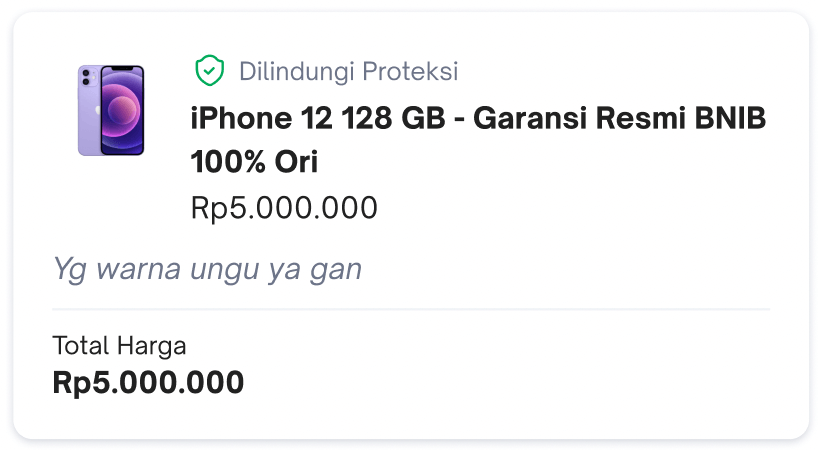
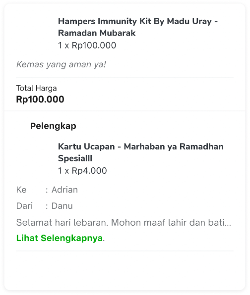
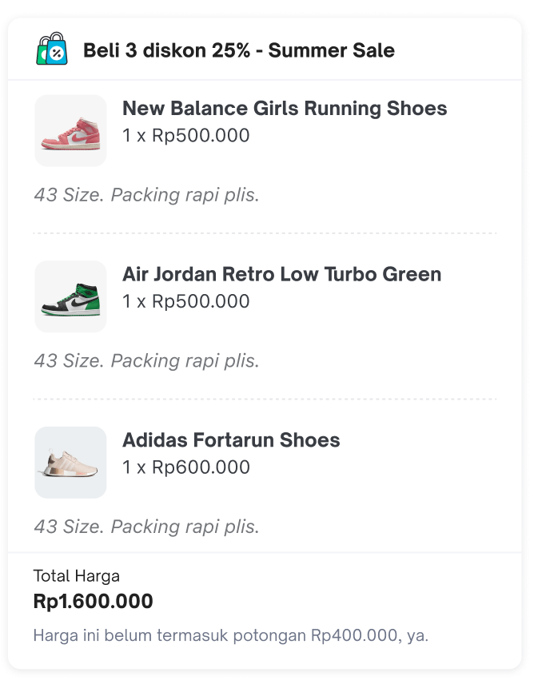
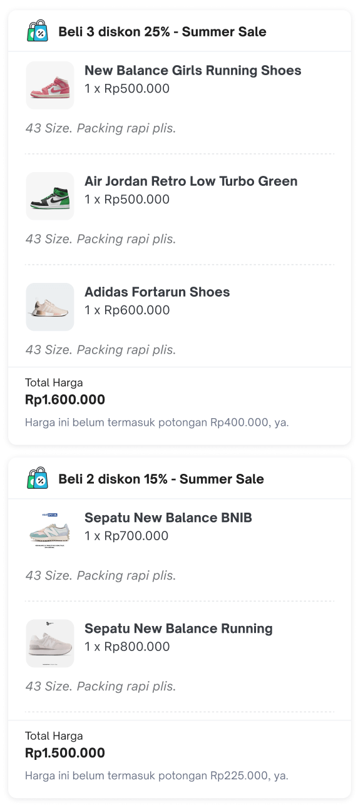
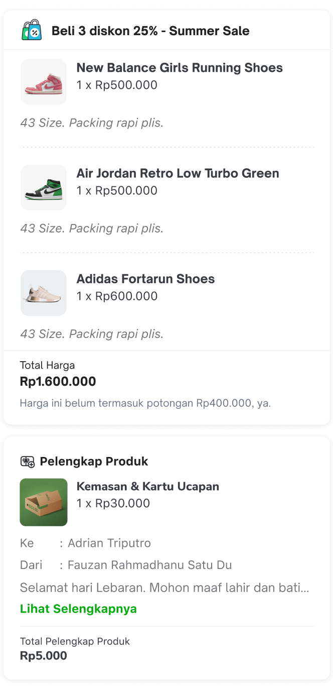
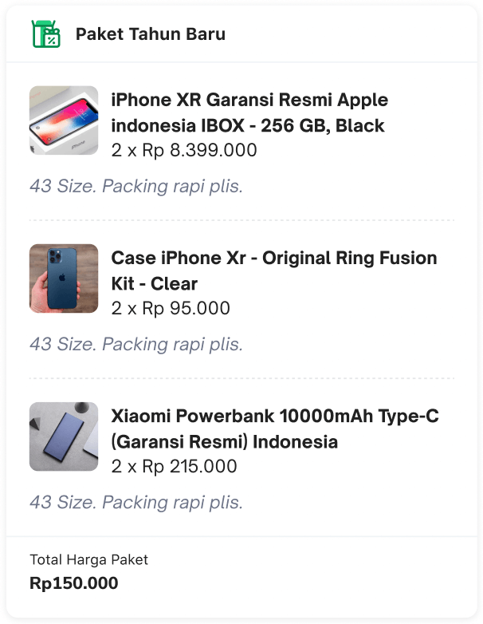
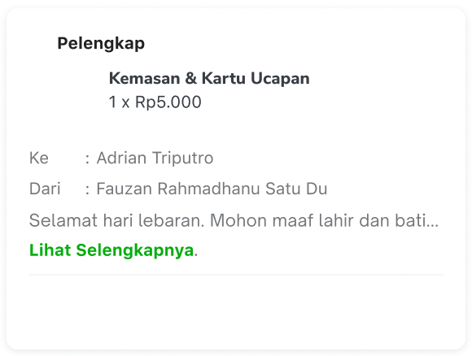
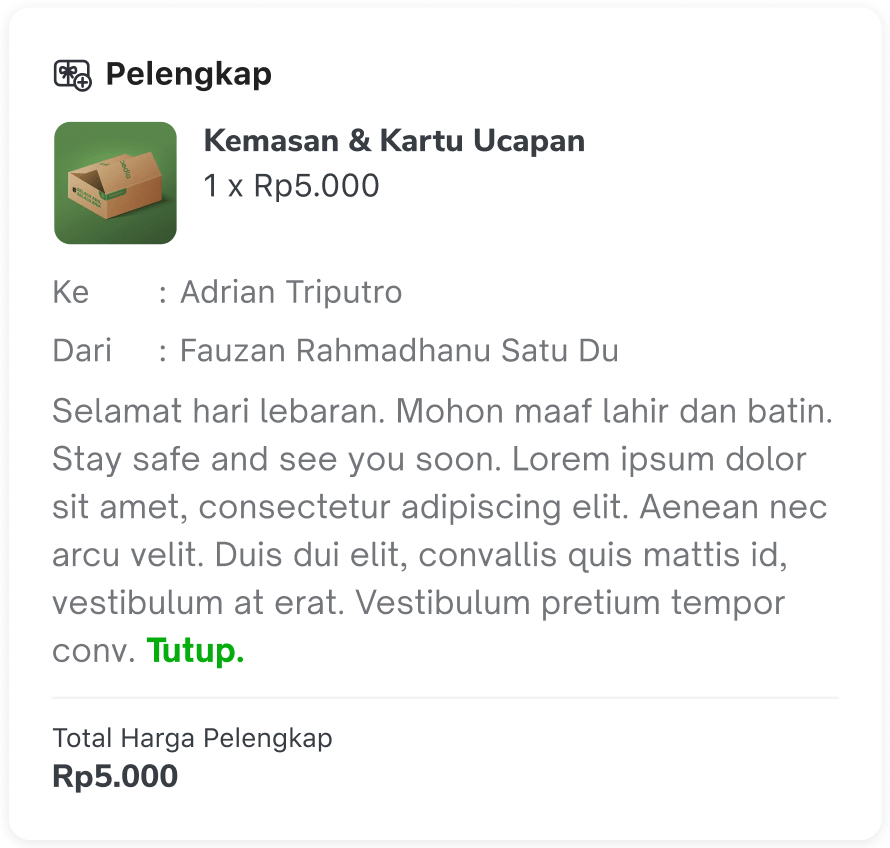

On the buyer order detail page, we have a section showing the list of the purchased product for that specific order. This section has 2 states which control how many product cards will be shown in the product list section:

- Collapsed state

In this state, the product list section will only show exactly 1 product card of any type depending on the product type contained in that specific order. The product card priority order is as follows:

1. Buy More Save More product
2. Bundling product (we show all the products that belong to the bundling if the bundling product is shown in the collapsed state)
3. Non-bundling product card with/without add-on
4. Add-on

So let’s say order A contains 1 product of each type then the only product card being shown is the first buy more save more product card. If product B contains only non-bundling products with/without add-ons then the only product card being shown is the first non-bundling product card with/without add-ons.

- Expanded state

In this state, the product list section will all the product cards in that specific order. The product card priority order is as follows:

1. Buy More Save More product
2. Bundling product
3. Non-bundling product card with/without add-on
4. Add-on

There are 5 types of product cards in this section which are:

- Non-bundling product card

This product type only shows exactly 1 product item on each card. This product type shows the non-bundle product item that the buyer purchased without any add-on or with an add-on but from TokoCabang (a non-bundling product purchased alongside any add-on but bought from TokoCabang will be shown as a non-bundling product without add-on).

- Non-bundling product card with add-on

This product type only shows exactly 1 product item on each card plus the list of add-ons attached to the product. This product type shows the non-bundle product item that the buyer purchased with any add-on and not from TokoCabang.

- Buy More Save More product

This product type displays multiple product items on each card that belong to a specific &#34;buy more, save more&#34; offer. In this product type, there may be optional attached add-ons either for the product or for the &#34;buy more, save more&#34; offer itself. The &#34;buy more, save more&#34; product has the same requirements as the non-bundling product card.

The Buy More Save More product has 4 type card type which is single offer, multiple offer, add on (non DT) and add on (DT/TokoCabang)

Buy More Save More - Single Offer

Buy More Save More - Multiple Offer

Buy More Save More - Add on (DT)

Buy More Save More - Add on (Non DT)

- Bundling product card

This product type shows multiple product items on each card that belong to that specific bundle. In this product type, there will be no attached add-on on the product or the bundling itself because currently there’s no feature that allows the buyer to purchase an add-on on a product bundling.

- Add-on card

This product type shows exactly 1 add-on on each card. This product type shows the add-on item that belongs to the purchased product but was bought from TokoCabang.

The complete design can be viewed on this Figma link: <https://www.figma.com/file/SurFX8HnscD3mkQAQGg9Qh/Buyer-Order-Management---UI---M?type=design&node-id=3879-19452&t=A3V1ijGBw6QEgODT-0> 

