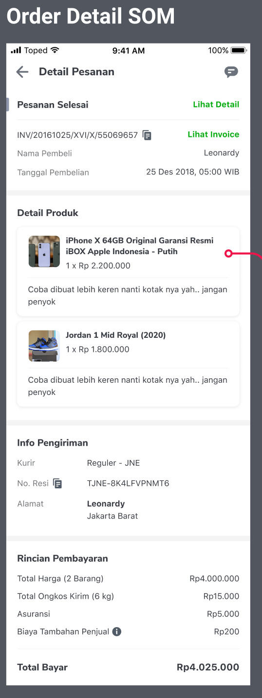
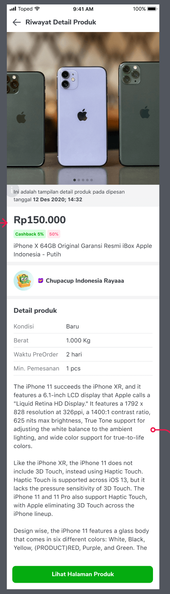
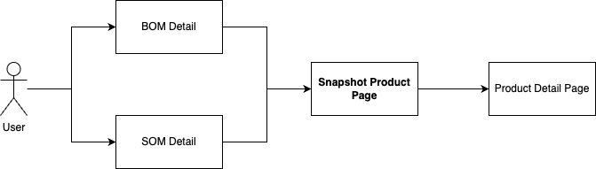

| **Status** | <!--start status:GREEN-->RELEASE<!--end status--> |
| --- | --- |
| Contributors | [Felicia Widjaja](https://tokopedia.atlassian.net/wiki/people/5c90c19d196abe2e884c82ed?ref=confluence) [Minion Stuart](https://tokopedia.atlassian.net/people/team/eeba862a-bd9d-472c-b901-415b15b1a37e) ([Rizqi Aryansa](https://tokopedia.atlassian.net/wiki/people/5e25ee87006fae0ca232e1ac?ref=confluence) [Edwin Nurwansyah](https://tokopedia.atlassian.net/wiki/people/622e71a875f257006a98bab9?ref=confluence) [Ilham .](https://tokopedia.atlassian.net/wiki/people/5de4d2148743750d00b7cc12?ref=confluence) [Kelvindo Sutan](https://tokopedia.atlassian.net/wiki/people/5ff2a8fe44065f013f93507c?ref=confluence) [M. Ilham Jamaludin](https://tokopedia.atlassian.net/wiki/people/5c87306ea329a40b8555c1ca?ref=confluence) [REIVIN OKTAVIANUS](https://tokopedia.atlassian.net/wiki/people/5dae89dab86cd40c2da5ad2f?ref=confluence) [Yehezkiel .](https://tokopedia.atlassian.net/wiki/people/5c94aa7a7792242c8613ad14?ref=confluence) [Yusuf Hendrawan](https://tokopedia.atlassian.net/wiki/people/5df336f3f4ab290ecfc64169?ref=confluence)) |
| Product Manager | [Venessa Jeremia](https://tokopedia.atlassian.net/wiki/people/5ce4e9c983de300fe5d546d7?ref=confluence)  |
| Team | [Minion Stuart](https://tokopedia.atlassian.net/people/team/eeba862a-bd9d-472c-b901-415b15b1a37e?ref=directory&src=peopleMenu) |
| Release date | 05 Mar 2021 / <!--start status:GREY-->MA-3.117<!--end status-->  |
| Module type | <!--start status:YELLOW-->FEATURE<!--end status--> |
| Product PRD | [Product Snapshot in SOM and BOM detail](/wiki/spaces/SM/pages/2350712352/Product+Snapshot+in+SOM+and+BOM+detail)  |
| Module Location | `features/ordermanagement/snapshot` |

## Table of Contents

- [Table of Contents](https://tokopedia.atlassian.net/wiki/spaces/PA/pages/2349237360/Product+Snapshot+Page#Table-of-Contents)
- [Overview](https://tokopedia.atlassian.net/wiki/spaces/PA/pages/2349237360/Product+Snapshot+Page#Overview)
- [Release Notes](https://tokopedia.atlassian.net/wiki/spaces/PA/pages/2349237360/Product+Snapshot+Page#Release-Notes)
- [Pages](https://tokopedia.atlassian.net/wiki/spaces/PA/pages/2349237360/Product+Snapshot+Page#Pages)
- [Flow Chart](https://tokopedia.atlassian.net/wiki/spaces/PA/pages/2349237360/Product+Snapshot+Page#Flow-Chart)
- [GQL](https://tokopedia.atlassian.net/wiki/spaces/PA/pages/2349237360/Product+Snapshot+Page#GQL)
- [Navigation](https://tokopedia.atlassian.net/wiki/spaces/PA/pages/2349237360/Product+Snapshot+Page#Navigation)
- [Useful Links](https://tokopedia.atlassian.net/wiki/spaces/PA/pages/2349237360/Product+Snapshot+Page#Useful-Links)

## Overview

As the platform responsible for order transactions, it's essential for us to maintain accurate information about every order placed on Tokopedia. This is crucial for providing evidence to both buyers and sellers in case they have concerns about the accuracy of their orders. By preserving the order's details throughout the entire checkout process, we can demonstrate the authenticity of each transaction.

This practice allows us to reassure sellers and buyers when issues arise, such as instances where the seller fails to deliver the correct item, variant, or adequate stock levels. This level of transparency helps address a significant percentage of customer support tickets, maintaining trust and satisfaction within our user base.

## Release Notes

<!--start expand:July, 15th 2022 (MA-3.183/SA-2.113)-->
###### Product Snapshot page
PR: <https://github.com/tokopedia/android-tokopedia-core/pull/17719> 

Tickets:
- [AN-23316](https://tokopedia.atlassian.net/browse/AN-23316)
<!--end expand-->

## Pages

|  Snapshot Entry point in SOM/BOM Detail<br/> | Snapshot Page<br/> |
|-------------------------------------------------------------------------------|----------------------------------------------|

## Flow Chart




The user should open the Product Snapshot Page by clicking on the product card on either the **BOM Detail** or **SOM Detail** page. The Snapshot Product Page will then provide information that will be available under this page: 

1. Payment Date
2. Product Name
3. Final price product
4. Condition
5. Weight
6. Insurance
7. Product Description
8. Shop badge during checkout
9. Shop name (linked to shop page)
10. Button CTA "lihat halaman Produk" (if deleted then redirect to 404 page), If the user wants to open the Product Detail Page, they can simply click on "Lihat Halaman Produk"

## GQL
| **Query**                                                                                                                                                                                                                                                                                                                                                                                                                                                                                                                                                                                                                                                                                                                                                                                                                                                                                                                                                                                                                                                                                                                                                                                                                                                                                                                                                                                                                                                                                                                                                                                                                                                                                                                                                                                                                                                                        | **Response (JSON)**                                                                                                                                                                                                                                                                                                                                                                                                                                                                                                                                                                                                                                                                                                                                                                                                                                                                                                                                                                                                                                                                                                                                                                                                                                                                                                                                                                                                                                                                                                                                                                                                                                                                                                                                                                                                                                                                                                                                                                                                                                                                                                                                                                                                                                                                                                                                                                                                                                                                                                                                                                                                                                                                                                                                                                                                                           |
|----------------------------------------------------------------------------------------------------------------------------------------------------------------------------------------------------------------------------------------------------------------------------------------------------------------------------------------------------------------------------------------------------------------------------------------------------------------------------------------------------------------------------------------------------------------------------------------------------------------------------------------------------------------------------------------------------------------------------------------------------------------------------------------------------------------------------------------------------------------------------------------------------------------------------------------------------------------------------------------------------------------------------------------------------------------------------------------------------------------------------------------------------------------------------------------------------------------------------------------------------------------------------------------------------------------------------------------------------------------------------------------------------------------------------------------------------------------------------------------------------------------------------------------------------------------------------------------------------------------------------------------------------------------------------------------------------------------------------------------------------------------------------------------------------------------------------------------------------------------------------------|-----------------------------------------------------------------------------------------------------------------------------------------------------------------------------------------------------------------------------------------------------------------------------------------------------------------------------------------------------------------------------------------------------------------------------------------------------------------------------------------------------------------------------------------------------------------------------------------------------------------------------------------------------------------------------------------------------------------------------------------------------------------------------------------------------------------------------------------------------------------------------------------------------------------------------------------------------------------------------------------------------------------------------------------------------------------------------------------------------------------------------------------------------------------------------------------------------------------------------------------------------------------------------------------------------------------------------------------------------------------------------------------------------------------------------------------------------------------------------------------------------------------------------------------------------------------------------------------------------------------------------------------------------------------------------------------------------------------------------------------------------------------------------------------------------------------------------------------------------------------------------------------------------------------------------------------------------------------------------------------------------------------------------------------------------------------------------------------------------------------------------------------------------------------------------------------------------------------------------------------------------------------------------------------------------------------------------------------------------------------------------------------------------------------------------------------------------------------------------------------------------------------------------------------------------------------------------------------------------------------------------------------------------------------------------------------------------------------------------------------------------------------------------------------------------------------------------------------------|
| **Input Param :**<br/>```{ "input": {    "order_id": "166429675", "order_detail_id": "20354762"   }}```<br/><br/>**Query:**```query get_order_snapshot($input:OrderSnapshotRequest!) {  get_order_snapshot(input:$input){    bundle_id<br/>    bundle_variant_id<br/>    bundle_name<br/>    pre_order<br/>    shop_image_primary_url<br/>    product_bundling_icon<br/>    product_url<br/>    product_price_formatted<br/>    product_total_price_formatted<br/>    product_weight_formatted<br/>    product_total_weight_formatted<br/>    shop_summary{<br/>      user_id<br/>      shop_name<br/>      shop_id<br/>      shop_domain<br/>      logo<br/>      badge_url >> baru<br/>    }<br/>    product_additional_data{<br/>      create_time<br/>      product_price<br/>    }<br/>    product_image_secondary{<br/>      image_url<br/>      file_name<br/>      file_path<br/>    }<br/>    order_detail{<br/>      order_dtl_id<br/>      order_id<br/>      product_id<br/>      product_name<br/>      product_desc<br/>      quantity<br/>      quantity_deliver<br/>      quantity_reject<br/>      product_price<br/>      product_weight<br/>      total_weight<br/>      subtotal_price<br/>      notes<br/>      finsurance<br/>      returnable<br/>      child_cat_id<br/>      currency_id<br/>      insurance_price<br/>      normal_price<br/>      create_time<br/>      min_order<br/>      must_insurance<br/>      condition<br/>    }<br/>    pre_order_duration<br/>    is_os<br/>    is_pm<br/>    campaign_data{<br/>      product_id<br/>      campaign{<br/>        discounted_price<br/>        discount_percentage_text<br/>        discount_percentage_text_color<br/>        discount_percentage_label_color<br/>        original_price<br/>        original_price_fmt<br/>        <br/>      }<br/>    }<br/>  }<br/>}<br/>```<br/><br/> | <br/><br/>```<br/>{<br/>  "data": {<br/>    "get_order_snapshot": {<br/>      "bundle_id":1,<br/>      "bundle_varian_id":"1-shoe-white",<br/>      "bundle_name":"sepatu putih",<br/>      "pre_order": false,<br/>      "shop_image_primary_url": "https://images.tokopedia.net/img/seller_no_logo_2.png",<br/>      "product_bundling_icon":"",<br/>      "product_url": "https://staging.tokopedia.com/sukamakan/variant-oldflow-192-merah",<br/>      "product_price_formatted": "Rp 1.000",<br/>      "product_total_price_formatted": "Rp 1.000",<br/>      "product_weight_formatted": "250 gr",<br/>      "product_total_weight_formatted": "250 gr",<br/>      "shop_summary": {<br/>        "user_id": 9066427,<br/>        "shop_name": "Suka makan",<br/>        "shop_id": 6550506,<br/>        "shop_domain": "sukamakan",<br/>        "logo": "https://images.tokopedia.net/img/seller_no_logo_2.png"<br/>      },<br/>      "product_additional_data": {<br/>        "create_time": "14 January 2021",<br/>        "product_price": "Rp 1.000"<br/>      },<br/>      "product_image_secondary": [<br/>        {<br/>          "image_url": "https://ecs7.tokopedia.net/img/VqbcmM/2021/1/13/0c953431-fa33-4d96-99cc-416395f375af.jpg",<br/>          "file_name": "0c953431-fa33-4d96-99cc-416395f375af.jpg",<br/>          "file_path": "VqbcmM/2021/1/13"<br/>        }<br/>      ],<br/>      "order_detail": {<br/>        "order_dtl_id": 0,<br/>        "order_id": 166497971,<br/>        "product_id": 15578219,<br/>        "product_name": "variant oldflow 192 - Merah",<br/>        "product_desc": "",<br/>        "quantity": 1,<br/>        "quantity_deliver": 1,<br/>        "quantity_reject": 0,<br/>        "product_price": 1000,<br/>        "product_weight": 0.25,<br/>        "total_weight": 0.25,<br/>        "subtotal_price": 1000,<br/>        "notes": "",<br/>        "finsurance": 1,<br/>        "returnable": 0,<br/>        "child_cat_id": 995,<br/>        "currency_id": 1,<br/>        "insurance_price": 0,<br/>        "normal_price": 1000,<br/>        "create_time": "2021-01-14T20:31:54.955201Z",<br/>        "min_order": 1,<br/>        "must_insurance": 1,<br/>        "condition": 1<br/>      },<br/>      "pre_order_duration": "",<br/>      "is_os": true,<br/>      "is_pm": false,<br/>      "campaign_data": {<br/>        "product_id": 15578219,<br/>        "campaign": {<br/>          "discounted_price": "Rp 1.000",<br/>          "discount_percentage_text": "50%",<br/>          "discount_percentage_text_color": "#D6001C",<br/>          "discount_percentage_label_color": "#FFEAEF",<br/>          "original_price": "Rp 2.000",<br/>          "original_price_fmt": "2000.00"<br/>        }<br/>      }<br/>    }<br/>  }<br/>}<br/>```<br/><br/> |

## Navigation
| External Applink - Snapshot Product | `tokopedia://snapshot/order/{orderId}/orderDetailId`                              |
|-------------------------------------|-----------------------------------------------------------------------------------|
| Internal Applink - Snapshot Product | `tokopedia-android-internal://snapshot/order/order_id=12345&order_detail_id=6789` |

## Useful Links
| Supporting docs | Links |
| --- | --- |
| Figma | <https://www.figma.com/file/uBd9P6ncGLFe8lU2I3RzKN/%5BUX%2FUI-M-OM%5D-Snapshot-Page?type=design&node-id=30-0&mode=design&t=h3JVDwDYq6f6oovP-0>  |
| GQL | [[GQL] Get Order Snapshot Data](/wiki/spaces/TTD/pages/972229540)  |
| Trackers | <https://mynakama.tokopedia.com/datatracker/product/requestdetail/328>  |

