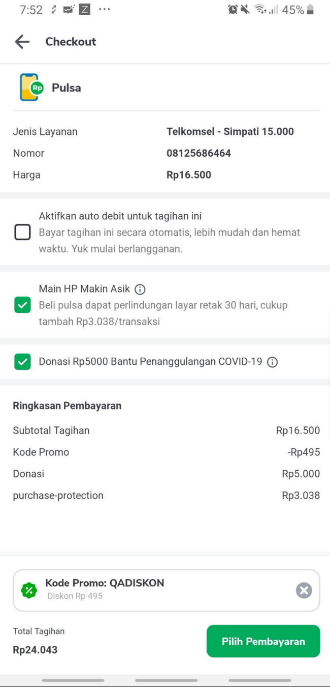
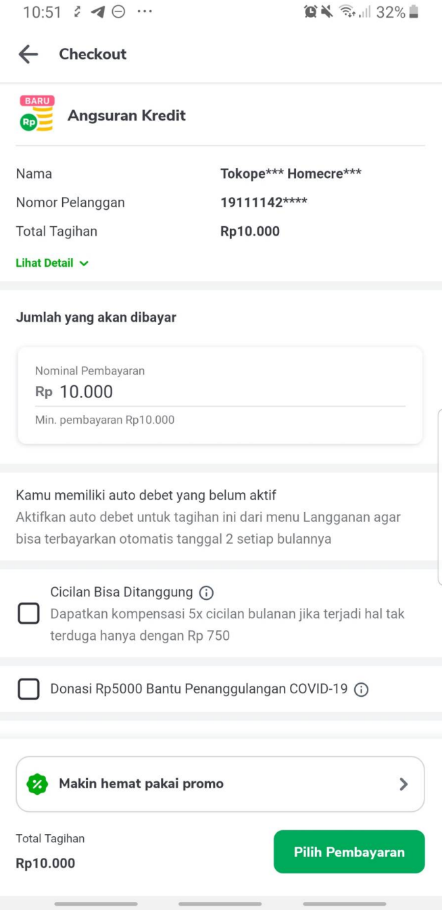
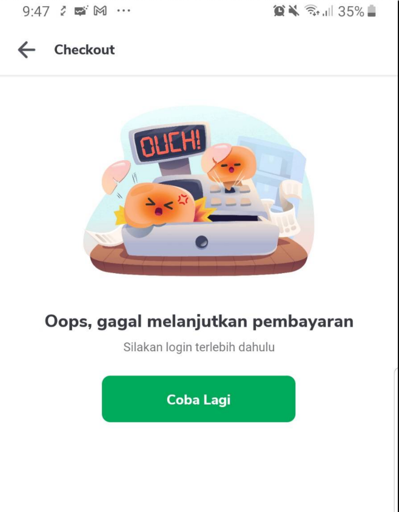
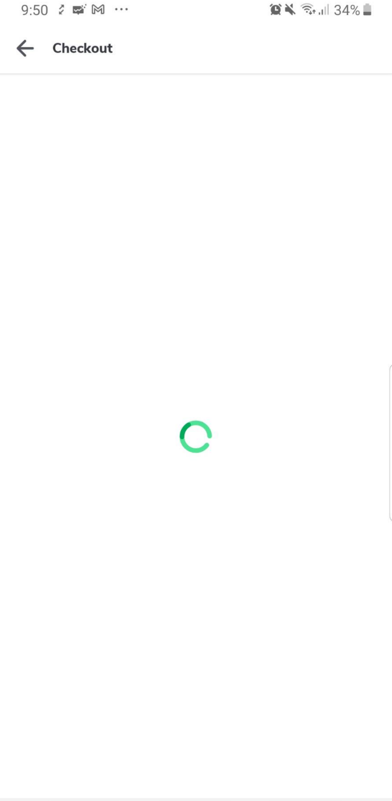
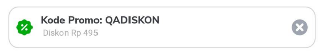
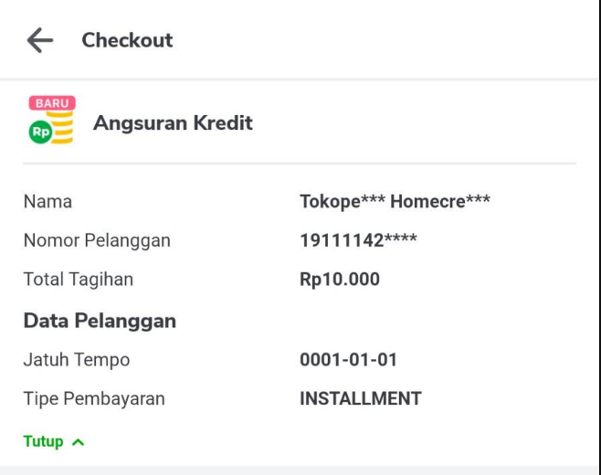
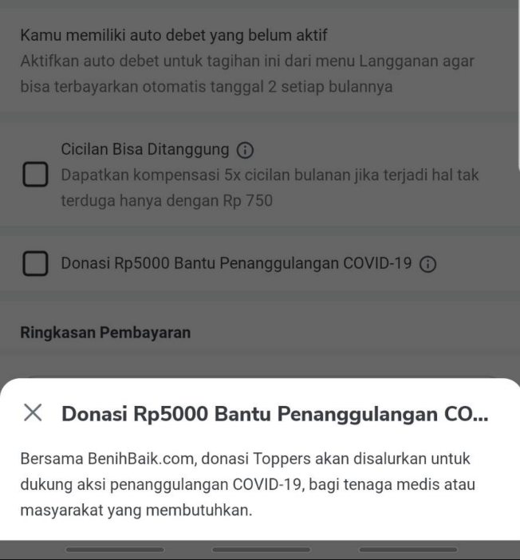

---
"Digital Checkout Page"
---

<!--left header table-->
| **Status** | <!--start status:GREEN-->RELEASE<!--end status--> |
| --- | --- |
| Team | [Minion Mark](https://tokopedia.atlassian.net/people/team/54372146-8afa-46e4-8de3-783c53a0cc3b)  |
| Module PIC | Irfan Muhlishin (temporary) |
| Product Manager | Hartono Santoso |
| Module Type | <!--start status:YELLOW-->FEATURE<!--end status--> |
| Module Location | `features/recharge/digital_checkout` |
| Release Date | `March 2021` / <!--start status:GREY-->MA-3.118<!--end status--> <br/> [AN-23477](https://tokopedia.atlassian.net/browse/AN-23477)<br/> |

## Table of Contents

<!--toc-->

## Release Notes

<!--left header table-->
| **Date**  | **App Version** | Notes                             | PR                                                               |
|-----------|-----------------|-----------------------------------|------------------------------------------------------------------|
| 19 May 23 | MA-3.221        | Update Plus Bottomsheet           | <https://github.com/tokopedia/android-tokopedia-core/pull/33011> |
| 10 Apr 23 | MA-3.217        | Remove Rest API on ATC & Checkout | <https://github.com/tokopedia/android-tokopedia-core/pull/32624> |
| 11 Aug 22 | MA-3.188        | Convert Rest to GQL               | <https://github.com/tokopedia/android-tokopedia-core/pull/28155> |


## Overview

Digital Checkout page enable user to see the summary of their selected product before checkout. User could also see and add some adds-on to their cart (fintech products, tebus murah) and also subscribe to certain bills/product. Here, eligible user could apply promo/coupon to their cart. 

## Screenshot





## API List

| **Query Name** | **Usage** |
| --- | --- |
| `/v1.4/cart (REST API)`\*will be removed soon | for **add to cart** a recharge product.  |
| `rechargeAddToCartV2` |
| `/v1.4/cart/otp-success (REST API)` | to check if otp succeed. |
| `rechargeGetCart` | to **get cart** information, basically for rendering every part of digital cart activity |
| `rechargePushEventRecommendation` | to send event load checkout page |
| `clearCacheAutoApplyStack` | to validate cancel voucher event (when user click X in promo checkout view) |
| `/v1.4/checkout (REST API)`\*will be removed soon | to checkout a recharge product. Need to pass fintech info, subscription info and also applied promo code. |
| `rechargeCheckoutV3` |

## User Stories


| **No** | **Stories** | **Flow** | **Screenshot** |
| --- | --- | --- | --- |
| 1 | Non-login user open cart page | 1. show full page error<br/> | <br/> |
| 2 | Login user open cart page via applink (!isFromPdp && !needGetCart) | 1. show loading and hide page content<br/>2. add to cart (hit `rechargeAddToCartV2`)<br/>3. when atc succeed, proceed to get cart **(con’t to 4)**<br/> | <br/> |
| 3 | Login user from PDP open cart page | 1. show loading and hide page content<br/>2. get cart **(con’t to 4)**<br/> | <br/> |
| 4 | Get cart | 1. hit API `rechargeGetCart`<br/>2. if succeed, map response to cart data (CartDigitalInfoData)<br/>3. build checkout data based on cart data → serve as checkout API param<br/>4. check `isNeedOtp`, open otp page **(con’t to 5)**<br/>5. setup price and payment summary.<br/>	1. update total tagihan<br/>	2. update payment summary with subtotal tagihan<br/>	3. update payment summary with admin fee only if it is open amount product and has admin fee<br/>6. render cart based on cart data<br/>7. render promo view<br/>	1. if !isEnableVoucher, set promo data as INACTIVE<br/>	2. if promo isSuccess && is not coupon, set promo data as ACTIVE<br/>	3. applyPromo **(con’t to 6)**<br/>8. show content and hide loading<br/> | ` <br/> |
| 5 | User need otp | 1. redirect to otp page<br/>2. hit `/v1.4/cart/otp-success`<br/>3. if response is success, get cart **(con’t to 4)**<br/> | - |
| 6 | Apply promo:- apply `auto_apply promo`<br/>- user click use promo from promo page<br/> | 1. apply promo<br/>	1. if promo state is FAILED, or EMPTY → remove row promo in payment summary and reset price<br/>	2. if promo state is ACTIVE or INACTIVE and has promo → render promo info in payment summary and update price<br/>2. render promo checkout view:<br/>	1. if promo state is INACTIVE, disableVoucherView<br/>	2. else, render promo checkout view based on its status and other attributes<br/> | <br/> |
| 7 | User cancel voucher | 1. user click `x` on promo checkout view<br/>2. hit `clearCacheAutoApplyStack` endpoint<br/>3. if success, remove promo in promo checkout view<br/> | - |
| 8 | User check/uncheck subscription  | 1. update existing subscription info in checkout param<br/> | <br/> |
| 9 | User check fintech product | 1. add fintech product info to checkout param<br/>2. update total price with fintech product<br/>3. update payment summary with fintech product<br/> | <br/> |
| 10 | User uncheck fintech product | 1. remove fintech product info to checkout param<br/>2. update total price with fintech product<br/>3. update payment summary with fintech product<br/> | - |
| 11 | Product is open\_amount and user type on open amount widget | 1. validate user input, make sure it is > minPrice and < maxPrice<br/>	1. disable checkout button if input is invalid<br/>2. update total price (total price without promo will be the same as value that user input)<br/>3. update subtotal payment value in payment summary section with value that user input<br/> | <br/> |
| 12 | User checkout  | 1. user click checkout button<br/>2. hit `rechargeCheckoutV3` endpoint<br/>3. if success, redirect to payment page<br/> | <br/> |
| 13 | User go back to checkout page | 1. if payment failed / cancelled / user press back from payment page, show error toaster with message<br/>2. get cart again **(con’t to 5)**<br/> | - |
| 14 | User click `lihat detail`/ `tutup` wording | 1. if user click lihat detail, product detail will expand and show additional info<br/>2. else if user click tutup, product detail will collaps and hide additional info<br/> | <br/> |
| 15 | User click icon `i` in fintech product | 1. if url link info is not empty, redirect user to the link<br/>2. if tooltip text is not empty, open bottom sheet and populate it with tooltip text.<br/> | <br/> |

## Highlighted FE Logic

### Total Price Formula


> TOTAL PRICE = Base Price + SUM(Fintech product Price) + Admin Fee (if open amount) - applied promo
> 
> 

1. check if it is open\_amount product/has input price.


	1. if there’s input price, set input price as **base price**
	2. else, the **base price** will be from `cartDigitalInfoData.attributes.pricePlain`
2. check if there is any fintech product in checkout param. 


	1. if any, add **base price** with each **fintech product’s price**
3. if it is open\_amount, **base price** with adminFee
4. update total price
5. substract with applied promo amount


```
private fun updateTotalPriceWithFintechProduct(inputPrice: Double?) {
    cartDigitalInfoData.value?.attributes?.let { attributes ->
        var totalPrice = inputPrice ?: attributes.pricePlain

        requestCheckoutParam.fintechProducts.forEach { fintech ->
            totalPrice += fintech.value.fintechAmount
        }
        _totalPrice.postValue(calculateTotalPrice(totalPrice, attributes.adminFee, attributes.isOpenAmount))
    }
}
```


```
private fun calculateTotalPrice(totalPrice: Double, adminFee: Double, isOpenAmount: Boolean): Double {
    return if (isOpenAmount) {
        totalPrice + adminFee
    } else totalPrice
}
```

### Render Subscription/ Fintech Product item:

Subscription and fintech product item is displayed under 1 recycler view. It is handled by `DigitalMyBillsAdapter`.

Notes: Subscription item count always 1 and fintech item could be > 1

- There is two itemViewType in DigitalMyBillsAdapter: `SUBSCRIPTION_VIEWTYPE` and `FINTECH_VIEWTYPE`


| `SUBSCRIPTION_VIEWTYPE` | `FINTECH_VIEWTYPE` |
| --- | --- |
| - if crossSellingType (get from getCart API response) is `3` , disable checkbox (hide only the checkbox)<br/><br/><br/>- always has no `i` icon.<br/>- if subscription isChecked, set **my bills widget** description with `subscription.bodyContentAfter`, else `subscription.bodyContentBefore`<br/> | - icon `i` appearance depends on whether `link_url` or `tooltip_text` exist.<br/>- fintech item divided into 2 type based on its `fintechProduct.info.iconUrl`:<br/>	- fintech product (without iconUrl); also divided into normal fintech product and donasi.<br/>	- tebus murah (with iconUrl)<br/>- if `fintechProduct.checkBoxDisabled`, disable checkbox (hide checkbox)<br/>- auto-check fintech product if `fintechProduct.optIn` is true<br/> |

## Applink

- Option 1

`tokopedia://digital/cart?product_id={product_id}&category_id={category_id}&client_number={client_number}&field_xx={..}`

- field\_xx is optional param (use for open amount product)

e.g: 

`tokopedia://digital/cart?product\_id=7467&operator\_id=2510&category\_id=38&field\_open\_amount=100000`

- Option 2

`tokopedia://digital/form?category_id={category_id}&client_number={client_number}&is_from_widget=true&operator_id={operator_id}&product_id={product_id}`

e.g: 

`tokopedia://digital/form?category\_id=55&client\_number=083898879891&is\_from\_widget=true&operator\_id=1&product\_id=8016`

## Useful Links

- [Figma](https://www.figma.com/file/eE5Kq2hCQ0zuiP8uZEB8Xi/%5BUI---M%5D-New-Checkout?node-id=11%3A4268)
- [Test Case](https://docs.google.com/spreadsheets/d/1t9VSBzDbRnsAtHNAh7WrvwAsHcrlfEN_x7ClzrqmCxY/edit#gid=2138619440)
- [Tracking](https://mynakama.tokopedia.com/datatracker/requestdetail/720) (Thanos)


