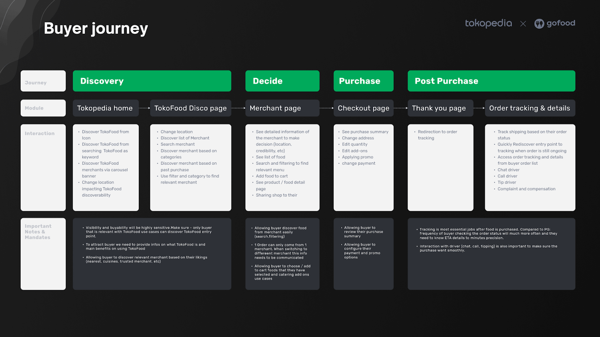

| **Status**       | <!--start status:GREEN-->RELEASE<!--end status-->                                                                                                                                                                                                                                                                                                                                                                                                                                                                                                                                                                                                                                                                                                                    |
|------------------|----------------------------------------------------------------------------------------------------------------------------------------------------------------------------------------------------------------------------------------------------------------------------------------------------------------------------------------------------------------------------------------------------------------------------------------------------------------------------------------------------------------------------------------------------------------------------------------------------------------------------------------------------------------------------------------------------------------------------------------------------------------------|
| Contributors     | [M Ilham Jamaludin](https://tokopedia.atlassian.net/wiki/people/5c87306ea329a40b8555c1ca?ref=confluence) [Hendry Setiadi](https://tokopedia.atlassian.net/wiki/people/5c94ae68999a3f2d4cae9b85?ref=confluence) [Rizqi Aryansa](https://tokopedia.atlassian.net/wiki/people/5e25ee87006fae0ca232e1ac?ref=confluence) [Firmanda Mulyawan Nugroho](https://tokopedia.atlassian.net/wiki/people/5d91c148fdfa560dcc3a040f?ref=confluence) [REIVIN OKTAVIANUS](https://tokopedia.atlassian.net/wiki/people/5dae89dab86cd40c2da5ad2f?ref=confluence) [YOHANN Prananta (Unlicensed)](https://tokopedia.atlassian.net/wiki/people/5de4eab04ae7b80d0d19f990?ref=confluence) [Yehezkiel .](https://tokopedia.atlassian.net/wiki/people/5c94aa7a7792242c8613ad14?ref=confluence) |
| Product Manager  | [Fauzan Ramadhanu](https://tokopedia.atlassian.net/wiki/people/5b6b99772f51d429dce93e93?ref=confluence) [Vania Chandra (Unlicensed)](https://tokopedia.atlassian.net/wiki/people/5c735c615b4c267532745762?ref=confluence) [Sheren Lengkong](https://tokopedia.atlassian.net/wiki/people/5de4c4a27474110e2311ebec?ref=confluence) [Joshua Ghibran](https://tokopedia.atlassian.net/wiki/people/70121:7d12fd85-be0a-4d0c-a14e-8279fe20ff69?ref=confluence) [Gardha Respati](https://tokopedia.atlassian.net/wiki/people/5bf669b40495101184444320?ref=confluence)                                                                                                                                                                                                       |
| Team             | [Minion Stuart](https://tokopedia.atlassian.net/people/team/eeba862a-bd9d-472c-b901-415b15b1a37e?ref=directory&src=peopleMenu)                                                                                                                                                                                                                                                                                                                                                                                                                                                                                                                                                                                                                                       |
| Release date     | 12 Jul 2022 / <!--start status:GREY-->MA-3.182<!--end status-->                                                                                                                                                                                                                                                                                                                                                                                                                                                                                                                                                                                                                                                                                                      |
| Module type  | <!--start status:YELLOW-->FEATURE<!--end status-->                                                                                                                                                                                                                                                                                                                                                                                                                                                                                                                                                                                                                                                                                                                   |
| Product PRD      | [TokoFood PRD](https://docs.google.com/document/d/1GnxJ1JUmOd8vCG0zpOl1K990w9ex4-YBsvf0XM_lvNU)                                                                                                                                                                                                                                                                                                                                                                                                                                                                                                                                                                                                                                                                      |
| Module Location  | `features/tokofood`                                                                                                                                                                                                                                                                                                                                                                                                                                                                                                                                                                                                                                                                                                                                                  |

## Table of Contents

- [Overview](https://tokopedia.atlassian.net/wiki/spaces/PA/pages/1989904172/TokoFood#%5BhardBreak%5DOverview)
- [Buyer Journey](https://tokopedia.atlassian.net/wiki/spaces/PA/pages/1989904172/TokoFood#%5BhardBreak%5DBuyer-Journey)
- [Release Notes](https://tokopedia.atlassian.net/wiki/spaces/PA/pages/1989904172/TokoFood#Release-Notes)
- [Navigation](https://tokopedia.atlassian.net/wiki/spaces/PA/pages/1989904172/TokoFood#Navigation)
- [Useful Links](https://tokopedia.atlassian.net/wiki/spaces/PA/pages/1989904172/TokoFood#Useful-Links)
- [Pages](https://tokopedia.atlassian.net/wiki/spaces/PA/pages/1989904172/TokoFood#Pages)
- [Action Items](https://tokopedia.atlassian.net/wiki/spaces/PA/pages/1989904172/TokoFood#Action-Items)
- [FAQ](https://tokopedia.atlassian.net/wiki/spaces/PA/pages/1989904172/TokoFood#FAQ)

## Overview

TokoFood is a new service that will provide the optimal experience for hungry and craving Tokopedia buyers when looking for ready-to-consume (RTC) meals. TokoFood will serve a wide variety of meals and drinks, curate only those that can be fulfilled instantly, and deliver them right to your doorstep - served by GoFood merchants who have the ability to fulfill your orders instantly

## Buyer Journey

## Release Notes

<!--start expand:9 January 2023 (MA-3.202)-->
###### Chat with DriverPR: <https://github.com/tokopedia/android-tokopedia-core/pull/29924>
<!--end expand-->

<!--start expand:MA-3.198 and MA-3.200-->
###### Promo in Merchant ListPR: <https://github.com/tokopedia/android-tokopedia-core/pull/29774> Promo in Merchant PagePR: <https://github.com/tokopedia/android-tokopedia-core/pull/29869>
<!--end expand-->

<!--start expand:6 Oktober 2022 (MA-3.195)-->
###### TokoFood SearchPR: <https://github.com/tokopedia/android-tokopedia-core/pull/28806>
<!--end expand-->

<!--start expand:12 July 2022 (MA-3.182)-->
###### TokoFood Pilot ReleasePR: <https://github.com/tokopedia/android-tokopedia-core/pull/26882> Ticket: 

 

 

 
 [AN-37563](https://tokopedia.atlassian.net/browse/AN-37563)
 -
 Getting issue details...

STATUS
<!--end expand-->

## **Navigation**

- Home: `tokopedia://food/home`
- Category: `tokopedia://food/category?pageTitle={pageTitle}&cuisine={cuisine}&option={option}&sortBy={sortBy}&brand_uid={brand_uid}`
- Purchase:
- Post Purchase: `tokopedia://food/postpurchase/{orderId}`
- Search: `tokopedia://food/search`

## **Useful Links**

- PR: <https://github.com/tokopedia/android-tokopedia-core/pull/26882>
- New Relic: [TokoFood Dashboard in New Relic](https://onenr.io/01wZV4vrAw6)

## **Pages**

- [Home and Category](https://tokopedia.atlassian.net/wiki/spaces/PA/pages/1989382558/Home+Category)
- [Merchant](https://tokopedia.atlassian.net/wiki/spaces/PA/pages/1989545980/Merchant+Decide)
- [Promo and Purchase](https://tokopedia.atlassian.net/wiki/spaces/PA/pages/1989840656/Purchase+Promo)
- [Post Purchase](/wiki/spaces/PA/pages/1990198460/Post+Purchase)
- [Search](https://tokopedia.atlassian.net/l/cp/EV1ajmEu)
- [Single Activity Navigation](https://tokopedia.atlassian.net/l/cp/UMF9DJkj)

## **Action Items**

- Move Navigation Logic to BaseMultiFragActivity
- [Create documentation of Navigation Logic to BaseMultiFragActivity](https://tokopedia.atlassian.net/l/cp/UMF9DJkj)
- [Increase UT coverage up to 100% in Merchant Page](https://tokopedia.atlassian.net/browse/AN-43396)
- [Remove memory leaks in TokoFood](https://tokopedia.atlassian.net/browse/AN-43568)
- [Reduce TokoFood Overdraw](https://tokopedia.atlassian.net/browse/AN-44599)
- Use debounce on Merchant Page Cart
- [Update Post Purchase Documentation to add the chat with the driver](https://tokopedia.atlassian.net/wiki/spaces/PA/pages/1990198460/Post+Purchase#Chat-with-Driver---9-January-2023-(MA-3.202))

## **FAQ**

<!--start expand:Where can we know for the other links; like Figma link, Trackers (thanos) link, GQL link, etc?-->
You can go to the pages section and then choose the page you want to see
<!--end expand-->

