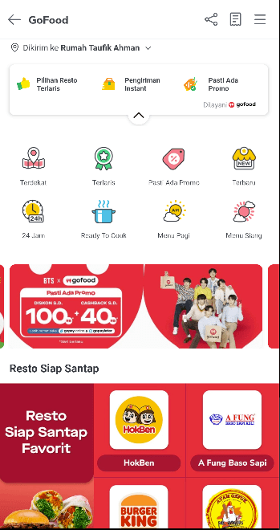
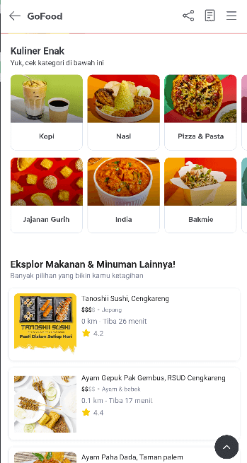
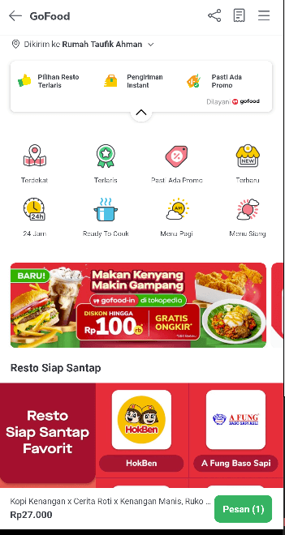
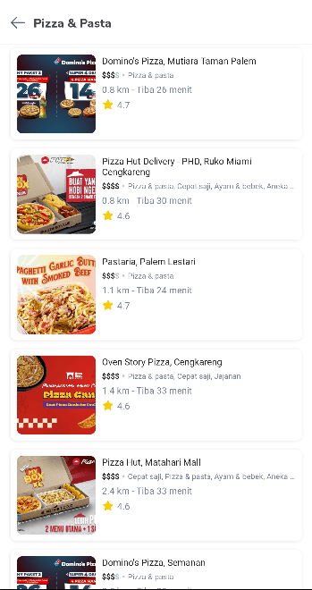
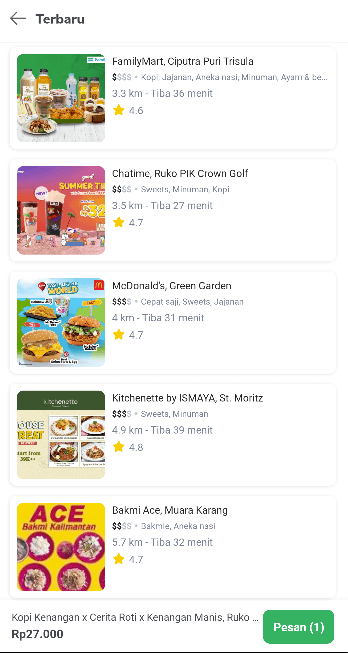

| **Status**       | <!--start status:GREEN-->RELEASE<!--end status-->                                                                                                                                                                                                                                                                                                                                                                                                                                                                                                                                                                                                                                                                                                                    |
|------------------|----------------------------------------------------------------------------------------------------------------------------------------------------------------------------------------------------------------------------------------------------------------------------------------------------------------------------------------------------------------------------------------------------------------------------------------------------------------------------------------------------------------------------------------------------------------------------------------------------------------------------------------------------------------------------------------------------------------------------------------------------------------------|
| Contributors     | [M Ilham Jamaludin](https://tokopedia.atlassian.net/wiki/people/5c87306ea329a40b8555c1ca?ref=confluence) [Hendry Setiadi](https://tokopedia.atlassian.net/wiki/people/5c94ae68999a3f2d4cae9b85?ref=confluence) [Rizqi Aryansa](https://tokopedia.atlassian.net/wiki/people/5e25ee87006fae0ca232e1ac?ref=confluence) [Firmanda Mulyawan Nugroho](https://tokopedia.atlassian.net/wiki/people/5d91c148fdfa560dcc3a040f?ref=confluence) [REIVIN OKTAVIANUS](https://tokopedia.atlassian.net/wiki/people/5dae89dab86cd40c2da5ad2f?ref=confluence) [YOHANN Prananta (Unlicensed)](https://tokopedia.atlassian.net/wiki/people/5de4eab04ae7b80d0d19f990?ref=confluence) [Yehezkiel .](https://tokopedia.atlassian.net/wiki/people/5c94aa7a7792242c8613ad14?ref=confluence) |
| Product Manager  | [Fauzan Ramadhanu](https://tokopedia.atlassian.net/wiki/people/5b6b99772f51d429dce93e93?ref=confluence) [Vania Chandra (Unlicensed)](https://tokopedia.atlassian.net/wiki/people/5c735c615b4c267532745762?ref=confluence) [Sheren Lengkong](https://tokopedia.atlassian.net/wiki/people/5de4c4a27474110e2311ebec?ref=confluence) [Joshua Ghibran](https://tokopedia.atlassian.net/wiki/people/70121:7d12fd85-be0a-4d0c-a14e-8279fe20ff69?ref=confluence) [Gardha Respati](https://tokopedia.atlassian.net/wiki/people/5bf669b40495101184444320?ref=confluence)                                                                                                                                                                                                       |
| Team             | [Minion Stuart](https://tokopedia.atlassian.net/people/team/eeba862a-bd9d-472c-b901-415b15b1a37e?ref=directory&src=peopleMenu)                                                                                                                                                                                                                                                                                                                                                                                                                                                                                                                                                                                                                                       |
| Release date     | 12 Jul 2022 / <!--start status:GREY-->MA-3.182<!--end status-->                                                                                                                                                                                                                                                                                                                                                                                                                                                                                                                                                                                                                                                                                                      |
| Module type      | <!--start status:YELLOW-->FEATURE<!--end status-->                                                                                                                                                                                                                                                                                                                                                                                                                                                                                                                                                                                                                                                                                                                   |
| Product PRD      | [TokoFood PRD](https://docs.google.com/document/d/1GnxJ1JUmOd8vCG0zpOl1K990w9ex4-YBsvf0XM_lvNU)                                                                                                                                                                                                                                                                                                                                                                                                                                                                                                                                                                                                                                                                      |
| Package Location | `com.tokopedia.tokofood.feature.home`                                                                                                                                                                                                                                                                                                                                                                                                                                                                                                                                                                                                                                                                                                                                |
| Fragment Class   | `TokoFoodHomeFragment`                                                                                                                                                                                                                                                                                                                                                                                                                                                                                                                                                                                                                                                                                                                                               |

## Table of Contents

- [Overview](https://tokopedia.atlassian.net/wiki/spaces/PA/pages/1989382558/Home+Category#%5BhardBreak%5D%5BhardBreak%5D%5BhardBreak%5DOverview)
- [Flowchart](https://tokopedia.atlassian.net/wiki/spaces/PA/pages/1989382558/Home+Category#Flowchart)
- [Page Structure](https://tokopedia.atlassian.net/wiki/spaces/PA/pages/1989382558/Home+Category#Page-Structure)
- [Navigation](https://tokopedia.atlassian.net/wiki/spaces/PA/pages/1989382558/Home+Category#Navigation)
- [Useful Links](https://tokopedia.atlassian.net/wiki/spaces/PA/pages/1989382558/Home+Category#Useful-Links)

# Overview

|  Home           |  Home                                |  Home with Mini Cart   |
|--------------------------------------------------------|--------------------------------------------------------------------------------------|-----------------------------------------------------------------------------|
|  Category   |  Category with Mini Cart   |                                                                             |

# Flowchart

# Page Structure

Home Page and Category Page are part of Discovery TokoFood. Home TokoFood uses skeleton data from Dynamic Channel to show its content, some of the layout reused from home component, and support a lot of other layouts. Category Page almost only uses merchant lists all the time, so it is quite efficient. Both of Home Page and Category Page have load more function and always get newest merchant list data and show it.

## Navigation

| External Homepage Applink      | tokopedia://food/home                                                                                                                      |
|--------------------------------|--------------------------------------------------------------------------------------------------------------------------------------------|
| Internal Homepage Applink      | `tokopedia-android-internal://food/home`                                                                                                   |
| External Category Page Applink | tokopedia://food/category?pageTitle={pageTitle}&cuisine={cuisine}&option={option}&sortBy={sortBy}&brand\_uid={brand\_uid}                  |
| Internal Category Page Applink | `tokopedia-android-internal://food/category?pageTitle={pageTitle}&cuisine={cuisine}&option={option}&sortBy={sortBy}&brand_uid={brand_uid}` |

# Useful Links

| Figma    | - Light Mode <https://www.figma.com/file/qnn2v65Mf6qAQtqpjlao9S/TokoFood---Platform-Services-%5BM%5D?node-id=1378%3A388015> - Dark Mode <https://www.figma.com/file/XvYnjpzLxyCSYdiUZwC2Pb/UI---Darkmode---TokoFood>                                                                                               |
|----------|----------------------------------------------------------------------------------------------------------------------------------------------------------------------------------------------------------------------------------------------------------------------------------------------------------------------------|
| GQL      | - Dynamic Channel [HPB/Home - [API:MOJ] Channel](/wiki/spaces/HP/pages/381550603) - USP [Tokofood-GQL Get USP TokoFood](/wiki/spaces/TECH/pages/1934754422/Tokofood-GQL+Get+USP+TokoFood) - Merchant List [Tokofood-GQL Get Merchant List](/wiki/spaces/TECH/pages/1941176646/Tokofood-GQL+Get+Merchant+List)  |
| Trackers | <https://mynakama.tokopedia.com/datatracker/requestdetail/view/3053>                                                                                                                                                                                                                                                       |

