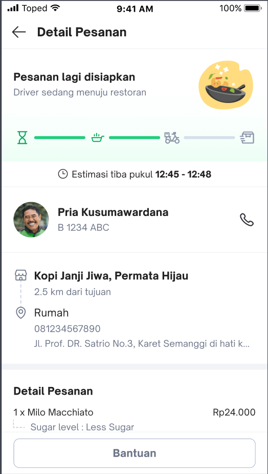
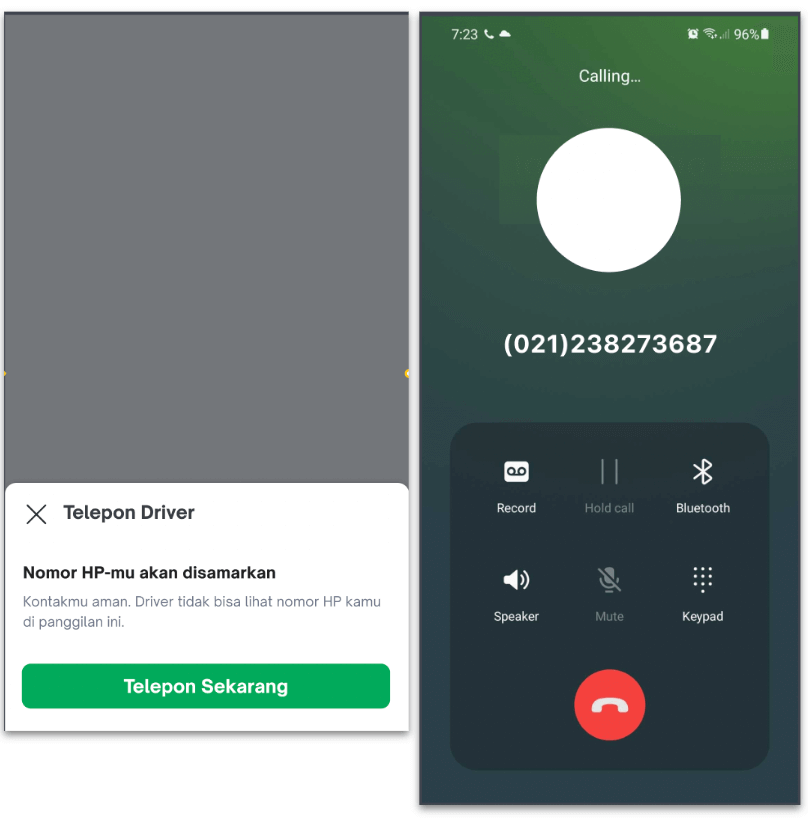
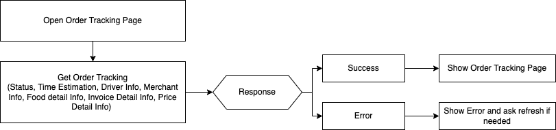
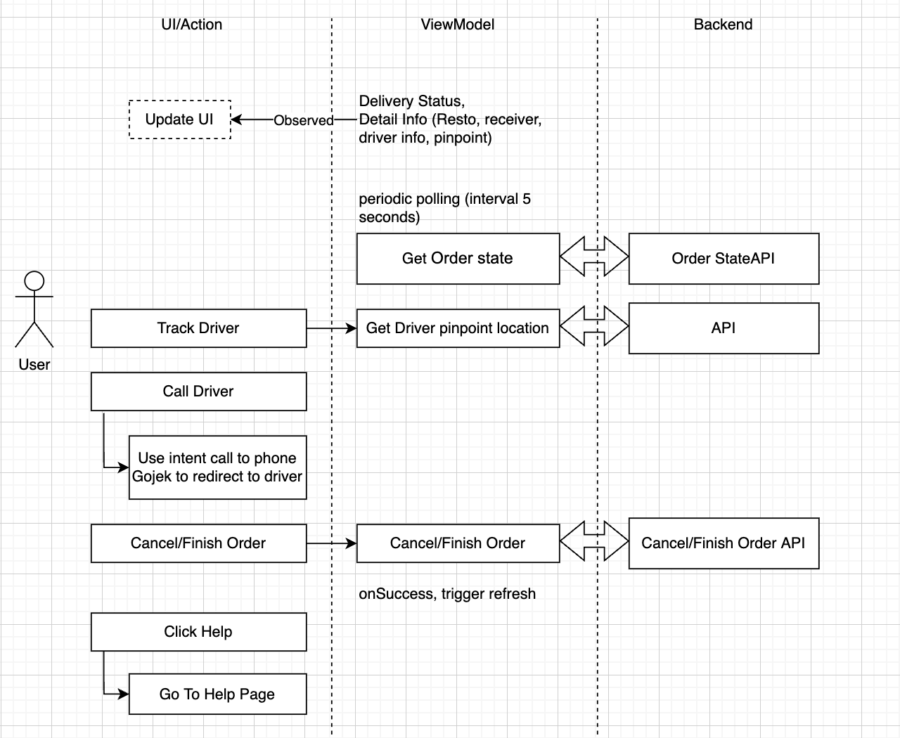
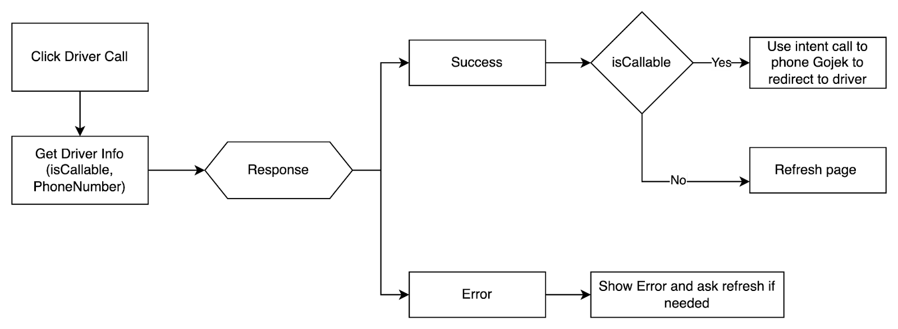
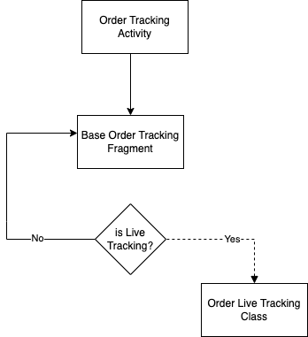
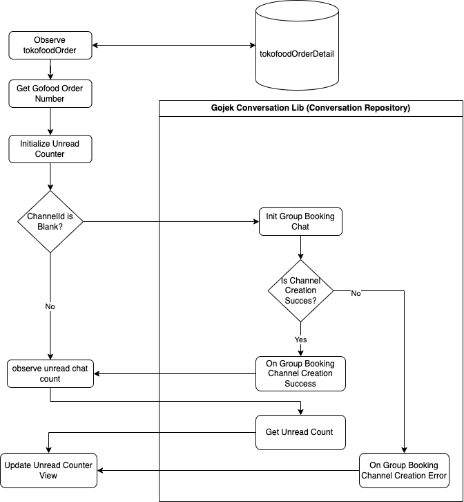

| **Status**       | <!--start status:GREEN-->RELEASE<!--end status-->                                                                                                                                                                                                                                                                                                                                                                                                                                                                                                                                                                                                                                                                                                                    |
|------------------|----------------------------------------------------------------------------------------------------------------------------------------------------------------------------------------------------------------------------------------------------------------------------------------------------------------------------------------------------------------------------------------------------------------------------------------------------------------------------------------------------------------------------------------------------------------------------------------------------------------------------------------------------------------------------------------------------------------------------------------------------------------------|
| Contributors     | [M Ilham Jamaludin](https://tokopedia.atlassian.net/wiki/people/5c87306ea329a40b8555c1ca?ref=confluence) [Hendry Setiadi](https://tokopedia.atlassian.net/wiki/people/5c94ae68999a3f2d4cae9b85?ref=confluence) [Rizqi Aryansa](https://tokopedia.atlassian.net/wiki/people/5e25ee87006fae0ca232e1ac?ref=confluence) [Firmanda Mulyawan Nugroho](https://tokopedia.atlassian.net/wiki/people/5d91c148fdfa560dcc3a040f?ref=confluence) [REIVIN OKTAVIANUS](https://tokopedia.atlassian.net/wiki/people/5dae89dab86cd40c2da5ad2f?ref=confluence) [YOHANN Prananta (Unlicensed)](https://tokopedia.atlassian.net/wiki/people/5de4eab04ae7b80d0d19f990?ref=confluence) [Yehezkiel .](https://tokopedia.atlassian.net/wiki/people/5c94aa7a7792242c8613ad14?ref=confluence) |
| Product Manager  | [Fauzan Ramadhanu](https://tokopedia.atlassian.net/wiki/people/5b6b99772f51d429dce93e93?ref=confluence) [Vania Chandra (Unlicensed)](https://tokopedia.atlassian.net/wiki/people/5c735c615b4c267532745762?ref=confluence) [Sheren Lengkong](https://tokopedia.atlassian.net/wiki/people/5de4c4a27474110e2311ebec?ref=confluence) [Joshua Ghibran](https://tokopedia.atlassian.net/wiki/people/70121:7d12fd85-be0a-4d0c-a14e-8279fe20ff69?ref=confluence) [Gardha Respati](https://tokopedia.atlassian.net/wiki/people/5bf669b40495101184444320?ref=confluence)                                                                                                                                                                                                       |
| Team             | [Minion Stuart](https://tokopedia.atlassian.net/people/team/eeba862a-bd9d-472c-b901-415b15b1a37e?ref=directory&src=peopleMenu)                                                                                                                                                                                                                                                                                                                                                                                                                                                                                                                                                                                                                                       |
| Release date     | 12 Jul 2022 / <!--start status:GREY-->MA-3.182<!--end status-->                                                                                                                                                                                                                                                                                                                                                                                                                                                                                                                                                                                                                                                                                                      |
| Module type      | <!--start status:YELLOW-->FEATURE<!--end status-->                                                                                                                                                                                                                                                                                                                                                                                                                                                                                                                                                                                                                                                                                                                   |
| Product PRD      | [TokoFood PRD](https://docs.google.com/document/d/1GnxJ1JUmOd8vCG0zpOl1K990w9ex4-YBsvf0XM_lvNU)                                                                                                                                                                                                                                                                                                                                                                                                                                                                                                                                                                                                                                                                      |
| Package Location | `com.tokopedia.tokofood.feature.ordertracking`                                                                                                                                                                                                                                                                                                                                                                                                                                                                                                                                                                                                                                                                                                                       |
| Activity Class   | `TokoFoodOrderTrackingActivity`                                                                                                                                                                                                                                                                                                                                                                                                                                                                                                                                                                                                                                                                                                                                      |

## Table of Contents

- [Overview](https://tokopedia.atlassian.net/wiki/spaces/PA/pages/1990198460/Post+Purchase#%5BhardBreak%5D%5BhardBreak%5DOverview)
- [Flowchart](https://tokopedia.atlassian.net/wiki/spaces/PA/pages/1990198460/Post+Purchase#Flowchart)
- [Page Structure](https://tokopedia.atlassian.net/wiki/spaces/PA/pages/1990198460/Post+Purchase#Page-Structure)
- [Release Notes](https://tokopedia.atlassian.net/wiki/spaces/PA/pages/1990198460/Post+Purchase#%5BhardBreak%5DRelease-Notes)

	- [Chat With Driver](https://tokopedia.atlassian.net/wiki/spaces/PA/pages/1990198460/Post+Purchase#Chat-with-Driver---9-January-2023-(MA-3.202))
- [Navigation](https://tokopedia.atlassian.net/wiki/spaces/PA/pages/1990198460/Post+Purchase#%5BhardBreak%5DNavigation)
- [Useful Links](https://tokopedia.atlassian.net/wiki/spaces/PA/pages/1990198460/Post+Purchase#Useful-Links)

## Overview

Post-purchase is Buyer will be able to track their order fulfillment and ask for help if there is an issue with their order  

 Live Tracking

 Completed Order

 Driver Call

## Flowchart

 First Open Page

 Polling Based (Periodic every 5 seconds) for update order status

 Driver Call

## **Page Structure**

 Page Structure Flow

Post Purchase has two classes to handle differentiate between live tracking order and completed order. But actually, for the completed order use the common class to reuse logic & component. and for the order live tracking using the individual class with the extends of `LifecycleObserver`

## Release Notes

### Chat with Driver - 9 January 2023 (**MA-3.202**)

Chat with Driver with unread counter

Chat with Driver Flowchart

Currently, TokoFood has already supported chat with the driver by adding the chat icon as an entry point and tokochat feature. so how it works unread chat counter on the post-purchase page? basically, we need Gojek Conversation Library as a dependency. 

- After that, we need Gofood Order Number, the first time we fetch it from the tokoFoodOrderDetail query.
- Then after it’s a success, we get the Gofood Order Number as a parameter to get the channel ID.

	- Then, we need to check in our code if the channel ID is blank or not. 
	
	
		- if it’s empty, we need to initialize a group booking chat to get the channel ID within the Conversation Repository class.
		- otherwise, there is a channel ID, the next step is to get the unread chat count.
	- After getting the Channel ID is already successful, we need to get the unread chat count value within the Conversation Repository class. 
	
	
		- after observing the unread chat count, the unread chat count value to update within the chat icon view.
		- otherwise, we set the unread counter view as zero value or not shown counter.

For more information regarding the tokochat feature, you can see the documentation [Tokochat: Chat Platform for Tokopedia and Gojek App](/wiki/spaces/PA/pages/2150138353/Tokochat%3A+Chat+Platform+for+Tokopedia+and+Gojek+App) 

## Navigation

| **External Applink** | `tokopedia://food/postpurchase/{orderId}`                          |
|----------------------|--------------------------------------------------------------------|
| **Internal Applink** | `tokopedia-android-internal://food/postpurchase?orderId={orderId}` |

## Useful Links

| **Figma**    | <https://www.figma.com/file/qnn2v65Mf6qAQtqpjlao9S/TokoFood---Platform-Services-%5BM%5D?node-id=2401%3A235528>                                                                                                                                                     |
|--------------|--------------------------------------------------------------------------------------------------------------------------------------------------------------------------------------------------------------------------------------------------------------------|
| **GQL**      | - Get Order Detail[Tokofood-GQL Get Order Detail](/wiki/spaces/TECH/pages/1927381097/Tokofood-GQL+Get+Order+Detail) - Get Driver’s Phone Number<https://tokopedia.atlassian.net/wiki/spaces/TECH/pages/1946325236/Tokofood-GQL+Get+Driver+s+Phone+Number>  |
| **Trackers** | <https://mynakama.tokopedia.com/datatracker/product/requestdetail/view/3059>                                                                                                                                                                                       |

