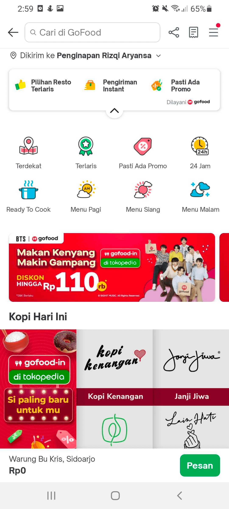
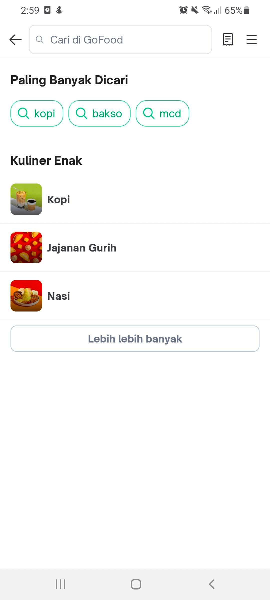
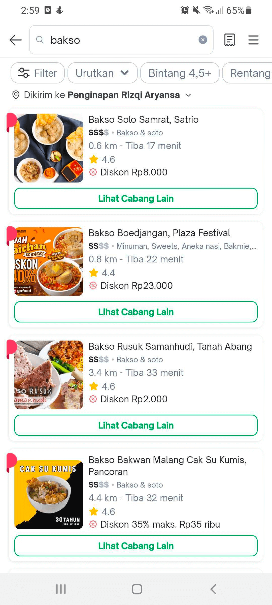
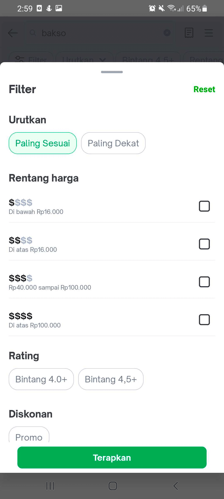
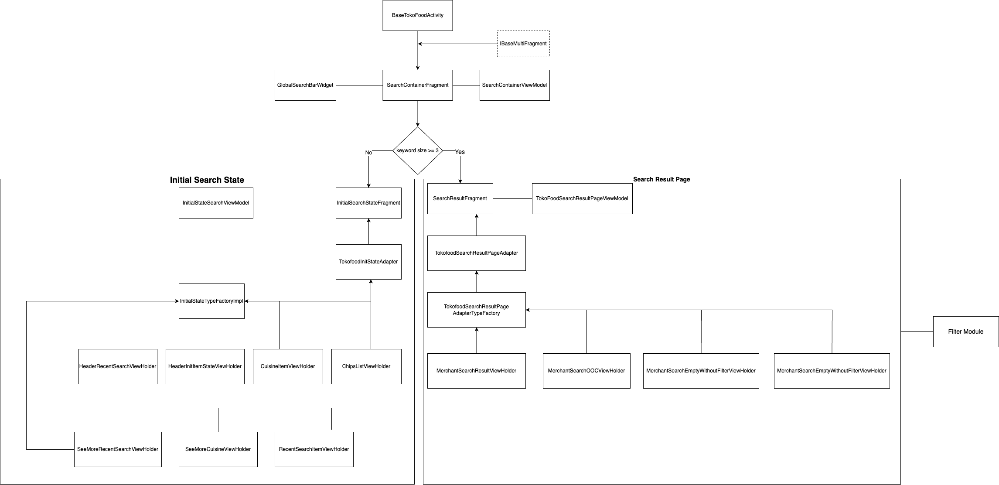

| **Status**       | <!--start status:GREEN-->RELEASE<!--end status-->                                                                                                                                                                                                                                                                                                                                                                                                                                                                                                                                                                                                                                                                                                                    |
|------------------|----------------------------------------------------------------------------------------------------------------------------------------------------------------------------------------------------------------------------------------------------------------------------------------------------------------------------------------------------------------------------------------------------------------------------------------------------------------------------------------------------------------------------------------------------------------------------------------------------------------------------------------------------------------------------------------------------------------------------------------------------------------------|
| Contributors     | [M Ilham Jamaludin](https://tokopedia.atlassian.net/wiki/people/5c87306ea329a40b8555c1ca?ref=confluence) [Hendry Setiadi](https://tokopedia.atlassian.net/wiki/people/5c94ae68999a3f2d4cae9b85?ref=confluence) [Rizqi Aryansa](https://tokopedia.atlassian.net/wiki/people/5e25ee87006fae0ca232e1ac?ref=confluence) [Firmanda Mulyawan Nugroho](https://tokopedia.atlassian.net/wiki/people/5d91c148fdfa560dcc3a040f?ref=confluence) [REIVIN OKTAVIANUS](https://tokopedia.atlassian.net/wiki/people/5dae89dab86cd40c2da5ad2f?ref=confluence) [YOHANN Prananta (Unlicensed)](https://tokopedia.atlassian.net/wiki/people/5de4eab04ae7b80d0d19f990?ref=confluence) [Yehezkiel .](https://tokopedia.atlassian.net/wiki/people/5c94aa7a7792242c8613ad14?ref=confluence) |
| Product Manager  | [Fauzan Ramadhanu](https://tokopedia.atlassian.net/wiki/people/5b6b99772f51d429dce93e93?ref=confluence) [Vania Chandra (Unlicensed)](https://tokopedia.atlassian.net/wiki/people/5c735c615b4c267532745762?ref=confluence) [Sheren Lengkong](https://tokopedia.atlassian.net/wiki/people/5de4c4a27474110e2311ebec?ref=confluence) [Joshua Ghibran](https://tokopedia.atlassian.net/wiki/people/70121:7d12fd85-be0a-4d0c-a14e-8279fe20ff69?ref=confluence) [Gardha Respati](https://tokopedia.atlassian.net/wiki/people/5bf669b40495101184444320?ref=confluence)                                                                                                                                                                                                       |
| Team             | [Minion Stuart](https://tokopedia.atlassian.net/people/team/eeba862a-bd9d-472c-b901-415b15b1a37e?ref=directory&src=peopleMenu)                                                                                                                                                                                                                                                                                                                                                                                                                                                                                                                                                                                                                                       |
| Release date     | 06 Oct 2022 / <!--start status:GREY-->MA-3.195<!--end status-->                                                                                                                                                                                                                                                                                                                                                                                                                                                                                                                                                                                                                                                                                                      |
| Module type      | <!--start status:YELLOW-->FEATURE<!--end status-->                                                                                                                                                                                                                                                                                                                                                                                                                                                                                                                                                                                                                                                                                                                   |
| Product PRD      | [TokoFood PRD](https://docs.google.com/document/d/1GnxJ1JUmOd8vCG0zpOl1K990w9ex4-YBsvf0XM_lvNU)                                                                                                                                                                                                                                                                                                                                                                                                                                                                                                                                                                                                                                                                      |
| Package Location | `com.tokopedia.tokofood.feature.search`                                                                                                                                                                                                                                                                                                                                                                                                                                                                                                                                                                                                                                                                                                                              |
| Fragment Class   | `SearchContainerFragment`                                                                                                                                                                                                                                                                                                                                                                                                                                                                                                                                                                                                                                                                                                                                            |

## Table of Contents

- [Overview](https://tokopedia.atlassian.net/wiki/spaces/PA/pages/2076843243/TokoFood+Search#Overview)
- [Page Structure](https://tokopedia.atlassian.net/wiki/spaces/PA/pages/2076843243/TokoFood+Search#Page-Structure)
- [Navigation](https://tokopedia.atlassian.net/wiki/spaces/PA/pages/2076843243/TokoFood+Search#%5BhardBreak%5DNavigation)
- [Useful Links](https://tokopedia.atlassian.net/wiki/spaces/PA/pages/2076843243/TokoFood+Search#Useful-Links)

## Overview

## Page Structure

TokoFood search built into `SearchContainerFragment` within includes some pages such as `InitiaSearchStateFragment` And `SearchResultFragment`. To determine `InitialSearchStateFragment` or `SearchResultFragment`, we need to check the keyword size in the search bar, if the keyword size is more than or equal to 3, it will show `SearchResultFragment`, otherwise will show `InitSearchStateFragment`. `InitSearchStateFragment` has the responsibility to display content such as recent searches, popular searches and cuisine lists, and also we can remove item or all of the recent searches. For the `SearchResultFragment` has the responsibility to show search results such as merchant list and then we can filter the search results by sort, rating, and price.

## Navigation

| External TokoFood Search Applink | `tokopedia://food/search`                  |
|----------------------------------|--------------------------------------------|
| Internal TokoFood Search Applink | `tokopedia-android-internal://food/search` |

## Useful Links

| PRD     | <https://docs.google.com/document/d/1ffHPqUKw_VDL5MzgokuDKAZdkU5jG_Zu3dEoYzNSkF0/edit>                                                                                                                                                                                                                                                                                                                                                                                          |
|---------|---------------------------------------------------------------------------------------------------------------------------------------------------------------------------------------------------------------------------------------------------------------------------------------------------------------------------------------------------------------------------------------------------------------------------------------------------------------------------------|
| Figma   | <https://www.figma.com/file/qnn2v65Mf6qAQtqpjlao9S/TokoFood---Platform-Services-%5BM%5D?node-id=14056%3A346182>                                                                                                                                                                                                                                                                                                                                                                 |
| GQL     | Initial Search State: - [Tokofood-GQL Init Search](/wiki/spaces/TECH/pages/2018508983/Tokofood-GQL+Init+Search) - [Tokofood-GQL Remove Search History](/wiki/spaces/TECH/pages/2022146065/Tokofood-GQL+Remove+Search+History)  Search Result Page:- [Tokofood-GQL Search Merchant](/wiki/spaces/TECH/pages/2031255828/Tokofood-GQL+Search+Merchant) - [Tokofood-GQL Filter And Sort](/wiki/spaces/TECH/pages/2019098912/Tokofood-GQL+Filter+And+Sort)   |
| Tracker | <https://mynakama.tokopedia.com/datatracker/requestdetail/view/3347>                                                                                                                                                                                                                                                                                                                                                                                                            |

