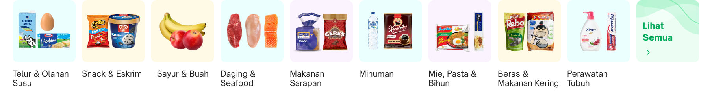

<!--left header table-->
| **Status** | <!--start status:GREEN-->RELEASE<!--end status-->  |
| --- | --- |
| **Project Lead** | [Steven Fredian Andy Putra](https://tokopedia.atlassian.net/wiki/people/557058:20782bf2-2a29-413c-b75c-ce30c92cad9e?ref=confluence) |
| **Product Manager** | [Ryan Mico](https://tokopedia.atlassian.net/wiki/people/5c6bedd8cff26405c30ad1b1?ref=confluence) |
| **PIC** | [Said Faisal](https://tokopedia.atlassian.net/wiki/people/5e25eee0ee264b0e745862c3?ref=confluence) |
| **UI / UX Designer** | @Audrey Devina Adyasa |
| **Back-End** | [Tommy Wijaya](https://tokopedia.atlassian.net/wiki/people/611c9137aee32f006f98f389?ref=confluence)  |
| **Team** | Minion Solo |
| **Module Type** | <!--start status:YELLOW-->FEATURE<!--end status--> |
| **Product PRD** | <https://docs.google.com/document/d/1ZqRlJWA-tzEi3PpS4TGjlVw4vpLo3UutrGUGsS8jSeU/edit>  |
| **Figma** | <https://www.figma.com/file/2J1JyygmICEBa6ouiFhp9T/Category-Widget-%2B-See-All-Revamp?node-id=1106%3A93371&t=Wc6UlYoblwxazNkX-0>  |
| **GQL Contract** | [GQL Category Tree API](/wiki/spaces/TokoNow/pages/1452802766/GQL+Category+Tree+API)  |
| **Tracker** | <https://mynakama.tokopedia.com/datatracker/product/requestdetail/view/3700>  |
| **Location** | `features/tokopedianow/common/viewholder/categorymenu` |

<!--toc-->

## **Description**

A collection of category level 1 that appears in a row as a navigation menu for users with maximum 9 categories and 1 see all card (in total 10 cards).

## **Requirements**

There are some requirements need to fulfill when developed this page, the requirements are as follows :

- Max is 9 categories and 1 see all card.
- Widget always appears as long as `layout` of `DynammicChannel` gql returns `category_tokonow` (in Home page only).
- Widget title will be dynamic in Home, constant in Category and Repurchase pages.
- “*Lihat Semua*” in the header and at the end of the list always appear.

## **How to Use**

- Implement `TokoNowCategoryMenuTypeFactory` on your adapter type factory.
- Implement `TokoNowCategoryMenuListener` listener and add it as `TokoNowCategoryMenuViewHolder` param. The following bellow are some functions that can be set after implementing the listener :

| `onCategoryMenuWidgetRetried` | Action on LocalLoad to refresh the widget |
| --- | --- |
| `onSeeAllCategoryClicked` | Action on “Lihat Semua” title and card when clicked  |
| `onCategoryMenuItemClicked` | Action on item of category menu widget when clicked |
| `onCategoryMenuItemImpressed` | Action on item of category menu widget when viewed |
| `onCategoryMenuWidgetImpression` | Action on category menu widget when viewed |

- Submit `TokoNowCategoryMenuUiModel` into adapter.

## **How to Customize**

To customize everything related to Recipe Bookmark, you can see these classes :

- `TokoNowCategoryMenuViewHolder.kt`
- `TokoNowCategoryMenuItemViewHolder.kt`
- `TokoNowCategoryMenuItemSeeAllViewHolder.kt`
