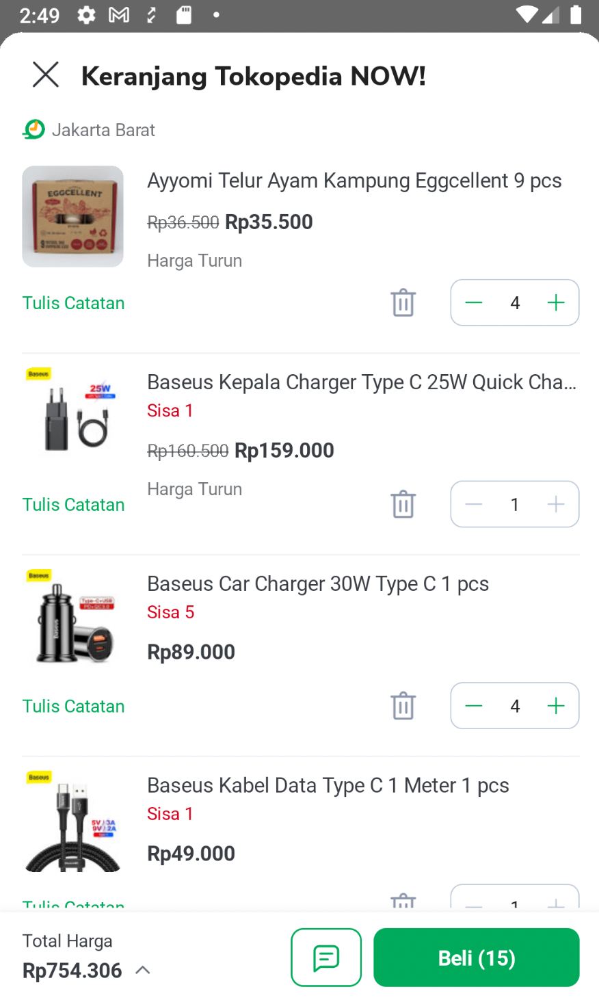
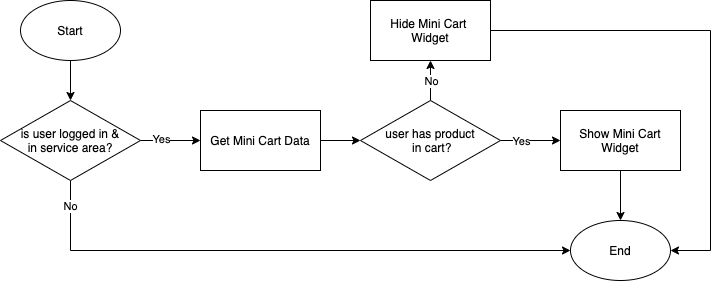
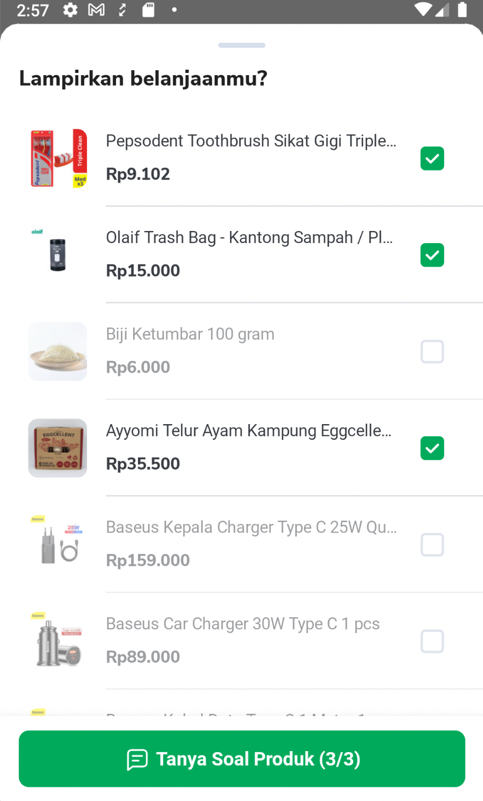
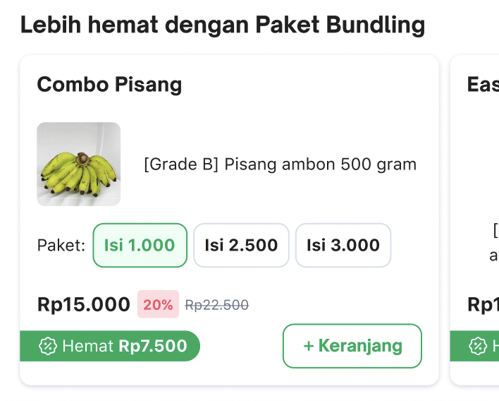

<!--left header table-->
| **Team of PIC** | Minion Bob |
| --- | --- |
| **Implementation Team** | Minion Solo |
| **PIC** | [Irfan Muhlishin](https://tokopedia.atlassian.net/wiki/people/5bfe19e5128c7106f57662cc?ref=confluence) [Hansen Putra Wijaya](https://tokopedia.atlassian.net/wiki/people/5d1c313ddea8360d16bd1d45?ref=confluence)  |
| **Implementor** | [Reza Gama Hidayat](https://tokopedia.atlassian.net/wiki/people/5def15952702bc0ec7e775c5?ref=confluence) [Said Faisal](https://tokopedia.atlassian.net/wiki/people/5e25eee0ee264b0e745862c3?ref=confluence)  |
| **Original Documentation** | [Mini Cart](/wiki/spaces/PA/pages/1524859150/Mini+Cart)  |

<!--toc-->

## **Description**

- When user land on the page, get [mini cart query](https://tokopedia.atlassian.net/wiki/spaces/TTD/pages/1477936471/GraphQL+Mini+Cart) also called parallel with layout queries.
- If there’s product in the cart, mini cart widget will be shown.
- If there’s no product in the cart, mini cart widget will not be shown.
- Get mini cart query will be called with some conditions:

	- User is logged in.
	- User is in service area. (warehouseId != 0)
	- Has valid shopId. (shopId != null or empty)
- If one of the conditions above is not fulfilled, getMiniCart query won’t be called.

## **Flow Diagram**

## **Features**

Even though the Mini Cart is owned by another team, we frequently make changes to the Mini Cart module if the task related to the development of Tokopedia Now. Therefore, these are some of the features that Tokopedia now has in the mini cart module :

| **Name** | **Screenshot**                                                         | **Link** |
| --- |------------------------------------------------------------------------| --- |
| Multiple Selections Chat |   | [Mini Cart Multiple Selections Chat](/wiki/spaces/PA/pages/2136178938/Mini+Cart+Multiple+Selections+Chat)  |
| Product Bundling |           | [Mini Cart Product Bundling](/wiki/spaces/PA/pages/2131689552/Mini+Cart+Product+Bundling)  |

