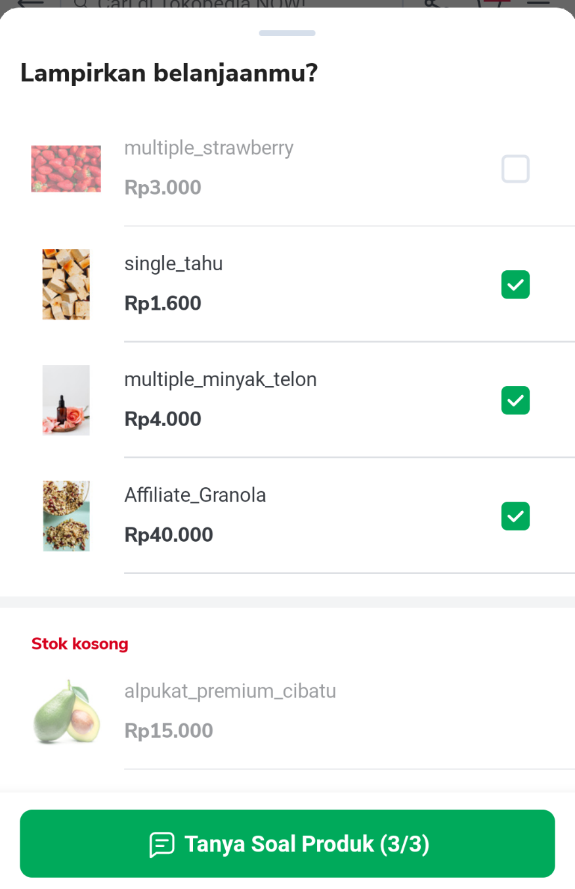
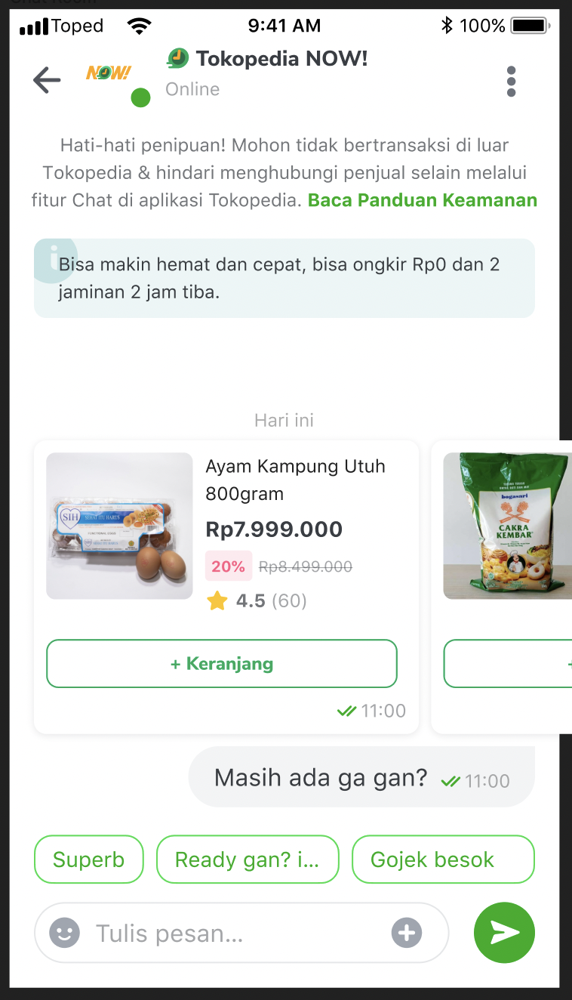

<!--left header table-->
| **Status** | <!--start status:GREEN-->RELEASE<!--end status--> |
| --- | --- |
| **Project Lead** | [Yogie Susdyastama Putra](https://tokopedia.atlassian.net/wiki/people/5c6bf2e6f1a05835f933bf30?ref=confluence) [Steven Fredian Andy Putra](https://tokopedia.atlassian.net/wiki/people/557058:20782bf2-2a29-413c-b75c-ce30c92cad9e?ref=confluence) <!--start status:BLUE-->CURRENT LEAD<!--end status--> |
| **Product Manager** | [Deo Nathaniel](https://tokopedia.atlassian.net/wiki/people/5c6be6f577edd55f716a2258?ref=confluence)  |
| **PIC** | [Said Faisal](https://tokopedia.atlassian.net/wiki/people/5e25eee0ee264b0e745862c3?ref=confluence) |
| **UI / UX Designer** | @Farrah NF |
| **Back-End** | [Edward Arlis Chouwanto](https://tokopedia.atlassian.net/wiki/people/5c94ab091b780c2c5d7c2a1c?ref=confluence)  |
| **Team** | Minion Solo |
| **Module Type** | <!--start status:YELLOW-->FEATURE<!--end status--> |
| **Figma** | <https://www.figma.com/file/BdMdmdfURvDmlHpx8r6pe8/UX%2FUI---Tokopedia-NOW!-%5BGrand-Launch---August%5D?node-id=1326%3A70110&t=xgdVrGqL75pLRWpQ-0>  |
| **Tracker** | <https://mynakama.tokopedia.com/datatracker/product/requestdetail/1995>  |
| **GQL Contract** | [[GraphQL] Mini Cart](/wiki/spaces/TTD/pages/1477936471)  |
| **Location** | `features/transaction/minicart` |

<!--toc-->

## **Description**

The Bottom Sheet is used to select several products that have been added to the Mini Cart, which will be sent to the chat and also make it easier for user to ask a question about certain products.

## **Requirements**

There are some requirements need to fulfill when developed this feature, the requirements are as follows :

- The limit of products that can be selected is 3. The view of remaining unselected products will be disabled.
- If more than one product is selected, should set the productIds into extra when moving to the chat page.
- There are two types of products, available products and unavailable products. If an available products can be selected and placed at the top while unavailable products cannot be selected and place at the bottom of the page.

## **How to Customize**

To customize everything related to Mini Cart Selection Multiple Chat, you can see these classes :

- `MiniCartChatListBottomSheet.kt`
- `MiniCartChatProductViewHolder.kt`
- `MiniCartViewModel.kt`
- `MiniCartWidget.kt`

