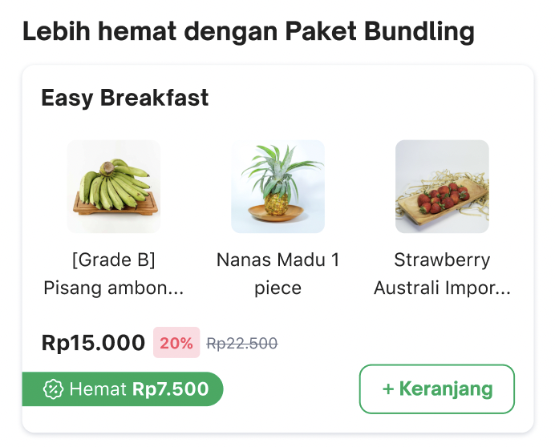
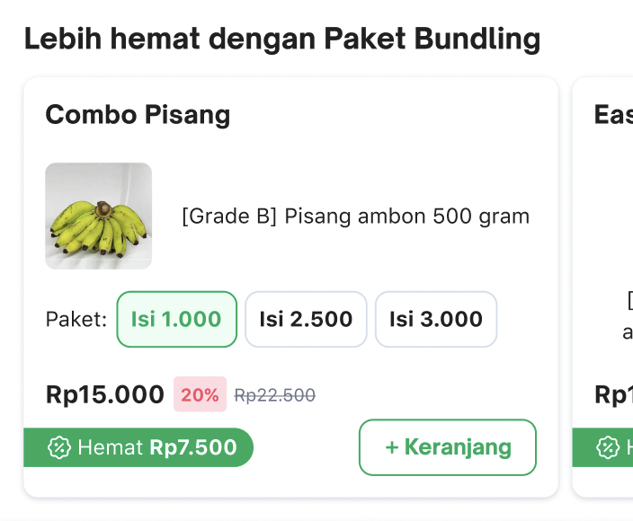

<!--left header table-->
| **Status** | <!--start status:GREEN-->RELEASE<!--end status--> |
| --- | --- |
| **Project Lead** | [Yogie Susdyastama Putra](https://tokopedia.atlassian.net/wiki/people/5c6bf2e6f1a05835f933bf30?ref=confluence) [Steven Fredian Andy Putra](https://tokopedia.atlassian.net/wiki/people/557058:20782bf2-2a29-413c-b75c-ce30c92cad9e?ref=confluence) <!--start status:BLUE-->CURRENT LEAD<!--end status--> |
| **Product Manager** | [Herman Taniwan](https://tokopedia.atlassian.net/wiki/people/5b0621d1a595df5d0a165974?ref=confluence)  |
| **PIC** | [Said Faisal](https://tokopedia.atlassian.net/wiki/people/5e25eee0ee264b0e745862c3?ref=confluence)  |
| **UI / UX Designer** | [Utari Ambarwati](https://tokopedia.atlassian.net/wiki/people/5c0619c0821157160bac0180?ref=confluence)  |
| **Back-End** | [Stephan Vebrian](https://tokopedia.atlassian.net/wiki/people/62535bdd62802600683df363?ref=confluence)  |
| **Team** | Minion Solo |
| **Module Type** | <!--start status:YELLOW-->FEATURE<!--end status--> |
| **Product PRD** | <https://docs.google.com/document/d/1EbDUuWB9hPDnQ0MgDvYZDfKzOpNdZu7dW8RD-PK4_rQ/edit>  |
| **Figma** | <https://www.figma.com/file/NHGAOCG8PmXNsMKxaP4gpn/Product-Bundling-NOW!?node-id=2395%3A121682&t=Uxqq9QbH5uSlY74s-0>  |
| **GQL Contract** | <https://tokopedia.atlassian.net/wiki/spaces/TokoNow/pages/1989613339/WIP+Product+Bundling+NOW+Phase+2#GQL>  |
| **Tracker** | <https://mynakama.tokopedia.com/datatracker/product/requestdetail/view/3235>  |
| **Location** | `features/transaction/minicart` |

<!--toc-->

## **Overview**

**Tokopedia Now** is a new business focusing on delivering groceries and essential items in less than two hours. Creating excitement and good deals are critical for the team to improve sales. Currently, the business can only used slashed price to provide good deals for the buyers. Despite its performance, it comes with limitations in exposure as it stands individually. Therefore, to equip the business team to have better tools, we implemented bundling features. The bundling feature will unlock many exciting opportunities and improve the chance of buyers to convert or purchase more should improve. 

## **Types**

There are 2 types of Product Bundling, they are **Single Bundling** and **Multiple Bundling**, the difference lies in the options displayed. For Multiple Bundling, user can choose other options of the bundling with the same title and the other hand Single Bundling only has one option.

To identify which one is Single or Multiple, we can use `bundleType` field from BE to distinguish, the value from the field would be **“SINGLE”** or **“MULTIPLE”**.

## **Requirements**

There are some requirements need to fulfill when developed this feature, the requirements are as follows :

- Show if at least one of the products in Mini Cart has bundling.
- If product empty or GQL failed to fetch, recommendation section will not be shown.
- Carousel bundling is mixed (single bundling and multiple bundling) sorted from the highest benefit (total hemat).
- Recommendation section will be shown with minimum 1 bundling card and max 10 bundling cards.
- After adding the bundling into Mini Cart, the bundling has been added will be gone, along with that, the toaster will be shown.
- Title of the widget will be changed from “*Tambah belanjaanmu biar gratis ongkir*” to “*Lebih hemat dengan Paket Bundling*” if total cart meet minimum purchase of *gratis ongkir.*
- For product variant either it is Single Bundling or Multiple Bundling, when user click button “*+ Keranjang”* Variant Bottom Sheet will be shown.

## **How to Customize**

To customize everything related to Product Bundling, you can see these classes :

- `MiniCartProductBundleRecomShimmeringViewHolder.kt`
- `MiniCartProductBundleRecomViewHolder.kt`
- `GetProductBundleRecomUseCase.kt`

