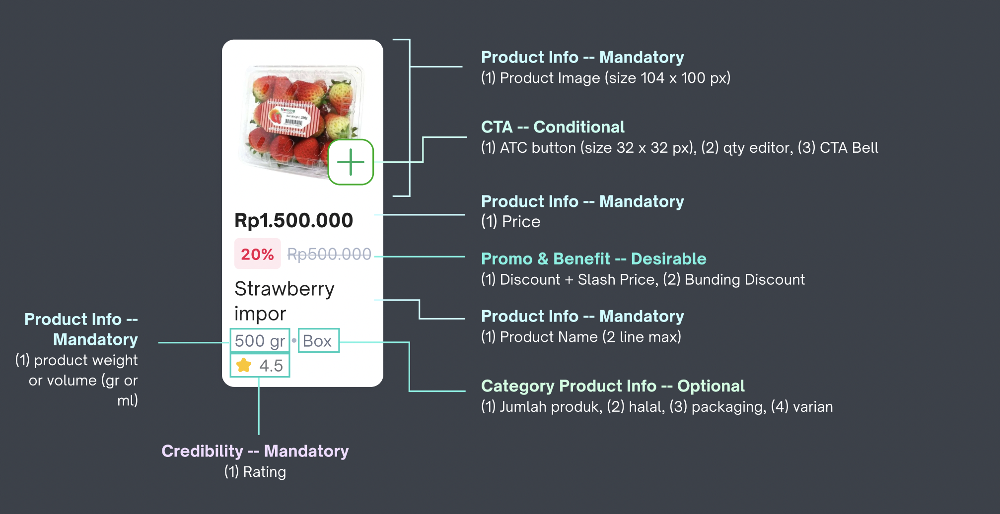
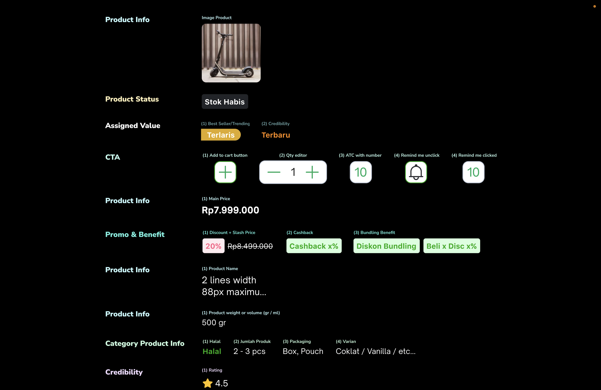
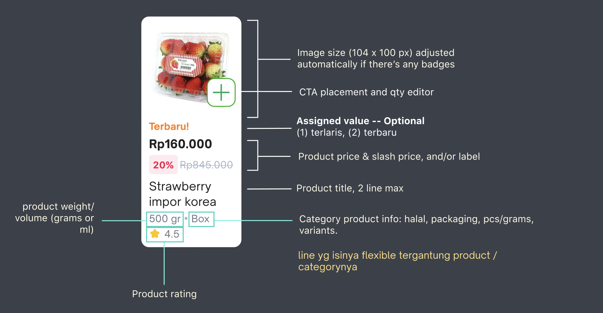
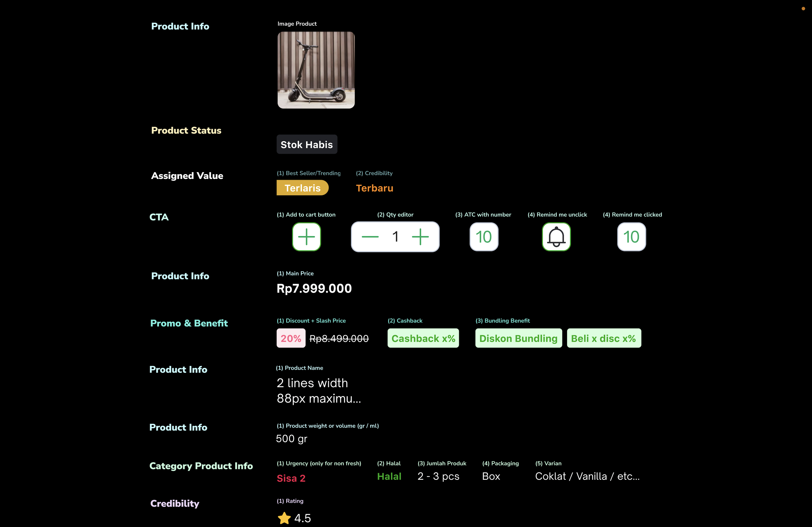
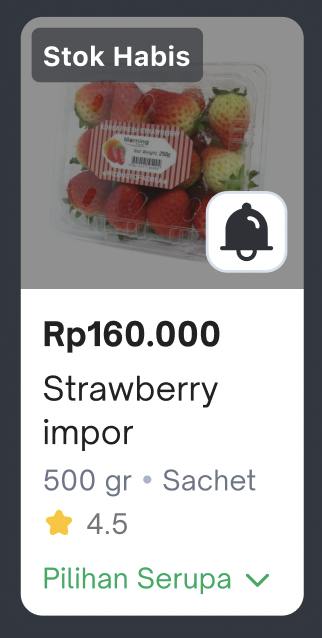
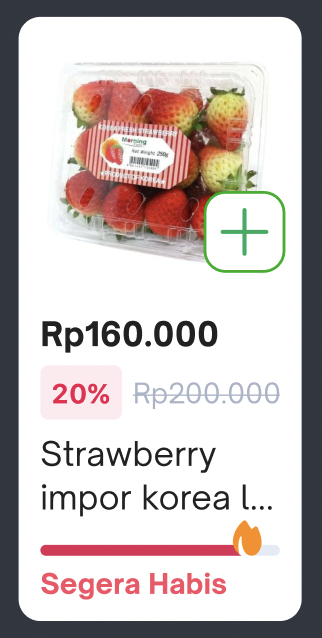
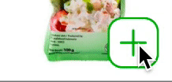
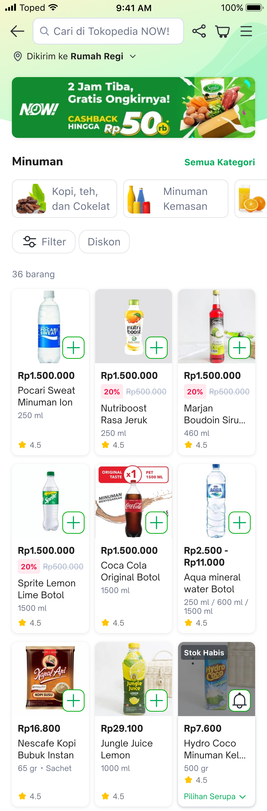
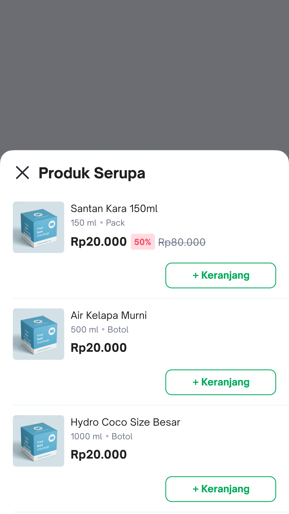
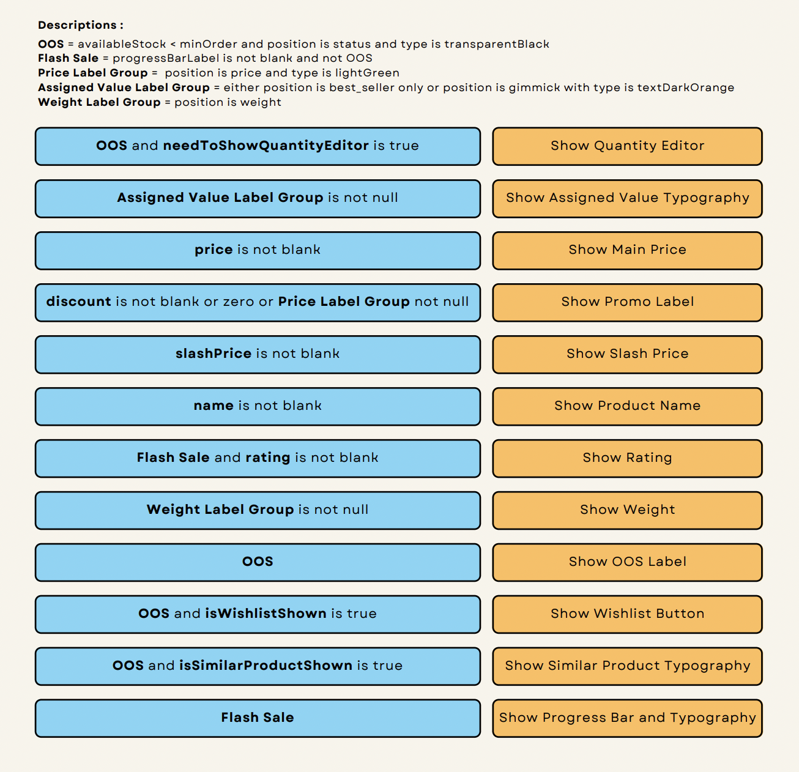

<!--left header table-->
| **Status** | <!--start status:GREEN-->RELEASE<!--end status--> |
| --- | --- |
| Contributors | [Said Faisal](https://tokopedia.atlassian.net/wiki/people/5e25eee0ee264b0e745862c3?ref=confluence) [Steven Fredian Andy Putra](https://tokopedia.atlassian.net/wiki/people/557058:20782bf2-2a29-413c-b75c-ce30c92cad9e?ref=confluence) [Jayant Kapila](https://tokopedia.atlassian.net/wiki/people/615acc1f048360006a366f3f?ref=confluence) [Reza Gama Hidayat](https://tokopedia.atlassian.net/wiki/people/5def15952702bc0ec7e775c5?ref=confluence)  |
| Product Manager | [Ryan Mico](https://tokopedia.atlassian.net/wiki/people/5c6bedd8cff26405c30ad1b1?ref=confluence) |
| UI / UX Designer | [Rahma Ari Fauziah](https://tokopedia.atlassian.net/wiki/people/5af9180ed1d9445cd3a5f6d1?ref=confluence)  |
| Release Date |  13 Dec 2022 / <!--start status:GREY-->MA-3.203<!--end status--> |
| Team | Minion Solo |
| Module Type | <!--start status:YELLOW-->FEATURE<!--end status--> |
| Product PRD | <https://docs.google.com/document/d/19zoPSLmRkYczrg5NpeuMCoTD_chMICz0yxg4o7iWo6s/edit>  |
| Figma | <https://www.figma.com/file/SFr59TCXXcMnm6Q9ZWFddF/%5BUX---NOW!%5D-Product-card?node-id=2064%3A56596&t=mEEnuOvGEM2F6Vho-0>  |
| Module Location | `features/tokopedianow/common/view` |
| Class Name | `TokoNowProductCardView` |

<!--toc-->

## Overview

Currently users need to browse more products per session which are shown by NOW! ABS is around 7-8 items, compared to the 1-2 items in PG. However, the construct of our pages is limited by the present product card design that can only fit a maximum of four products per page. Thus, browsing behavior in the groceries category is quite different than in PG, as our products are mostly standardized and most users might need less information to enable them to make ATC decisions due to their intention in quick shopping.

A redesign of the product card is needed if we’re going to improve the browsing experience on the NOW! pages. This can start by removing some of the unnecessary info for staple items, and finding a more compact way to place action buttons such as ATC. The goal is to fit as many products as possible on one page without jeopardizing the SKU clarity.

## Hierarchy

Hierarchy shows how important are the components in product card. Knowing this knowledge is essential to decide what things need to show at certain period.


## Types

There are two types which can cause different components and placements in the product card, the two types are as follow :

### Product List / SRP Page





### Carousel





## States

Apart from the types above, there are 3 states that can occur on a product card, those are:

- Normal State


- OOS (Out of Stock) State



- Flash Sale State



## Capabilities

Different from the usual product cards, this product card has a characteristic to show ownership of **Tokopedia NOW**. It has a different quantity editor and wishlist button. But not only that, there is a different way to show similar product.

### Quantity Editor

Interaction :

- When the + button is clicked, then the button will become a quantity editor.
- The qty editor will be closed with the quantity number shown if the user does the below activities:


	- Decrease the quantity to zero / minimum order then the button will be reverted to the default (+ only).
	- Idle for two seconds.
- If the user wants to update the quantity, can click the button again, and it will become a quantity editor.



### Wishlist Button

Interaction : 

- Total Duration from selected to after animation state - 500ms
.
- Angle rotation - 17 degree (left and right)
.
- Easing - ease in and out.
- Movement - 1x each (to left and to right)
.


### Similar Product

In product card, there is an entry point to open a bottomsheet filled of similar products. What we need to do is only click “Pilihan Serupa” (the similar product’s entry point).





## How to Use

### 1. Add Widget

Add `TokoNowProductCardView` into your layout xml file. There is no specific attributes needed here, only cardCornerRadius attribute that is needed if you feel the product card must be rounded shape.


```
<com.tokopedia.tokopedianow.common.view.productcard.TokoNowProductCardView
    xmlns:android="http://schemas.android.com/apk/res/android"
    xmlns:app="http://schemas.android.com/apk/res-auto"
    android:id="@+id/product_card"
    android:layout_width="match_parent"
    android:layout_height="wrap_content"
    app:cardCornerRadius="8dp" />
```

### 2. Set Data

Set the data by using `setData` function. Inside `setData` there is a condition that we need to be aware of, because it will affect to the rendering performance of product card. Set `usePreDraw` value to `true` only if you expect to make the product card wrap around its contents and adjust its height automatically if there is another product card with higher height (in this case probably carousel product card). This way will prevent UI issue with content in product card from being overwritten each other.


```
fun setData(model: TokoNowProductCardViewUiModel) {
    if (model.usePreDraw) {
        binding.root.doOnPreDraw {            
          binding.setupUi(model)
        }    
    } else {
        binding.setupUi(model)
    }
}
```

The following bellow are some properties that can be set on product card.


| **Property** | **Type** | **Goal** |
| --- | --- | --- |
| `productId` | String | For wishlist and similar product necessities |
| `imageUrl` | String | Product image |
| `minOrder` | Int | Minimum order |
| `maxOrder` | Int | Maximum order |
| `availableStock` | Int | One of variables to determine the OOS condition |
| `orderQuantity` | Int | Order Limit |
| `price` | String | Product price ( If there is a discount, it will be product price after discount) |
| `discount` | String | Product discount in string type |
| `discountInt` | Int | Product discount in int type |
| `slashPrice` | String | Original price before discount |
| `name` | String | Product name |
| `rating` | String | Product rating |
| `progressBarLabel` | String | One of variables to determine the Flash Sale condition, used as the label of progressbar |
| `progressBarPercentage` | Int | Product progressbar |
| `hasBeenWishlist` | Boolean | To determine whether the product has ever been wishlisted or not |
| `isSimilarProductShown` | Boolean | One of variables to determine whether showing similar product entry point or not |
| `isVariant` | Boolean | To determine whether the product is variant or not |
| `needToShowQuantityEditor` | Boolean | One of variables to determine whether showing quantity editor or not |
| `labelGroupList` | List | Used for non variant product labels |
| `needToChangeMaxLinesName` | Boolean | Adjust max lines of product name if needed ( default that is 2 to 1 ) |
| `usePreDraw` | Boolean | use pre draw only if need dynamic height of product card (ex: carousel) |

Apart from the properties, there are several conditions that need to be known to help you out determine what kind of content you need to show on product card which are illustrated with the graphic below.



### 3. On Click Quantity Editor Listener

You can get the quantity you added from quantity editor by implementing `setOnClickQuantityEditorListener` function.

### 4. On Click Quantity Editor Variant Listener

You can get the variant quantity you added from quantity editor by implementing `setOnClickQuantityEditorVariantListener` function.

### 5. Similar Product Listener

You can get some useful data to track from similar product entry point and bottomsheet by implementing `setListeners` function.

### 6. Wishlist Button Listener

You can get some useful data from wishlist button by implementing `setWishlistButtonListener` function.

