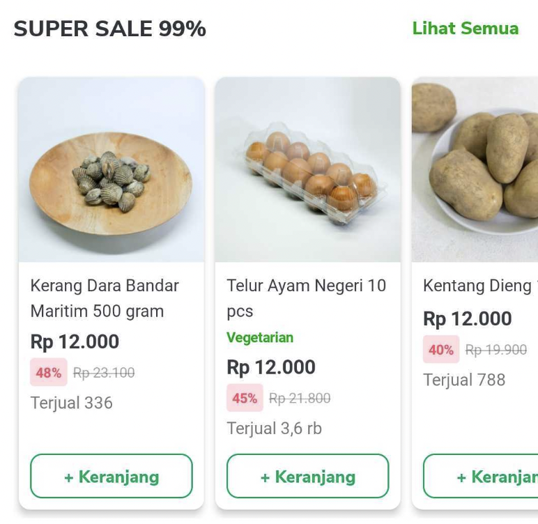

<!--left header table-->
| **Type Factory** | `TokoNowRecommendationCarouselTypeFactory` |
| --- | --- |
| **View Holder** | `TokoNowRecommendationCarouselViewHolder` |
| **UI Model** | `TokoNowRecommendationCarouselUiModel` |
| **Listener** | `TokoNowRecommendationCarouselListener``TokonowRecomBindPageNameListener` |
| **Use Case** | `GetRecommendationUseCase` |
| **GQL** | [Recommendation Widget GraphQL](/wiki/spaces/PSM/pages/513970356/Recommendation+Widget+GraphQL)  |
| **FE** | [Reza Gama Hidayat](https://tokopedia.atlassian.net/wiki/people/5def15952702bc0ec7e775c5?ref=confluence) [Yogie Susdyastama Putra](https://tokopedia.atlassian.net/wiki/people/5c6bf2e6f1a05835f933bf30?ref=confluence) [Said Faisal](https://tokopedia.atlassian.net/wiki/people/5e25eee0ee264b0e745862c3?ref=confluence) |
| **BE** | [Jerry Alfredo Saragih](https://tokopedia.atlassian.net/wiki/people/5d4287a27e09400be06c03e2?ref=confluence) [Nafiar Rahmansyah](https://tokopedia.atlassian.net/wiki/people/5c370a26a217aa69bce577b6?ref=confluence)  |

**How to Use**

1. Add `TokoNowRecommendationCarouselListener` and `TokonowRecomBindPageNameListener` implementation into fragment.
2. Add `TokoNowRecommendationCarouselTypeFactory` implementation into adapter type factory & override type `TokoNowRecommendationCarouselUiModel`.
3. Add `TokoNowRecommendationCarouselViewHolder` into `createViewHolder` method.
4. Add `TokoNowRecommendationCarouselUiModel` item into adapter.

**Example**


```
class MyTypeFactory(
  private val tokoNowRecommendationCarouselListener: TokoNowRecommendationCarouselListener,
  private val tokonowRecomBindPageNameListener: TokonowRecomBindPageNameListener
): TokoNowRecommendationCarouselTypeFactory {
    ...
    override fun type(uiModel: TokoNowEmptyStateOocUiModel) = TokoNowEmptyStateOocViewHolder.LAYOUT
    ...
    
    override fun createViewHolder(view: View, type: Int): AbstractViewHolder<out Visitable<*>> {
        return when(type) {
            ...
            TokoNowRecommendationCarouselViewHolder.LAYOUT -> TokoNowRecommendationCarouselViewHolder(view, tokoNowRecommendationCarouselListener, tokonowRecomBindPageNameListener)
            ...
            else -> super.createViewHolder(view, type)
        }
    }
}

class Fragment(): TokoNowRecommendationCarouselListener {
    fun onSaveCarouselScrollPosition(adapterPosition: Int, scrollPosition: Int) {
        // save the state while scrolling
    }

    fun onGetCarouselScrollPosition(adapterPosition: Int): Int {
        // get the scrolling position
    }

    fun onBindRecommendationCarousel(model: TokoNowRecommendationCarouselUiModel, adapterPosition: Int) {
        // bind data model to recom view
    }

    fun onImpressedRecommendationCarouselItem(
            model: TokoNowRecommendationCarouselUiModel?,
            data: RecommendationCarouselData,
            recomItem: RecommendationItem,
            itemPosition: Int,
            adapterPosition: Int,
    ) {
        // need to track while impressing recom
    }

    fun onClickRecommendationCarouselItem(
            model: TokoNowRecommendationCarouselUiModel?,
            data: RecommendationCarouselData,
            recomItem: RecommendationItem,
            itemPosition: Int,
            adapterPosition: Int
    ) {
        // click recom implementation
    }

    fun onATCNonVariantRecommendationCarouselItem(
            model: TokoNowRecommendationCarouselUiModel?,
            data: RecommendationCarouselData,
            recomItem: RecommendationItem,
            recommendationCarouselPosition: Int,
            quantity: Int,
    ) {
        // add to cart non variant
    }

    fun onAddVariantRecommendationCarouselItem(
            model: TokoNowRecommendationCarouselUiModel?,
            data: RecommendationCarouselData,
            recomItem: RecommendationItem,
    ) {
        // add to cart variant
    }

    fun onSeeMoreClick(data: RecommendationCarouselData, applink: String) {
        // see more implementation
    }
}

class Fragment(): TokonowRecomBindPageNameListener {
    override fun onMiniCartUpdatedFromRecomWidget(miniCartSimplifiedData: MiniCartSimplifiedData) {
        // minicart updated with page name
    }

    override fun onRecomTokonowAtcSuccess(message: String) {
        // add to cart success
    }

    override fun onRecomTokonowAtcFailed(throwable: Throwable) {
        // add to cart failed
    }

    override fun onRecomTokonowAtcNeedToSendTracker(recommendationItem: RecommendationItem) {
        // send tracker while adding product to cart
    }

    override fun onRecomTokonowDeleteNeedToSendTracker(recommendationItem: RecommendationItem) {
        // send tracker while deleting product cart
    }

    override fun onClickItemNonLoginState() {
        // non login state implementation
    }

    //lifecycle owner
    override fun setViewToLifecycleOwner(observer: LifecycleObserver) {
        // set lifeCycleOwner
    }
}
```

