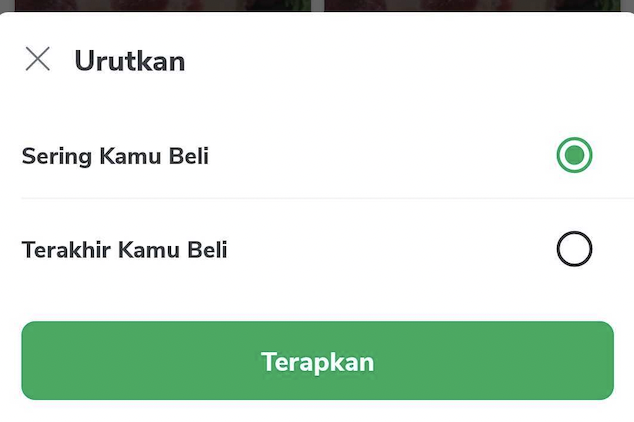

<!--left header table-->
| **Applink** | <br/><br/>```<br/>val SORT_FILTER = "$INTERNAL_TOKOPEDIA_NOW/sort-filter"<br/>```<br/><br/> |  |
| --- | --- | --- |
| **FE** | [Said Faisal](https://tokopedia.atlassian.net/wiki/people/5e25eee0ee264b0e745862c3?ref=confluence) [Yogie Susdyastama Putra](https://tokopedia.atlassian.net/wiki/people/5c6bf2e6f1a05835f933bf30?ref=confluence)  |  |
| **Figma** | [(Figma) UX/UI - TokoNOW!](https://www.figma.com/file/ywlnYgKxnz7AYYtPDhTs9T/UX%2FUI---TokoNOW!-%5BPilot-Release---July%5D?node-id=3441%3A13051)  |  |

### **Module**

`tokopedianow`


---

### **Classes**

- `TokoNowSortFilterFragment`
- `TokoNowSortFilterBottomSheet`


---

### **Description**



This bottom sheet is used for showing all available sort filter options in TokoNOW, latest there are 2 options :

- **Sering Kamu Beli**, this is for sorting based on product that you often buy
- **Terakhir Kamu Beli**, this is for sorting based on the latest product you bought


---

### **How to Use**

1. Call RouteManager.route() with `ApplinkConstInternalTokopediaNow.SORT_FILTER`.
2. Make sure to pass an extra integer value as 1 (last bought) or 2 (frequently bought)

