<!--left header table-->
| **Status** | <!--start status:GREEN-->RELEASE<!--end status--> |
| --- | --- |
| Contributor | [Yogie Susdyastama Putra](https://tokopedia.atlassian.net/wiki/people/5c6bf2e6f1a05835f933bf30?ref=confluence) [Said Faisal](https://tokopedia.atlassian.net/wiki/people/5e25eee0ee264b0e745862c3?ref=confluence) [Firmanda Mulyawan Nugroho](https://tokopedia.atlassian.net/wiki/people/5d91c148fdfa560dcc3a040f?ref=confluence) [Reza Gama Hidayat](https://tokopedia.atlassian.net/wiki/people/5def15952702bc0ec7e775c5?ref=confluence) [Misael Jonathan](https://tokopedia.atlassian.net/wiki/people/60051d42e64c95006fbaad73?ref=confluence) [Steven Fredian Andy Putra](https://tokopedia.atlassian.net/wiki/people/557058:20782bf2-2a29-413c-b75c-ce30c92cad9e?ref=confluence) |
| Product Manager | [Deo Nathaniel](https://tokopedia.atlassian.net/wiki/people/5c6be6f577edd55f716a2258?ref=confluence) [Joshua Edbert Tirtana](https://tokopedia.atlassian.net/wiki/people/60f7ac85f026ab007029a6bf?ref=confluence) [Ryan Mico](https://tokopedia.atlassian.net/wiki/people/5c6bedd8cff26405c30ad1b1?ref=confluence) [Jumadila Mustika](https://tokopedia.atlassian.net/wiki/people/61c037f6a54af90069a11858?ref=confluence) |
| Release date | 14 Jul 2021 |
| Team | Minion Solo |
| Module type | <!--start status:YELLOW-->FEATURE<!--end status--> |
| Product PRD | <https://docs.google.com/document/d/1pWsEA_85v9vZWmfxXo5DC0xsb7QWDu_cTNjMMQpnFsk/edit> |
| Module Location | `features/tokopedianow/home` |

<!--toc-->

## Technical Description

When user land on Tokopedia NOW! home page, first it will show loading state and get user address data (shopId & warehouseId) from choose address widget. If choose address widget returns shopId == 0L, home will get address data from [KeroAddrGetStateChosenAddress](/wiki/spaces/LG/pages/1145635698) query. Since Tokopedia NOW! only available in several areas in Indonesia, it will check whether user address is in service area or not based on user address data. If warehouseId == 0 means user is out of service coverage, else means user is in service area. When user is out of service coverage, Tokopedia NOW! home will show out of coverage UI, and user will be given chance to change address. 

When user is in service area, getHomeLayout() will be called. Home layout components are retrieved from [DynamicHomeChannel](/wiki/spaces/HP/pages/381550603) query. The data requested is only layout components list without its content data. After the layout components list are retrieved, Tokopedia NOW! home will load all layout components content data that only visible to user one by one, independently. If one of the layout fails to load data, it will be removed from home, except for category grid layout, it will show local load to retry get category grid data. The layout components that are not visible to user will be loaded lazily as user scrolls to the bottom of home page. After all layout components data finished to load, [mini cart query](https://tokopedia.atlassian.net/wiki/spaces/TTD/pages/1477936471/GraphQL+Mini+Cart) will be called to get add to cart quantity data, then each product add to cart quantity in product list will be updated with data from mini cart query. If product add to cart quantity > 0 (added to cart), the product card will show add to cart quantity editor.

## Flow Diagram

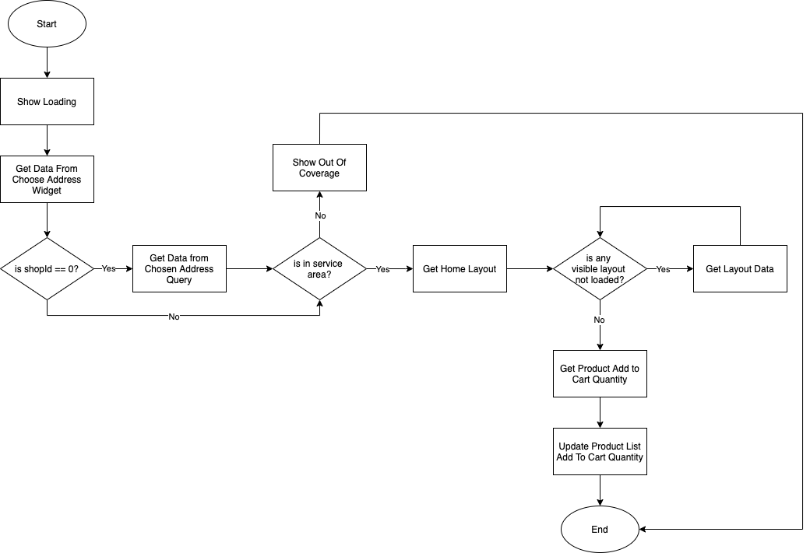

## Features

| **Name** | **Screenshot**                                                                                                                      | **Link** |
| --- |-------------------------------------------------------------------------------------------------------------------------------------| --- |
| Navigation Toolbar |                                                                                     | <https://tokopedia.atlassian.net/wiki/spaces/PA/pages/967945643/Navigation+Toolbar#Toolbar-title-setup>  |
| Universal Sharing Bottomsheet |  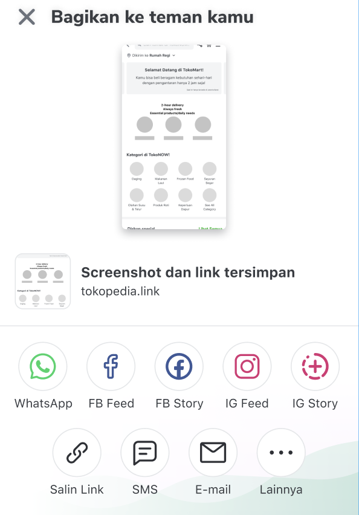  | [PRD - Universal Sharing Experience [Not Updated]](/wiki/spaces/CO/pages/1340674521) <https://docs.google.com/document/d/1yEDJmmLJ4V-k2u83FZ7dOzkFgjJZxOxYFCPepvDBINc/edit> <https://docs.google.com/document/d/1Z5wXNwYxRNKNqVFUBUfxVgUdCRk-Cxkcchra2ywsbtA/edit>  |
| Choose Address |                                                                                         | [Choose Address Widget - Localized Experience](/wiki/spaces/PA/pages/1157243000/Choose+Address+Widget+-+Localized+Experience)  |
| Ticker |                                                                                                  | [Home Ticker](/wiki/spaces/PA/pages/1845920179/Home+Ticker)  |
| USP / Educational Information | 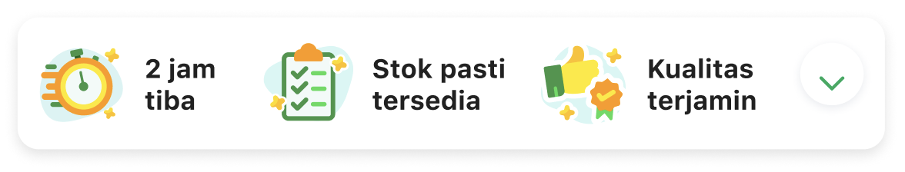 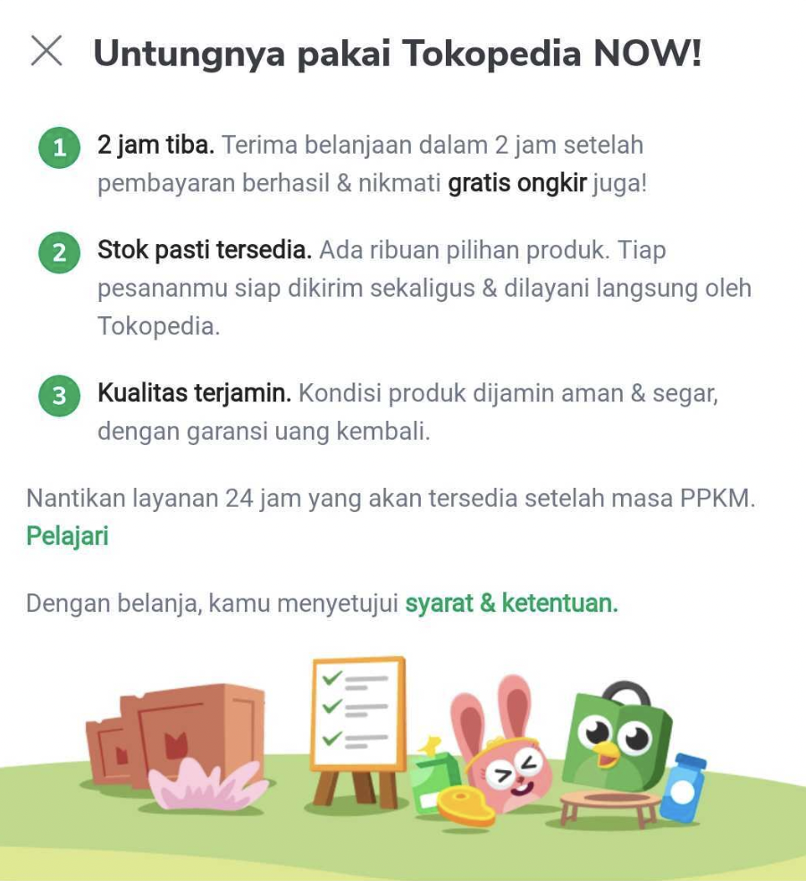     | [Home USP / Educational Information](/wiki/spaces/PA/pages/1845822243)  |
| Sharing Education |                                                                                      | [Home Sharing Education](/wiki/spaces/PA/pages/1845855118/Home+Sharing+Education)  |
| Banner Component |                                                                                                 | none |
| Buy It Again / Repurchase | 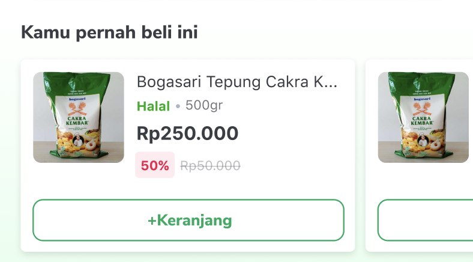                                                                                     | [Tokopedia Now Repurchase Widget](/wiki/spaces/PA/pages/1732379776/Tokopedia+Now+Repurchase+Widget)  |
| Category Menu | 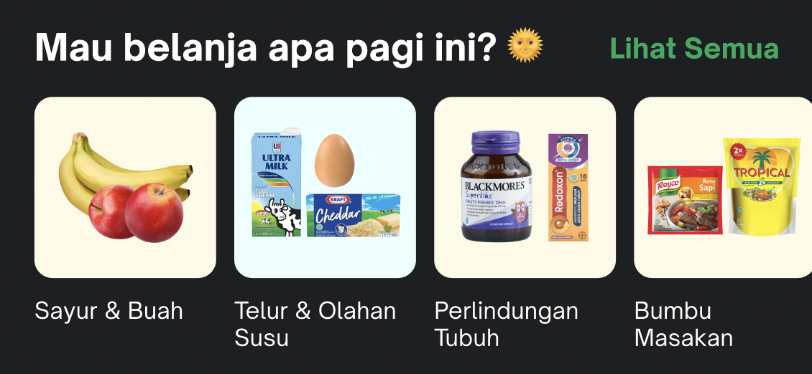                                                                                         | [Tokopedia Now Category Menu](/wiki/spaces/PA/pages/1844544240/Tokopedia+Now+Category+Menu)  |
| Category Bottom Sheet | 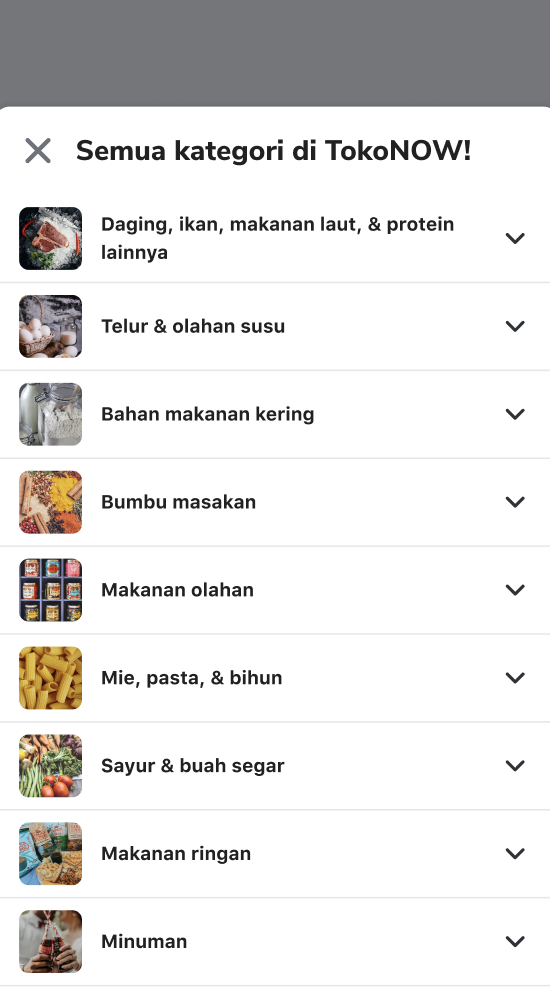                                                                                  | [Tokopedia Now Category Bottom Sheet](/wiki/spaces/PA/pages/1533447808/Tokopedia+Now+Category+Bottom+Sheet)  |
| Product Recommendation |                 | [Home Product Recommendation](/wiki/spaces/PA/pages/1846969610/Home+Product+Recommendation)  |
| Dynamic Lego Banner | 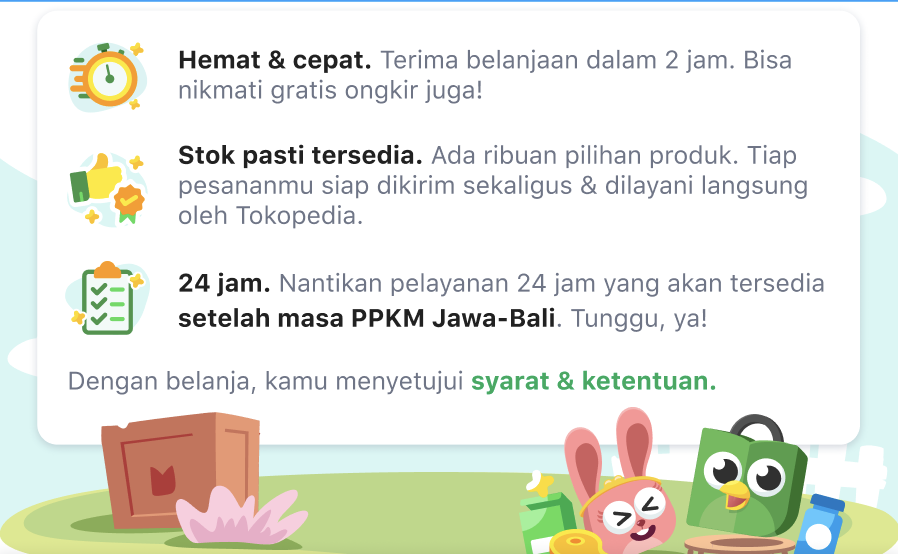                                                                                   | none |
| Mini Cart |                                                                                               | [Tokopedia Now Mini Cart](/wiki/spaces/PA/pages/1843758861/Tokopedia+Now+Mini+Cart)  |
| Sticky Login  |                                                                                           | none |
| Out of Coverage (OOC) State | 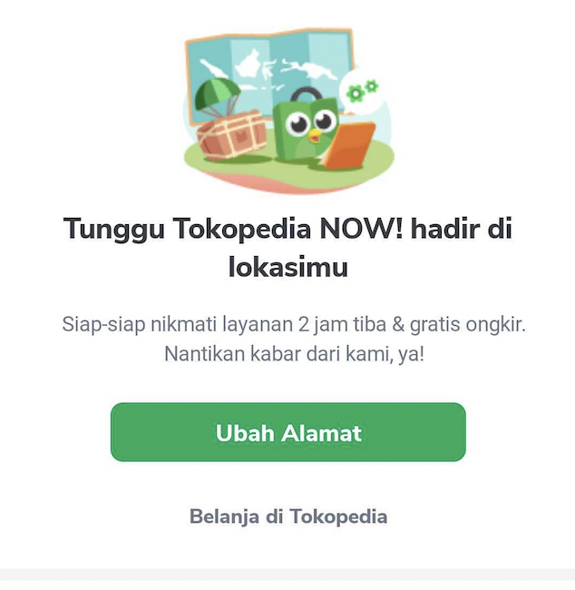                                                                                                   | [Tokopedia Now Out of Coverage (OOC) State](/wiki/spaces/PA/pages/1845790121/Tokopedia+Now+Out+of+Coverage+%28OOC%29+State)  |
| Error State | 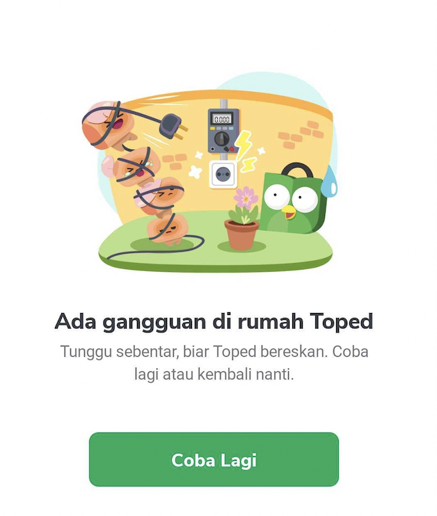                                                                                           | [Tokopedia Now Error State](/wiki/spaces/PA/pages/1845724290/Tokopedia+Now+Error+State)  |
| No Address State |                                                                                       | [Home No Address State](/wiki/spaces/PA/pages/1845887889/Home+No+Address+State)  |
| Add to Cart Variant Bottom Sheet | 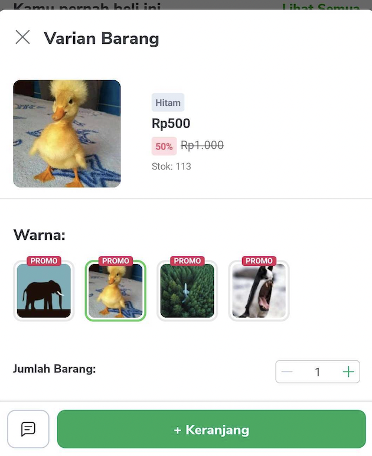                                                                               | [ATC Variant Bottom Sheet](/wiki/spaces/PA/pages/1522500791/ATC+Variant+Bottom+Sheet)  |
| Quest Widget |                                                                                                  | [Home Quest Widget](/wiki/spaces/PA/pages/2149450712/Home+Quest+Widget)  |

