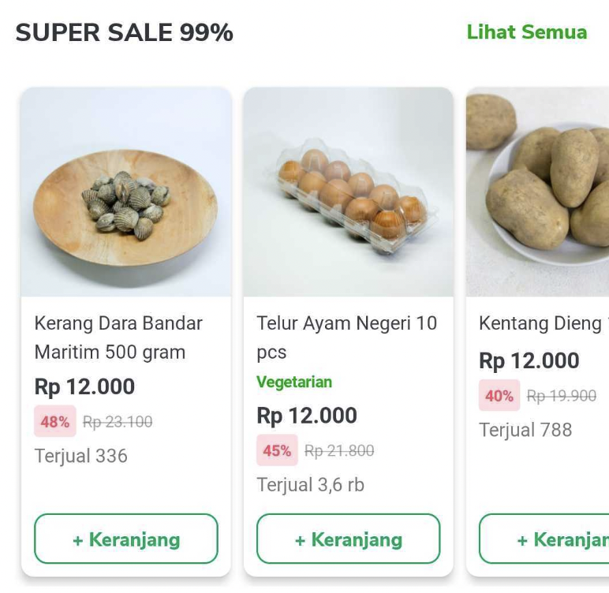
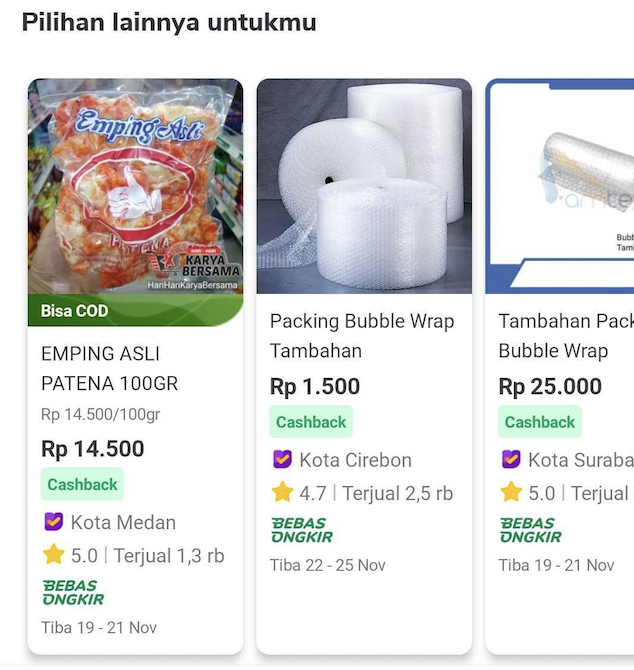

<!--left header table-->
| **Type Factory** | `HomeTypeFactory` |
| --- | --- |
| **View Holder** | `HomeProductRecomViewHolder` |
| **UI Model** | `HomeProductRecomUiModel` |
| **Listener** | `HomeProductRecomListener``TokoNowView` |
| **Use Case** | `GetHomeLayoutDataUseCase` |
| **GQL** | [HPB/Home - [API:MOJ] Channel](/wiki/spaces/HP/pages/381550603)  |
| **FE** |  [Said Faisal](https://tokopedia.atlassian.net/wiki/people/5e25eee0ee264b0e745862c3?ref=confluence) [Yogie Susdyastama Putra](https://tokopedia.atlassian.net/wiki/people/5c6bf2e6f1a05835f933bf30?ref=confluence) |
| **BE** | [Jerry Alfredo Saragih](https://tokopedia.atlassian.net/wiki/people/5d4287a27e09400be06c03e2?ref=confluence) [Christian Ade Yanuar](https://tokopedia.atlassian.net/wiki/people/5c370a28ff324728a1da77c4?ref=confluence)  |

## **Note**

- It’s only used on Tokopedia NOW! Home page
- Need `GetHomeLayoutDataUseCase` to all products data for this widget

