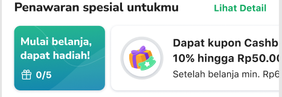
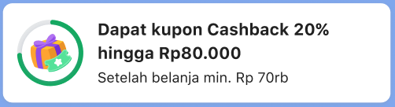
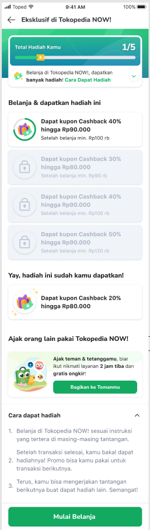
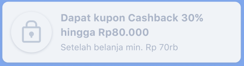
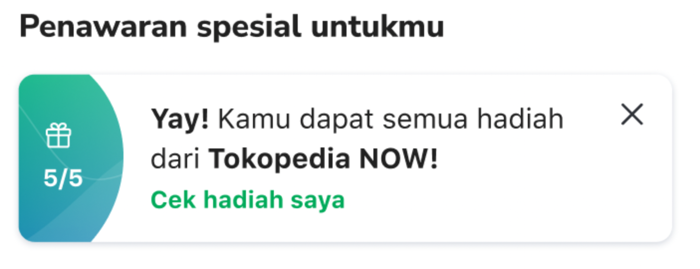

<!--left header table-->
| **Status** | <!--start status:GREEN-->RELEASE<!--end status--> |
| --- | --- |
| Contributors | [Said Faisal](https://tokopedia.atlassian.net/wiki/people/5e25eee0ee264b0e745862c3?ref=confluence) [Yogie Susdyastama Putra](https://tokopedia.atlassian.net/wiki/people/5c6bf2e6f1a05835f933bf30?ref=confluence)  |
| Product Manager |  [Ryan Mico](https://tokopedia.atlassian.net/wiki/people/5c6bedd8cff26405c30ad1b1?ref=confluence)  |
| UI / UX Designer | @Audrey Devina Adyasa |
| Back-End | [Ivan Bagaskara](https://tokopedia.atlassian.net/wiki/people/5fd6f88f34847e0069170532?ref=confluence)  |
| Release Date | 10 Jan 2021 / <!--start status:GREY-->MA-3.158<!--end status--> |
| Team | Minion Solo |
| Module Type | <!--start status:YELLOW-->FEATURE<!--end status--> |
| Product PRD | <https://docs.google.com/document/d/1UWm4F1oZBuKrFHUJ7scs2Gsv5LRK1EV3GVD1GLTFctU/edit>  |
| Figma | <https://www.figma.com/file/YXAaTDrwkKirqWqIjcJzOW/Progressive-Quest-NOW!?t=JKWNSWRRS5yZY8DX-0>  |
| GQL Contract | [Quest List API](/wiki/spaces/G/pages/299303078/Quest+List+API)  |
| Tracker | <https://mynakama.tokopedia.com/datatracker/requestdetail/view/2664>  |
| Module Location | `features/tokopedianow/home/presentation/viewholder` |

<!--toc-->

## Description

A widget that has several quests ready to be claimed for eligible users.

## Status

There are 3 status for the widget:

- **On progress**: active quest & clickable to detail quest (hardcoded url + `questId` : `https://www.tokopedia.com/seru/topquest/detail/{questId}`).

- **Idle**: waiting for the previous quest to be done & not clickable (locked & grey out).

- **Claimed**: the quest is done & gone from the quest widget.

## Requirements

There are some requirements need to fulfill when developed this page, the requirements are as follows :

- Only eligible users (with active quest > 1 within channelSlug = `tokonow-main-quest`), can see the widget.
- The widget can show 1 title card + up to 5 quest cards that are eligible to the user.
- “*Lihat Detail*” button will redirect the user to the NOW quest channel page (hardcoded url : `https://www.tokopedia.com/now/quest-channel`).
- Widget position will use widget type `tokonow_main_quest` from dynamic channel response.
- If all quests are finished there will be different UI shown with info if user already got all of the rewards, if user click it will redirect to my coupon page (hardcoded appLink : `tokopedia://rewards/kupon-saya`).

## Contract Used

This gql is hit if the widget type exist on dynamic channel response. 

| **Field** | **Use** |
| --- | --- |
| `id` | Used as a unique identifier on each item |
| `config` | This is a json type so need to convert first to map type, then will take : - `banner_title` as title of the ViewHolder - `banner_description` as subtitle of the ViewHolder - `banner_icon_url` as icon of the ViewHolder  |
| `task` → `progress` → `current` | Used as current progress of the quest |
| `task` → `progress` → `target` | Used as target progress of the quest |
| `questUser` → `status`  | Used as status on each item quest |

## How to Customize

To customize everything related to Recipe Bookmark, you can see these classes :

- `HomeQuestAllClaimedWidgetViewHolder.kt`
- `HomeQuestSequenceWidgetViewHolder.kt`
- `HomeQuestTitleViewHolder.kt`
- `HomeQuestWidgetViewHolder`
