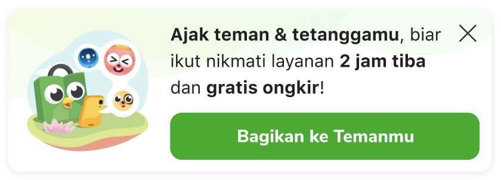

<!--left header table-->
| **Type Factory** | `HomeTypeFactory` |
| --- | --- |
| **View Holder** | `HomeSharingEducationWidgetViewHolder` |
| **UI Model** | `HomeSharingEducationWidgetUiModel` |
| **Listener** | `HomeSharingEducationListener` |
| **Use Case** | `GetHomeLayoutDataUseCase` |
| **GQL** | [HPB/Home - [API:MOJ] Channel](/wiki/spaces/HP/pages/381550603)  |
| **FE** | [Said Faisal](https://tokopedia.atlassian.net/wiki/people/5e25eee0ee264b0e745862c3?ref=confluence) [Yogie Susdyastama Putra](https://tokopedia.atlassian.net/wiki/people/5c6bf2e6f1a05835f933bf30?ref=confluence) |
| **BE** | [Christian Ade Yanuar](https://tokopedia.atlassian.net/wiki/people/5c370a28ff324728a1da77c4?ref=confluence) [Andreas Wijaya](https://tokopedia.atlassian.net/wiki/people/5c37093fad984b52108580ac?ref=confluence) [Jonathan Ryadi](https://tokopedia.atlassian.net/wiki/people/5c370a241c6a692feab9a87e?ref=confluence) |

## **Note**

- It’s only used on Tokopedia NOW! Home page
- Need `GetHomeLayoutDataUseCase` to decide whether the widget need to appear or not
- All data are hard coded
- If click “Bagikan ke Temanmu” button, it will show up [Universal Sharing Bottomsheet](/wiki/spaces/CO/pages/1340674521)

