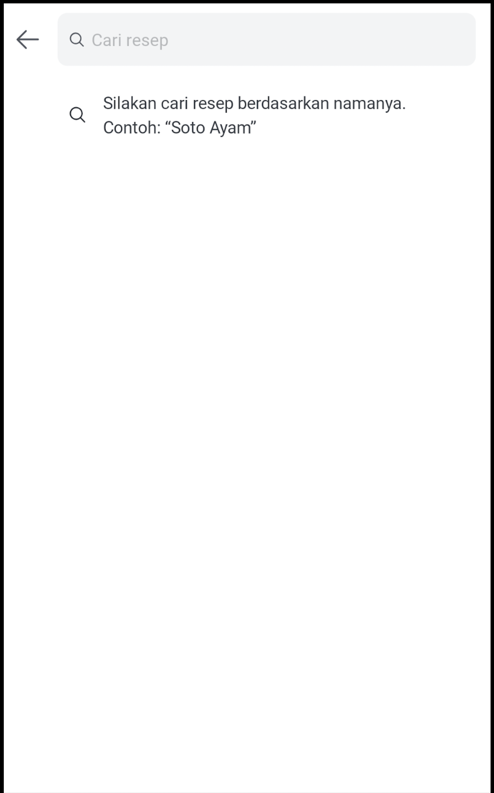

<!--left header table-->
| **Status** | <!--start status:GREEN-->RELEASE<!--end status--> |
| --- | --- |
| **Project Lead** | [Steven Fredian Andy Putra](https://tokopedia.atlassian.net/wiki/people/557058:20782bf2-2a29-413c-b75c-ce30c92cad9e?ref=confluence) |
| **Product Manager** | [Ryan Mico](https://tokopedia.atlassian.net/wiki/people/5c6bedd8cff26405c30ad1b1?ref=confluence) |
| **PIC** | [Said Faisal](https://tokopedia.atlassian.net/wiki/people/5e25eee0ee264b0e745862c3?ref=confluence) |
| **UI / UX Designer** | [Rahma Ari Fauziah](https://tokopedia.atlassian.net/wiki/people/5af9180ed1d9445cd3a5f6d1?ref=confluence) |
| **Team** | Minion Solo |
| **Module Type** | <!--start status:YELLOW-->FEATURE<!--end status--> |
| **Product PRD** | <https://docs.google.com/document/d/1GEaMoWKUYtt27STrf54MoF_d8vTSVSLOYqDSpko6tos/edit?pli=1#heading=h.skxbcmri1x3h> |
| **Figma** | <https://www.figma.com/file/U9jA9pNjgafD14Xx6Aioll/%5BUX-NOW!--Recipe%5D?node-id=3521%3A250284&t=9I81RKBTkc1AWBKF-0> |
| **Location** | `features/tokopedianow/recipeautocomplete` |
| **Applink** | `tokopedia://now/recipe/autocomplete` |

<!--toc-->

## **Description**

A page that is opened by clicking the SearchBar on Home Recipe or Search Result page. On this page users can type any keywords they want to search for, after typing some keywords and clicking search button on Soft Keyboard, the page will direct to Recipe Search Result page.

## **How to Customize**

To customize everything related to Recipe Auto Complete, you can see these classes :

- `TokoNowRecipeAutoCompleteFragment.kt`
- `TokoNowRecipeAutoCompleteViewModel.kt`
