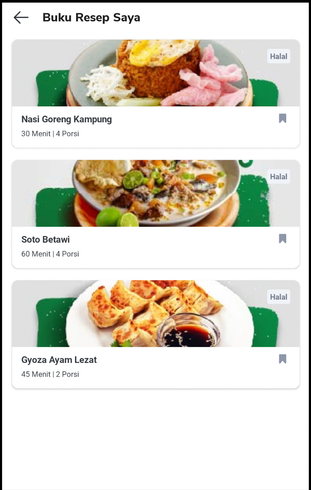
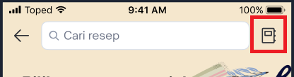
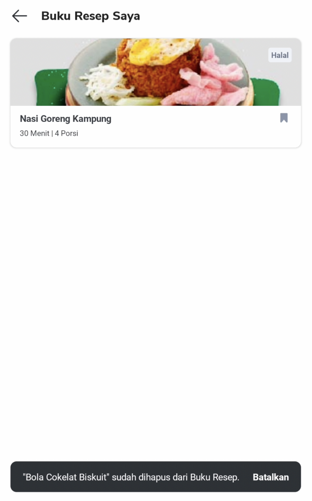
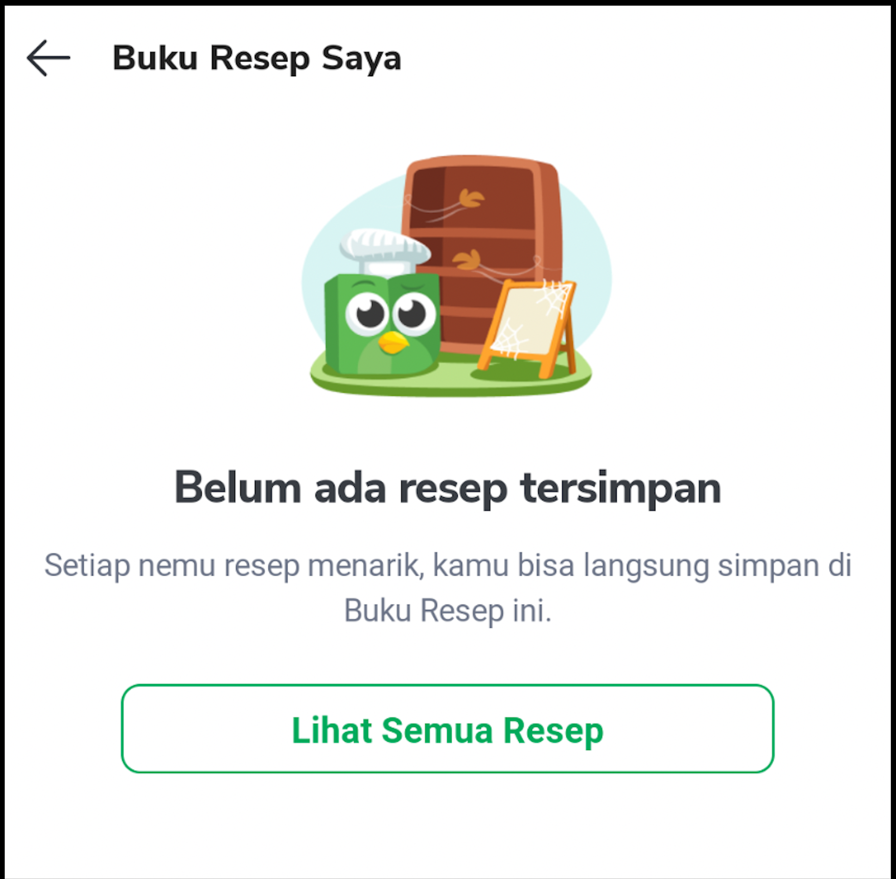

<!--left header table-->
| **Status** | <!--start status:GREEN-->RELEASE<!--end status--> |
| --- | --- |
| **Project Lead** | [Steven Fredian Andy Putra](https://tokopedia.atlassian.net/wiki/people/557058:20782bf2-2a29-413c-b75c-ce30c92cad9e?ref=confluence)  |
| **Product Manager** | [Ryan Mico](https://tokopedia.atlassian.net/wiki/people/5c6bedd8cff26405c30ad1b1?ref=confluence)  |
| **PIC** | [Said Faisal](https://tokopedia.atlassian.net/wiki/people/5e25eee0ee264b0e745862c3?ref=confluence) |
| **UI / UX Designer** | [Rahma Ari Fauziah](https://tokopedia.atlassian.net/wiki/people/5af9180ed1d9445cd3a5f6d1?ref=confluence)  |
| **Back-End** | [Hans Nicolaus](https://tokopedia.atlassian.net/wiki/people/61cb907168926d0068fb91d4?ref=confluence)  |
| **Team** | Minion Solo |
| **Module Type** | <!--start status:YELLOW-->FEATURE<!--end status--> |
| **Product PRD** | <https://docs.google.com/document/d/1GEaMoWKUYtt27STrf54MoF_d8vTSVSLOYqDSpko6tos/edit?pli=1#heading=h.skxbcmri1x3h>  |
| **Figma** | <https://www.figma.com/file/U9jA9pNjgafD14Xx6Aioll/%5BUX-NOW!--Recipe%5D?node-id=3521%3A250284&t=9I81RKBTkc1AWBKF-0>  |
| **GQL Contract** | [[Query] TokonowGetRecipeBookmarks GQL](/wiki/spaces/TokoNow/pages/1939183376) [[Mutation] TokonowAddRecipeBookmark GQL](/wiki/spaces/TokoNow/pages/1986497828) [[Mutation] TokonowRemoveRecipeBookmark GQL](/wiki/spaces/TokoNow/pages/1986498304)  |
| **Tracker** | <https://mynakama.tokopedia.com/datatracker/product/requestdetail/view/3391>  |
| **Location** | `features/tokopedianow/recipebookmark` |
| **Applink** | `tokopedia://now/recipe/bookmarks` |

<!--toc-->

## **Description**

A special page to display recipes that have been previously bookmarked and can be accessed through Recipe Home page.

## **Requirements**

There are some requirements need to fulfill when developed this page, the requirements are as follows :

- Unbookmark the recipe by clicking the filled bookmark icon. After clicked this, the item will be removed from the list and toaster displayed.

- After cancelling the bookmark, toaster will be displayed with “*Batalkan” / “Cancel”* cta. If user click the cta, the recipe will be re-added to the top of the page.

- If recipe is empty, the page will be empty state.

- Display the tag name if the number of tags is 4 maximum, if the tag more than 4, the fourth tag will be shown as “*+ {$tagSize - 3} lainnya*”.

## **Contract Used**

### 1. Get Recipe Bookmark

This gql is hit when user visits the page, will fetch all recipes bookmarked and show the bookmarks as card to the user.

| **Field** | **Use** |
| --- | --- |
| `id` | Used as a unique identifier for each item |
| `title` | Used as a recipe title for each item |
| `portion` | Used as subtitle along with `duration` |
| `duration` | Used as subtitle along with `portion` |
| `tags` → `id` & `name` | `id` is used as unique identifier and `name` is used as tag name for each tag item |
| `images`-> `urlOriginal` | Used as main image for each item |
| `appUrl` | Used as appLink of recipe detail page |

### 2. Add Recipe Bookmark

This gql is hit when click *“Batalkan”* cta on a toaster, will cancel the unbookmark process and re-added back the recipe to the top of the page.

| **Field** | **Use** |
| --- | --- |
| `message` | Used to display on toaster if gql failed from BE side |
| `success` | Used to decide whether gql is successful or not |

### 3. Remove Recipe Bookmark

This gql is hit when click the filled bookmark icon on card, will unbookmark the recipe and remove the recipe from the list.

| **Field** | **Use** |
| --- | --- |
| `message` | Used to display on toaster if gql failed from BE side |
| `success` | Used to decide whether gql is successful or not |

## **How to Customize**

To customize everything related to Recipe Bookmark, you can see these classes :

- `TokoNowRecipeBookmarkFragment.kt`
- `TokoNowRecipeBookmarkViewModel.kt`
- `RecipeBookmarkAdapter.kt`
- `RecipeBookmarkAnalytics.kt`
