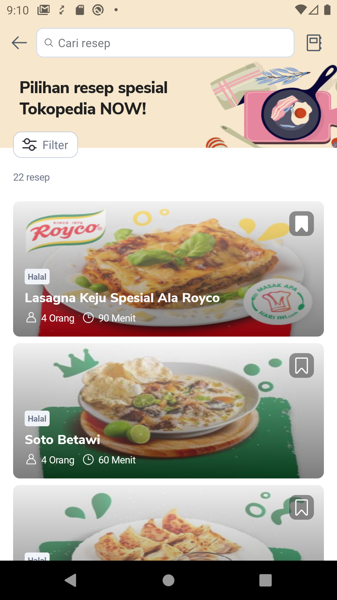
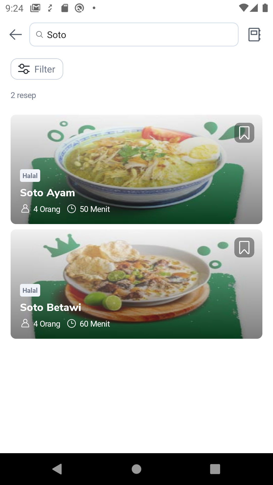
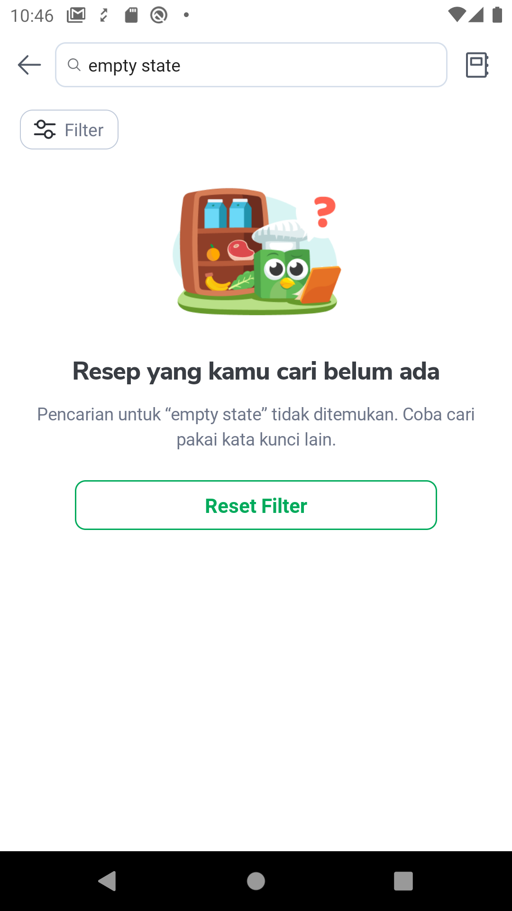
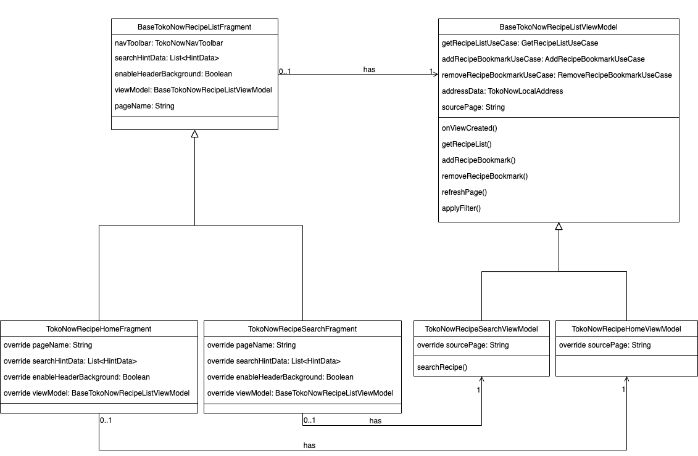
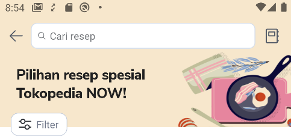
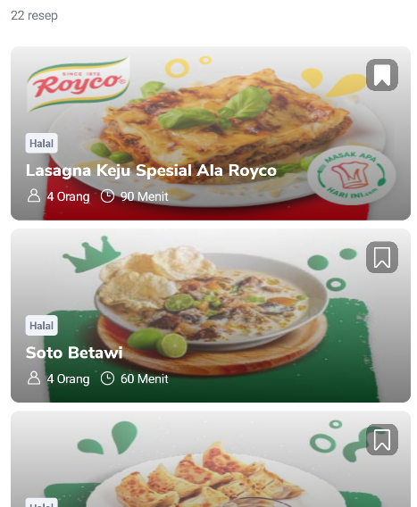

<!--left header table-->
| **Status** | <!--start status:GREEN-->RELEASE<!--end status--> |
| --- | --- |
| **Project Lead** | [Steven Fredian Andy Putra](https://tokopedia.atlassian.net/wiki/people/557058:20782bf2-2a29-413c-b75c-ce30c92cad9e?ref=confluence)  |
| **Product Manager** | [Ryan Mico](https://tokopedia.atlassian.net/wiki/people/5c6bedd8cff26405c30ad1b1?ref=confluence)[Jumadila Mustika](https://tokopedia.atlassian.net/wiki/people/61c037f6a54af90069a11858?ref=confluence) |
| **Team** | Minion Solo |
| **Module type** | <!--start status:YELLOW-->FEATURE<!--end status--> |
| **Product PRD** | <https://docs.google.com/document/d/1GEaMoWKUYtt27STrf54MoF_d8vTSVSLOYqDSpko6tos/edit?usp=sharing>  |
| **Figma** | <https://www.figma.com/file/U9jA9pNjgafD14Xx6Aioll/%5BUX-NOW!--Recipe%5D?node-id=1062%3A53202&t=Qv2QSQ1e4eNUKq5k-0>  |
| **Tracker** | Home: <https://mynakama.tokopedia.com/datatracker/product/requestdetail/view/3411> Search: <https://mynakama.tokopedia.com/datatracker/product/requestdetail/view/3407>  |
| **Location** | `features/tokopedianow/recipehome` | `features/tokopedianow/recipesearch` | `features/tokopedianow/recipelist` |

<!--toc-->

## **Description**

**Home and Search Page**

Recipe home page contains list of recipe and recipe filters. On the top of the page there’s search bar for searching recipes. When users click on one of the recipe, users will be redirected to recipe detail page.

In the home page, users can also add bookmark and remove bookmark for each recipe. The [recipe bookmark page](/wiki/spaces/PA/pages/2133557783/Recipe+Bookmark) can be accessed by clicking `book` icon on the top right of the page. 

Search page features are identical to home page. The difference is on GQL call when getting recipe list, in the home page there’s no keyword param passed to the query, while in search page require keyword param. 

Beside the GQL call, there’s also little bit UI difference, on search page there’s no background image on the header section (Image 1.2), this configuration controlled by `enableHeaderBackground` in its base class. 

The common features thats available on both pages provided on its base class which home and search page extends from it. Common features on home and search page are:

- Recipe list
- Recipe filter
- Add Recipe Bookmark
- Remove Recipe Bookmark

See more in [class diagram](https://tokopedia.atlassian.net/wiki/spaces/PA/pages/2157643621#Class-Diagram) and [features](https://tokopedia.atlassian.net/wiki/spaces/PA/pages/2157643621#Features) sections.

**Empty and Error State**

Recipe home and search page will show empty state when BE returns empty list of recipes from [TokonowGetRecipes](https://tokopedia.atlassian.net/wiki/spaces/TokoNow/pages/2033910971/Query+TokonowGetRecipes+GQL+FE) query. When user clicks on `Reset Filter` it will reset all applied filter and reload the recipe list. There’s also error state when home and search page failed to fetch [TokonowGetRecipes](https://tokopedia.atlassian.net/wiki/spaces/TokoNow/pages/2033910971/Query+TokonowGetRecipes+GQL+FE).

**Home & Search Applink**

| **Applink** | **Description** |
| --- | --- |
| `tokopedia://now/recipe` | Navigate to `TokoNowRecipeHomeActivity` |
| `tokopedia://now/recipe/search?queryString` | Navigate to `TokoNowRecipeSearchActivity`. Example query params: `tokopedia://now/recipe/search?title={search_keyword}`. See [TokonowGetRecipes GQL](https://tokopedia.atlassian.net/wiki/spaces/TokoNow/pages/2033910971/Query+TokonowGetRecipes+GQL+FE) for detailed contract. |

## **Class Diagram**

| **Properties** | **Description** | **Screenshot**                                                     |
| --- | --- |--------------------------------------------------------------------|
| enableHeaderBackground  | Enable background in the header section. Current value:- Home: `true` - Search: `false`  |                      |
| searchHintData | Set initial search hint on the searchbar. Current value:- Home: `Cari resep` - Search: `Cari resep`  |   |
| pageName | Used for tracking purpose. Current value:- Home: `TokoNow Recipe Home` - Search: `TokoNow Recipe Search`  |                                                                    |
| viewModel  | ViewModel used in the page (extend base class):- Home: `TokoNowRecipeHomeFragment` - Search: `TokoNowRecipeSearchFragment`  |                                                                    |
| sourcePage | sourcePage param to call [TokonowGetRecipes GQL](https://tokopedia.atlassian.net/wiki/spaces/TokoNow/pages/2033910971/Query+TokonowGetRecipes+GQL+FE). Current value:- Home: `Home` - Search: `Search`  |                                                                    |

## **Features**

| **Name** | **Screenshot**                                                            | **Link** | **Module** | **PIC** |
| --- |---------------------------------------------------------------------------| --- | --- | --- |
| Recipe List, Search, and Filter  |                 | [TokonowGetRecipes GQL](https://tokopedia.atlassian.net/wiki/spaces/TokoNow/pages/2033910971/Query+TokonowGetRecipes+GQL+FE) | `tokopedianow` | [Reza Gama Hidayat](https://tokopedia.atlassian.net/wiki/people/5def15952702bc0ec7e775c5?ref=confluence)  |
| Add Bookmark  |                | [TokonowAddRecipeBookmark GQL](https://tokopedia.atlassian.net/wiki/spaces/TokoNow/pages/1986497828/Mutation+TokonowAddRecipeBookmark+GQL) | `tokopedianow` | [Reza Gama Hidayat](https://tokopedia.atlassian.net/wiki/people/5def15952702bc0ec7e775c5?ref=confluence)  |
| Remove Bookmark |             | [TokonowRemoveRecipeBookmark GQL](https://tokopedia.atlassian.net/wiki/spaces/TokoNow/pages/1986498304/Mutation+TokonowRemoveRecipeBookmark+GQL) | `tokopedianow` | [Reza Gama Hidayat](https://tokopedia.atlassian.net/wiki/people/5def15952702bc0ec7e775c5?ref=confluence)  |
| Bookmark Page |   | [Documentation](/wiki/spaces/PA/pages/2133557783/Recipe+Bookmark) | `tokopedianow` | [Said Faisal](https://tokopedia.atlassian.net/wiki/people/5e25eee0ee264b0e745862c3?ref=confluence)  |
| Filter Bottomsheet |                 | Documentation  | `tokopedianow` | [Reza Gama Hidayat](https://tokopedia.atlassian.net/wiki/people/5def15952702bc0ec7e775c5?ref=confluence)  |

