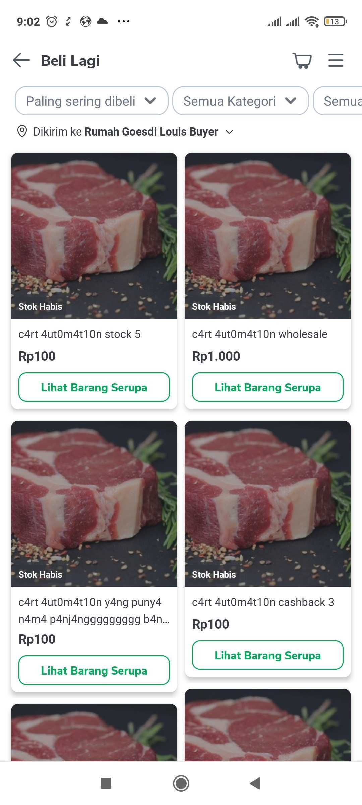
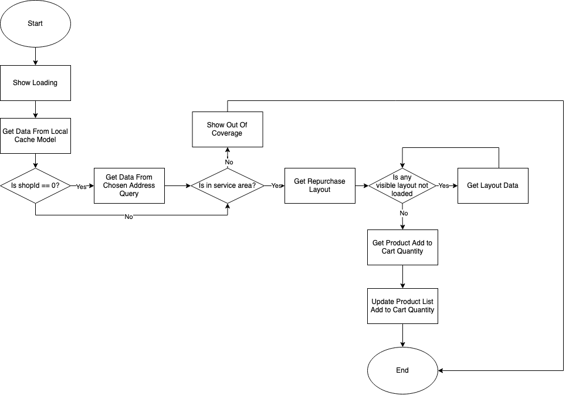
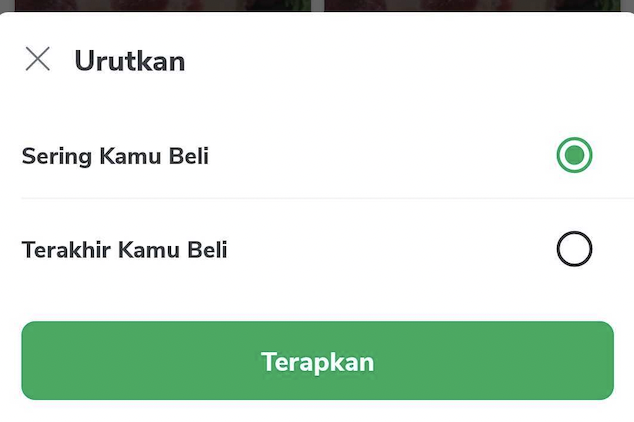
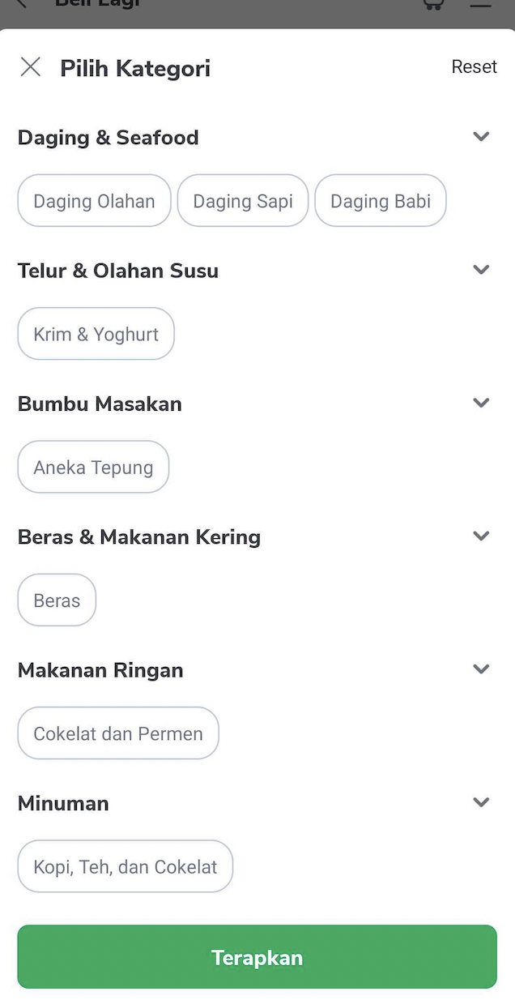
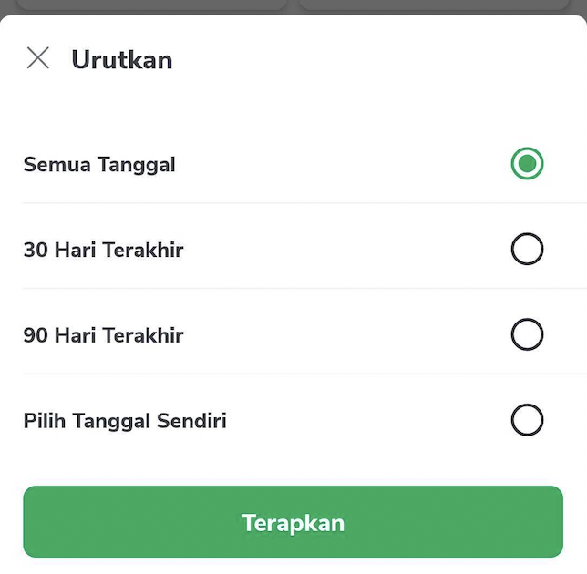
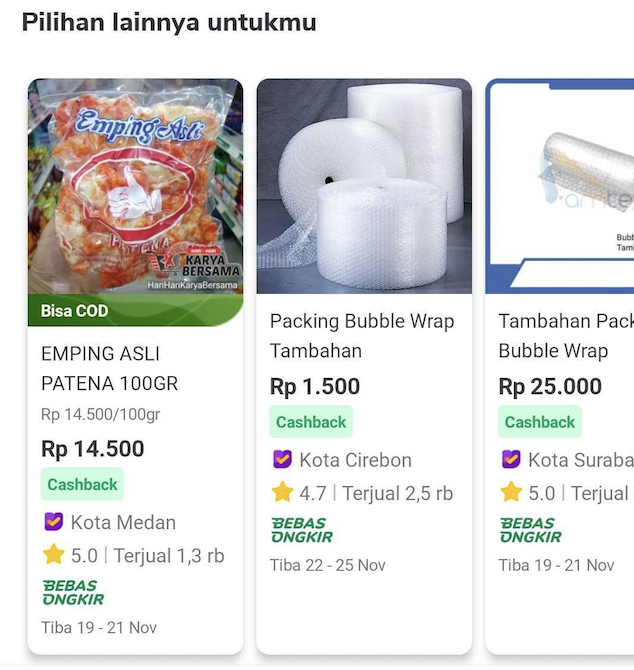
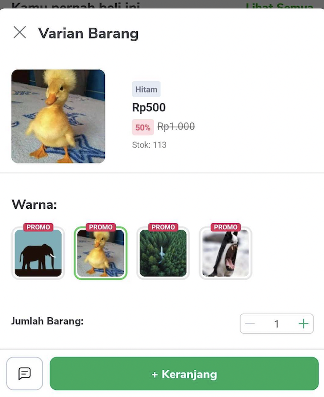

<!--left header table-->
| **Status** | <!--start status:GREEN-->RELEASE<!--end status--> |
| --- | --- |
| **Project Lead** | [Yogie Susdyastama Putra](https://tokopedia.atlassian.net/wiki/people/5c6bf2e6f1a05835f933bf30?ref=confluence) [Steven Fredian Andy Putra](https://tokopedia.atlassian.net/wiki/people/557058:20782bf2-2a29-413c-b75c-ce30c92cad9e?ref=confluence) <!--start status:BLUE-->CURRENT LEAD<!--end status--> |
| **Product Manager** | [Deo Nathaniel](https://tokopedia.atlassian.net/wiki/people/5c6be6f577edd55f716a2258?ref=confluence) [Joshua Edbert Tirtana](https://tokopedia.atlassian.net/wiki/people/60f7ac85f026ab007029a6bf?ref=confluence) [Ryan Mico](https://tokopedia.atlassian.net/wiki/people/5c6bedd8cff26405c30ad1b1?ref=confluence)[Jumadila Mustika](https://tokopedia.atlassian.net/wiki/people/61c037f6a54af90069a11858?ref=confluence) |
| **Team** | Minion Solo |
| **Module type** | <!--start status:YELLOW-->FEATURE<!--end status--> |
| **Product PRD** | Look at [Tokopedia NOW!](/wiki/spaces/PA/pages/1576539971) |
| **Figma** | Look at [Tokopedia NOW!](/wiki/spaces/PA/pages/1576539971) |
| **Tracker** | Look at [Tokopedia NOW!](/wiki/spaces/PA/pages/1576539971) |
| **Location** | `features/tokopedianow/repurchase` |

<!--toc-->

## **Description**

- When user land on Tokopedia NOW! repurchase page, first it will show loading state and get user address data (shopId & warehouseId) from `LocalCacheModel`.
- If choose address widget returns shopId == 0L, repurchase will get address data from `GetChosenAddressWarehouseLocUseCase`.
- Since Tokopedia NOW! only available in several areas in Indonesia, it will check whether user address is in service area or not based on user address data.
- If warehouseId == 0 means user is out of service coverage, else means user is in service area.
- When user is out of service coverage, Tokopedia NOW! repurchase will show out of coverage UI, and user will be given chance to change address.
- When user is in service area, `getLayoutList()` will be called. layout components are retrieved from [TokonowRepurchasePage](#) query.
- After the layout components list are retrieved, Tokopedia NOW! repurchase will load all layout components content data that only visible to user one by one, independently.

- If one of the layout fails to load data, it will be removed from repurchase.
- The layout components that are not visible to user will be loaded lazily as user scrolls to the bottom of repurchase page.
- After all layout components data finished to load, [mini cart query](https://tokopedia.atlassian.net/wiki/spaces/TTD/pages/1477936471/GraphQL+Mini+Cart) will be called to get add to cart quantity data, then each product add to cart quantity in product list will be updated with data from mini cart query.
- If product add to cart quantity > 0 (added to cart), the product card will show add to cart quantity editor.

## **Flow Diagram**

## **Features**

| **Name** | **Screenshot**                                                                                                                | **Link** | **Module** | **PIC** |
| --- |-------------------------------------------------------------------------------------------------------------------------------| --- | --- | --- |
| Navigation Toolbar |                                                                         | <https://tokopedia.atlassian.net/wiki/spaces/PA/pages/967945643/Navigation+Toolbar#Toolbar-title-setup> | `searchbar` | [Said Faisal](https://tokopedia.atlassian.net/wiki/people/5e25eee0ee264b0e745862c3?ref=confluence)  |
| Choose Address |                                                                             | [Choose Address Widget - Localized Experience](/wiki/spaces/PA/pages/1157243000/Choose+Address+Widget+-+Localized+Experience) | `locallizationchooseaddress` | [Said Faisal](https://tokopedia.atlassian.net/wiki/people/5e25eee0ee264b0e745862c3?ref=confluence)  |
| Filter Chips |                                                                               | [Repurchase Filter Chips](/wiki/spaces/PA/pages/1847197699/Repurchase+Filter+Chips)  | `tokopedianow` | [Reza Gama Hidayat](https://tokopedia.atlassian.net/wiki/people/5def15952702bc0ec7e775c5?ref=confluence)  |
| Sort Filter Bottom Sheet |                                                                           | [Tokopedia NOW! Sort Filter Bottom Sheet](/wiki/spaces/PA/pages/1847197730/Tokopedia+Now+Sort+Filter+Bottom+Sheet)  | `tokopedianow` | [Said Faisal](https://tokopedia.atlassian.net/wiki/people/5e25eee0ee264b0e745862c3?ref=confluence)  |
| Category FilterBottom Sheet |                                                                       | [Tokopedia NOW! Category Filter Bottom Sheet](/wiki/spaces/PA/pages/1846804596/Tokopedia+Now+Category+Filter+Bottom+Sheet)  | `tokopedianow` | [Reza Gama Hidayat](https://tokopedia.atlassian.net/wiki/people/5def15952702bc0ec7e775c5?ref=confluence)  |
| Date Filter Bottom Sheet |                                                                           | [Tokopedia NOW! Date Filter Bottom Sheet](/wiki/spaces/PA/pages/1847001205/Tokopedia+Now+Date+Filter+Bottom+Sheet)  | `tokopedianow` | [Said Faisal](https://tokopedia.atlassian.net/wiki/people/5e25eee0ee264b0e745862c3?ref=confluence)  |
| Repurchase Product |                                                                                    | [Repurchase Product](/wiki/spaces/PA/pages/1847132182/Repurchase+Product)  | `tokopedianow` | [Reza Gama Hidayat](https://tokopedia.atlassian.net/wiki/people/5def15952702bc0ec7e775c5?ref=confluence)  |
| Category Grid |                                                                              | [Tokopedia NOW! Category Grid](/wiki/spaces/PA/pages/1844544240/Tokopedia+Now+Category+Menu)  | `tokopedianow` | [Said Faisal](https://tokopedia.atlassian.net/wiki/people/5e25eee0ee264b0e745862c3?ref=confluence)  |
| Product Recommendation |    | [Tokopedia NOW! Product Recommendation](/wiki/spaces/PA/pages/1845954714/Tokopedia+Now+Product+Recommendation)  | `tokopedianow` | [Said Faisal](https://tokopedia.atlassian.net/wiki/people/5e25eee0ee264b0e745862c3?ref=confluence)  |
| Mini Cart |                                                                                   | [Tokopedia NOW! Mini Cart](/wiki/spaces/PA/pages/1843758861/Tokopedia+Now+Mini+Cart)  | `tokopedianow` | [Reza Gama Hidayat](https://tokopedia.atlassian.net/wiki/people/5def15952702bc0ec7e775c5?ref=confluence)  |
| No History State |                                                                           | [Repurchase No History State](/wiki/spaces/PA/pages/1845726531/Repurchase+No+History+State)  | `tokopedianow` | [Said Faisal](https://tokopedia.atlassian.net/wiki/people/5e25eee0ee264b0e745862c3?ref=confluence)  |
| No Result State |                                                                            | [Tokopedia NOW! No Result State](/wiki/spaces/PA/pages/1845692948/Tokopedia+Now+No+Result+State)  | `tokopedianow` | [Said Faisal](https://tokopedia.atlassian.net/wiki/people/5e25eee0ee264b0e745862c3?ref=confluence)  |
| Out of Coverage (OOC) State |                                                                                        | [Tokopedia NOW! Out of Coverage (OOC) State](/wiki/spaces/PA/pages/1845790121/Tokopedia+Now+Out+of+Coverage+%28OOC%29+State)  | `tokopedianow` | [Said Faisal](https://tokopedia.atlassian.net/wiki/people/5e25eee0ee264b0e745862c3?ref=confluence)  |
| Error State |                                                                                | [Tokopedia NOW! Error State](/wiki/spaces/PA/pages/1845724290/Tokopedia+Now+Error+State)  | `tokopedianow` | [Reza Gama Hidayat](https://tokopedia.atlassian.net/wiki/people/5def15952702bc0ec7e775c5?ref=confluence)  |
| Add to Cart Variant Bottom Sheet |                                                                                | [ATC Variant Bottom Sheet](/wiki/spaces/PA/pages/1522500791/ATC+Variant+Bottom+Sheet)  | `atc_variant``product_detail_common` | none |

