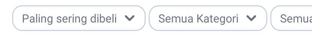

<!--left header table-->
| **Type Factory** | `RepurchaseTypeFactory` |
| --- | --- |
| **View Holder** | `RepurchaseSortFilterViewHolder` |
| **UI Model** | `RepurchaseSortFilterUiModel` |
| **Listener** | `SortFilterListener` |
| **FE** |  [Reza Gama Hidayat](https://tokopedia.atlassian.net/wiki/people/5def15952702bc0ec7e775c5?ref=confluence) [Yogie Susdyastama Putra](https://tokopedia.atlassian.net/wiki/people/5c6bf2e6f1a05835f933bf30?ref=confluence) |

## **Note**

- It’s only used on Tokopedia NOW! Repurchase page
- There are three filters on that widget those are Sort Filter, Category Filter and Date Filter

