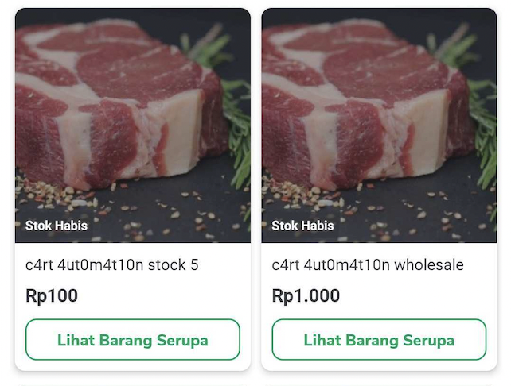

<!--left header table-->
| **Type Factory** | `RepurchaseTypeFactory` |
| --- | --- |
| **View Holder** | `RepurchaseProductViewHolder` |
| **UI Model** | `RepurchaseProductUiModel` |
| **Listener** | `RepurchaseProductCardListener` |
| **Use Case** | `GetRepurchaseProductListUseCase` |
| **GQL** | [GQL Repurchase Page API](/wiki/spaces/TokoNow/pages/1774913750/GQL+Repurchase+Page+API)  |
| **FE** |  [Reza Gama Hidayat](https://tokopedia.atlassian.net/wiki/people/5def15952702bc0ec7e775c5?ref=confluence) [Yogie Susdyastama Putra](https://tokopedia.atlassian.net/wiki/people/5c6bf2e6f1a05835f933bf30?ref=confluence) |
| **BE** | [Tommy Wijaya](https://tokopedia.atlassian.net/wiki/people/611c9137aee32f006f98f389?ref=confluence) [Rizky Andre Wibisono](https://tokopedia.atlassian.net/wiki/people/612c2a4f0f8ff40068adae28?ref=confluence)  |

## **Note**

- It’s only used on Tokopedia NOW! Repurchase page
- Need `GetRepurchaseProductListUseCase` to get all data product

