<!--left header table-->
| **Status** | <!--start status:GREEN-->RELEASE<!--end status--> |
| --- | --- |
| **Project Lead** | [Yogie Susdyastama Putra](https://tokopedia.atlassian.net/wiki/people/5c6bf2e6f1a05835f933bf30?ref=confluence) [Steven Fredian Andy Putra](https://tokopedia.atlassian.net/wiki/people/557058:20782bf2-2a29-413c-b75c-ce30c92cad9e?ref=confluence) <!--start status:BLUE-->CURRENT LEAD<!--end status-->  |
| **Product Manager** | [Deo Nathaniel](https://tokopedia.atlassian.net/wiki/people/5c6be6f577edd55f716a2258?ref=confluence) [Joshua Edbert Tirtana](https://tokopedia.atlassian.net/wiki/people/60f7ac85f026ab007029a6bf?ref=confluence) [Ryan Mico](https://tokopedia.atlassian.net/wiki/people/5c6bedd8cff26405c30ad1b1?ref=confluence)[Jumadila Mustika](https://tokopedia.atlassian.net/wiki/people/61c037f6a54af90069a11858?ref=confluence)  |
| **Team** | Minion Solo |
| **Module type** | <!--start status:YELLOW-->FEATURE<!--end status--> |
| **Product PRD** | Look at [Tokopedia NOW!](/wiki/spaces/PA/pages/1576539971)  |
| **Figma** | Look at [Tokopedia NOW!](/wiki/spaces/PA/pages/1576539971)  |
| **Tracker** | Look at [Tokopedia NOW!](/wiki/spaces/PA/pages/1576539971)  |
| **Module Location** | `features/tokopedianow/searchcategory` | `features/tokopedianow/search` | `features/tokopedianow/category` |

<!--toc-->

## **Overall Diagram**

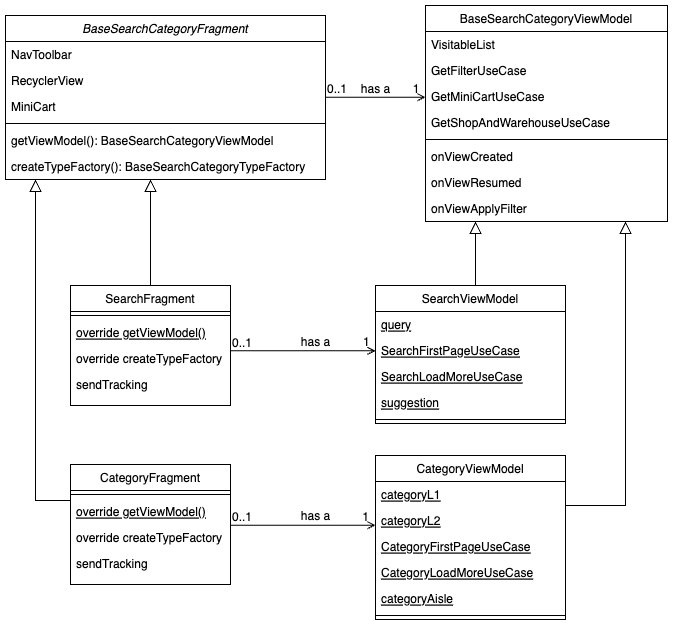

## **Description**

### Product List & Filter

Product list use GQL from search `ace_search_product_v4`. Filter also use GQL from search `filter_sort_product`. Tech docs from BE: [[Tech Doc] Search - TokoNOW](/wiki/spaces/SE/pages/1445855269) 

In short, the params should be like this:

|  | **Search** | **Category** |
| --- | --- | --- |
| **Product List** | `navsource=tokonow``source=tokonow``q=<keyword>` | `navsource=tokonow_directory``source=tokonow_directory``srp_page_id=<category_id_L1>` |
| **Category Chips Filter** | `navsource=category_tokonow``source=category_tokonow``q=<keyword>` | `navsource=category_tokonow_directory``source=category_tokonow_directory``srp_page_id=<category_id_L1>` |
| **Quick Filter** | `navsource=quick_filter_tokonow``source=quick_filter_tokonow``q=<keyword>` | `navsource=quick_filter_tokonow_directory``source=quick_filter_tokonow_directory``srp_page_id=<category_id_L1>` |
| **Big Filter / Advance Filter / Filter Bottomsheet** | `navsource=tokonow``source=tokonow``q=<keyword>` | `navsource=tokonow_directory``source=tokonow_directory``srp_page_id=<category_id_L1>` |

### Category Chips Filter

Front End (Android, iOS, and Lite) provide some hacks regarding category filter. Requirement from UX is that we do **NOT** count Category Chips Filter in the Filter Count, but if the category filter is applied from quick filter or filter bottomsheet, it will be counted. Screenshot example:

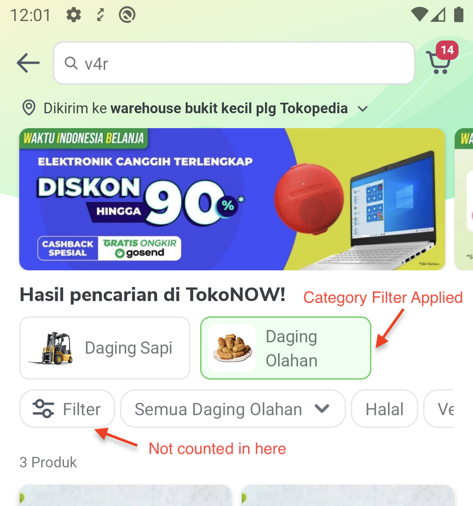

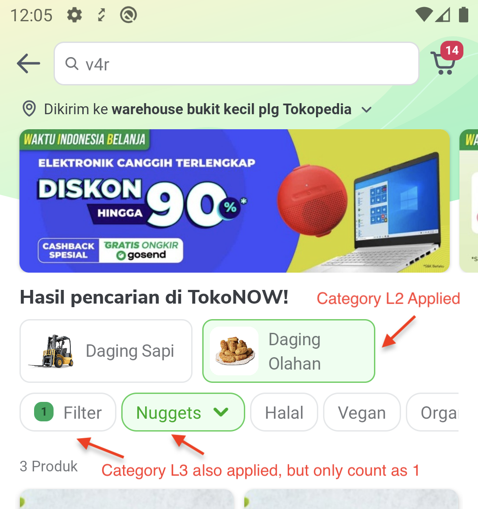

To achieve this, we modify the filter Option `key` from Backend by adding prefix `exclude_`. Backend will return category filter Option key as `sc`, and then we will modify it to become `exclude_sc`.

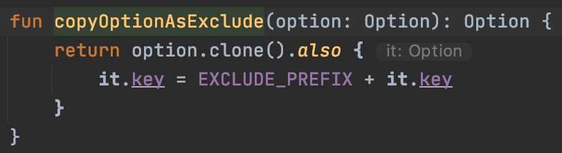

We also have to add prefix `exclude_` in Quick Filter Option, if the Quick Filter Option also exists as Category Chips Filter Option. In the **Screenshot 1** above, `Semua Daging Olahan` in Quick Filter has the modified key `exclude_sc` because it is the same Option as Category Chips filter `Daging Olahan`. 

All other Filter Options will leave it as it is without any modification.

`getSortFilterCount` function will not count key with `exclude_` as the filter count.

When sending the parameter to Backend, we will “revert” all the `exclude_` prefix in the Option key:

- If the parameter contains both exclude and non exclude: `exclude_sc=1234&sc=2345&q=samsung`, then we will send the params as `sc=2345&q=samsung`
- If the parameter only contains exclude: `exclude_sc=1234&q=samsung`, then we will send the params as `sc=1234&q=samsung`.
- If the parameter only contains non exclude: `sc=1234&q=samsung`, then we will send the params as `sc=1234&q=samsung`.

This way, all the params that we sent to Backend will **never** contains the `exclude_` prefix.

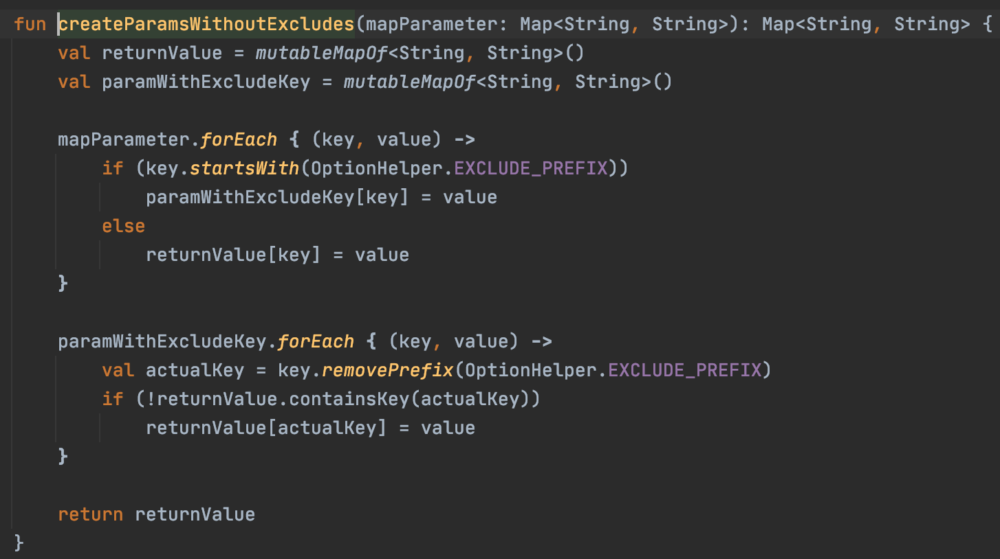

 

Do **NOT** discuss `exclude_` prefix hack with Backend team to avoid confusion. Backend should only receive the params without `exclude_` prefix.

### Category Page Applink

User can enter Category page L1 and L2 from Category Jumper / Category List bottom sheet. In Front End, Category L2 is only considered as an active filter, and can be unselected to show Category L1 product list.

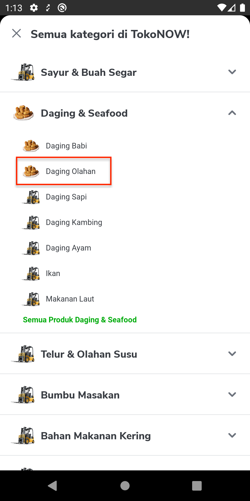

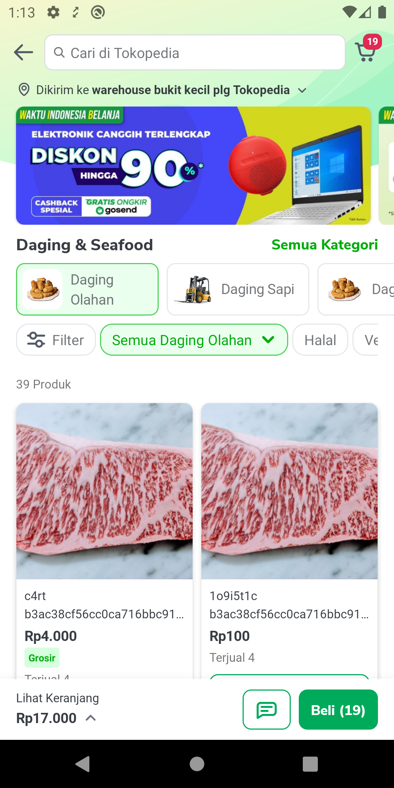

To achieve this, we require the applink to provide both Category L1 and Category L2 Id. So, for apps (iOS and Android), we have this applink for category page:

Category L1: `tokopedia://now/category/<category_id_L1>`

Category L2: `tokopedia://now/category/<category_id_L1>/<category_id_L2>`

Internally in Android, we convert the applink into internal applink and put the category id as query params in `DeeplinkMapperTokoNow.kt`.

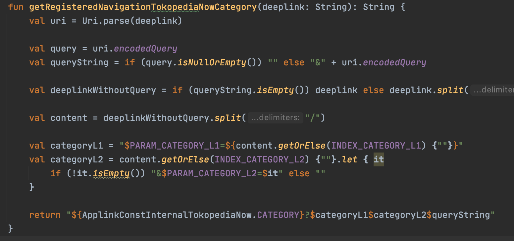

The end result is:

`tokopedia-android-internal://now/category?category_l1=<category_id_l1>&category_l2=<category_id_l2>`

`CategoryActivity.kt` will process this further by taking `category_l1` and `category_l2`, and remove it from the `queryParamMap`. `category_l1`, `category_l2`, and `queryParamMap`will be injected into `CategoryViewModel` from `CategoryParamModule.kt`.

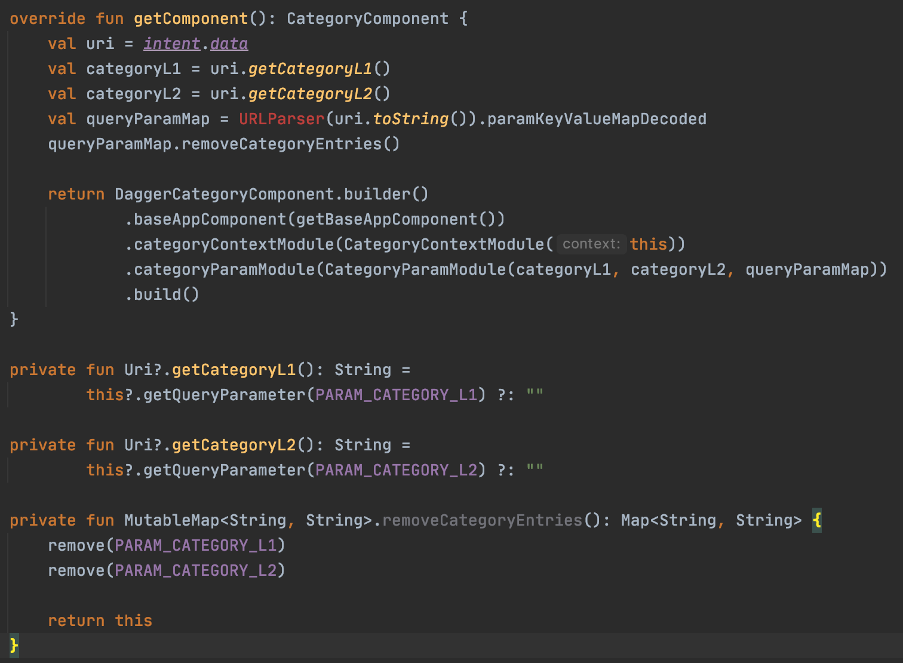

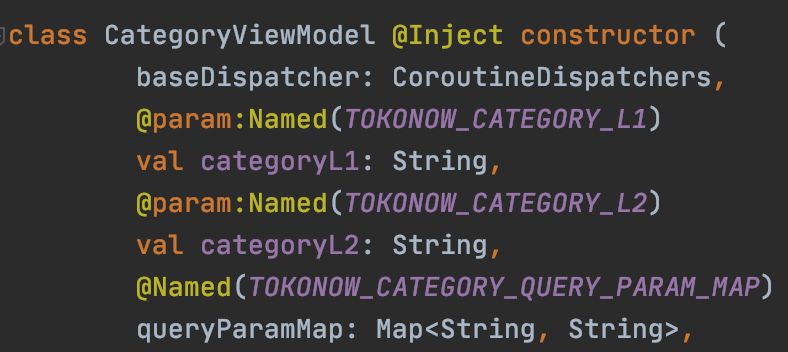

In the future, this `categoryL1` and `categoryL2` can also be used for slug, for example `tokopedia://now/category/daging-olahan/daging-sapi`. To achieve this, we first need to check if the `categoryL1` and `categoryL2` is `Int`. If it’s not `Int`, then it’s a slug, and we have to call GQL `TokonowCategoryDetail` [GQL Category Detail API](/wiki/spaces/TokoNow/pages/1456342232/GQL+Category+Detail+API) to get the categoryIds before we get the product list from `ace_search_product_v4`. 

## **Flow Diagram**

### Update Product Card Quantity based on Mini Cart Flow Diagram

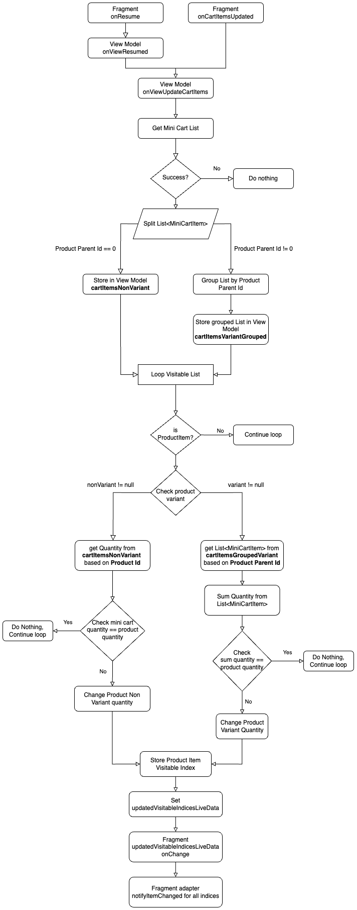

### Check Shop Id and Warehouse Id Flow Diagram

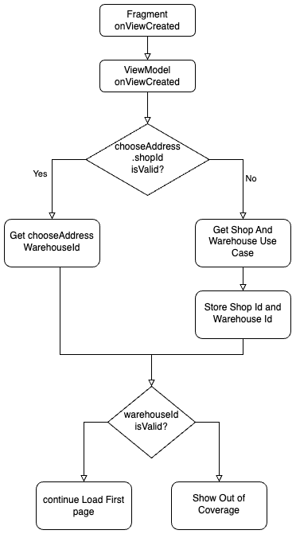

