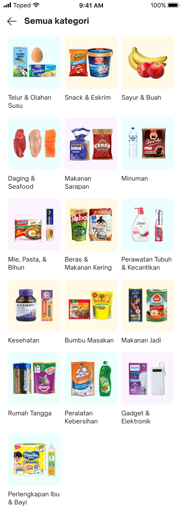

<!--left header table-->
| **Status** | <!--start status:GREEN-->RELEASE<!--end status--> |
| --- | --- |
| **Project Lead** | [Steven Fredian Andy Putra](https://tokopedia.atlassian.net/wiki/people/557058:20782bf2-2a29-413c-b75c-ce30c92cad9e?ref=confluence) |
| **Product Manager** | [Ryan Mico](https://tokopedia.atlassian.net/wiki/people/5c6bedd8cff26405c30ad1b1?ref=confluence) |
| **PIC** | [Said Faisal](https://tokopedia.atlassian.net/wiki/people/5e25eee0ee264b0e745862c3?ref=confluence) |
| **UI / UX Designer** | @Audrey Devina Adyasa |
| **Back-End** | [Tommy Wijaya](https://tokopedia.atlassian.net/wiki/people/611c9137aee32f006f98f389?ref=confluence) |
| **Team** | Minion Solo |
| **Module Type** | <!--start status:YELLOW-->FEATURE<!--end status--> |
| **Product PRD** | <https://docs.google.com/document/d/1ZqRlJWA-tzEi3PpS4TGjlVw4vpLo3UutrGUGsS8jSeU/edit> |
| **Figma** | <https://www.figma.com/file/2J1JyygmICEBa6ouiFhp9T/Category-Widget-%2B-See-All-Revamp?node-id=1106%3A93371&t=Wc6UlYoblwxazNkX-0> |
| **GQL Contract** | [GQL Category Tree API](/wiki/spaces/TokoNow/pages/1452802766/GQL+Category+Tree+API) |
| **Tracker** | <https://mynakama.tokopedia.com/datatracker/product/requestdetail/view/3700> |
| **Location** | `features/tokopedianow/seeallcategory` |
| **AppLink** | `tokopedia-android-internal://now/see-all-category?warehouse_id={warehouse_id}` |

<!--toc-->

## **Description**

A collection of category level 1 that appears in a page as a navigation menu for users.

## **How to Customize**

To customize everything related to Recipe Bookmark, you can see these classes :

- `TokoNowSeeAllCategoryFragment.kt`
- `SeeAllCategoryItemViewHolder.kt`
- `TokoNowSeeAllCategoryViewModel.kt`
