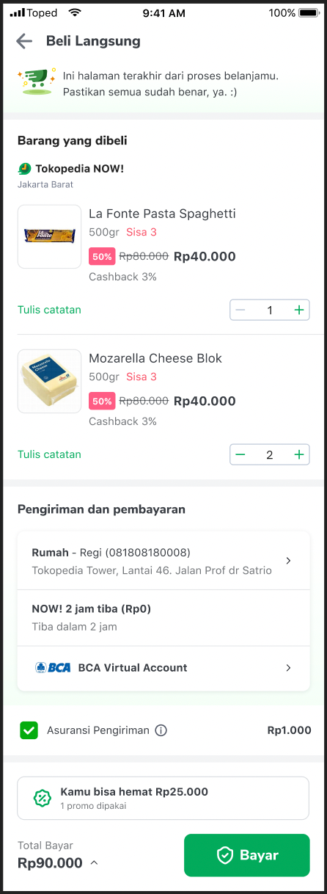
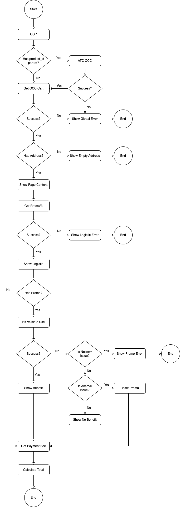
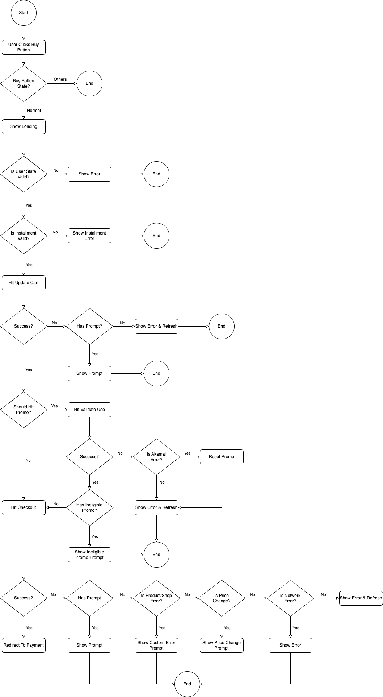

---
<!--left header table-->
| **Status**      | <!--start status:Green-->RELEASE<!--end status-->                                                                                                   |
|-----------------|-----------------------------------------------------------------------------------------------------------------------------------------------------|
| Product Manager | @Fauzan Ramadhanu @Nevin Jonaputra Liauw @Ayesha Brenda                                                                                             |
| Team            | [Minion Bob](https://tokopedia.atlassian.net/wiki/spaces/PA/pages/1225571771/Android+Minion+Bob)                                                    |
| Module type     | <!--start status:Yellow-->FEATURE<!--end status-->                                                                                                  |
| Module Location | <code>features/transaction/oneclickcheckout</code>                                                                                                  |
| Product PRD     | [PRD OCC Multi - Tokopedia Now](https://docs.google.com/document/d/1xgPIQkocPZoP0HATcvvbC4M8kgzkV1gVJvAU8vfhONQ/edit?pli=1#heading=h.1rxfwnt6h4rr)  |

<!--toc-->
## Release Notes
<!--start expand:17 Feb (MA-3.210)-->
[OCC - GoPayLater Cicil 0% Promo](https://tokopedia.atlassian.net/wiki/spaces/PA/pages/2146763827)
<!--end expand-->

<!--start expand:6 Feb (MA-3.208)-->
[OCC - Dynamic Platform Fee](https://tokopedia.atlassian.net/wiki/spaces/PA/pages/2109181348)
<!--end expand-->

<!--start expand:9 Jan (MA-3.204)-->
[Whitelabel Instan](https://tokopedia.atlassian.net/wiki/spaces/PA/pages/2104460915)
<!--end expand-->

<!--start expand:11 Nov (MA-3.201)-->
[OCC - Epharmacy](https://tokopedia.atlassian.net/wiki/spaces/PA/pages/2065990815)
<!--end expand-->

<!--start expand:3 Oct (MA-3.195)-->
[Bebas Ongkir Unstack | OSP](https://tokopedia.atlassian.net/wiki/spaces/PA/pages/2003501967/Bebas+Ongkir+Unstack#OSP)
<!--end expand-->

## Overview

One Click Checkout (OCC) aka Beli Langsung is a “quick buy” process for Marketplace products. Using OCC, user will be able to directly checkout without having to navigate through Cart page & Checkout page (aka normal buy process).

The purpose of OCC is to reduce the number of clicks and duration of the whole checkout process, by providing user with a single summary page before checking out the product, called Order Summary Page (OSP)

## Tech Stack
- Coroutines
- MVVM with Processor\
Since OSP has a lot of business logic against multiple business unit teams (Cart, Checkout, Logistic, Promo, Payment), we decided to use “processors” to simplify and separate the logic\
 
See this slide for more info: https://docs.google.com/presentation/d/11aVJHnpPx6s0PeX1soljPpzWT9lZkcF1Ueii_NI9RrY/edit?usp=sharing

## UI Components
- OrderSummaryPageActivity (OSP) → OCC Main Page
  - OrderSummaryPageFragment
    - OrderTickerCard
    - OrderOnboardingCard
    - OrderShopCard
    - OrderProductCard
    - UploadPrescriptionViewHolder
    - OrderPreferenceCard
    - OrderInsuranceCard
    - OrderPromoCard
    - OrderTotalPaymentCard
- AddressListBottomSheet → To change Address in OCC
- OrderPriceSummaryBottomSheet → Show Transaction Summary Info
- TransactionFeeInfoBottomSheet → Show Transaction/Payment Fee Info
- PurchaseProtectionInfoBottomSheet → Show WebView of Purchase Protection Info
- PaymentActivationWebViewBottomSheet → Show Wallet Activation WebView
- CreditCardInstallmentDetailBottomSheet → To change CC Installment in OCC & show T&C
- GoCicilInstallmentDetailBottomSheet → To change GoCicil Installment in OCC
- PaymentTopUpWebViewActivity → Show Wallet (OVO, GoPay) TopUp WebView
  - PaymentTopUpWebViewFragment
- CreditCardPickerActivity → To change CC in OCC
  - CreditCardPickerFragment
- PaymentListingActivity → To change Payment Method in OCC
  - PaymentListingFragment

## Flow Diagram
#### OSP First Load Flow

 

#### OSP Checkout Flow

 

## Navigation

#### How To
To navigate to OCC page/OSP, please do one of the following:
- **Add OCC product(s) to cart before moving to OSP (Recommended)**\
  App can use [AddToCartOccUseCase](https://tokopedia.atlassian.net/wiki/spaces/PA/pages/1428718668/ATC+Common#AddToCartOccUseCase) to add OCC product(s) to cart. If ATC succeed, then app can redirect to OSP via app link
- **Send productId(s) to OSP**\
  If using [AddToCartOccUseCase](https://tokopedia.atlassian.net/wiki/spaces/PA/pages/1428718668/ATC+Common#AddToCartOccUseCase) is not possible, then app can use product_id app link param, to trigger automatic ATC inside OSP. Currently only used from notification

#### External AppLink
`tokopedia://occ`\
`ApplinkConst.OCC`

#### Internal AppLink
`tokopedia-android-internal://marketplace/one-click-checkout`\
`ApplinkConstInternalMarketplace.ONE_CLICK_CHECKOUT`\
`ApplinkConstInternalMarketplace.ONE_CLICK_CHECKOUT_WITH_SPECIFIC_PAYMENT`: with params `gateway_code`, `tenure_type`, and `source`

#### AppLink Params
| **Param Key**  | **Mandatory** | **Mandatory**                       | **Note**                                                                                                                                                                                                                                                                                                                                                                                                                                    |
|----------------|---------------|-------------------------------------|---------------------------------------------------------------------------------------------------------------------------------------------------------------------------------------------------------------------------------------------------------------------------------------------------------------------------------------------------------------------------------------------------------------------------------------------|
| `product_id`   | NO            | `"123456"` `"123,124,125"`      | Optional param for automatic ATC*  *Automatic ATC is currently only used from notification, and is **not** the recommended flow, because it does not support custom analytics and custom error handlingInstead, it is **recommended** to use [AddToCartOccUseCase](https://tokopedia.atlassian.net/wiki/spaces/PA/pages/1428718668/ATC+Common#AddToCartOccUseCase) to do ATC on any page before routing to OCC applink when success |
| `gateway_code` | NO            | `"GOCICIL"`                         | Optional param for automatic select payment gateway  Currently only used by BNPL payment simulation page for GoCicil payment method                                                                                                                                                                                                                                                                                                |
| `tenure_type`  | NO            | `3`                                 | Optional param for automatic select payment tenure   Currently only used by BNPL payment simulation page for GoCicil payment method                                                                                                                                                                                                                                                                                                |
| `source`       | NO            | `pdp` `minicart` `fintech` | Optional param to differentiate source of origin  *Please contact developer if need to create a new source                                                                                                                                                                                                                                                                                                                        |

## Useful Links
- [PRD OCC Multi - Tokopedia Now](https://docs.google.com/document/d/1xgPIQkocPZoP0HATcvvbC4M8kgzkV1gVJvAU8vfhONQ/edit?pli=1#heading=h.1rxfwnt6h4rr)
- [Figma OCC Multi - Tokopedia Now](https://www.figma.com/file/BdMdmdfURvDmlHpx8r6pe8/UX%2FUI---Tokopedia-NOW!-%5BGrand-Launch---August%5D?node-id=1166%3A0)

### GQL List
#### GQL Docs

| **GQL Name**         | **Team**          | **Usage**                                             | **Link**                                                                                                       |
|----------------------|-------------------|-------------------------------------------------------|----------------------------------------------------------------------------------------------------------------|
| GetOCCMulti          | PP - Cart         | Get Cart Data                                         | [[GraphQL] Cart Page Multi](https://tokopedia.atlassian.net/wiki/spaces/TTD/pages/1602814548)                  |
| UpdateCartOCCMulti   | PP - Cart         | Update Cart Data                                      | [[GraphQL] Update Cart OCC Multi](https://tokopedia.atlassian.net/wiki/spaces/TTD/pages/1603142893)            |
| RatesV3              | Logistic          | Get Shipping Data                                     | [Rates V3](https://tokopedia.atlassian.net/wiki/spaces/LG/pages/567279712)                                     |
| OneClickCheckout     | PP - Checkout     | Checkout                                              | [[Mutation] One Click Checkout](https://tokopedia.atlassian.net/wiki/spaces/TTD/pages/724043954)               |
| ValidateUse          | Promo & PP - Cart | Apply Promo & Get Benefit                             | [[GraphQL] Promo Revamp Validate Promo Use](https://tokopedia.atlassian.net/wiki/spaces/TTD/pages/706323972)   |
| KeroAddressCorner    | Address           | Get Address List                                      | LogisticCommon Module                                                                                          |
| FetchInstantTopupUrl | Payment           | Get OVO TopUp URL                                     | [GQL Fetch Instant Top Up URL](https://tokopedia.atlassian.net/wiki/spaces/PY/pages/736134467)                 |
| GetListingParams     | Payment           | Get Payment Params For Loading WebView                | -                                                                                                              |
| CreditCardTenorList  | Payment           | Get Tenor List For CC & Debit Card                    | [Credit Card Tenor List API for Merchant Use](https://tokopedia.atlassian.net/wiki/spaces/PY/pages/1521485348) |
| GetInstallmentInfo   | Payment           | Get Installment Options For GoPayLater Cicil          | [Gopaylater Cicil - Installment Option](https://tokopedia.atlassian.net/wiki/spaces/PY/pages/1894089469)       |
| GetPaymentFee        | Payment           | Get Dynamic Payment Fee, especially for platform fee  | [GQL Get Payment Fee](https://tokopedia.atlassian.net/wiki/spaces/PY/pages/2106034126)                         |

#### API Docs
| **API Name**            | **Team**          | **Usage**                 | **Link**                                                                                                          |
|-------------------------|-------------------|---------------------------|-------------------------------------------------------------------------------------------------------------------|
| GetOCCMulti             | PP - Cart         | Get Cart Data             | [[External] Cart Page One Click Checkout Multi](https://tokopedia.atlassian.net/wiki/spaces/TTD/pages/1589971576) |
| UpdateCartOCCMulti      | PP - Cart         | Update Cart Data          | [[External] Update Cart OCC Multi](https://tokopedia.atlassian.net/wiki/spaces/TTD/pages/1602814277)              |
| RatesV3                 | Logistic          | Get Shipping Data         | [Rates V3](https://tokopedia.atlassian.net/wiki/spaces/LG/pages/567279712)                                        |
| OneClickCheckout        | PP - Checkout     | Checkout                  | [[Contract] 1Click Checkout API Documentation](https://tokopedia.atlassian.net/wiki/spaces/TTD/pages/699572176)   |
| ValidateUse             | Promo & PP - Cart | Apply Promo & Get Benefit | [[External] Promo Revamp Validate Promo Use](https://tokopedia.atlassian.net/wiki/spaces/TTD/pages/706323972)     |
| Payment Listing WebView | Payment           | Open Payment List Page    | [Open Gateway Settings Page](https://tokopedia.atlassian.net/wiki/spaces/PY/pages/699640342)                      |
| CC List WebView         | Payment           | Open CC List Page         | [Show Card List API](https://tokopedia.atlassian.net/wiki/spaces/PY/pages/861243905)                              |
| OVO Activation WebView  | Payment           | Open OVO Activation Page  | [Activation](https://tokopedia.atlassian.net/wiki/spaces/PY/pages/517442003)                                      |

### See Also
- [ATC Common](https://tokopedia.atlassian.net/wiki/spaces/PA/pages/1428718668) → To add product(s) to OCC
- [Cart-Checkout Localized Chosen Address Logic | OCC Page](https://tokopedia.atlassian.net/wiki/spaces/PA/pages/1858210131/Cart-Checkout+Localized+Chosen+Address+Logic#OCC-Page) → About Localized Address handling
- [Promo Checkout Marketplace](https://tokopedia.atlassian.net/wiki/spaces/PA/pages/1426100871) → About promo in marketplace
- [Checkout](https://tokopedia.atlassian.net/wiki/spaces/PA/pages/1426720585) → About regular checkout flow

### Tech Plans
- [OCC - BNPL](https://tokopedia.atlassian.net/wiki/spaces/PA/pages/1909556577)
- [Bebas Ongkir Unstack | OSP](https://tokopedia.atlassian.net/wiki/spaces/PA/pages/2003501967/Bebas+Ongkir+Unstack#OSP)
- [OCC - Epharmacy](https://tokopedia.atlassian.net/wiki/spaces/PA/pages/2065990815)
- [Whitelabel Instan](https://tokopedia.atlassian.net/wiki/spaces/PA/pages/2104460915)
- [OCC - Dynamic Platform Fee](https://tokopedia.atlassian.net/wiki/spaces/PA/pages/2109181348)
- [OCC - GoPayLater Cicil 0% Promo](https://tokopedia.atlassian.net/wiki/spaces/PA/pages/2146763827)

## FAQ