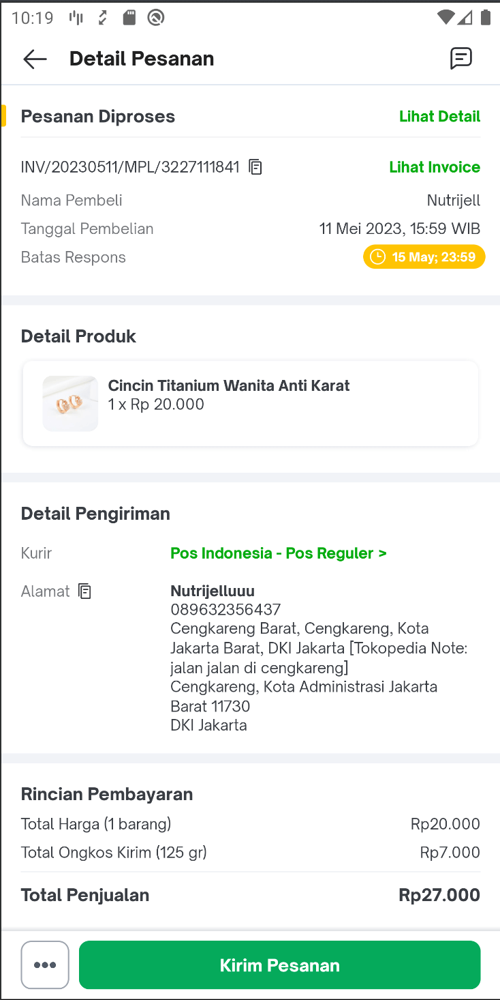
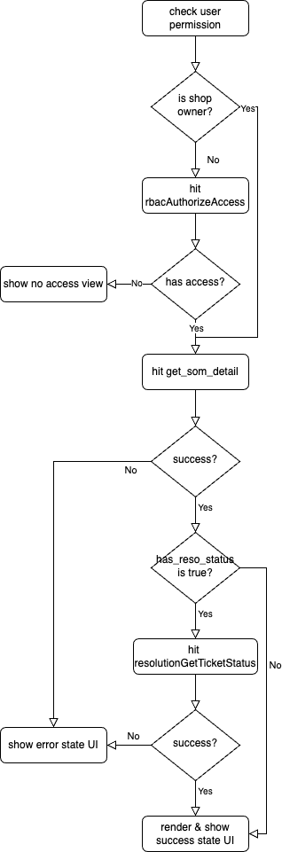
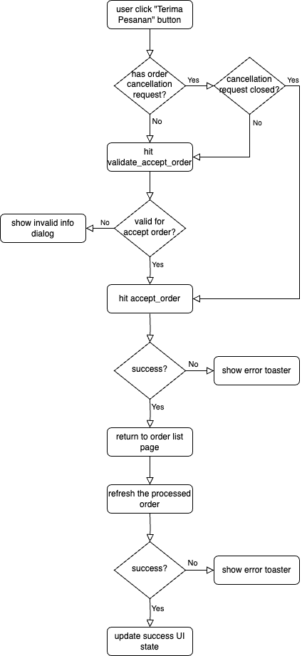
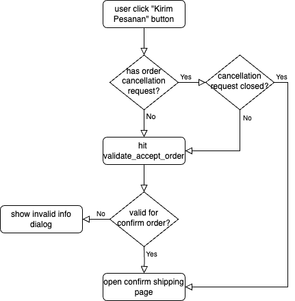
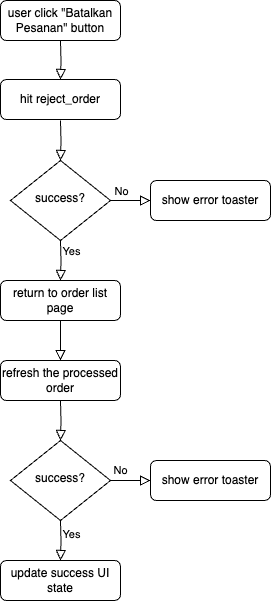
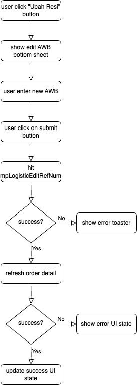
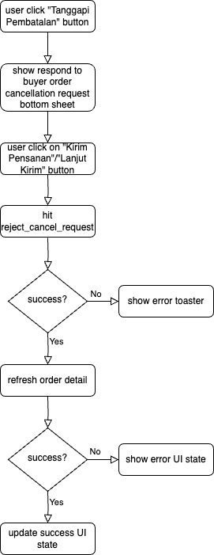

| **Status** | <!--start status:GREEN-->RELEASE<!--end status-->  |
| --- | --- |
| Contributors | [Edwin Nurwansyah](https://tokopedia.atlassian.net/wiki/people/622e71a875f257006a98bab9?ref=confluence) [Ilham .](https://tokopedia.atlassian.net/wiki/people/5de4d2148743750d00b7cc12?ref=confluence) [REIVIN OKTAVIANUS](https://tokopedia.atlassian.net/wiki/people/5dae89dab86cd40c2da5ad2f?ref=confluence) [Rizqi Aryansa](https://tokopedia.atlassian.net/wiki/people/5e25ee87006fae0ca232e1ac?ref=confluence) [Yehezkiel .](https://tokopedia.atlassian.net/wiki/people/5c94aa7a7792242c8613ad14?ref=confluence) [Yusuf Hendrawan](https://tokopedia.atlassian.net/wiki/people/5df336f3f4ab290ecfc64169?ref=confluence) |
| Product Manager | [Erik Novaldi Sampurno](https://tokopedia.atlassian.net/wiki/people/622e70525b6d710070a01bed?ref=confluence) [Priscilla Christie Suyanto](https://tokopedia.atlassian.net/wiki/people/60865011248ef6007359be97?ref=confluence)[Venessa Jeremia](https://tokopedia.atlassian.net/wiki/people/5ce4e9c983de300fe5d546d7?ref=confluence)  |
| Team | [Minion Stuart](https://tokopedia.atlassian.net/people/team/eeba862a-bd9d-472c-b901-415b15b1a37e?ref=directory&src=peopleMenu) |
| Release date | 16 Oct 2020 / <!--start status:GREY-->MA-3.98<!--end status--> <!--start status:GREY-->SA-2.28<!--end status--> |
| Module type |  <!--start status:YELLOW-->FEATURE<!--end status--> |
| Product PRD | [[SOM] Revamp SOM 2020](/wiki/spaces/SM/pages/879788143)  |
| Package Location | `com.tokopedia.sellerorder.detail` |
| Fragment Class | `SomDetailFragment` |

- [Overview](https://tokopedia.atlassian.net/wiki/spaces/PA/pages/2205232373/Order+Detail#%5BhardBreak%5DOverview)
- [Flow Diagram](https://tokopedia.atlassian.net/wiki/spaces/PA/pages/2222952085/Order+Detail#Flow-Diagram)
- [Navigation](https://tokopedia.atlassian.net/wiki/spaces/PA/pages/2222952085/Order+Detail#Navigation)
- [GQL](https://tokopedia.atlassian.net/wiki/spaces/PA/pages/2222952085/Order+Detail#GQL)
- [How To](https://tokopedia.atlassian.net/wiki/spaces/PA/pages/2222952085/Order+Detail#How-To)
- [Useful Links](https://tokopedia.atlassian.net/wiki/spaces/PA/pages/2222952085/Order+Detail#Useful-Links)

# Overview

The order detail page is a page that shows the detail of an order for the seller side. On this page, the seller can see the detail of an order they received and perform an action on the order like “Terima Pesanan”, or “Kirim Pesanan”. The list of actions that can be performed is controlled by the backend team and it depends on the order status.

# Flow Diagram

When we open the page, there are several things we need to do. The flow of the logic is described in the following diagram:

On this page, the seller can do several actions such as:

- Accept order: This action allows the seller to confirm/accept the buyer’s order. In this flow, the app will need to check whether the order has a buyer cancellation request that is not closed yet. This validation flow is required to cover this case:

	- The seller loaded the order detail
	- The order detail page shows the order detail that has no cancellation request from the buyer
	- The buyer sends an order cancellation request while the seller is reviewing the order detail
	- The seller performs the accept order action on that order

The complete flow of this action can be seen in the flowchart below.

- Confirm order (“Kirim Pesanan”): This action allows the seller to confirm the buyer’s order or send the buyer’s order. In this flow, the app will need to check whether the order has a buyer cancellation request that is not closed yet. This validation flow is required to cover this case:

	- The seller loaded the order detail
	- The order detail page shows the order detail that has no cancellation request from the buyer
	- The buyer sends an order cancellation request while the seller is reviewing the order detail
	- The seller performs the confirm order action on that order

The complete flow of this action can be seen in the flowchart below.

- Reject order: This action allows the seller to approve the buyer’s order cancellation request. The flow can be seen in the flowchart below.

- Edit AWB: This action allows the seller to edit the order AWB number. The flow can be seen in the flowchart below.

- Reject buyer’s order cancellation request: This action allows the reject buyer’s order cancellation request and continue to process the order. The flow can be seen in the flowchart below.

# Navigation

| External Applink  | - `tokopedia://seller/order/{order_id}/`  |
| --- | --- |
| Internal Applink | - `tokopedia-android-internal://seller/order?order_id={order_id}`  |

# GQL

There are 2 groups of queries on this page such as:

1. Queries for UI renders

	1. Query `get_som_detail`
	2. Query `resolutionGetTicketStatus`
	3. Query `som_reject_reason` (to get the list of order reject reason when the seller perform the reject order using the “Tolak Pesanan” button)
2. Queries for processing order

	1. Queries shared with the order list page:
	
		1. Mutation `accept_order`
		2. Mutation `reject_order`
		3. Mutation `mpLogisticEditRefNum`
		4. Mutation `reject_cancel_request`
		5. Query `validate_accept_order`
	2. Queries used exclusively on the order detail page:
	
		1. Mutation `set_delivered`

| **Query** | **Description** | **Documentation** |
| --- | --- | --- |
| `query get_som_detail`  | The query for getting the order detail data. The data will be used to render the order detail page minus the order resolution ticket status (if any). | [[Query] Seller Order Detail](/wiki/spaces/TTD/pages/487590828)  |
| `query resolutionGetTicketStatus`  | This query is for getting the order resolution ticket status (if any) and render it on the order detail section. **Note: We must only hit this query if** `has_reso_status` **from the** `get_som_detail` **query is** `true` | [Tech Plan - Integrate Resolution Status In Order Detail Page](/wiki/spaces/CS/pages/1983977492/Tech+Plan+-+Integrate+Resolution+Status+In+Order+Detail+Page)  |
| `query som_reject_reason`  | This query is used to get the list of reject reason that seller can choose when the seller is trying to reject the buyer order by clicking on the “Tolak Pesanan” button. The list later will be rendered inside a bottomsheet (`SomRejectReasonBottomSheet`). | [[Query] Reject Reason Order](/wiki/spaces/TTD/pages/575406563)  |
| `mutation accept_order` | This query is used to send the accept order (“Terima Pesanan” button) action. Before sending this query, the app need to validate the order first by sending the `validate_accept_order` query | [[Mutation] Button Accept Order Query List](/wiki/spaces/TTD/pages/473172371)  |
| `mutation reject_order` | This query is used to send the reject/cancel order action when the seller is responding to buyer order cancellation request | [[Mutation] Button Reject Order Query List](/wiki/spaces/TTD/pages/473272057)  |
| `mutation mpLogisticEditRefNum` | This query is used to send the change AWB/”Resi” action when the seller is clicking on “Ubah Resi” button | [[Internal/GQL][Shipping Action] Edit AWB](/wiki/spaces/LG/pages/558236750)  |
| `mutation reject_cancel_request` | This query is used to send the reject the buyer cancellation request (the seller decided to process the order instead of cancel it) | [[Mutation] Reject Cancel Request](/wiki/spaces/TTD/pages/907806141)  |
| `query validate_accept_order` | This query is used to check whether there’s a buyer cancellation request on that specific order before proceeding with the accept order action (“Terima Pesanan” button) | [[GQL] ValidateAcceptOrder](/wiki/spaces/TTD/pages/1418037994)  |
| `query set_delivered` | This query is used to send the finish order (“Selesaikan Pesanan” button) action. This will mark the order as finished or received by the buyer. | [[Mutation] Action Set Delivered GQL](/wiki/spaces/TTD/pages/483655764)  |

# How To

#### How to monitor page load time (PLT)

To check PLT performance we can use this trace name: `som_detail_trace` click [here](https://console.firebase.google.com/u/0/project/tkpd-tokopedia-2014/performance/app/android:com.tokopedia.tkpd/troubleshooting/trace/DURATION_TRACE/som_detail_trace/duration/duration)

# Useful Links

| Figma | <https://www.figma.com/file/2FtdGXsCvgy6ZatjhQZk60/UI-M--SOM-Revamp?node-id=183%3A7>  |
| --- | --- |
| Trackers | <https://docs.google.com/spreadsheets/d/1ZBKXBl05uBBUjWVXZLANknnnpYTlgyJb5DG5BrkYxBU/edit#gid=1959318975>  |

