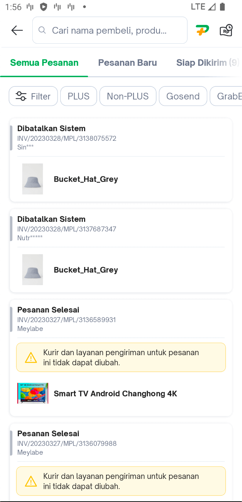
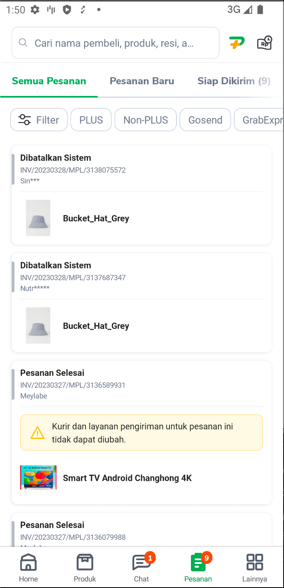
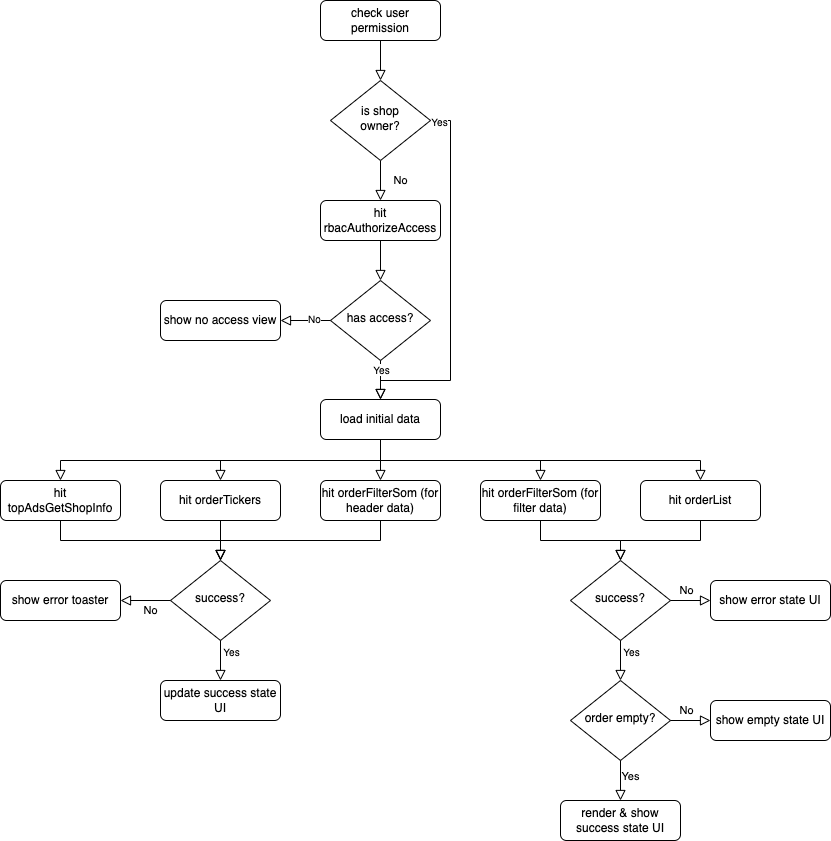
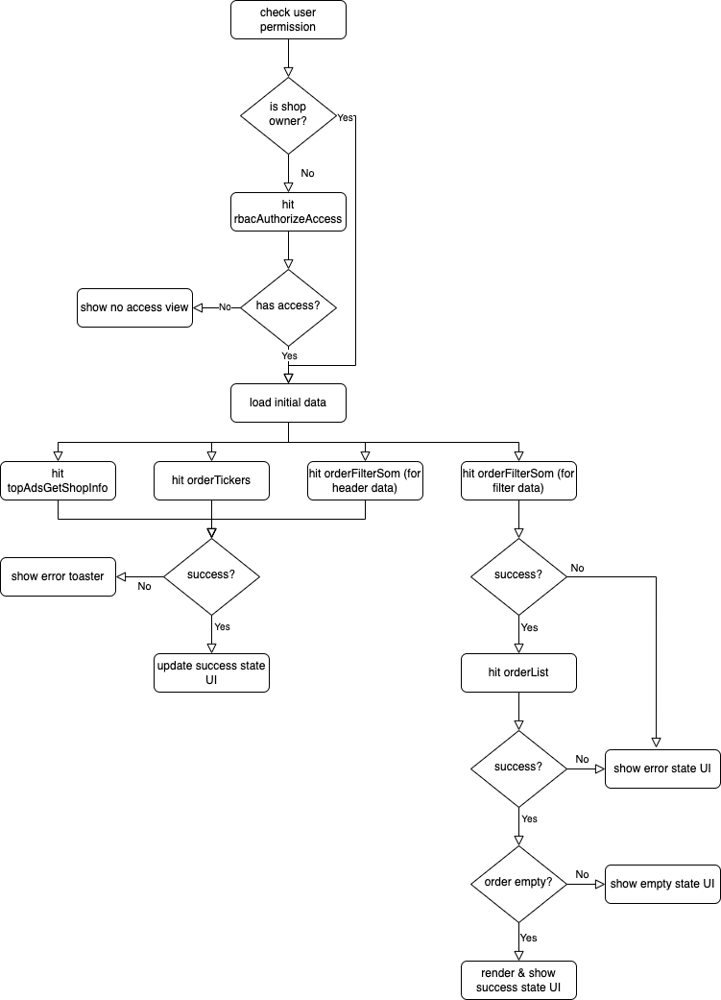
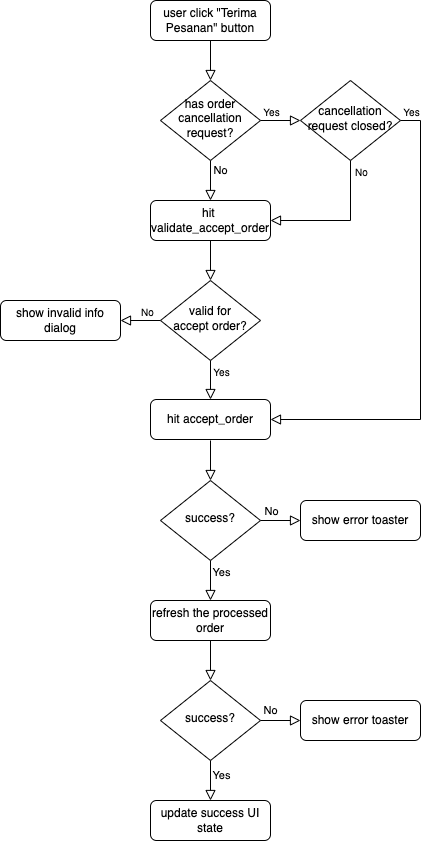
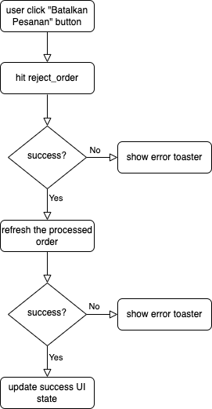
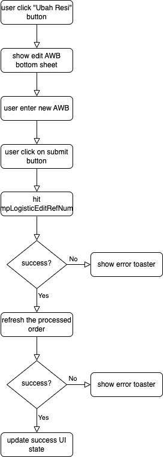
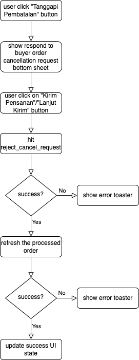

| **Status** | <!--start status:GREEN-->RELEASE<!--end status-->  |
| --- | --- |
| Contributors | [Edwin Nurwansyah](https://tokopedia.atlassian.net/wiki/people/622e71a875f257006a98bab9?ref=confluence) [Ilham .](https://tokopedia.atlassian.net/wiki/people/5de4d2148743750d00b7cc12?ref=confluence) [REIVIN OKTAVIANUS](https://tokopedia.atlassian.net/wiki/people/5dae89dab86cd40c2da5ad2f?ref=confluence) [Rizqi Aryansa](https://tokopedia.atlassian.net/wiki/people/5e25ee87006fae0ca232e1ac?ref=confluence) [Yehezkiel .](https://tokopedia.atlassian.net/wiki/people/5c94aa7a7792242c8613ad14?ref=confluence) [Yusuf Hendrawan](https://tokopedia.atlassian.net/wiki/people/5df336f3f4ab290ecfc64169?ref=confluence) |
| Product Manager | [Erik Novaldi Sampurno](https://tokopedia.atlassian.net/wiki/people/622e70525b6d710070a01bed?ref=confluence) [Priscilla Christie Suyanto](https://tokopedia.atlassian.net/wiki/people/60865011248ef6007359be97?ref=confluence)[Venessa Jeremia](https://tokopedia.atlassian.net/wiki/people/5ce4e9c983de300fe5d546d7?ref=confluence)  |
| Team | [Minion Stuart](https://tokopedia.atlassian.net/people/team/eeba862a-bd9d-472c-b901-415b15b1a37e?ref=directory&src=peopleMenu) |
| Release date | 16 Oct 2020 / <!--start status:GREY-->MA-3.98<!--end status--> <!--start status:GREY-->SA-2.28<!--end status--> |
| Module type |  <!--start status:YELLOW-->FEATURE<!--end status--> |
| Product PRD | [[SOM] Revamp SOM 2020](/wiki/spaces/SM/pages/879788143)  |
| Package Location | `com.tokopedia.sellerorder.list` |
| Fragment Class | `SomListFragment` |

- [Overview](https://tokopedia.atlassian.net/wiki/spaces/PA/pages/2205232373/Order+List#Overview)
- [Flowchart](https://tokopedia.atlassian.net/wiki/spaces/PA/pages/2205232373/Order+List#Flowchart)
- [Seller Actions](https://tokopedia.atlassian.net/wiki/spaces/PA/pages/2205232373/Order+List#Seller-Actions)
- [Navigation](https://tokopedia.atlassian.net/wiki/spaces/PA/pages/2205232373/Order+List#Navigation)
- [GQL](https://tokopedia.atlassian.net/wiki/spaces/PA/pages/2205232373/Order+List#GQL)
- [How To’s](https://tokopedia.atlassian.net/wiki/spaces/PA/pages/2205232373/Order+List#How-To%E2%80%99s)
- [Useful Links](https://tokopedia.atlassian.net/wiki/spaces/PA/pages/2205232373/Order+List#Useful-Links)

# Overview

The order list page is a page that shows the list of orders. On this page, the seller can see the preview of each order, and perform an action on each order like “Terima Pesanan”, or “Kirim Pesanan”. On this page, there’s also a quick filter that can be used to quickly filter the order list based on the order status and order type like “Sameday Delivery”, or “PLUS”. This page also has an exclusive feature that is only available on the SellerApp which is:

- Bulk accept orders: A feature that allows the seller to accept multiple orders at once
- Bulk request pick-up: A feature that allows the seller to send request pick-up for multiple orders at once
- Bulk print AWB/label: A feature that allows the seller to print multiple orders AWB at once

# Flowchart

There are 2 flows used on the order list page:

- The flow when the user enters the page with no order status filter (using `tokopedia://seller/history?search={searchParam}` app link). This flow is used in this case because when we enter the order list page with no order status filter, the app doesn’t need to send order filter ids when sending the `orderList` query therefore we don’t need to wait for the get the filter data request to be completed.

- The flow when the user enters the page with the order status filter. This flow is used in this case because when we enter the order list page with any order status filter, the app need to send order filter ids belonging to that order status when sending the `orderList` query therefore we need to wait for the get the filter data request to be completed.

# Seller Actions

On this page, the seller can do several actions such as:

- Accept order: This action allows the seller to confirm/accept the buyer’s order. In this flow, the app will need to check whether the order has a buyer cancellation request that is not closed yet. This validation flow is required to cover this case:

	- The seller load the order list
	- The order list page shows order A that have no cancellation request from the buyer
	- Buyer sends an order cancellation request
	- Seller performs the accept order action on order A

The complete flow of this action can be seen in the flowchart below.

- Reject order: This action allows the seller to approve the buyer’s order cancellation request. The flow can be seen in the flowchart below.

- Edit AWB: This action allows the seller to edit the order AWB number. The flow can be seen in the flowchart below.

- Reject buyer’s order cancellation request: This action allows the reject buyer’s order cancellation request and continue to process the order. The flow can be seen in the flowchart below.

# Navigation

| External Applink  | - `tokopedia://seller/history?search={searchParam}` - `tokopedia://seller/new-order` - `tokopedia://seller/ready-to-ship` - `tokopedia://seller/shipped` - `tokopedia://seller/cancelled` - `tokopedia://seller/cancellationrequest` - `tokopedia://seller/waitingpickup` - `tokopedia://seller/awbinvalid` - `tokopedia://seller/awbchange` - `tokopedia://seller/retur` - `tokopedia://seller/complaint` - `tokopedia://seller/finished`  |
| --- | --- |
| Internal Applink on CustomerApp | - `tokopedia-android-internal://seller/history` - `tokopedia-android-internal://seller/new-order` - `tokopedia-android-internal://seller/ready-to-ship` - `tokopedia-android-internal://seller/shipped` - `tokopedia-android-internal://seller/delivered` - `tokopedia-android-internal://seller/cancelled` - `tokopedia-android-internal://seller/cancellationrequest` - `tokopedia-android-internal://seller/waiting-pickup` - `tokopedia-android-internal://seller/waiting-awb` - `tokopedia-android-internal://seller/retur` - `tokopedia-android-internal://seller/complaint` - `tokopedia-android-internal://seller/finished` - `tokopedia-android-internal://seller/awb-invalid` - `tokopedia-android-internal://seller/awb-change`  |
| Internal Applink on SellerApp | - `tokopedia-android-internal://sellerapp/sellerhome-som-neworder` - `tokopedia-android-internal://sellerapp/sellerhome-som-readytoship` - `tokopedia-android-internal://sellerapp/sellerhome-som-inshipping` - `tokopedia-android-internal://sellerapp/sellerhome-som-done` - `tokopedia-android-internal://sellerapp/sellerhome-som-cancelled` - `tokopedia-android-internal://sellerapp/sellerhome-som-cancellation-request`  |

# GQL

There’s 2 group of query in this page such as:

1. Queries for UI renders

	1. Query `orderList`
	2. Query `orderFilterSom`
	3. Query `orderTickers`
	4. Query `topAdsGetShopInfo`
2. Queries for processing order

	1. Mutation `multi_accept_order`
	2. Query `get_multi_accept_order_status`
	3. Mutation `mpLogisticBulkRequestPickup`
	4. Mutation `mpLogisticMultiShippingStatus`
	5. Several queries that are shared with the order detail page such as:
	
		1. Mutation `accept_order`
		2. Mutation `reject_order`
		3. Mutation `mpLogisticEditRefNum`
		4. Mutation `reject_cancel_request`
		5. Query `validate_accept_order`

| **Query** | **Description** | **Documentation** |
| --- | --- | --- |
| `query orderList`  | The query for getting the order list data. The data will be used to bind the order list section:  | [[Query] Seller Order List](/wiki/spaces/TTD/pages/487754656)  |
| `query orderFilterSom`  | The query is used for getting 2 type of data:- For getting the filter data. The data will be used to bind the quick filter order on this section:   - For getting data which will be used on the header section (the PLUS logo URL & to show the red dot on the waiting for payment menu icon)    | [[Query] Seller Order Filter Single](/wiki/spaces/TTD/pages/532906293)  |
| `query orderTickers`  | The query for getting the list of tickers to be shown under the quick filter section | [Ticker List](/wiki/spaces/TTD/pages/533430360/Ticker+List)  |
| `query topAdsGetShopInfo` | The query for checking whether the seller is TopAds user or not so that we can show entry point to TopAds page when the order list is empty |  |
| `mutation multi_accept_order` | This query is used to send the bulk accept order action which only available in SellerApp | [[Mutation] Action Multi Accept Order GQL](/wiki/spaces/TTD/pages/569573409)  |
| `query get_multi_accept_order_status` | This query is used after the `multi_accept_order` query to check for the bulk accept order progress. The app need to hit this query once every second until the query return a response indicating that the bulk accepts order is complete | [[Query] Get Multi Accept Order Status](/wiki/spaces/TTD/pages/569475108)  |
| `mutation mpLogisticBulkRequestPickup` | This query is used to send the bulk request pickup order action which is only available in SellerApp | [[Internal/GQL][Shipping Action] Bulk Request Pickup Action](/wiki/spaces/LG/pages/1226156903)  |
| `mutation mpLogisticMultiShippingStatus` | This query is used after the `mpLogisticBulkRequestPickup` query to check for the bulk request pickup order progress. The app need to hit this query once every second until the query return a response indicating that the bulk request pickup order is complete | [[Internal/GQL][Shipping Action] Get Multi Shipping Status](/wiki/spaces/LG/pages/590644049)  |
| `mutation accept_order` | This query is used to send the accept order (“Terima Pesanan” button) action. Before sending this query, the app need to validate the order first by sending the `validate_accept_order` query | [[Mutation] Button Accept Order Query List](/wiki/spaces/TTD/pages/473172371)  |
| `mutation reject_order` | This query is used to send the reject/cancel order action when the seller is responding to buyer order cancellation request | [[Mutation] Button Reject Order Query List](/wiki/spaces/TTD/pages/473272057)  |
| `mutation mpLogisticEditRefNum` | This query is used to send the change AWB/”Resi” action when the seller is clicking on “Ubah Resi” button | [[Internal/GQL][Shipping Action] Edit AWB](/wiki/spaces/LG/pages/558236750)  |
| `mutation reject_cancel_request` | This query is used to send the reject the buyer cancellation request (the seller decided to process the order instead of cancel it) | [[Mutation] Reject Cancel Request](/wiki/spaces/TTD/pages/907806141)  |
| `query validate_accept_order` | This query is used to check whether there’s a buyer cancellation request on that specific order before proceeding with the accept order action (“Terima Pesanan” button) | [[GQL] ValidateAcceptOrder](/wiki/spaces/TTD/pages/1418037994)  |

# How To’s

#### How to monitor page load time (PLT)

To check PLT performance we can use this trace name: `som_list_trace` click [here](https://console.firebase.google.com/u/0/project/tkpd-tokopedia-2014/performance/app/android:com.tokopedia.tkpd/troubleshooting/trace/DURATION_TRACE/som_list_trace/duration/duration)

# Useful Links

| Figma | <https://www.figma.com/file/2FtdGXsCvgy6ZatjhQZk60/UI-M--SOM-Revamp?node-id=183%3A7>  |
| --- | --- |
| Trackers | <https://docs.google.com/spreadsheets/d/1ZBKXBl05uBBUjWVXZLANknnnpYTlgyJb5DG5BrkYxBU/edit#gid=1959318975>  |

