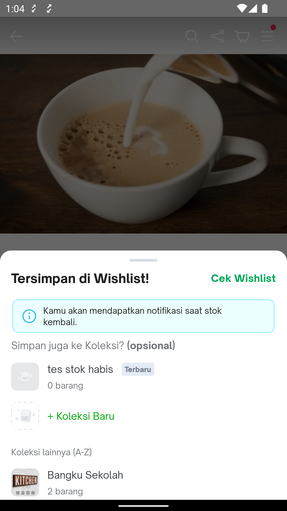
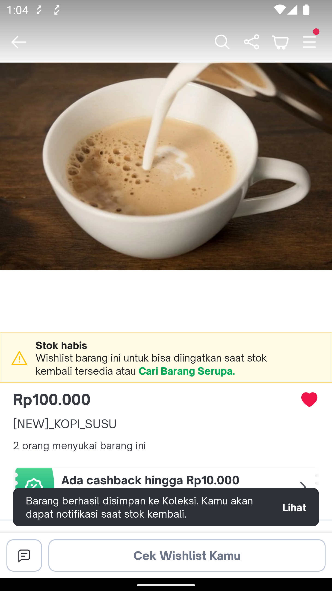
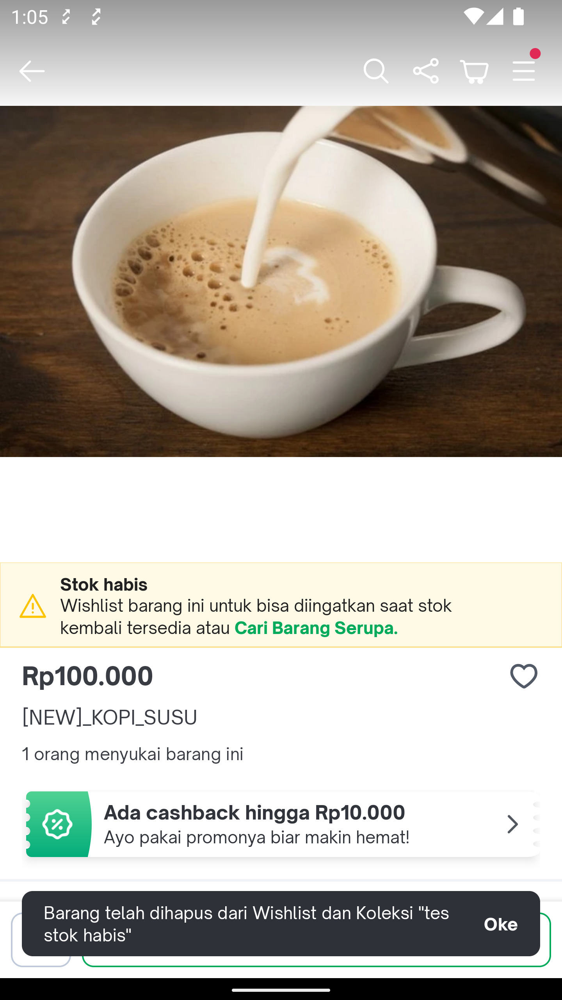

---
labels:
- add_to_wishlist
- Wishlist
---
<!--left header table-->
| **Status** | <!--start status:Green-->RELEASE<!--end status-->    |
| --- |------------------------------------------------------|
| Team | Minion Bob                                           |
| Module type | <!--start status:Yellow-->FEATURE<!--end status-->   |
| Release date | -                                                    |
| Product Manager | @Ayesha Brenda                                       |
| Contributors | @Felicia Widjaja                                     |
| Module Location | features/transaction/wishlist |
| Product PRD | -                                                    |

<!--toc-->
## Release Notes

## Overview

### Background
There are many modules need add & remove wishlist item with same handling afterwards, so it needs to be centralized in 1 common module

### Project Description
Wishlist Common Module is a module which provide common use case for every add/remove wishlist item action

## Navigation

For now, this bottomsheet is only show from PDP page, and the rest will use toaster below

This is the toaster that will be show after add to wishlist is success

This is the toaster that will be show after remove from wishlist is success

## How To

### Use Add/Remove Wishlist UseCase Common
- add dependency to the build.gradle file : implementation projectOrAar(rootProject.ext.features.wishlistCommonV2)
- add AddToWishlistV2UseCase and implementation WishlistV2ActionListener : onSuccessAddWishlist & onErrorAddWishList
- add DeleteWishlistV2UseCase and implementation WishlistV2ActionListener : onSuccessRemoveWishlist & onErrorRemoveWishlist

### Use Add to Wishlist Collection Bottomsheet
You can use internal applink tokopedia-android-internal://transaction/wishlist-collection-bottomsheet?productId={wishlistItem.id}

## Useful Links
- [Add Wishlist](https://tokopedia.atlassian.net/wiki/spaces/TTD/pages/1852151288/Add+Wishlist)
- [Delete Wishlist](https://tokopedia.atlassian.net/wiki/spaces/TTD/pages/1852151339/Delete+Wishlist)