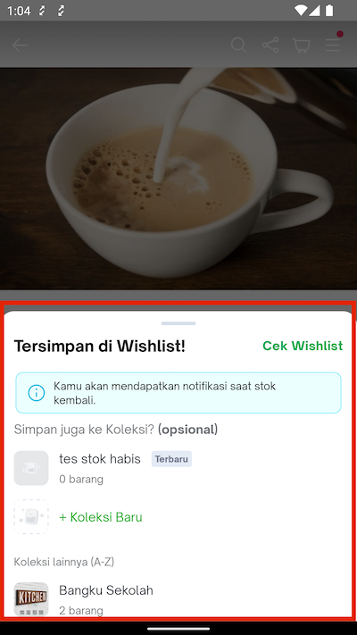
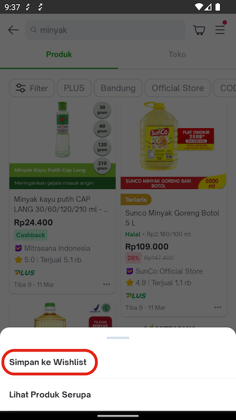
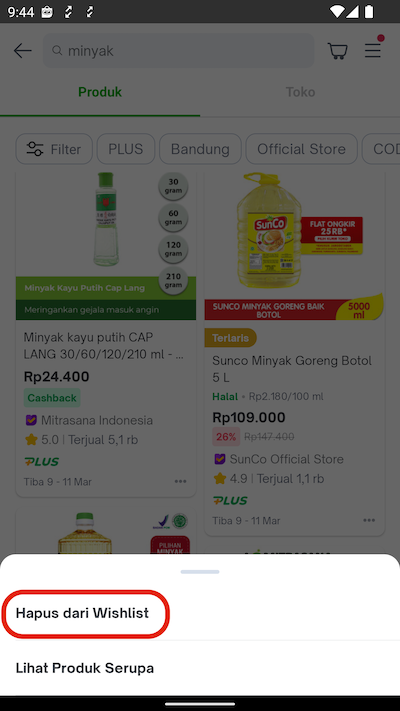
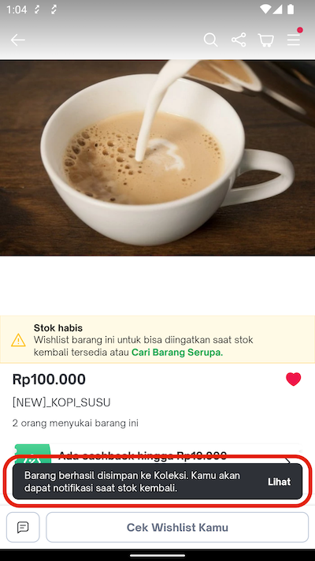
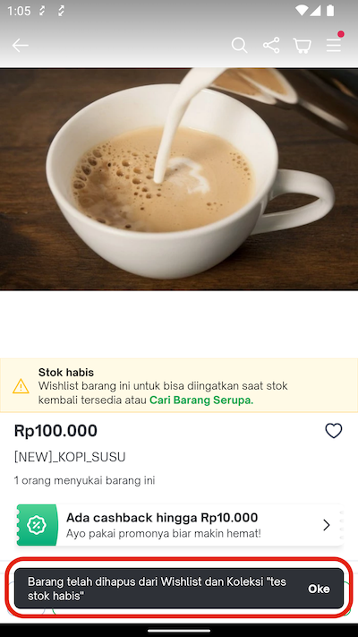

<!--left header table-->
| **Status** | <!--start status:GREEN-->RELEASE<!--end status--> |
| --- | --- |
| Team | [Minion Bob](https://tokopedia.atlassian.net/people/team/2373d8a6-1afc-4f2a-aa7a-63855c273051) |
| Module type | <!--start status:YELLOW-->FEATURE<!--end status--> |
| Release date | `June 17, 2022` / <!--start status:GREY-->MA-3.179<!--end status--> |
| Product Manager | @Ayesha Brenda |
| Contributors | @Felicia Widjaja |
| Module Location | `features/transaction/wishlist_common` |
| Product PRD | - |

<!--toc-->

## **Release Notes**

<!--start expand:17 June 2022 (MA.3.179)-->
Add new wishlistcommon module and validate max quantity of wishlist items<https://github.com/tokopedia/android-tokopedia-core/pull/25649>
<!--end expand-->

## **Overview**

### Background

There are many modules need add & remove wishlist item with same handling afterwards, so it needs to be centralized in 1 common module

### Project Description

Wishlist Common Module is a module which provide common use case for every add/remove wishlist item action

## **Navigation**

There are some different UI entry points/usage of this wishlist common module, for example :

- on PDP, when icon heart is click, then this common module will be called   
  Note: for current implementation, bottomsheet wishlist collection will be shown if user add to wishlist from PDP page

*For now, this bottomsheet is only show from PDP page when add, and the rest will use toaster below*

- on Search Product Page, when three dots menu is clicked, then this bottomsheet will be show, and choose ***Simpan ke Wishlist***

If item is not on wishlist, the menu will show **“Simpan ke Wishlist”**

If item is already on wishlist, the menu will show **“Hapus dari Wishlist”**

*This is the toaster that will be show after **add to wishlist** is **success***

*This is the toaster that will be show after **remove from wishlist** is **success***

Current implementation :

| **Module** | **Using New Add/Remove Wishlist**  | **Using New Bottomsheet Wishlist Collection** |
| --- | --- | --- |
| `category/catalog` | ✅ |  |
| `category/find_native` | ✅ |  |
| `communication/notifcenter` | ✅ |  |
| `communication/orderhistory` | ✅ |  |
| `content/feed` | ✅ |  |
| `content/kol` | ✅ |  |
| `discovery/home` | ✅ |  |
| `discovery/home_nav` | ✅ |  |
| `discovery/home_recom` | ✅ |  |
| `discovery/home_wishlist` | ✅ |  |
| `discovery/productcard_options` | ✅ |  |
| `discovery/recentview` | ✅ |  |
| `discovery/search` | ✅ |  |
| `discovery/similarsearch` | ✅ |  |
| `discovery/topadssdk` | ✅ |  |
| `home/navigation` | ✅ |  |
| `merchant/atc_variant` | ✅ |  |
| `merchant/brandlist` | ✅ |  |
| `merchant/official_store` | ✅ |  |
| `merchant/product_detail` |  | ✅ |
| `merchant/shop_page` | ✅ |  |
| `promo/gamification` | ✅ |  |
| `transaction/buyerorder` | ✅ |  |
| `transaction/cart` | ✅ |  |
| `user/home_account` | ✅ |  |
| `user/topchat` | ✅ |  |

## **How To**

### Use Add/Remove Wishlist UseCase Common

- add dependency to the `build.gradle` file : `implementation projectOrAar(rootProject.ext.features.wishlistCommonV2)`
- add `AddToWishlistV2UseCase` and implementation `WishlistV2ActionListene` : `onSuccessAddWishlist` & `onErrorAddWishList`
- add `DeleteWishlistV2UseCase` and implementation `WishlistV2ActionListener` : `onSuccessRemoveWishlist` & `onErrorRemoveWishlist`

### Use Add to Wishlist Collection Bottomsheet

You can use internal applink `tokopedia-android-internal://transaction/wishlist-collection-bottomsheet?productId={wishlistItem.id}`

## **GQL List**

| **GQL Name** | **Action** | **GQL Documentation** |
| --- | --- | --- |
| `wishlist_add_v2` | Do add to wishlist | [Add Wishlist](/wiki/spaces/TTD/pages/1852151288/Add+Wishlist)  |
| `wishlist_remove_v2` | Do remove from wishlist | [Delete Wishlist](/wiki/spaces/TTD/pages/1852151339/Delete+Wishlist)  |

