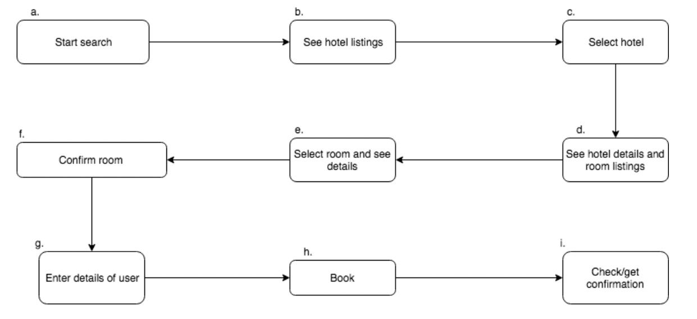
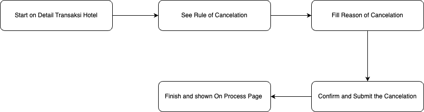

| **Status** | <!--start status:GREEN-->RELEASE<!--end status--> |
| --- | --- |
| Contributors | [Willybrodus Rangga Khaisar Purnama](https://tokopedia.atlassian.net/wiki/people/62cb5c393d382dfc9c5f11d2?ref=confluence) [Irfan Muhlishin](https://tokopedia.atlassian.net/wiki/people/5bfe19e5128c7106f57662cc?ref=confluence) [Firmanda Mulyawan Nugroho](https://tokopedia.atlassian.net/wiki/people/5d91c148fdfa560dcc3a040f?ref=confluence)  |
| Product Manager | [Hartono Santoso](https://tokopedia.atlassian.net/wiki/people/5c6f1fc4017b4a53c68aa479?ref=confluence)  |
| Team | [Minion Mark](https://tokopedia.atlassian.net/people/team/54372146-8afa-46e4-8de3-783c53a0cc3b)  |
| Module type | <!--start status:YELLOW-->FEATURE<!--end status--> |
| Module Location | `feature.travel.hotel` /  `features/travel/hotel` |
| PRD | [Hotel PRD - MVP Release](/wiki/spaces/TR/pages/456983079/Hotel+PRD+-+MVP+Release)  |

## Table of Contents

<!--toc-->

## Release Notes (max 5 latest release notes)

<!--start expand:17 May 2023 (MA-3.220)-->
Bugfix for error `358 (empty page)` , Android needs to check Error Code from BE
<!--end expand-->

## Overview

The Hotel Module is a module that contains features for users to make hotel bookings which includes several features such as searching for lodging properties in a place, viewing room details to canceling a booking.

### Background

Provide travel solutions for Indonesian customers (existing 90 million Tokopedia customers, as well as tap into new markets). Tokopedia already has 30+ digital product offerings, and the hotel will be a strong addition. Also, we can use Tokopedia’s key strengths (massive amounts of data, more than those of OTAs) to provide personalized travel experiences to our customers. The hotel will be one of the biggest revenue generators for Tokopedia’s business because we already have the buy tickets travel transactions feature and normally hotel transactions will be 30% of ticket transactions.

## Tech Stack

- MVVM
- Kotlin
- JUnit
- Coroutines
- LiveData

## Flow Diagram

Here is the flow diagram of the hotel feature

1. Booking Hotel Flow  

2. Cancel Hotel Flow  

## List Feature Page

| **Page** | **Desc** | **Link Doc** |
| --- | --- | --- |
| [Dashboard Page](https://tokopedia.atlassian.net/wiki/spaces/PA/pages/2204565505/Hotel+Dashboard+Hotel+Page) | On this page, users will be shown a field that user can fill out for detail searching, existing promotions, a list of last searching keys, and also town recommendations. | [[Hotel] Dashboard Hotel Page](/wiki/spaces/PA/pages/2204565505)  |
| [Search and Select Destination](https://tokopedia.atlassian.net/wiki/spaces/PA/pages/2223047492/Hotel+Search+and+Select+Destination+Page) | This page is page that is intended so that users can search for the right keywords when searching for properties in this hotel booking feature. Keywords that can be entered such as property names, specific addresses, or keywords in the form of area names | [[Hotel] Search and Select Destination Page](/wiki/spaces/PA/pages/2223047492)  |
| [List Search Result Property Page](https://tokopedia.atlassian.net/wiki/spaces/PA/pages/2212791285/Hotel+Search+Result+Page) | This page is page that shows the results of search items that match the input entered by the user on the [dashboard Page](https://tokopedia.atlassian.net/wiki/spaces/PA/pages/2204565505/Hotel+Dashboard+Hotel+Page). On this page, you can do more advanced filters, also you can change the search area by pointing to areas on maps. | [[Hotel] Search Result Page](/wiki/spaces/PA/pages/2212791285)  |
| [Detail Hotel Page](https://tokopedia.atlassian.net/wiki/spaces/PA/pages/2224130457/Hotel+Detail+Hotel+Page) | This is a page to display hotel details that the user might visit. Users can see what facilities are offered, hotel check-in - check-out hours, cancellation booking requirements, and a list of available rooms. | [[Hotel] Detail Hotel Page](/wiki/spaces/PA/pages/2224130457)  |
| [Room List and Room Page Detail](https://tokopedia.atlassian.net/wiki/spaces/PA/pages/2237923792/Hotel+Room+List+and+Detail+Room)  | You can see the list of rooms and room detail on this subfeature. | [[Hotel] Room List and Detail Room](/wiki/spaces/PA/pages/2237923792)  |
| [Booking Process Page](https://tokopedia.atlassian.net/wiki/spaces/PA/pages/2237991807/Hotel+Booking+Hotel) | After users choose the property and the room on [the Room list and Room Detail Page](https://tokopedia.atlassian.net/wiki/spaces/PA/pages/2237923792/Hotel+Room+List+and+Detail+Room), The user can see a summary of what he has chosen and can see the terms and conditions that apply to the total and details of the accommodation costs that must be incurred by the user on this page. | [[Hotel] Booking Hotel](/wiki/spaces/PA/pages/2237991807)  |
| [Hotel Order Detail and E-Voucher](https://tokopedia.atlassian.net/wiki/spaces/PA/pages/2244149474/Hotel+Order+Detail+dan+E-Voucher)  | This is a page to display order hotel details that the user wants to visit. Users can see the detailed time to visit, the refund schedule, seeing the invoice, seeing the E-Voucher, seeing the detail + contact of the hotel, and also if users want to cancel the booking, this page is the checkpoint to do that. | [[Hotel] Order Detail dan E-Voucher](/wiki/spaces/PA/pages/2244149474)  |
| [Cancel Page](https://tokopedia.atlassian.net/wiki/spaces/PA/pages/2248804998/Hotel+Cancel+Process+Page)  | This page is provided to display hotel details as well as terms and conditions that apply to processing requests for cancellation of property stay bookings. | [[Hotel] Cancel Process Page](/wiki/spaces/PA/pages/2248804998)  |

## How-to

To Access Hotel Page, here are the details step :

1. On Apps  
on apps you can prefer follow this video

[GoTo Hotel Dashboard.webm](/wiki/download/attachments/2249265529/GoTo%20Hotel%20Dashboard.webm?version=1&modificationDate=1684307192966&cacheVersion=1&api=v2)
2. Using applink :  
If you want to use applink, here is the detail

| Page Name | **Applink Url** | **Detail Desc** |
| --- | --- | --- |
| Dashboard Page | `tokopedia://hotel/dashboard` | <https://tokopedia.atlassian.net/wiki/spaces/PA/pages/2204565505/Hotel+Dashboard+Hotel+Page#How-to>  |
| Search Result Page | `tokopedia://hotel/result?id={id_location}&name={name_location}&type=regionOrigin` | <https://tokopedia.atlassian.net/wiki/spaces/PA/pages/2212791285/Hotel+Search+Result+Page#How-to>  |
| Detail Hotel Page | `tokopedia://hotel/detail/{id_hotel}` | <https://tokopedia.atlassian.net/wiki/spaces/PA/pages/2224130457/Hotel+Detail+Hotel+Page#How-to>  |
| Hotel Booking Page | `tokopedia://hotel/booking/{id_chart}` | <https://tokopedia.atlassian.net/wiki/spaces/PA/pages/2237991807/Hotel+Booking+Hotel#How-to>  |
| Order and E-Voucher Page | `tokopedia://hotel/order/{id_order}` | <https://tokopedia.atlassian.net/wiki/spaces/PA/pages/2244149474/Hotel+Order+Detail+dan+E-Voucher#How-to>  |
| Cancel Page | `tokopedia://hotel/cancel/{id_booking}` | <https://tokopedia.atlassian.net/wiki/spaces/PA/pages/2248804998/Hotel+Cancel+Process+Page#How-to>  |

---

## Tracking Activity

For tracking user activity you can preferer [this doc](https://docs.google.com/spreadsheets/d/1i0pxHqiHuAftEnPoSNAxUeJsvt3Nyj-UtFW9q_aglX4/edit#gid=237713213)

## Useful Links

- <https://www.figma.com/file/PxEOtpZawpxhw73GqerP5B/%5BUI---M---HOTEL%5D-All-Screens?type=design&node-id=0-1668&t=GS4OHFleIGQdV40p-0>
- [PRD List](/wiki/spaces/TR/pages/461112007/Hotel+PRD+List)
- [API List](/wiki/spaces/TR/pages/474712718/Hotel+API+List)
