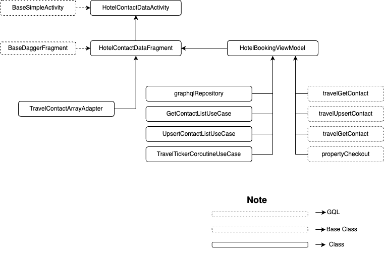
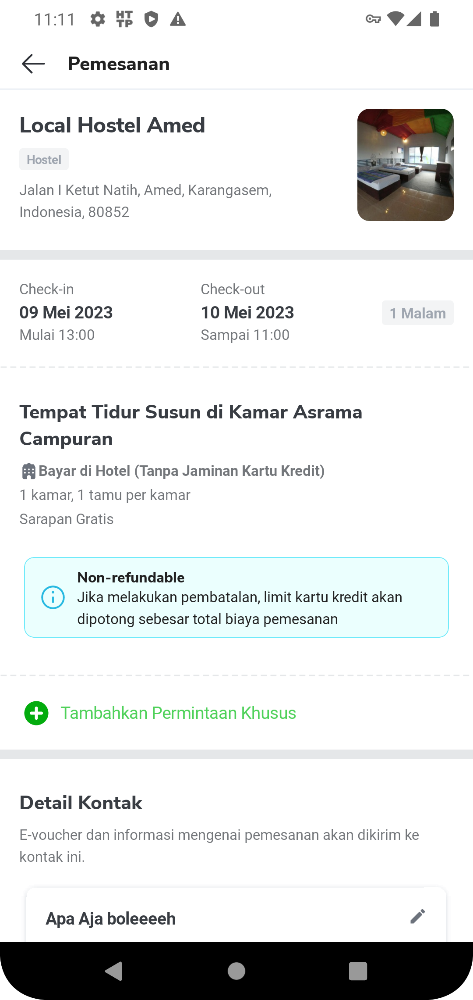

| **sStatus** |  <!--start status:GREEN-->RELEASE<!--end status--> |
| --- | --- |
| Contributors | [Willybrodus Rangga Khaisar Purnama](https://tokopedia.atlassian.net/wiki/people/62cb5c393d382dfc9c5f11d2?ref=confluence) [Irfan Muhlishin](https://tokopedia.atlassian.net/wiki/people/5bfe19e5128c7106f57662cc?ref=confluence) [Firmanda Mulyawan Nugroho](https://tokopedia.atlassian.net/wiki/people/5d91c148fdfa560dcc3a040f?ref=confluence)  |
| Product Manager | [Hartono Santoso](https://tokopedia.atlassian.net/wiki/people/5c6f1fc4017b4a53c68aa479?ref=confluence)  |
| Team | [Minion Mark](https://tokopedia.atlassian.net/people/team/54372146-8afa-46e4-8de3-783c53a0cc3b)  |
| Module type | <!--start status:RED-->FEATURE<!--end status--> |
| Module Location | `features/travel/hotel/booking` |

## Table of Contents

<!--toc-->

## Overview

When the user wants to book a hotel, we need to inform the booking details such as the hotel address, check-in-check-out schedule, room type, and the conditions that apply to the hotel to confirm the contact number of the customer. On this order page, all information about order details will be displayed, and asked about confirmation of contact information and voucher options that can be used.

## Tech Stack

- Kotlin
- *MVVM*
- *JUnit*
- *Coroutines*
- *LiveData*

## Flow Diagram




## How-to

If you want to access this page, you can use two ways, there are : 

1. Using Apps  
In apps, you can access the page in two ways  
 a. From Room List  
 

[Booking Page from Room List.webm](/wiki/download/attachments/2237991807/Booking%20Page%20from%20Room%20List.webm?version=2&modificationDate=1683517136593&cacheVersion=1&api=v2)

b. From Room Detail 

[Booking Page from Detail Room.webm](/wiki/download/attachments/2237991807/Booking%20Page%20from%20Detail%20Room.webm?version=2&modificationDate=1683517030692&cacheVersion=1&api=v2&width=340)

2. Applink : `tokopedia://hotel/booking/{id_chart}`


```
startActivity(RouteManager.getIntent(this, "tokopedia://hotel/booking/{id_chart}"))
```

## GQL List

Here is the GQL for supporting the Detail Hotel Page


| **GQL Name** | **Documentation** | **Description** |
| --- | --- | --- |
| `TravelGetTicker` | [Subhomepage API | Travel Get Ticker](https://tokopedia.atlassian.net/wiki/spaces/TR/pages/518979745/Subhomepage+API#Travel-Get-Ticker) | Get Ticker |
| `travelGetContact` | [Unify Contact API](/wiki/spaces/TR/pages/486211948/Unify+Contact+API#UnifyContactAPI-GetContactList)  | Get Contact on Account |
| `travelUpsertContact` | [Unify Contact API](/wiki/spaces/TR/pages/486211948/Unify+Contact+API#UnifyContactAPI-UpsertContact)  | Set Contact on Account |
| `propertyCheckout` | <https://tokopedia.atlassian.net/wiki/spaces/TR/pages/457605663/Hotel+Fulfillment#Checkout>  | Check Out Booking Hotel |

## User Scenario


| **No** | **Stories** | **Flow** | **Screenshot**                                                                                                                                                                                       |
| --- | --- | --- |------------------------------------------------------------------------------------------------------------------------------------------------------------------------------------------------------|
| 1 | User want to see booking hotel page after seeing detail room | 1. User goes to hotel feature and click hotel that want to book<br/>2. User click “Lihat Kamar”<br/>3. User click item room<br/>4. User click “Pilih Kamar”<br/> | [Booking Page from Detail Room.webm](/wiki/download/attachments/2237991807/Booking%20Page%20from%20Detail%20Room.webm?version=2&modificationDate=1683517030692&cacheVersion=1&api=v2&width=340)<br/> |
| 2 | User want to see booking hotel page after seeing list of room | 1. User goes to hotel feature and click hotel that want to book<br/>2. User click “Lihat Kamar”<br/>3. User click “Pilih Kamar” on Room Item<br/> | [Booking Page from Room List.webm](/wiki/download/attachments/2237991807/Booking%20Page%20from%20Room%20List.webm?version=2&modificationDate=1683517136593&cacheVersion=1&api=v2)<br/>               |
| 3 | User want to add special booking requirement to Hotel | User need click “Tambahkan permintaan khusus” | <br/>                                                                                                                                                            |
| 4 | User want to change Contact Information | 1. User need scroll UI until “Detail Kontak” section<br/>2. User click icon pencil on Top Right UI “Detail Kontak” section<br/>3. User will shown form and need to full fill the form<br/>4. Click “Simpan” to save the changes<br/> | [Change Contact.webm](/wiki/download/attachments/2237991807/Change%20Contact.webm?version=1&modificationDate=1683619530586&cacheVersion=1&api=v2)<br/>                                               |
| 5 | User want to booking the Hotel for other people | 1. User need scroll UI until “Detail Kontak” section<br/>2. User pick “Pesan untuk orang lain”<br/>3. User need to write name of other people<br/> | [Contact order for other.webm](/wiki/download/attachments/2237991807/Contact%20order%20for%20other.webm?version=1&modificationDate=1683619714872&cacheVersion=1&api=v2)<br/>                         |
| 6 | User want to finish the booking order process | After full fill all of the form and confirm the detail, next step is User need to click “Lanjutkan”. After click “Lanjutkan” the page will be hit `propertyCheckout` and redirect to payment process (Reroute using `ApplinkConstInternalPayment.PAYMENT_CHECKOUT`) | [Lanjutkan Booking Hotel.webm](/wiki/download/attachments/2237991807/Lanjutkan%20Booking%20Hotel.webm?version=1&modificationDate=1683620108652&cacheVersion=1&api=v2)<br/>                           |

## Useful Links

- [Figma](https://www.figma.com/file/PxEOtpZawpxhw73GqerP5B/%5BUI---M---HOTEL%5D-All-Screens?type=design&node-id=0-1668&t=YmWIaYY2SqTyIlRM-0)
- [PRD on MVP version](/wiki/spaces/TR/pages/456983079/Hotel+PRD+-+MVP+Release)
