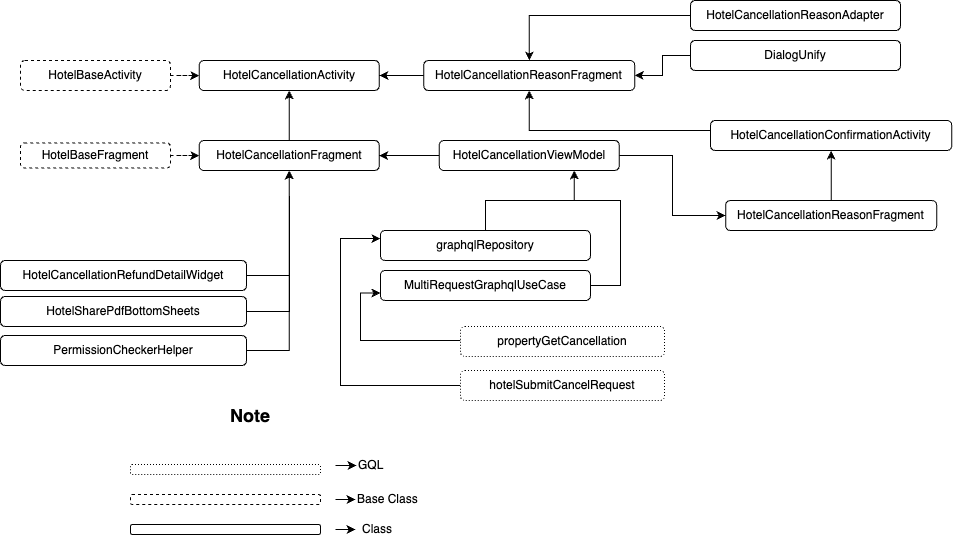
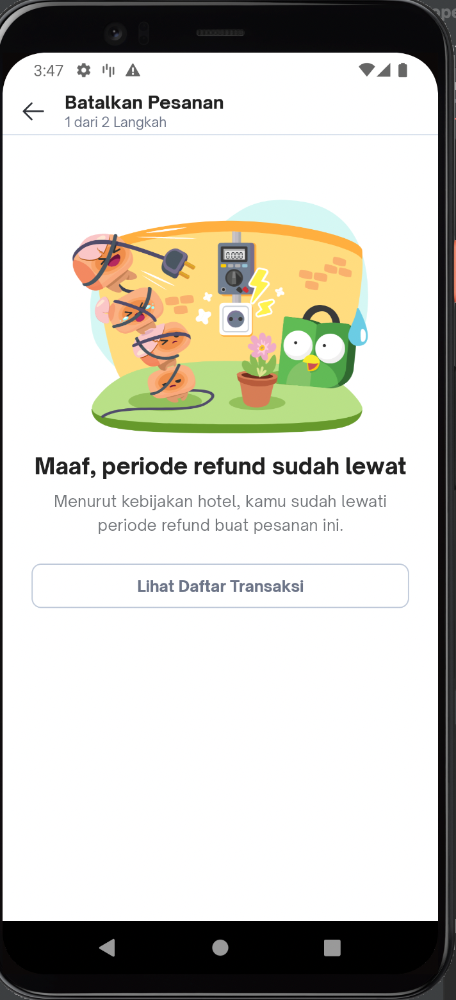

| **Status** | <!--start status:GREEN-->RELEASE<!--end status--> |
| --- | --- |
| Contributors | [Willybrodus Rangga Khaisar Purnama](https://tokopedia.atlassian.net/wiki/people/62cb5c393d382dfc9c5f11d2?ref=confluence) [Irfan Muhlishin](https://tokopedia.atlassian.net/wiki/people/5bfe19e5128c7106f57662cc?ref=confluence) [Firmanda Mulyawan Nugroho](https://tokopedia.atlassian.net/wiki/people/5d91c148fdfa560dcc3a040f?ref=confluence)  |
| Product Manager | [Hartono Santoso](https://tokopedia.atlassian.net/wiki/people/5c6f1fc4017b4a53c68aa479?ref=confluence)  |
| Team | [Minion Mark](https://tokopedia.atlassian.net/people/team/54372146-8afa-46e4-8de3-783c53a0cc3b)  |
| Module type | <!--start status:YELLOW-->FEATURE<!--end status-->  |
| Module Location | `features/travel/hotel/cancel` |

## Table of Contents

<!--toc-->

## Overview

When users want to cancel Hotel Booking, we need to show the rule of refund and the other detail. On this page, users will be shown the detail about canceled orders, and the rule of refunds also we will ask the reason why users cancel hotel bookings and ask the confirmation.

## Tech Stack

- Kotlin
- *MVVM*
- *JUnit*
- *Coroutines*
- *LiveData*

## Flow Diagram



## How-to

If you want to access the page, you can use two ways, there are :

1. Using Apps   
Here is the video to access the page  


[Cancel Hotel Book.webm](/wiki/download/attachments/2248804998/Cancel%20Hotel%20Book.webm?version=2&modificationDate=1684227193308&cacheVersion=1&api=v2)
2. Using Applink : `tokopedia://hotel/cancel/{id_booking}`


```
startActivity(RouteManager.getIntent(this, "tokopedia://hotel/cancel/{id_booking}"))
```

## GQL List

Here is the GQL for supporting the Order Detail Hotel page


| **GQL Name** | **Documentation** | **Description** |
| --- | --- | --- |
| `propertyGetCancellation` | [Hotel Cancellation](/wiki/spaces/TR/pages/458195131/Hotel+Cancellation#HotelCancellation-GetCancellation)  | Get Cancellation Description |
| `hotelSubmitCancelRequest` | [Hotel Cancellation](/wiki/spaces/TR/pages/458195131/Hotel+Cancellation#HotelCancellation-SubmitCancellation)  | Submit Cancellation Hotel |

## User Scenario


| **No** | **Stories** | **Flow** | **Screenshot**                                                                                                                                                                       |
| --- | --- | --- |--------------------------------------------------------------------------------------------------------------------------------------------------------------------------------------|
| 1 | User want to see cancel detail page | 1. User go To Daftar Transaksi Page<br/>2. Click Item that user want to see<br/>3. Scroll Page to the bottom and then click button “Batalkan Pesanan”<br/> | [Go To Cancelation Page.webm](/wiki/download/attachments/2248804998/Go%20To%20Cancelation%20Page.webm?version=1&modificationDate=1684226941085&cacheVersion=1&api=v2&width=340)<br/> |
| 2 | User want to cancel page but it’s out of cancelation date | 1. User go To Daftar Transaksi Page<br/>2. Click Item that user want to see<br/>3. Scroll Page to the bottom and then click button “Batalkan Pesanan”<br/>4. Page will shown the out of date message<br/> | <br/>                                                                                                                               |
| 3 | User want to cancel Hotel book and success | 1. User go To Daftar Transaksi Page<br/>2. Click Item that user want to see<br/>3. Scroll Page to the bottom and then click button “Batalkan Pesanan”<br/>4. Pick Reason of Cancellation<br/>5. Click button “Lanjutkan”<br/>6. Page will shown the success cancellation message<br/> | [Cancel Hotel Book.webm](/wiki/download/attachments/2248804998/Cancel%20Hotel%20Book.webm?version=2&modificationDate=1684227193308&cacheVersion=1&api=v2)<br/>                       |

## Useful Links

###### *Put reference links that you have in this section. You can attach a Figma URL, Thanos URL, etc.*

- [Figma](https://www.figma.com/file/PxEOtpZawpxhw73GqerP5B/%5BUI---M---HOTEL%5D-All-Screens?type=design&node-id=813-1&t=Dw40fxNKxA5rIfVW-0)
