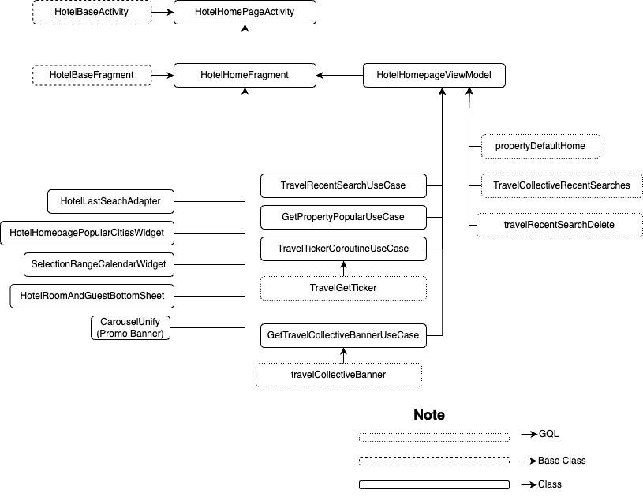
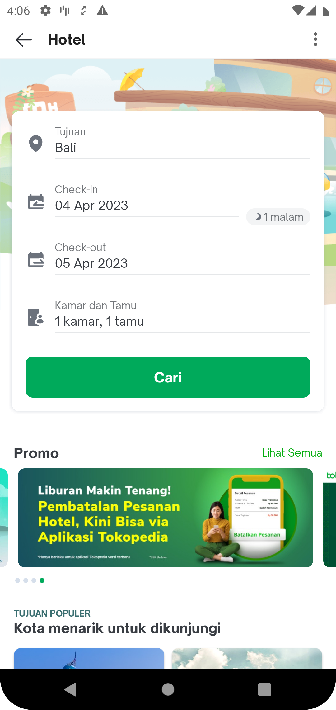
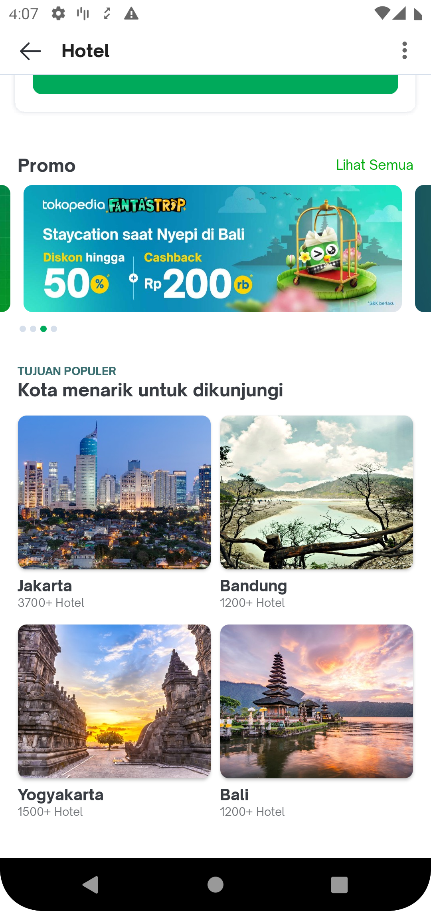
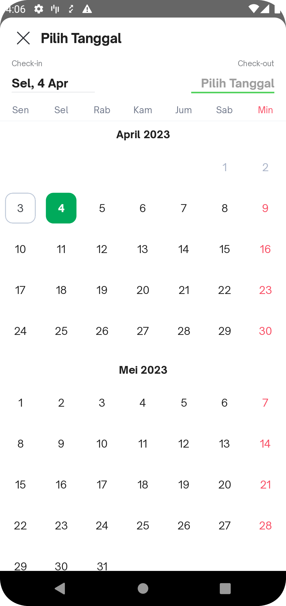
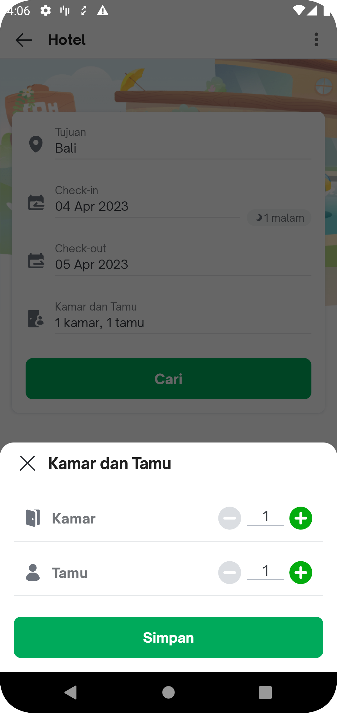
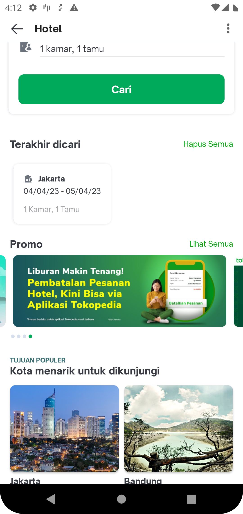
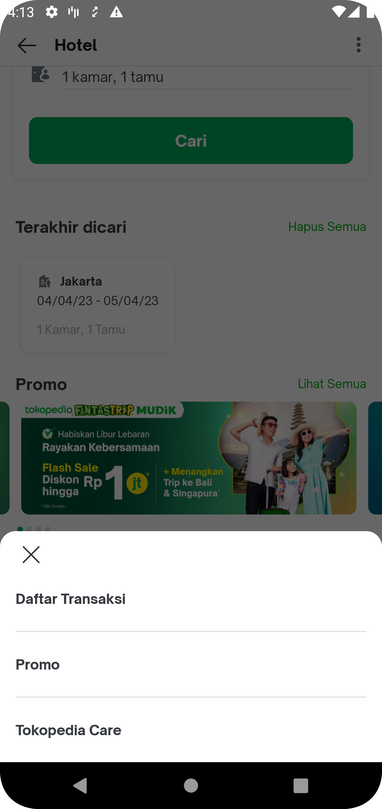

| **Status** |  <!--start status:GREEN-->RELEASE<!--end status-->  |
| --- | --- |
| Contributors | [Willybrodus Rangga Khaisar Purnama](https://tokopedia.atlassian.net/wiki/people/62cb5c393d382dfc9c5f11d2?ref=confluence) [Firmanda Mulyawan Nugroho](https://tokopedia.atlassian.net/wiki/people/5d91c148fdfa560dcc3a040f?ref=confluence) [Irfan Muhlishin](https://tokopedia.atlassian.net/wiki/people/5bfe19e5128c7106f57662cc?ref=confluence)  |
| Product Manager | [Hartono Santoso](https://tokopedia.atlassian.net/wiki/people/5c6f1fc4017b4a53c68aa479?ref=confluence)  |
| PRD | [Doc PRD](/wiki/spaces/TR/pages/1277702387/Hotel+-+Search+by+Map) |
| Team | [Minion Mark](https://tokopedia.atlassian.net/people/team/54372146-8afa-46e4-8de3-783c53a0cc3b)  |
| Module type | <!--start status:RED-->FEATURE<!--end status--> |
| Module Location | `features/travel/hotel/homepage` |

## Table of Contents

<!--toc-->

## Overview

Hotel is a product allowing users to book hotels, guest houses, villas, etc. Since we need to know when, how long, how many rooms to rent, and where a user needs to stay to be able to display the best property recommendations, we need to create a search dashboard page. On this dashboard page, we show the history of user searches, a promotion banner, and also recommend popular cities to visit.


## Flow Diagram



## How-to

You can access Hotel Homepage using the following:

1. You can access on Apps using :   


[GoTo Hotel Dashboard.webm](/wiki/download/attachments/2204565505/GoTo%20Hotel%20Dashboard.webm?version=1&modificationDate=1680510037438&cacheVersion=1&api=v2)
2. Applink : `tokopedia://hotel/dashboard`


```
startActivity(RouteManager.getIntent(this, ApplinkConst.HOTEL_DASHBOARD))
```

also you can add params into applink, here are the possibility params :


| **Param Name** | **is mandatory?** | **Description** | **Example** | **Note** |
| --- | --- | --- | --- | --- |
| `id` | No | id of location options | 835 | mandatory if using param <br/>**name,**optional if not using it<br/> |
| `name` | No | name of location options | Bali | mandatory if using param <br/>**id,**optional if not using it<br/> |
| `check_in` | No | date check in to property | 2023-04-04 | Optional |
| `check_out` | No | date check out from property | 2023-04-05 | Optional |
| `room` | No | number of room | 1 | Optional |
| `adult` | No | number of visitor | 1 | Optional |

Example : 


```
val appLink = tokopedia://hotel/dashboard?id=835&name=Bali&check_in=2023-04-08&check_out=2023-04-09&room=1&adult=1&type=regionOrigin
startActivity(RouteManager.getIntent(this, appLink))
```


---

## GQL List

Here is the gql for supporting dashboard hotel activity


| **GQL Name** | **Documentation** | **Description** |
| --- | --- | --- |
| `travelCollectiveBanner` | <https://tokopedia.atlassian.net/wiki/spaces/TR/pages/518979745/Subhomepage+API#Banner>  | Get list of Banner<br/> Promo for Hotel |
| `TravelCollectiveRecentSearches` | <https://tokopedia.atlassian.net/wiki/spaces/TR/pages/518979745/Subhomepage+API#Recent-Searches>  | Get list of Recent Search |
| `propertyPopular` | [Hotel Homepage](/wiki/spaces/TR/pages/838631425/Hotel+Homepage#HotelHomepage-PopularDestination)  | Get List of Popular Destination |
| `TravelGetTicker` | <https://tokopedia.atlassian.net/wiki/spaces/TR/pages/518979745/Subhomepage+API#Travel-Get-Ticker>  | Get Ticker |
| `propertyDefaultHome` | [Hotel Homepage](/wiki/spaces/TR/pages/838631425/Hotel+Homepage#HotelHomepage-DefaultHomePageParameter)  | Get Default Option on Hotel Dashboard<br/> |

## Tech Stack

- MVVM
- Kotlin
- JUnit
- Coroutines
- LiveData

## User Stories


| **No** | **Stories** | **Flow** | **Screenshot** |
| --- | --- | --- | --- |
| 1 | User want to go to Hotel home page | 1. User click Travel & Entertaiment<br/>2. User click hotel<br/> | [To Dashboard.webm](/wiki/download/attachments/2204565505/To%20Dashboard.webm?version=1&modificationDate=1680574058672&cacheVersion=1&api=v2&width=340)<br/> |
| 2 | User want to See Hotel Options on someplace | 1. User click “Tujuan” and pick destination<br/>2. Click “Check In” or “Check Out” to determine how long to stay at property<br/>3. Click “Kamar dan Tamu” to determine how many rooms and guests you want to stay<br/> | [See Hotel Options on town.webm](/wiki/download/attachments/2204565505/See%20Hotel%20Options%20on%20town.webm?version=1&modificationDate=1680574376894&cacheVersion=1&api=v2)<br/> |
| 3 | User want to see hotel options on someplace using Recent Search feature | 1. User selects an itemclick options on “Terakhir dicari” section<br/> | [See Options using recent search.webm](/wiki/download/attachments/2204565505/See%20Options%20using%20recent%20search.webm?version=2&modificationDate=1680574620850&cacheVersion=1&api=v2)<br/> |
| 4 | User want to see hotel options on someplace using Popular Destination feature | 1. User selects an itemclick options on “Tujuan Popular” section<br/> | [See Hotel Options by Popular Place.webm](/wiki/download/attachments/2204565505/See%20Hotel%20Options%20by%20Popular%20Place.webm?version=1&modificationDate=1680574697899&cacheVersion=1&api=v2)<br/> |

## Screenshot


| **Main Page Filter Section** | **Main Page
 Promo and Popular** | **Calendar Dialog Options** |
| --- | --- | --- |
| <br/> | <br/> | <br/> |
| **Main Page Filter Section** | **Recent Search** | **Menu** |
| <br/> | <br/> | <br/> |

## Useful Links

- [Figma](https://www.figma.com/file/PxEOtpZawpxhw73GqerP5B/%5BUI---M---HOTEL%5D-All-Screens?node-id=0-4333&t=LITRze4NpUN18RWb-0)
- [API Doc](/wiki/spaces/TR/pages/838631425/Hotel+Homepage#HotelHomepage-DefaultHomePageParameter)
