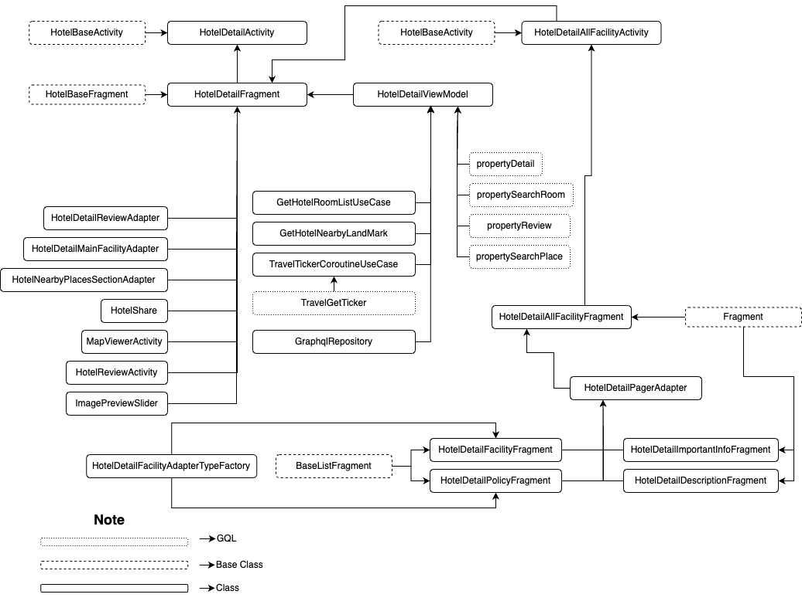
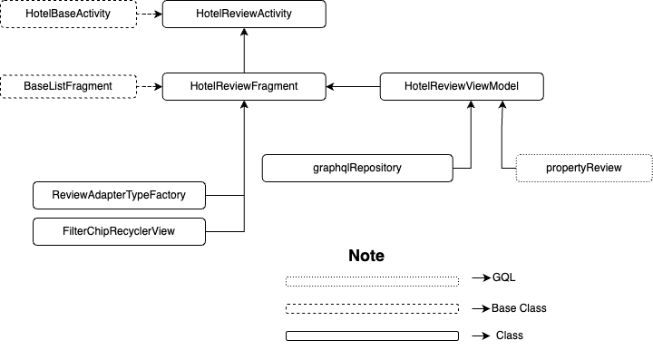

| **Status** | <!--start status:GREEN-->RELEASE<!--end status--> |
| --- | --- |
| Contributors | [Willybrodus Rangga Khaisar Purnama](https://tokopedia.atlassian.net/wiki/people/62cb5c393d382dfc9c5f11d2?ref=confluence) [Irfan Muhlishin](https://tokopedia.atlassian.net/wiki/people/5bfe19e5128c7106f57662cc?ref=confluence) [Firmanda Mulyawan Nugroho](https://tokopedia.atlassian.net/wiki/people/5d91c148fdfa560dcc3a040f?ref=confluence)  |
| Product Manager | [Hartono Santoso](https://tokopedia.atlassian.net/wiki/people/5c6f1fc4017b4a53c68aa479?ref=confluence)  |
| Team | [Minion Mark](https://tokopedia.atlassian.net/people/team/54372146-8afa-46e4-8de3-783c53a0cc3b) |
| Module type | <!--start status:RED-->FEATURE<!--end status--> |
| Module Location | `features/travel/hotel/hoteldetail` |

## Table of Contents

<!--toc-->

## Overview

*Hotel is a product that allows users to book hotels, guest houses, villas, etc., at any place, both domestically and abroad. As a user, of course I want to know the details of a hotel that I have the potential to stay in, such as location details, details of landmarks around the hotel, to the value of reviews from other users. It is on the hotel detail page that all these concerns are accommodated.*

## Tech Stack

- Kotlin
- *MVVM*
- *JUnit*
- *Coroutines*
- *LiveData*

## Flow Diagram





## How-to

*You can access Hotel Homepage using the following:*

1. You can access Apps View through this step  


[How to Go To Detail Hotel Page.webm](/wiki/download/attachments/2224130457/How%20to%20Go%20To%20Detail%20Hotel%20Page.webm?version=2&modificationDate=1681711381862&cacheVersion=1&api=v2&width=306)

2. Applink : `tokopedia://hotel/detail/{id}`

You can use the applink to go to Hotel Detail Page with the parameter, here are the params :


| **Param Name** | **is mandatory?** | **Description** | **Example** |
| --- | --- | --- | --- |
| `id` | Yes | id of hotel | 898674 |
| `check_in` | No | date check in to property | 2023-04-04 |
| `check_out` | No | date check out from property | 2023-04-05 |
| `room` | No | number of room | 1 |
| `adult` | No | number of visitor | 1 |

Example :


```
val appLink = tokopedia://hotel/detail/898674?check_in=2023-04-08&check_out=2023-04-09&room=1&adult=1
startActivity(RouteManager.getIntent(this, appLink))
```

  
3. Besides using Applink you can also use the intent method, here is the pattern :


```
HotelDetailActivity().getCallingIntent(context: Context, checkInDate: String, checkOutDate: String, propertyId: Long, roomCount: Int,
adultCount: Int, destinationType: String, destinationName: String, isDirectPayment: Boolean = true, source: String = HotelSourceEnum.SEARCHRESULT.value)
```

## GQL List

Here is the gql for supporting the Detail Hotel Page


| **GQL Name** | **Documentation** | **Description** |
| --- | --- | --- |
| `TravelGetTicker` | [Subhomepage API | Travel Get Ticker](https://tokopedia.atlassian.net/wiki/spaces/TR/pages/518979745/Subhomepage+API#Travel-Get-Ticker) | Get Ticker |
| `propertyDetail` | <https://tokopedia.atlassian.net/wiki/spaces/TR/pages/838271051/Hotel+Discovery#Hotel-Info-page>  | Get Property Detail |
| `propertySearchRoom` | <https://tokopedia.atlassian.net/wiki/spaces/TR/pages/838271051/Hotel+Discovery#Search-Room-Page>  | Get Room Information |
| `propertyReview` | <https://tokopedia.atlassian.net/wiki/spaces/TR/pages/838271051/Hotel+Discovery#Hotel-Review-page>  | Get Property Review |
| `propertySearchPlace` | <https://tokopedia.atlassian.net/wiki/spaces/TR/pages/1570898674/Hotel+Places#Graphql-Request>  | To get landmark nearby hotel |

## User Stories


| **No** | **Stories** | **Flow** | **Screenshot** |
| --- | --- | --- | --- |
| 1 | User want to see detail Hotel | 1. User click Travel & Entertaiment<br/>2. User click hotel<br/>3. Input Detail Filter and Click “Cari”<br/>4. Users click one item on Hotel List<br/> | [How to Go To Detail Hotel Page.webm](/wiki/download/attachments/2224130457/How%20to%20Go%20To%20Detail%20Hotel%20Page.webm?version=2&modificationDate=1681711381862&cacheVersion=1&api=v2)<br/> |
| 2 | User want to see the image galery | 1. User click Travel & Entertaiment<br/>2. User click hotel<br/>3. Input Detail Filter and Click “Cari”<br/>4. Users click one item on Hotel List<br/>5. User Click Image Item on Colapsing Toolbar<br/> | [Go To Image Slider.webm](/wiki/download/attachments/2224130457/Go%20To%20Image%20Slider.webm?version=1&modificationDate=1681712578113&cacheVersion=1&api=v2)<br/> |
| 3 | User want to share the detail hotel page | 1. Users click one item on Hotel List<br/>2. User click symbol share on right screen, located at the bottom of the hotel pictures<br/>3. Bottom Sheet will be shown and user can pick any options on there for share detail hotel to others<br/> | [Share To Other.webm](/wiki/download/attachments/2224130457/Share%20To%20Other.webm?version=1&modificationDate=1681712792465&cacheVersion=1&api=v2)<br/> |
| 4 | User want to see hotel review | 1. User click Travel & Entertaiment<br/>2. User click hotel<br/>3. Input Detail Filter and Click “Cari”<br/>4. Users click one item on Hotel List<br/>5. User scoll the view until review section<br/>6. User can scroll horizontal list and click “Lihat Semua” for seeing all reviews<br/> | [See Review Hotel.webm](/wiki/download/attachments/2224130457/See%20Review%20Hotel.webm?version=1&modificationDate=1681713110605&cacheVersion=1&api=v2)<br/> |
| 5 | User want to see position of hotel on maps and see near landmarks | 1. Users click one item on Hotel List<br/>2. User scoll the view until “Alamat” section<br/>3. User will be shown a list of near landmarks around hotel<br/>4. User can click button “Lihat Peta” for seeing position of hotel on maps<br/> | [See hotel position on maps.webm](/wiki/download/attachments/2224130457/See%20hotel%20position%20on%20maps.webm?version=1&modificationDate=1681713332032&cacheVersion=1&api=v2)<br/> |
| 6 | User want to see detail facility on hotel | 1. Users click one item on Hotel List<br/>2. User scoll the view until “Fasilitas” section<br/>3. User can scroll horizontal list and click “Lihat Semua” for seeing all facility on one page<br/> | [See facility.webm](/wiki/download/attachments/2224130457/See%20facility.webm?version=1&modificationDate=1681713477825&cacheVersion=1&api=v2)<br/> |
| 7 | User want to see detail Policy on hotel | 1. Users click one item on Hotel List<br/>2. User scoll the view until “Kebijakan” section<br/>3. User can click “Lihat Semua” for seeing all hotel Policy on one page<br/> | [See Kebijakan.webm](/wiki/download/attachments/2224130457/See%20Kebijakan.webm?version=1&modificationDate=1681714114690&cacheVersion=1&api=v2)<br/> |
| 8 | User want to see the description hotel | 1. Users click one item on Hotel List<br/>2. User scoll the view until “Deskripsi” section<br/>3. User can click “Baca selengkapnya” for seeing all hotel description on one page<br/> | [See description.webm](/wiki/download/attachments/2224130457/See%20description.webm?version=1&modificationDate=1681714235290&cacheVersion=1&api=v2)<br/> |

## Useful Links

- [Figma](http://figma.com/file/PxEOtpZawpxhw73GqerP5B/%5BUI---M---HOTEL%5D-All-Screens?type=design&node-id=0-6795&t=esxNjmVGLXVfzc2w-0)
- [PRD for Share Button](/wiki/spaces/TR/pages/961120214/Hotel+-+Share+URL+button)
- [PRD for Landmarks](https://tokopedia.atlassian.net/wiki/spaces/TR/pages/1403257320/Hotel+-+Nearby+places+in+hotel+PDP+landmarks)
- [PRD for Review](/wiki/spaces/TR/pages/775099650/Hotel+-+Hotel+Reviews)
