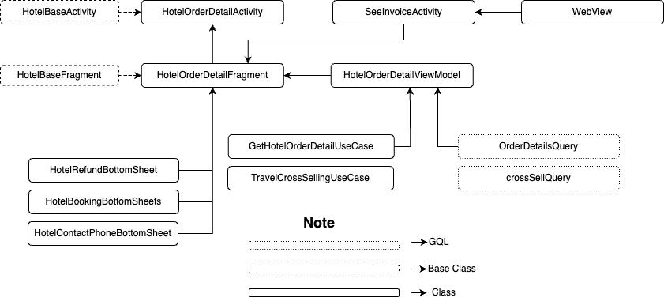
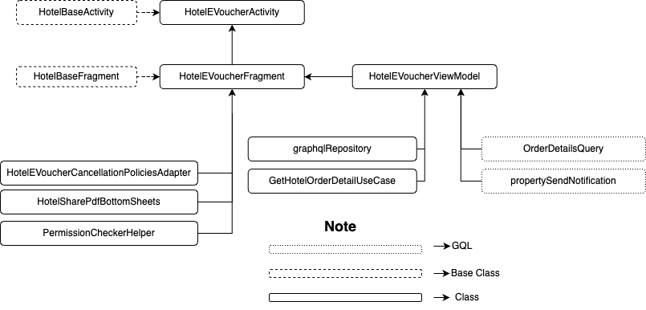

| **Status** |  <!--start status:GREEN-->RELEASE<!--end status-->  |
| --- | --- |
| Contributors | [Willybrodus Rangga Khaisar Purnama](https://tokopedia.atlassian.net/wiki/people/62cb5c393d382dfc9c5f11d2?ref=confluence) [Irfan Muhlishin](https://tokopedia.atlassian.net/wiki/people/5bfe19e5128c7106f57662cc?ref=confluence) [Firmanda Mulyawan Nugroho](https://tokopedia.atlassian.net/wiki/people/5d91c148fdfa560dcc3a040f?ref=confluence) |
| Product Manager | [Hartono Santoso](https://tokopedia.atlassian.net/wiki/people/5c6f1fc4017b4a53c68aa479?ref=confluence) |
| Team | [Minion Mark](https://tokopedia.atlassian.net/people/team/54372146-8afa-46e4-8de3-783c53a0cc3b) |
| Module type | <!--start status:RED-->FEATURE<!--end status--> |
| Module Location | `features/travel/hotel/orderdetail` |

## Table of Contents

<!--toc-->

## Overview

After the user completes the [booking](https://tokopedia.atlassian.net/wiki/spaces/PA/pages/2237991807/Hotel+Booking+Hotel) process, users will get a notification about the booking process and can read the order booking details. On this page, users will be shown the rule, the time to check in and check out, the e-voucher, and hotel details. Also if they book Hotel with possible cancellation users can do that through this page. 

## Tech Stack

- Kotlin
- *MVVM*
- *JUnit*
- *Coroutines*
- *LiveData*

## Flow Diagram





## How-to

If you want to access the page, you can use two ways, there are :

1. Using Apps   
Here is the video to access the page 

[Detail Orde.webm](/wiki/download/attachments/2244149474/Detail%20Orde.webm?version=1&modificationDate=1683805400824&cacheVersion=1&api=v2)
2. Using Applink `tokopedia://hotel/order/{id_order}`


```
startActivity(RouteManager.getIntent(this, "tokopedia://hotel/order/{order_id}"))
```

## GQL List

Here is the GQL for supporting the Order Detail Hotel page


| **GQL Name** | **Documentation** | **Description** |
| --- | --- | --- |
| `OrderDetailsQuery` | <https://tokopedia.atlassian.net/wiki/spaces/TR/pages/478347287/Hotel+Order+History#Order-Details>  | For get Order Detail |
| `propertySendNotification` | <https://tokopedia.atlassian.net/wiki/spaces/TR/pages/478347287/Hotel+Order+History#Send-Notification>  | To send Notification |

## User Scenario


| **No** | **Stories** | **Flow** | **Screenshot** |
| --- | --- | --- | --- |
| 1 | User want to see order detail | 1. User go To Daftar Transaksi Page<br/>2. Click Item that user want to see<br/> | [Go To Detail Order.webm](/wiki/download/attachments/2244149474/Go%20To%20Detail%20Order.webm?version=1&modificationDate=1683806532704&cacheVersion=1&api=v2)<br/> |
| 2 | User want to see the E-Voucher of Order | 1. User go To Daftar Transaksi Page<br/>2. Click Item that user want to see<br/>3. On Detail Order Page, click “Lihat E-Voucher”<br/> | [Detail Orde.webm](/wiki/download/attachments/2244149474/Detail%20Orde.webm?version=1&modificationDate=1683805400824&cacheVersion=1&api=v2)<br/> |
| 3 | User want to see the Invoice | 1. User go To Daftar Transaksi Page<br/>2. Click Item that user want to see<br/>3. On Detail Order Page, click “Lihat” on right side<br/> | [Users want to see invoice.webm](/wiki/download/attachments/2244149474/Users%20want%20to%20see%20invoice.webm?version=1&modificationDate=1683806935771&cacheVersion=1&api=v2)<br/> |
| 4 | User want to see detail Hotel, detail guest, payment order and detail refund schedule | 1. On Detail Order Page scroll the display until “Detail Hotel” section.<br/>	1. if you want to see Hotel page, click “Lihat Detail Hotel”<br/>	2. If you want to see Hotel contact you can click “Kontak Hotel”<br/>	3. If you want to see detail refund schedule you can click “i” logo left side on ticker<br/> | [Detail Hotel, info refund and payment.webm](/wiki/download/attachments/2244149474/Detail%20Hotel,%20info%20refund%20and%20payment.webm?version=1&modificationDate=1683807895626&cacheVersion=1&api=v2)<br/> |
| 5 | User want to cancel order | 1. On Detail Order Page scroll the display the bottom view<br/>2. Click on “Batalkan Pesanan”<br/> | [Cancel from batalkan pesanan.webm](/wiki/download/attachments/2244149474/Cancel%20from%20batalkan%20pesanan.webm?version=1&modificationDate=1683811114575&cacheVersion=1&api=v2)<br/> |

## Useful Links

###### *Put reference links that you have in this section. You can attach a Figma URL, Thanos URL, etc.*

- [Figma](https://www.figma.com/file/PxEOtpZawpxhw73GqerP5B/%5BUI---M---HOTEL%5D-All-Screens?type=design&node-id=0-10874&t=Pn3ckBazcpXuqEgd-0)
- [PRD](/wiki/spaces/TR/pages/456983079/Hotel+PRD+-+MVP+Release)
