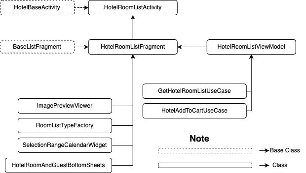
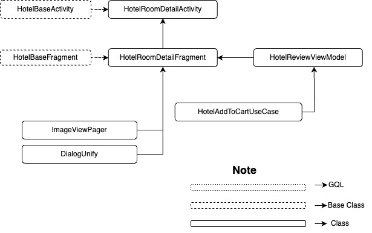

| **Status** |  <!--start status:GREEN-->RELEASE<!--end status-->  |
| --- | --- |
| Contributors | [Willybrodus Rangga Khaisar Purnama](https://tokopedia.atlassian.net/wiki/people/62cb5c393d382dfc9c5f11d2?ref=confluence) [Irfan Muhlishin](https://tokopedia.atlassian.net/wiki/people/5bfe19e5128c7106f57662cc?ref=confluence) [Firmanda Mulyawan Nugroho](https://tokopedia.atlassian.net/wiki/people/5d91c148fdfa560dcc3a040f?ref=confluence)  |
| Product Manager | [Hartono Santoso](https://tokopedia.atlassian.net/wiki/people/5c6f1fc4017b4a53c68aa479?ref=confluence)  |
| Team | [Minion Mark](https://tokopedia.atlassian.net/people/team/54372146-8afa-46e4-8de3-783c53a0cc3b)  |
| Module type | <!--start status:RED-->FEATURE<!--end status--> |
| Module Location | `features/travel/hotel/roomlist`  `features/travel/hotel/roomdetail`  |

## Table of Contents

<!--toc-->

## Overview

Hotel is a product that allows users to book hotels, guest houses, villas, etc., at any place, both domestically and abroad. As a user, of course, I want to know the details of a variant hotel room that I have the potential to stay in. On this page, we will show the user about hotel variant rooms starting from the picture until the facility that the user can get if using a room.

## Tech Stack

- Kotlin
- *MVVM*
- *JUnit*
- *Coroutines*
- *LiveData*

## Flow Diagram

## Navigation

To access this page, you can follow the steps in the video below

[Looking Room Options.webm](/wiki/download/attachments/2237923792/Looking%20Room%20Options.webm?version=2&modificationDate=1683181083688&cacheVersion=1&api=v2&width=340)

## GQL List

Here is the gql for supporting page

| **GQL Name** | **Documentation** | **Description** |
| --- | --- | --- |
| `propertySearchRoom` | <https://tokopedia.atlassian.net/wiki/spaces/TR/pages/838271051/Hotel+Discovery#Search-Room-Page>  | Get Room List |
| `propertyAddToCart` | <https://tokopedia.atlassian.net/wiki/spaces/TR/pages/457605663/Hotel+Fulfillment#AddToCart>  | Add Hotel Order To Chart |

## User Stories

| **No** | **Stories** | **Flow** | **Screenshot** |
| --- | --- | --- | --- |
| 1 | I wanna see variant room on Hotel | 1. User fill all of field information 2. Klik “Cari” 3. Pick Hotel that I want to stay 4. Click “Lihat Kamar”  | [Looking Room Options.webm](/wiki/download/attachments/2237923792/Looking%20Room%20Options.webm?version=2&modificationDate=1683181083688&cacheVersion=1&api=v2)  |
| 2 | I wanna change time to sleep | 1. User fill all of field information 2. Klik “Cari” 3. Pick Hotel that I want to stay 4. Click “Lihat Kamar” 5. Click time section on top left screen  | [Change Date on Room List.webm](/wiki/download/attachments/2237923792/Change%20Date%20on%20Room%20List.webm?version=1&modificationDate=1683181307919&cacheVersion=1&api=v2)  |
| 3 | I wanna change qty room and guest qty | 1. User fill all of field information 2. Klik “Cari” 3. Pick Hotel that I want to stay 4. Click “Lihat Kamar” 5. Click room qty section on top right screen 6. Click “Simpan”  | [Change Qty Room.webm](/wiki/download/attachments/2237923792/Change%20Qty%20Room.webm?version=1&modificationDate=1683181342606&cacheVersion=1&api=v2)  |
| 4 | I wanna see room detail | 1. User fill all of field information 2. Klik “Cari” 3. Pick Hotel that I want to stay 4. Click “Lihat Kamar” 5. Click Item that I want to see detail  | [Room Galery.webm](/wiki/download/attachments/2237923792/Room%20Galery.webm?version=1&modificationDate=1683181465203&cacheVersion=1&api=v2)  |

---

## Useful Links

###### *Put reference links that you have in this section. You can attach a Figma URL, Thanos URL, etc.*

- [Figma](https://www.figma.com/file/PxEOtpZawpxhw73GqerP5B/%5BUI---M---HOTEL%5D-All-Screens?type=design&node-id=0-6327&t=9WfYzJzCj2SWdqqS-0)
- [PRD](https://tokopedia.atlassian.net/wiki/spaces/TR/pages/665813285/Hotel+-+Refresh+room+list+page+reprice+checking+timer+in+payment+page)
