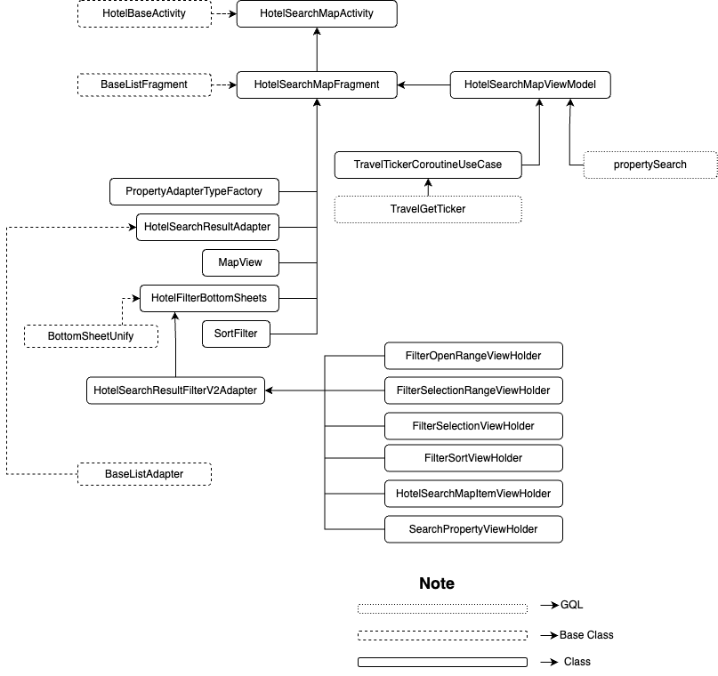

| **Status** | <!--start status:GREEN-->RELEASE<!--end status-->  |
| --- | --- |
| Contributors | [Willybrodus Rangga Khaisar Purnama](https://tokopedia.atlassian.net/wiki/people/62cb5c393d382dfc9c5f11d2?ref=confluence) [Irfan Muhlishin](https://tokopedia.atlassian.net/wiki/people/5bfe19e5128c7106f57662cc?ref=confluence) [Firmanda Mulyawan Nugroho](https://tokopedia.atlassian.net/wiki/people/5d91c148fdfa560dcc3a040f?ref=confluence)  |
| Product Manager | [Hartono Santoso](https://tokopedia.atlassian.net/wiki/people/5c6f1fc4017b4a53c68aa479?ref=confluence)  |
| PRD | [Doc PRD](/wiki/spaces/TR/pages/1277702387/Hotel+-+Search+by+Map) |
| Team<br/> | [Minion Mark](https://tokopedia.atlassian.net/people/team/54372146-8afa-46e4-8de3-783c53a0cc3b)  |
| Module type | <!--start status:RED-->FEATURE<!--end status--> |
| Module Location | `features/travel/hotel/search_map` |

## Table of Contents

<!--toc-->

## Overview

Hotel is a product allowing users to book hotels, guest houses, villas, etc, and because we have ~18,000 properties in our hotel, we need to make a searching and filtering feature. On this page, we show the property options that the user can order based on the input data that has been entered by the user on the [Dashboard Hotel Page](https://tokopedia.atlassian.net/wiki/spaces/PA/pages/2204565505/Hotel+Dashboard+Hotel+Page). On this page, there are various advanced filter options to make it easier for users to find properties that suit them, such as the desired price range, rating filters, to accommodation type filters. 

## Tech Stack

- Kotlin
- MVVM
- JUnit
- Coroutines
- LiveData
- Google Maps API

## Flow Diagram



## How-to

*You can access Hotel Homepage using the following:*

1. You can access Apps View through this step

[Go To Search Maps Hotel Page.webm](/wiki/download/attachments/2212791285/Go%20To%20Search%20Maps%20Hotel%20Page.webm?version=1&modificationDate=1681184356642&cacheVersion=1&api=v2)
2. Applink : `tokopedia://hotel/result`  
You can use the applink to go to Hotel Search Page with the parameter, here are the params :


| **Param Name** | **is mandatory?** | **Description** | **Example** |
| --- | --- | --- | --- |
| `id` | Yes | id of location options | 835 |
| `name` | Yes | name of location options | Bali |
| `type` | Yes | type of searching | regionOrigin |
| `check_in` | No | date check in to property | 2023-04-04 |
| `check_out` | No | date check out from property | 2023-04-05 |
| `room` | No | number of room | 1 |
| `adult` | No | number of visitor | 1 |

Example :


```
val appLink = tokopedia://hotel/result?id=835&name=Bali&check_in=2023-04-08&check_out=2023-04-09&room=1&adult=1&type=regionOrigin
startActivity(RouteManager.getIntent(this, appLink))
```

## GQL List

Here is the gql for supporting the show result search page activity


| **GQL Name** | **Documentation** | **Description** |
| --- | --- | --- |
| `TravelGetTicker` | [Subhomepage API | Travel Get Ticker](https://tokopedia.atlassian.net/wiki/spaces/TR/pages/518979745/Subhomepage+API#Travel-Get-Ticker) | Get Ticker |
| `propertySearch` | [Hotel Discovery](/wiki/spaces/TR/pages/838271051/Hotel+Discovery)  | Get Property |

## User Stories


| **No** | **Stories** | **Flow** | **Screenshot** |
| --- | --- | --- | --- |
| 1 | User want to go to Hotel Search Result Page  | 1. User click Travel & Entertaiment<br/>2. User click hotel<br/>3. Input Detail Filter and Click “Cari”<br/> | [Go To Search Maps Hotel Page.webm](/wiki/download/attachments/2212791285/Go%20To%20Search%20Maps%20Hotel%20Page.webm?version=1&modificationDate=1681184356642&cacheVersion=1&api=v2)<br/> |
| 2 | Users can see the coach mark for better understanding of button function | 1. User click Travel & Entertaiment<br/>2. User click hotel<br/>3. Input Detail Filter and Click “Cari”<br/>4. Coachmark will be shown<br/> | [Search Page Using CoachMark.webm](/wiki/download/attachments/2212791285/Search%20Page%20Using%20CoachMark.webm?version=1&modificationDate=1681187152832&cacheVersion=1&api=v2)<br/> |
| 3 | Users can see the result of searching and also can see the location on maps | 1. Input Detail Filter and Click “Cari”<br/>2. Users will be shown search results on maps and vertical list<br/>3. User can scroll up the vertical list and show more result<br/>4. User can scroll down the vertical list and show the list just on maps click item on horizontal list to see the position property on maps<br/> | [See result of search.webm](/wiki/download/attachments/2212791285/See%20result%20of%20search.webm?version=1&modificationDate=1681187593372&cacheVersion=1&api=v2)<br/> |
| 4 | Users can see a list of properties around the displayed map area | 1. Input Detail Filter and Click “Cari”<br/>2. Users will be shown search results on maps and vertical list<br/>3. Scroll down the vertical list<br/>4. Zoom target area<br/>5. Click “Cari di sekitar sini”<br/>6. Users will be shown search results on maps and horizontal list<br/> | [Search by Maps Location.webm](/wiki/download/attachments/2212791285/Search%20by%20Maps%20Location.webm?version=1&modificationDate=1681188421372&cacheVersion=1&api=v2)<br/> |
| 5 | Users want to apply simply filter in searches | 1. Input Detail Filter and Click “Cari”<br/>2. Users will be shown search results on maps and vertical list<br/>3. At the top of the map, filter options will be displayed and users can scroll right or left and click on them to apply them in searches<br/> | [Using Sort Filter.webm](/wiki/download/attachments/2212791285/Using%20Sort%20Filter.webm?version=1&modificationDate=1681192535344&cacheVersion=1&api=v2)<br/> |
| 6 | Users want to apply advance filter in searches | 1. Input Detail Filter and Click “Cari”<br/>2. Users will be shown search results on maps and vertical list<br/>3. At the top of the map, filter options will be displayed<br/>4. Click 1st options with title “Filter” to shown advance filter options<br/>5. Input the parameter<br/>6. Click “Simpan” to apply the filter in searches<br/> | [Using advance filter.webm](/wiki/download/attachments/2212791285/Using%20advance%20filter.webm?version=1&modificationDate=1681192980575&cacheVersion=1&api=v2)<br/> |
| 7 | Users wants to reset all filters that have been applied | 1. At the top of the map, click first filter options with title “Filter”<br/>2. At the top right, click the words "Reset" to reset all filter settings that have been applied<br/> | [Reset Filter.webm](/wiki/download/attachments/2212791285/Reset%20Filter.webm?version=2&modificationDate=1681192986753&cacheVersion=1&api=v2)<br/> |

## Useful Links

- [Figma](https://www.figma.com/file/33nf5Cxtl4ub2X6rO1k9hO/%5BUX---M---HOTEL%5D-Search-by-Map-%5BSRP-Improvement%5D)
- [Development Doc](/wiki/spaces/PA/pages/1553498906/Hotel+Search+by+Map)
