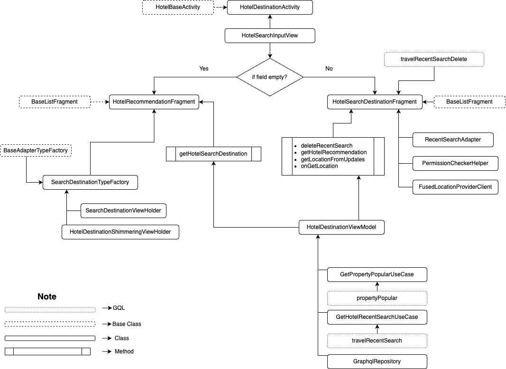

| **Status** | <!--start status:GREEN-->RELEASE<!--end status--> |
| --- | --- |
| Contributors | [Willybrodus Rangga Khaisar Purnama](https://tokopedia.atlassian.net/wiki/people/62cb5c393d382dfc9c5f11d2?ref=confluence) [Irfan Muhlishin](https://tokopedia.atlassian.net/wiki/people/5bfe19e5128c7106f57662cc?ref=confluence) [Firmanda Mulyawan Nugroho](https://tokopedia.atlassian.net/wiki/people/5d91c148fdfa560dcc3a040f?ref=confluence)  |
| Product Manager | [Hartono Santoso](https://tokopedia.atlassian.net/wiki/people/5c6f1fc4017b4a53c68aa479?ref=confluence)  |
| Team | [Minion Mark](https://tokopedia.atlassian.net/people/team/54372146-8afa-46e4-8de3-783c53a0cc3b)  |
| Module type | <!--start status:RED-->FEATURE<!--end status--> |
| Module Location | `features/travel/hotel/destination` |

## Table of Contents

<!--toc-->

## Overview

Hotel is a product that allows users to book hotels, guest houses, villas, etc., in all places, both domestically and abroad. Because there are many possible places for someone to live, it would be better if there was a special page for users to search and select a place. Besides that, on this page there will be a selection of the most popular cities, the last searched list to the "Near your position" short cut button to see hotels around the current user.

## Tech Stack

- Kotlin
- *MVVM*
- *JUnit*
- *Coroutines*
- *LiveData*
- *Google Maps API*

## Flow Diagram

## Navigation

To access this page, you can follow the steps in the video below

[GoTo Fill Tujuan.webm](/wiki/download/attachments/2223047492/GoTo%20Fill%20Tujuan.webm?version=2&modificationDate=1681439204423&cacheVersion=1&api=v2)

## GQL List

Here is the gql for supporting the show result search page activity

| **GQL Name** | **Documentation** | **Description** |
| --- | --- | --- |
| `propertyPopular` | [Hotel Homepage](/wiki/spaces/TR/pages/838631425/Hotel+Homepage#HotelHomepage-PopularDestination) | Get Ticker |
| `travelRecentSearch` | [Hotel Homepage](/wiki/spaces/TR/pages/838631425/Hotel+Homepage#HotelHomepage-RecentSearch)  | Get User Recent Search |
| `travelRecentSearchDelete` | [Hotel Homepage](/wiki/spaces/TR/pages/838631425/Hotel+Homepage#HotelHomepage-Delete)  | To deleted user recent search |

## User Stories

| **No** | **Stories** | **Flow** | **Screenshot** |
| --- | --- | --- | --- |
| 1 | User want to go to Search Destination | 1. User click Travel & Entertaiment 2. User click hotel 3. User click field Tujuan  | [GoTo Fill Tujuan.webm](/wiki/download/attachments/2223047492/GoTo%20Fill%20Tujuan.webm?version=2&modificationDate=1681439204423&cacheVersion=1&api=v2)  |
| 2 | User want to search the destination by typing name of place | 1. User click Travel & Entertaiment 2. User click hotel 3. User click field Tujuan 4. User Input Name of Place on Input field  | [Using typing filter.webm](/wiki/download/attachments/2223047492/Using%20typing%20filter.webm?version=1&modificationDate=1681439289811&cacheVersion=1&api=v2)  |
| 3 | User want to search the destination by typing name of place but no match item | 1. User click Travel & Entertaiment 2. User click hotel 3. User click field Tujuan 4. User Input Name of Place on Input field  | [When typing is no result.webm](/wiki/download/attachments/2223047492/When%20typing%20is%20no%20result.webm?version=1&modificationDate=1681439929477&cacheVersion=1&api=v2)  |
| 4 | User want to search hotel using last searching location  | 1. User click Travel & Entertaiment 2. User click hotel 3. User click field Tujuan 4. Click item list on “Terakhir dicari” section  | [Using recent searching.webm](/wiki/download/attachments/2223047492/Using%20recent%20searching.webm?version=1&modificationDate=1681439634942&cacheVersion=1&api=v2)  |
| 5 | User want to deleted all last searching location | 1. User click Travel & Entertaiment 2. User click hotel 3. User click field Tujuan 4. Click “Hapus semua” on “Terakhir dicari” section  | [Deleted recent searching.webm](/wiki/download/attachments/2223047492/Deleted%20recent%20searching.webm?version=1&modificationDate=1681440070317&cacheVersion=1&api=v2)  |
| 5 | User want to searching hotel using popular destination | 1. User click Travel & Entertaiment 2. User click hotel 3. User click field Tujuan 4. Click item list on “Terakhir popular” section  | [Using popular options.webm](/wiki/download/attachments/2223047492/Using%20popular%20options.webm?version=1&modificationDate=1681439743623&cacheVersion=1&api=v2)  |
| 6 | User want to searching hotel on current my location but apps need permission | 1. User click Travel & Entertaiment 2. User click hotel 3. User click field Tujuan 4. User click ”Lihat hotel dekat lokasimu” 5. User will be shown dialog permission and can pick “While using the app” or “Only this time” 6. After that click ”Lihat hotel dekat lokasimu” again  | [Hotel dekat lokasimu.webm](/wiki/download/attachments/2223047492/Hotel%20dekat%20lokasimu.webm?version=1&modificationDate=1681440312329&cacheVersion=1&api=v2)  |
| 7 | User want to searching hotel on current my location and apps need permission but user deny the permission | 1. User click Travel & Entertaiment 2. User click hotel 3. User click field Tujuan 4. User click ”Lihat hotel dekat lokasimu” 5. User will be shown dialog permission and pick “Deny” 6. When user click ”Lihat hotel dekat lokasimu” again, user will be shown dialog warning about why we need your permission approval  | [Denny Permission.webm](/wiki/download/attachments/2223047492/Denny%20Permission.webm?version=1&modificationDate=1681440506158&cacheVersion=1&api=v2)  |
| 8 | User want to searching hotel on current my location but user deny the permission before | 1. User click Travel & Entertaiment 2. User click hotel 3. User click field Tujuan 4. User click ”Lihat hotel dekat lokasimu” 5. User will be shown dialog warning about why we need your permission approval 6. Click “Ok” 7. User will be shown dialog permission and can pick “While using the app” or “Only this time” 8. User click ”Lihat hotel dekat lokasimu” again  | [Enable after deny permission.webm](/wiki/download/attachments/2223047492/Enable%20after%20deny%20permission.webm?version=1&modificationDate=1681440581460&cacheVersion=1&api=v2)  |

## Useful Links

- [Figma](https://www.figma.com/file/PxEOtpZawpxhw73GqerP5B/%5BUI---M---HOTEL%5D-All-Screens?node-id=0-1668&t=9uXofoyOENUwDfLn-0)
- [Development Documentation](/wiki/spaces/PA/pages/1553498906/Hotel+Search+by+Map)
