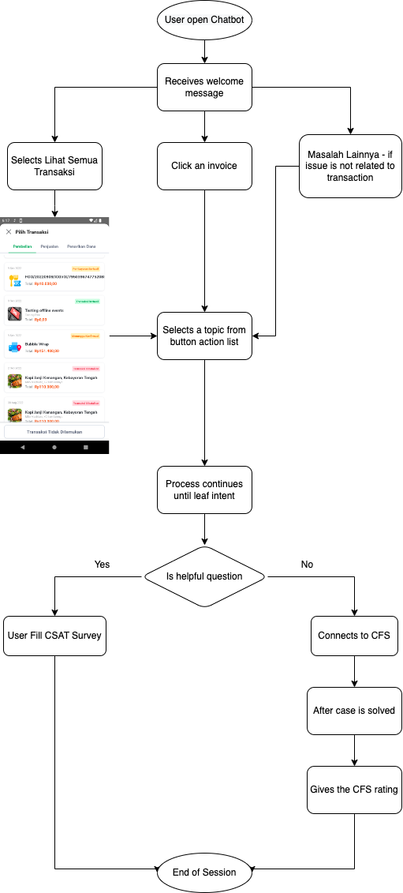
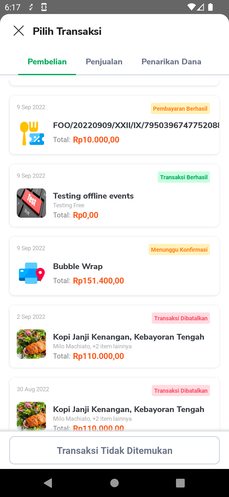
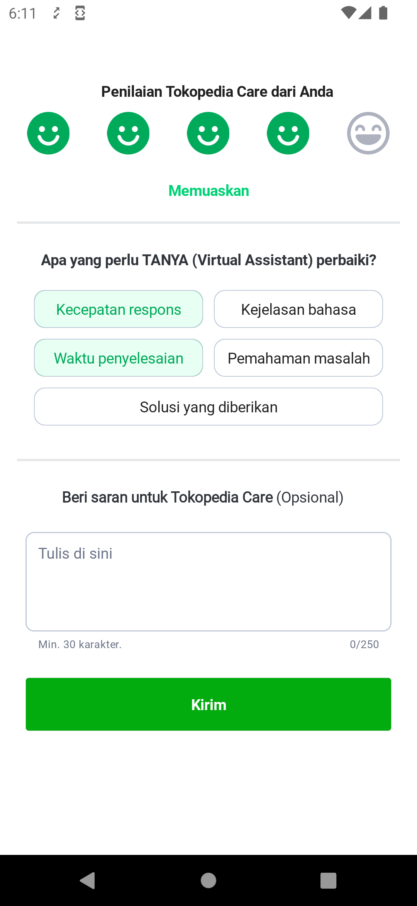
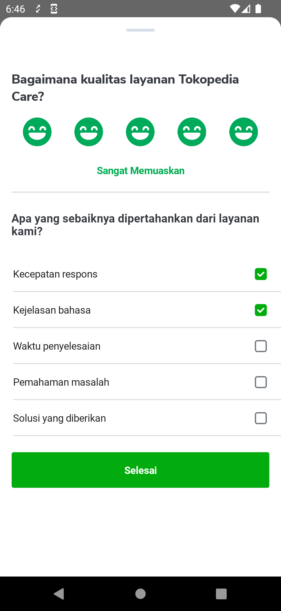
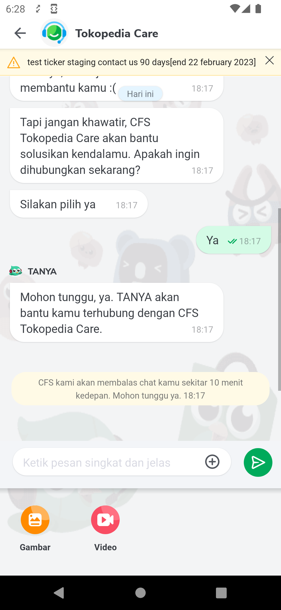

---
"CSAT Rating"
---

| **Status** |  <!--start status:GREEN-->RELEASE<!--end status--> |
| --- | --- |
| Product Manager | [Rifki Mega](https://tokopedia.atlassian.net/wiki/people/62831a49222d36006fb5d2e2?ref=confluence) [Felix Riady Tanamas](https://tokopedia.atlassian.net/wiki/people/62e70978a41ecbd0ba16e326?ref=confluence)  |
| Team | [Minion Mark](https://tokopedia.atlassian.net/people/team/54372146-8afa-46e4-8de3-783c53a0cc3b)  |
| Module type |  <!--start status:YELLOW-->FEATURE<!--end status--> |
| Product PRD | [Chatbot](/wiki/spaces/CS/pages/474580489/Chatbot)  |
| Backend Documentation | [Technology](/wiki/spaces/CS/pages/1833077984/Technology)  |
| Module Location | `features/user/chatbot` |

## Table of Contents

<!--toc-->

## Release Notes

<!--left header table-->
| **Date**  | **App Version**     | Notes                                                                    | PR                                                               |
|-----------|---------------------|--------------------------------------------------------------------------|------------------------------------------------------------------|
| 30 Jun 30 | MA-3.226 / SA-2.156 | Chatbot Helpful Question                                                 | <https://github.com/tokopedia/android-tokopedia-core/pull/33277> |
| 29 May 23 | MA-3.222 / SA-2.152 | Big reply Box                                                            | <https://github.com/tokopedia/android-tokopedia-core/pull/33105> |
| 26 May 23 | MA-3.222 / SA-2.152 | Migrate to MVVM                                                          | <https://github.com/tokopedia/android-tokopedia-core/pull/31428> |
| 4 Apr 23  | MA-3.217 / SA-2.147 | Dynamic Sticky Button - Dynamic Attachment with Content code 105 and 106 | <https://github.com/tokopedia/android-tokopedia-core/pull/32237> |
| 24 Mar 23 | MA-3.215 / SA-2.145 | Media button dynamic attachment                                          | <https://github.com/tokopedia/android-tokopedia-core/pull/31999> |

## Overview

Chatbot or conversational AI is a computer program that can understand user’s query and answer it instantly, which can form conversation between human and machine. Chatbot in Tokopedia is used to answer simple questions, where the complex one will be handled by CFS (Customer First Squad) / human agent.

---

### Background

Chatbot can give a lot of benefits for Tokopedia, the following are some of them

- Answer simple and repetitive questions automatically, so CFS can focus to handle complex inquiry
- Understand user intention regarding general inquiry or even troubleshooting
- Provide answer based on specific condition since we use information from transaction invoice
- Can be integrated with internal & external system such as ticketing system, logistic, etc.
- Can be used anytime since it operates 24/7
- Instant answer within seconds

---

### Project Description

Chatbot help reduce ticket count to our customer service agent and give user faster response. It helps in creating more cost optimisation. Since it is available 24/7, user can get faster response for their queries.

---

## Tech Stack

Applink - `tokopedia://chatbot/1234567` ; `1234567` is the `messageId` for the user

- `MediaUploader` - This library is used to upload videos. [Not used for image upload as we need to do secure upload which is not supported by `MediaUploader` yet]
- `MediaPicker` - This library is used to pick image/videos from gallery.
- `Exoplayer` - Used for playing videos.
- `Server Logger` - Used to send logs to `New Relic` in case of GQL errors, Message Id conversion issue and socket issues
- `chat_common`- It uses this module to have common chat functionalities. `Topchat` also uses `chat_common` module

---

## Flow Diagram

- Step 1 - TANYA gives welcome message to user, then user click an invoice. User can click `Masalah lainnya` if it's not related to transaction.
- Step 2 - Users select a topic from button action list and will follow the flow until leaf intent. Once they reach leaf intent, chatbot will show a probing for helpful question (Yes or No answer).
- Step 3 - User fill `CSAT` survey if they answer helpful question with "Yes". The conversation will end in here.

---

## Navigation

| **Entry Point** | **Screen Recording**  |
| --- | --- |
|  Pesan Bantuan / Contact Us | [Screen Recording 2023-01-11 at 4.51.45 PM.mov](/wiki/download/attachments/2109183004/Screen%20Recording%202023-01-11%20at%204.51.45%20PM.mov?version=2&modificationDate=1673438258907&cacheVersion=1&api=v2&width=340)  |
| Help Page | [Screen Recording 2023-01-11 at 4.50.10 PM.mov](/wiki/download/attachments/2109183004/Screen%20Recording%202023-01-11%20at%204.50.10%20PM.mov?version=2&modificationDate=1673438147379&cacheVersion=1&api=v2)  |
| From Article | [Screen Recording 2023-01-11 at 4.51.45 PM.mov](/wiki/download/attachments/2109183004/Screen%20Recording%202023-01-11%20at%204.51.45%20PM.mov?version=2&modificationDate=1673438258907&cacheVersion=1&api=v2)  |

---

## How-to-Use

| **Screen** | **Screenshot** |
| --- | --- |
| **See all transactions** - This `TransactionInvoiceListFragment` helps to list down all the transactions for the user using `get_invoice_list` gql. You can click on `Lihat Semua Transaks`i button action which you get while starting a new session with Tanya. |   |
| **Send CSAT for Tanya** - This is `ChatBotProvideRatingFragment` helps to give Csat to bot. When the `Kirim` button is clicked , it goes back to `ChatbotFragment` |   |
| **Send CSAT for Tokopedia Care Agent** - This is `ChatBotCsatActivity` helps to give CSAT for Agent |   |
| **Upload Image** - `Gambar` icon lets user to upload images (single/multiple) |   |
| **Upload Video** - `Video` icon lets user to upload videos(single/multiple).  | Check the above image |

---

## List of GQL

| **GQL NAME**  | **Description** | **Documentation Link(if any)** |
| --- | --- | --- |
| TicketListQuery | Used to get data for bottomsheet for Contact Us Migration |  |
| submitRatingCSAT | Used to submit csat for bot and agent | [Submit-CSAT](/wiki/spaces/CS/pages/524780080/Submit-CSAT)  |
| post\_rating | Send Thumbs Up/ Thumbs Down for response - Very less used - Will be removed completely in the future |  |
| topbotGetNewSession | Used to check whether the user has a new session or whether to enable/disable typing block on the chat | [Topbot GetUserSession](/wiki/spaces/CS/pages/1861681651/Topbot+GetUserSession)  |
| chipGetActiveTickerV4 | Used to get the ticker list on chatbot |  [Get Active Ticker](/wiki/spaces/CS/pages/585236669/Get+Active+Ticker)  |
| getResolutionlink | Used to get the entry point applink for resolution center. |  |
| chipSubmitHelpfulQuestion | FE can submit Helpful questions  | [GQL Contact Us - Submit Helpful Question](/wiki/spaces/CS/pages/977600765/GQL+Contact+Us+-+Submit+Helpful+Question)  |
| chipSubmitChatCSAT | FE can submit CSAT |  [GQL Contact Us - Submit Chat CSAT](/wiki/spaces/CS/pages/967949755/GQL+Contact+Us+-+Submit+Chat+CSAT)  |
| chipGetChatRatingListV5 | FE can get helpful questions and submitted rating  | [GQL Contact Us - Get Chat Rating List V5](/wiki/spaces/CS/pages/1053466387/GQL+Contact+Us+-+Get+Chat+Rating+List+V5)  |
| topbotUploadSecureAvailability | Used for checking whether the user is eligible for secure image upload. Currently we just call this end-point to record the user's ip as it is a backend requirement | [Get Upload Secure Availability](/wiki/spaces/CS/pages/1377602257/Get+Upload+Secure+Availability)  |
| topbotUploadVideoEligibility | Used for checking whether the user is eligible for video upload | [GQL - topbotUploadVideoEligibility](/wiki/spaces/CS/pages/1846149251/GQL+-+topbotUploadVideoEligibility)  |
| Secure Image Upload | Used for secure upload of image |  |
| get\_invoice\_list  | Lists down all the invoices for a user  |  |
| get\_chat\_replies | Used to get the list of chat for the user, this GQL uses beforeReplyTime and afterReplyTime to get paged message list |  |

---

## List of Socket message Attachment Type

| **Attachment Type** | **Identifier** | **Description**                                                                                                                                                                                                                                                                                       | **Documentation link(if any)** |
| --- | --- |-------------------------------------------------------------------------------------------------------------------------------------------------------------------------------------------------------------------------------------------------------------------------------------------------------| --- |
| Invoice List | 6 | Get invoice list for user                                                                                                                                                                                                                                                                             |  [Ws-invoice-list](/wiki/spaces/CS/pages/524846149/Ws-invoice-list)  |
| Send Invoice | 7 | To send any selected invoice                                                                                                                                                                                                                                                                          |  |
| Quick Reply | 8 | Options to easily select reply without typing                                                                                                                                                                                                                                                         |  [Ws-quick-replies](/wiki/spaces/CS/pages/524714679/Ws-quick-replies)  |
| Button Action List | 9 | List of available options                                                                                                                                                                                                                                                                             |  [Ws-button-actions](/wiki/spaces/CS/pages/524846192/Ws-button-actions)  |
| Quick Reply Send | 10 | Send Quick Reply                                                                                                                                                                                                                                                                                      |  |
| Open Csat | 13 | Show Csat emojis                                                                                                                                                                                                                                                                                      |  [Ws-csat](/wiki/spaces/CS/pages/524846268/Ws-csat)  |
| Update Toolbar | 14 | Used to update toolbar Text and Profile picture url; ie: Tanya and Tokopedia Care                                                                                                                                                                                                                     |  [Ws-divider](/wiki/spaces/CS/pages/524846209/Ws-divider)  |
| Chat Divider | 15 | Used to show divider when session is changed from Tanya to Tokopedia Care and vice versa                                                                                                                                                                                                              |  [Ws-divider](/wiki/spaces/CS/pages/524846209/Ws-divider)  |
| Options List | 22 | When agent solves the question, need to show this                                                                                                                                                                                                                                                     |  [Ws-helpful-questions](/wiki/spaces/CS/pages/945720888/Ws-helpful-questions)  |
| Csat Options | 23 | Give Rating to agent                                                                                                                                                                                                                                                                                  |  [Ws-chat-csat](/wiki/spaces/CS/pages/950637273/Ws-chat-csat)  |
| Sticky Button Options | 25 | Entry point for Resolution Center from Chatbot                                                                                                                                                                                                                                                        | [Ws-sticked-button-actions](/wiki/spaces/CS/pages/1019055227/Ws-sticked-button-actions)  |
| Secure Image Upload  | 26 | Used for uploading image using secure mechanism                                                                                                                                                                                                                                                       |  [Ws-Upload Secure](/wiki/spaces/CS/pages/1435187199/Ws-Upload+Secure)  |
| Reply Bubble | 28 | Used for specific reply bubble                                                                                                                                                                                                                                                                        |  |
| Video Upload  | 30 | Used for sending video url to Backend                                                                                                                                                                                                                                                                 |  [Ws-Video](/wiki/spaces/CS/pages/1839891620/Ws-Video)  |
| Session Change | 31 | Notify user that session has been changed from Bot to Agent and vice versa                                                                                                                                                                                                                            |  [Ws-Session-change](/wiki/spaces/CS/pages/1888707658/Ws-Session-change)  |
| Dynamic Attachment | 34 | Content codes:  100 - To Show Big Reply Box  101 - To Show/Hide Normal Reply Box  104 - Show/Hide add attachment, upload image, upload video buttons  105 - Sticky Button V2 , used for confirmation from BE to notify seller  106 - FE can give confirmation to content code 105 |  [Ws-dynamic-attachment](/wiki/spaces/CS/pages/2038213145/Ws-dynamic-attachment)  |

---

## Action Items
- Convert messageId type from Long to String [planned for H1,2023]

## Useful Links

- [Figma](https://www.figma.com/file/arxxaSaRJx4YktHl2CqZSp/Chatbot-UI-(Mobile)?node-id=0%3A1&t=Tx5AbdLoyBjjLTae-0)
- [New Relic Dashboard](https://onenr.io/01wZV4e6aw6)
- [Detailed Data Flow](/wiki/spaces/PA/pages/2218428529/Chatbot+-+Data+Flow)
- [Scrolling Behaviour](/wiki/spaces/PA/pages/2218626251/Chatbot+-+Modified+Scroll+Behaviour)

## FAQ

- Q : How can I access Chatbot ? 
A : At first you need to be logged in to enter chatbot. There are multiple entry points to chatbot; Help page , Pesan Bantuan, article pages and push notification.

- Q : How can I connect to Salesforce Agent? 
A : If your query is not resolved by Tanya, you get an option to let you connect to Agent. You can follow these steps → Enter `Chat Dengan CFS` , you will get connected to Tokopedia Care

- Q : How can I close a ticket with Salesforce Agent? 
A : You can follow this [doc](https://docs.google.com/document/d/1v8dKGKoCOLDQLEgQE3sZ8f2BI0gRLOdDew-jFE3kGXI/edit?usp=sharing) to close the ticket from Salesforce console for Staging only.

- Q : How can I reset a session with Tanya via Postman? 
A : You can follow this [doc](https://docs.google.com/document/d/1W6TgO8BwpP6sFczd5ZuRH9rckyMrGLFCaz0TnwiPhpY/edit?usp=sharing).

