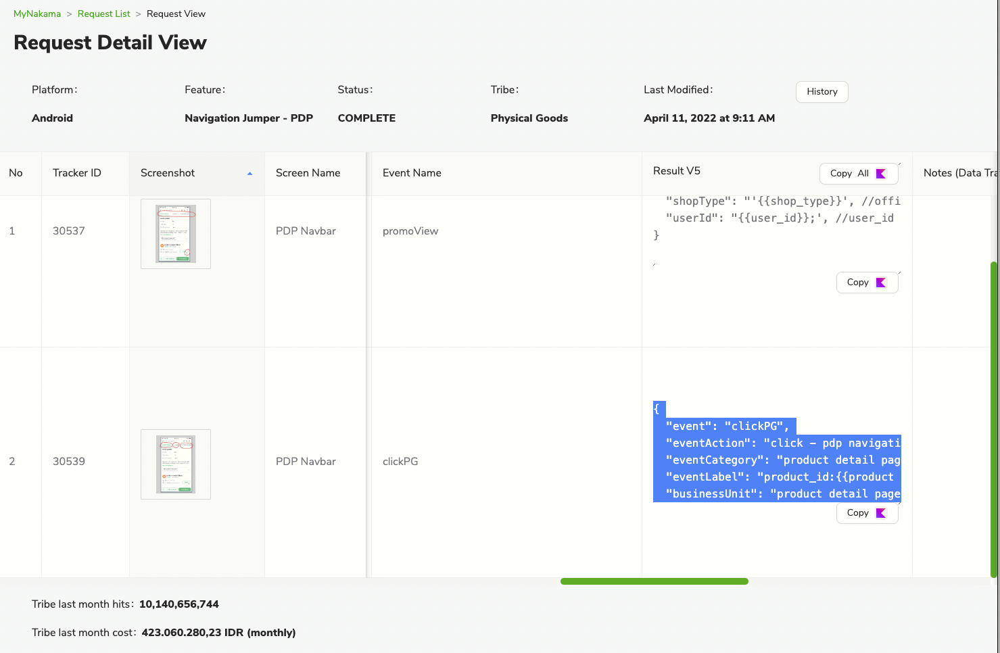
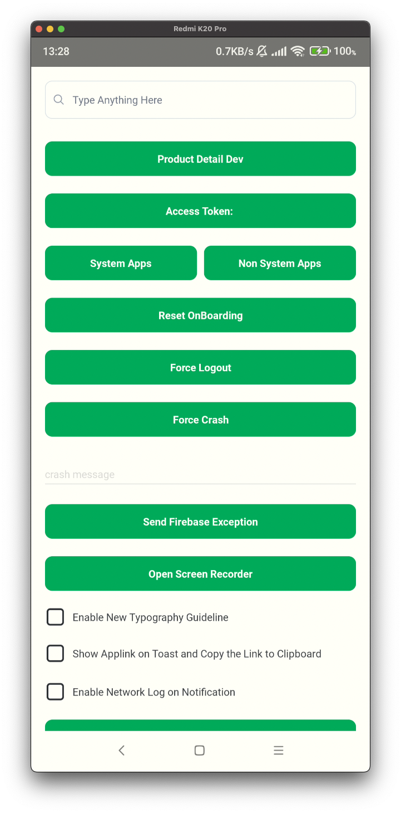
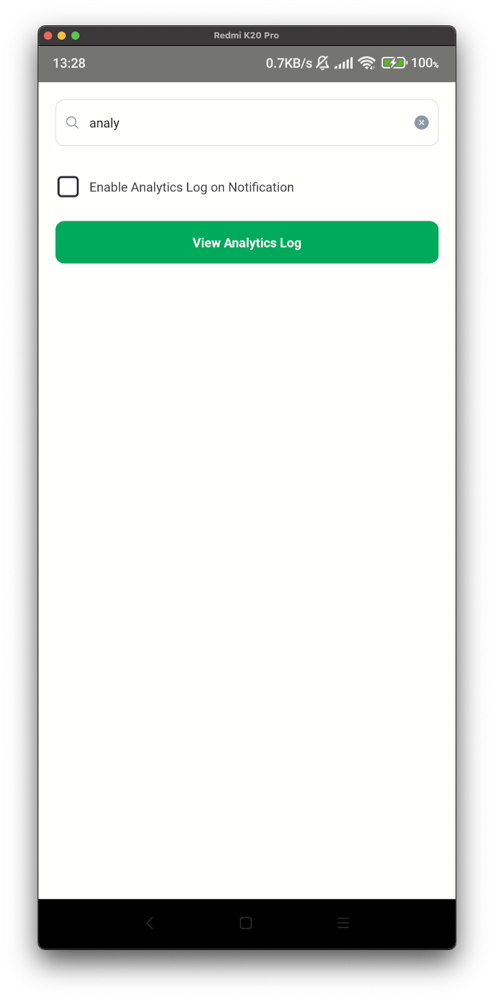
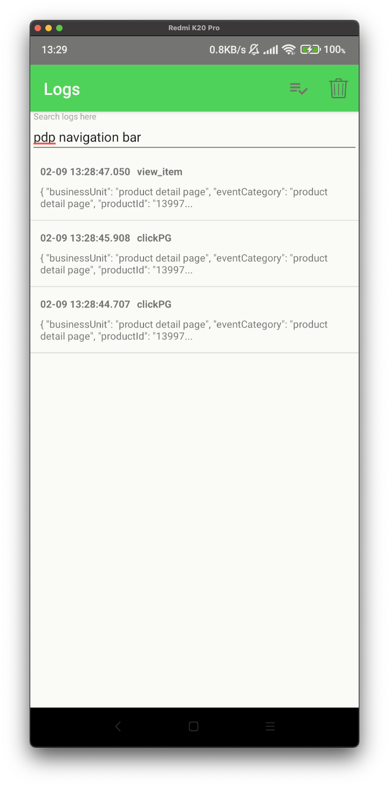
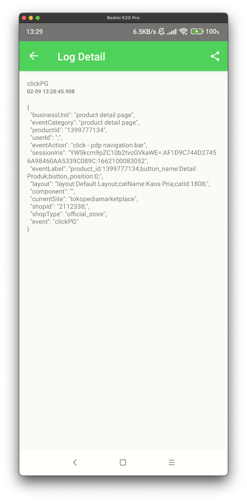

---
General Event
---

| Status | <!--start status:GREEN-->RELEASE<!--end status--> |
| --- | --- |
| Contributors | [Kelvindo Sutan](https://tokopedia.atlassian.net/wiki/people/5ff2a8fe44065f013f93507c?ref=confluence) |
| Product Manager | [Yehezkiel .](https://tokopedia.atlassian.net/wiki/people/5c94aa7a7792242c8613ad14?ref=confluence) |
| Team | [Minion Stuart](https://tokopedia.atlassian.net/people/team/eeba862a-bd9d-472c-b901-415b15b1a37e) |
| Release date | - |
| Module type | <!--start status:PURPLE-->INTERNAL-LIBRARY<!--end status--> |
| Module Location | `libraries.tracking_optimizer`  `libraries.track` |

## Table of Contents

<!--toc-->

## Release Notes

<!--start expand:14 Dec 22-->
Initial Release
<!--end expand-->

## Overview

If you want the data to fire immediately when the user do action.

## How-to

1. Add dependency into module


```
implementation projectOrAar(rootProject.ext.libraries.track)
```
2. (Optional) Install Tokopedia Tracker Generator - for simple and easy converter from JSON into hashMapOf.

### Requirement

Ask PO for MyNakama link for *Thanos* or *Arceus*: <https://mynakama.tokopedia.com/datatracker/requestdetail/view/2980>. In this MyNakama, the General Event part is at second row. Scroll to the right, find the column of *Event Name* and *Result V5*.



The JSON Result V5.


```
{
  "event": "clickPG",
  "eventAction": "click - pdp navigation bar",
  "eventCategory": "product detail page",
  "eventLabel": "product_id:{{product id}};button_name:{{buttonnname}};button_position{{button position}};",
  "businessUnit": "product detail page",
  "component": "'comp:{{component name}};temp:{{template name}};elem:{{element name}};cpos:{{component position}};', //component level attribute",
  "currentSite": "tokopediamarketplace",
  "layout": "'layout:{{layout name}};catName:{{category name}};catId:{{category id}};', //layout level attribute",
  "productId": "'{{Product ID}}', //Product ID of product displayed on PDP",
  "shopId": "{{shop_id}};', //shop_id level hit",
  "shopType": "'{{shop_type}}', //official_store, gold_merchant, regular",
  "userId": "{{user_id}};', //user_id level hit, pass null if non login"
}
```

### Function

From the JSON, convert it to `hashMapOf`. Then replace the placeholder `{{}

}` with proper variable. Also don't forget to make sure that the "event" value is the *Event Name* from MyNakama.


```
val mapEvent = hashMapOf<String, Any>(
    "event" to "clickPG",
    "eventAction" to "click - pdp navigation bar",
    "eventCategory" to "product detail page",
    "eventLabel" to "product_id:$productId;button_name:$buttonName;button_position$buttonPosition;",
    "businessUnit" to "product detail page",
    "component" to "comp:$componentName;temp:$templateName;elem:$elementName;cpos:$position;",
    "currentSite" to "tokopediamarketplace",
    "layout" to "layout:$layoutName;catName:$categoryName;catId:$categoryId;",
    "productId" to productId,
    "shopId" to "$shopId;",
    "shopType" to shopType,
    "userId" to "$userId;"
)
```


> Try our Tokopedia [Tracker Generator](Tracker%20Generator.md). It will help you convert the JSON into hashMapOf
> 
> 

After done with the `hashMapOf`, the only thing you need is pass it into the function:


```
TrackApp.getInstance().gtm.sendGeneralEvent(mapEvent)
```

  
Preferable to put both of them into a single function. So the result will be:


```
fun sendClickPdpNavigationBarEvent(
   productId: String,
   buttonName: String,
   buttonPosition: Int,
   componentName: String,
   templateName: String,
   elementName: String,
   position: Int,
   layoutName: String,
   categoryName: String,
   categoryId: String,
   shopId: String,
   shopType: String,
   userId: String
) {
  val mapEvent = hashMapOf<String, Any>(
    "event" to "clickPG",
    "eventAction" to "click - pdp navigation bar",
    "eventCategory" to "product detail page",
    "eventLabel" to "product_id:$productId;button_name:$buttonName;button_position$buttonPosition;",
    "businessUnit" to "product detail page",
    "component" to "comp:$componentName;temp:$templateName;elem:$elementName;cpos:$position;",
    "currentSite" to "tokopediamarketplace",
    "layout" to "layout:$layoutName;catName:$categoryName;catId:$categoryId;",
    "productId" to productId,
    "shopId" to "$shopId;",
    "shopType" to shopType,
    "userId" to "$userId;"
  )
  TrackApp.getInstance().gtm.sendGeneralEvent(mapEvent)
}
```

### Clean up

You may notice there are a lot of parameter to be pass into single tracker function. It will lead us to linter warning with too many parameters function. In the end you still need to adjust it with your code preferences.

In this documentation, we will try one of solution to avoid too many parameters. Which is wrap them into a data class.

 

This is only for references. You can use another solution that suit your preferences.


```
data class PdpNavigationTrackerData(
  productData: ProductData, // our source of data - probably already exists in our code
  viewData: ViewData // class that contains view data
){
  val productId = productData.productId
  val categoryName = productData.categoryName
  val categoryId = productData.categoryId
  val shopId = productData.shopId
  val shopType = productData.shopType
  val userId = productData
  
  val buttonName = viewData.buttonName
  val buttonPosition = viewData.buttonPosition
  val componentName = viewData.componentName
  val templateName = viewData.templateName
  val elementName = viewData.elementName
  val position = viewData.position
  val layoutName = viewData.layoutName
}
```

  
Then we can update our function into


```
fun sendClickPdpNavigationBarEvent(
   data: PdpNavigationTrackerData
) {
  val mapEvent = hashMapOf<String, Any>(
    "event" to "clickPG",
    "eventAction" to "click - pdp navigation bar",
    "eventCategory" to "product detail page",
    "eventLabel" to "product_id:${data.productId};button_name:${data.buttonName};button_position${data.buttonPosition};",
    "businessUnit" to "product detail page",
    "component" to "comp:${data.componentName};temp:${data.templateName};elem:${data.elementName};cpos:${data.position};",
    "currentSite" to "tokopediamarketplace",
    "layout" to "layout:${data.layoutName};catName:${data.categoryName};catId:${data.categoryId};",
    "productId" to data.productId,
    "shopId" to "${data.shopId};",
    "shopType" to data.shopType,
    "userId" to "${data.userId};"
  )
  TrackApp.getInstance().gtm.sendGeneralEvent(mapEvent)
}
```

### Testing

Call the function at expected action. In this example, invoke the function when user click Navigation Tab.

Run and Debug in Developer Options  
Tokopedia Apps > Developer Options > View Analytics Log  
Search your tracker/event. Make sure everything correct.














You are done.

## FAQ

<!--start expand:Can we use mapOf instead of hashMapOf ?-->
Short answer is no. Since our tracker library written to use HashMap.java
<!--end expand-->


