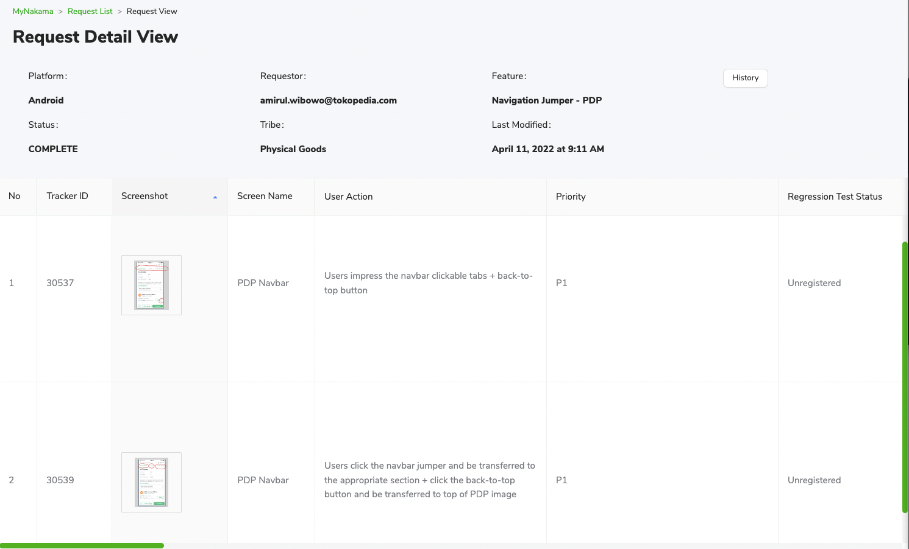

---
Tracker Guidelines
---

| **Status** | <!--start status:GREEN-->RELEASE<!--end status--> |
| --- | --- |
| Contributors | [Kelvindo Sutan](https://tokopedia.atlassian.net/wiki/people/5ff2a8fe44065f013f93507c?ref=confluence)  |
| Product Manager | [Yehezkiel .](https://tokopedia.atlassian.net/wiki/people/5c94aa7a7792242c8613ad14?ref=confluence)  |
| Team | [Minion Stuart](https://tokopedia.atlassian.net/people/team/eeba862a-bd9d-472c-b901-415b15b1a37e) |
| Release date | - |
| Module type | <!--start status:PURPLE-->INTERNAL-LIBRARY<!--end status--> |
| Module Location | `libraries.tracking_optimizer` | `libraries.track` |

## Table of Contents

<!--toc-->

## Release Notes

<!--start expand:14 Dec 22-->
Initial Release
<!--end expand-->

## Overview

This page will help you to create tracker. There will be 2 parts, the first one is about [General Event](General%20Event.md), and the second will be [Enhance Ecommerce](Tracking%20Queue.md).

Also we have a [Tracker Generator](Tracker%20Generator.md) to improve your flow when create tracker.

### MyNakama

URL: [MyNakama](https://mynakama.tokopedia.com/)

To access some of the Data Tracking platforms. We usually called the platform *Thanos or Arceus.* In MyNakama there are information of how the tracker should be created, such as action, label, and result of the tracker.

For more information you can start exploration from this [pages](https://tokopedia.atlassian.net/wiki/spaces/DT/pages/974030175).

### Google Tag Manager (GTM)

As for this confluence written, our Data Tracking platform using Google Analytics. To provide data into our analytics, we use Google Tag Manager in our mobile application.

> Google Tag Manager is a [tag management system](https://en.wikipedia.org/wiki/Tag_management_system) (TMS) that allows you to quickly and easily update measurement codes and related code fragments collectively known as [***tags***](https://support.google.com/tagmanager/answer/3281060) on your website or mobile app. Once the small segment of Tag Manager code has been added to your project, you can safely and easily deploy analytics and measurement tag configurations from a web-based user interface.
> 
> 

## Navigation

[General Event](General%20Event.md)

[Enhance Ecommerce](Tracking%20Queue.md)

[Tracker Generator](Tracker%20Generator.md)

